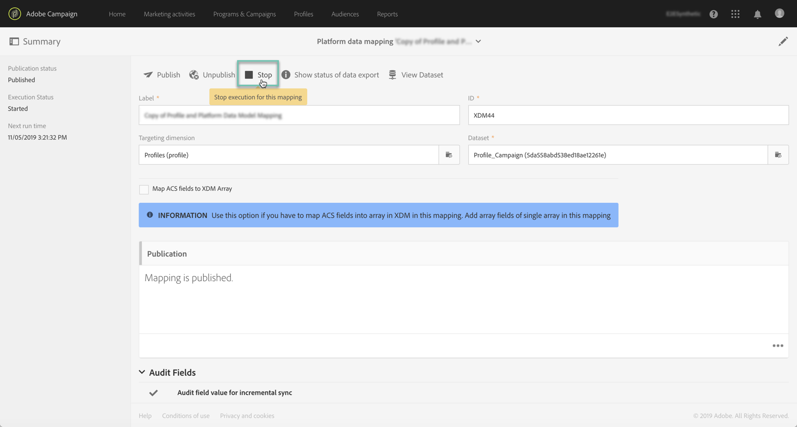

# API によるデータ取り込みのトリガー {#triggering-data-ingestion-apis}

>[!IMPORTANT]
>
>Adobe Experience Platform Data Connectorは現在ベータ版で、予告なく頻繁に更新される可能性があります。 これらの機能にアクセスするには、Azure（現在は北米のみベータ版）でホスティングされている必要があります。 アクセスをご希望の場合は、Adobe カスタマーケアにお問い合わせください。

Adobe Campaign Standardでは、APIを介したデータマッピングの即時の取り込みをトリガーし、取り込みリクエストのステータスを取得できます。

ここでは、データマッピングの取り込みステータスをトリガーおよび取得する方法について説明します。 Campaign Standard APIに関するグローバルな情報については、[この節](../../api/using/get-started-apis.md)を参照してください。

## 前提条件 {#prerequisites}

APIを使用する前に、データマッピングを最初に設定し、Campaign Standard インターフェイス内で公開する必要があります。 詳しくは、以下の節を参照してください。

* [マッピングの定義](../../integrating/using/aep-mapping-definition.md)
* [マッピングのアクティベーション](../../integrating/using/aep-mapping-activation.md)

データマッピングを作成したら、必要なときにいつでもAPIからトリガーできるように、データマッピングの実行を停止する必要があります。 これを行うには、次の手順に従います。

1. Campaign Standardで、**[!UICONTROL Administration]** > **[!UICONTROL Development]** > **[!UICONTROL Platform]** > **[!UICONTROL Status of data export to platform]** メニューに移動します。

1. データマッピングをダブルクリックして開き、**[!UICONTROL Stop]** ボタンをクリックします。

   

1. 変更を保存

これで、データマッピングの実行は停止しました。 Campaign Standard APIを使用して、手動でトリガーすることもできます。

## データマッピングの即時取り込みを開始する {#starting-immediate-ingestion}

XDM マッピングのAdobe Experience Platformへの即時の取り込みは、POST操作でトリガーされます。

`POST https://mc.adobe.io/<ORGANIZATION>/campaign/dataIngestion/xdmIngestion/<XDM Mapping ID>/ingest`

>[!NOTE]
>
>取り込みPOST API呼び出しを実行するには、以下のJS スクリプトを実行することでCampaign Standard管理者が提供できる&#x200B;**SQL関数の実行** ロールが必要です。
>
>```
>var sqlRoleObj = REST.head.roleBase.sql.get();
>REST.head.securityGroup.Administrators.roles.post(sqlRoleObj);
>```
>

POST操作は、作成されたリクエストステータスに関する情報を返します。

* XDM マッピングのリクエストが正常に送信されました：

```
{
"requestId": <value>,
"info": "Ingestion request submitted successfully for the Mapping ID: <value>",
"status":"Success"
}
```

* XDM マッピングのリクエストは既に進行中です：

```
{
"requestId": <value>,
"info": "Ingestion request already in progress for the Mapping ID: <value>",
"status":"In Progress"
}
```

* XDM マッピングが公開されていないか停止しているため、リクエストが失敗しました：

```
{
"info": "Unable to submit data ingestion request, XDM Mapping ID: <value> is not stopped",
"status": "Failed"
}
{
"info": "Unable to submit data ingestion request, XDM Mapping ID: <value> is not published",
"status": "Failed"
}
```

## 取り込みリクエストのステータスの取得 {#retrieving-status}

取り込みリクエストのステータスは、GET操作とパラメーター内の目的のリクエスト IDで取得できます。

```
GET https://mc.adobe.io/<ORGANIZATION>/campaign/dataIngestion/xdmIngestion/<XDM Mapping ID>/ingest
{"requestId"="<value>"}
```

>[!NOTE]
>
>XDM マッピングリクエストのステータスと関連ジョブの詳細は、**[!UICONTROL Status of data export to platform]** メニューのCampaign Standard インターフェイスで確認できます（[&#x200B; マッピングのアクティベーション &#x200B;](../../integrating/using/aep-mapping-activation.md)を参照）。

GET操作は、次の情報を返します。

* **batchId**：このフィールドは、バッチ準備とアップロード後にエラーが発生した場合にのみ入力されます。
* **info**: XDM マッピング ID,
* **numRecords**：取り込まれたレコードの数（成功ステータスのみ）、
* **status**：取り込み要求の状態（成功/失敗/処理中）

GET操作に対する可能な応答は次のとおりです。

* 正常な取り込み要求：

  ```
  {
  "batchId": "",
  "info": "Mapping Id: <value>. ",
  "numRecords": 15,
  "requestId": 3520,
  "status": "Success"
  }
  ```

* 取り込み要求が失敗しました。取り込まれたレコードは0件です：

  ```
  {
  "batchId": "",
  "info": "Mapping Id: <value>. ACP-880056 Failed to fetch the record from the database.",
  "numRecords": 0,
  "requestId": 3520,
  "status": "Failed"
  }
  ```

* 取り込み要求が失敗し、一部のレコードがバッチでアップロードされました：

  ```
  {
  "batchId": "<value>",
  "info": "Mapping Id: <value>. ACP-880096 Sync Job failed to upload. Please check the error in the Platform UI.",
  "numRecords": 0,
  "requestId": <value>,
  "status": "Failed"
  }
  ```

* 一部のレコードの取り込み後に取り込みリクエストが中止されました（これはクラッシュシナリオで発生する可能性があります）。

  ```
  {
  "batchId": "",
  "info": "Mapping Id: <value>. Ingestion request aborted due to some issue with data ingestion service. Please submit a new request",
  "numRecords": 0,
  "requestId": <value>,
  "status": "Aborted"
  }
  ```

* 処理中のリクエストの取り込み（リクエストがデータをバッチでアップロードした場合、またはリクエストの準備をバッチで行う場合）:

  ```
  {
  "batchId": "",
  "info": "Mapping Id: <value>.",
  "numRecords": 0,
  "requestId": <value>,
  "status": "In Progress"
  }
  ```
