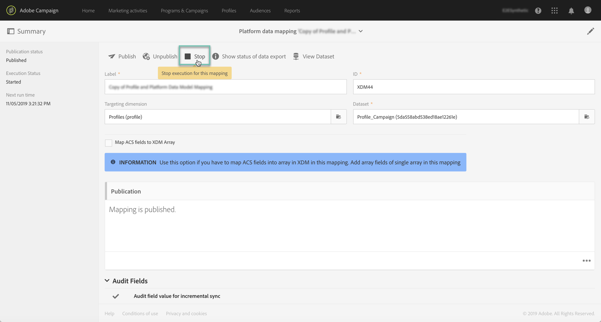

# API によるデータ取得のトリガー {#triggering-data-ingestion-apis}

>[!IMPORTANT]
>
>Adobe Experience Platform Data Connectorは現在ベータ版です。通知なしに頻繁に更新される可能性があります。 これらの機能にアクセスするには、Azureでホストする必要があります（現在、北米でのみベータ版）。 にアクセスする場合は、Adobeカスタマーケアにお問い合わせください。

Adobe Campaign Standardでは、APIを使用して、データマッピングの即時取り込みをトリガーし、取り込みリクエストのステータスを取得できます。

このページでは、データマッピングのトリガーおよび取り込みステータスの取得方法について説明します。 Campaign StandardAPIの全体的な情報については、[この節](../../api/using/get-started-apis.md)を参照してください。

## 前提条件 {#prerequisites}

APIを使用する前に、データマッピングをCampaign Standardインターフェイス内で設定および公開する必要があります。 詳しくは、以下の節を参照してください。

* [マッピングの定義](../../integrating/using/aep-mapping-definition.md)
* [マッピングのアクティベーション](../../integrating/using/aep-mapping-activation.md)

データマッピングを作成したら、必要に応じてAPIからトリガーできるように、データマッピングの実行を停止する必要があります。 次の手順に従います。

1. Campaign Standardで、 **[!UICONTROL Administration]** > **[!UICONTROL Development]** > **[!UICONTROL Platform]** > **[!UICONTROL Status of data export to platform]**&#x200B;メニューに移動します。

1. データマッピングをダブルクリックして開き、「**[!UICONTROL Stop]**」ボタンをクリックします。

   

1. 変更を保存します

これで、データマッピングの実行が停止しました。 Campaign StandardAPIを使用して、手動でトリガーできます。

## データマッピングの即時取り込みの開始 {#starting-immediate-ingestion}

XDMマッピングのAdobe Experience Platformへの即時取り込みは、POST操作でトリガーされます。

`POST https://mc.adobe.io/<ORGANIZATION>/campaign/dataIngestion/xdmIngestion/<XDM Mapping ID>/ingest`

>[!NOTE]
>
>取り込みPOSTAPI呼び出しを実行するには、**SQL関数execution**&#x200B;ロールが必要です。このロールは、Campaign Standard管理者が以下のJSスクリプトを実行することで提供できます。
>
>
```
>var sqlRoleObj = REST.head.roleBase.sql.get();
>REST.head.securityGroup.Administrators.roles.post(sqlRoleObj);
>```

POST操作は、作成されたリクエストステータスに関する情報を返します。

* XDMマッピングの要求が正常に送信されました：

```
{
"requestId": <value>,
"info": "Ingestion request submitted successfully for the Mapping ID: <value>",
"status":"Success"
}
```

* XDMマッピングのリクエストは既に進行中です：

```
{
"requestId": <value>,
"info": "Ingestion request already in progress for the Mapping ID: <value>",
"status":"In Progress"
}
```

* XDMマッピングが公開されていないか、または停止されているため、要求に失敗しました：

```
{
"info": "Unable to submit data ingestion request, XDM Mapping ID: <value> is not stopped",
"status": "Failed"
}
{
"info": "Unable to submit data ingestion request, XDM Mapping ID: <value> is not published",
"status": "Failed"
}
```

## 取得リクエストのステータスの取得 {#retrieving-status}

取得リクエストのステータスは、GET操作を使用して取得でき、パラメーターに目的のリクエストIDを指定して取得できます。

```
GET https://mc.adobe.io/<ORGANIZATION>/campaign/dataIngestion/xdmIngestion/<XDM Mapping ID>/ingest
{"requestId"="<value>"}
```

>[!NOTE]
>
>XDMマッピングリクエストのステータスと関連ジョブに関する詳細情報は、Campaign Standardインターフェイスの&#x200B;**[!UICONTROL Status of data export to platform]**&#x200B;メニューで確認できます（[マッピングの有効化](../../integrating/using/aep-mapping-activation.md)を参照）。

「GET」操作では、次の情報が返されます。

* **batchId**:このフィールドは、バッチの準備とアップロード後にエラーが発生した場合にのみ入力されます。
* **情報**:XDMマッピングID
* **numRecords**:取り込まれたレコードの数（成功ステータスのみ）
* **ステータス**:取り込みリクエストのステータス（成功/失敗/処理中）

次に、GET操作に対する応答を示します。

* 取り込みリクエストが成功しました：

   ```
   {
   "batchId": "",
   "info": "Mapping Id: <value>. ",
   "numRecords": 15,
   "requestId": 3520,
   "status": "Success"
   }
   ```

* 取り込み要求が0件のレコードで失敗しました：

   ```
   {
   "batchId": "",
   "info": "Mapping Id: <value>. ACP-880056 Failed to fetch the record from the database.",
   "numRecords": 0,
   "requestId": 3520,
   "status": "Failed"
   }
   ```

* 取り込みリクエストが失敗し、一部のレコードがバッチにアップロードされました：

   ```
   {
   "batchId": "<value>",
   "info": "Mapping Id: <value>. ACP-880096 Sync Job failed to upload. Please check the error in the Platform UI.",
   "numRecords": 0,
   "requestId": <value>,
   "status": "Failed"
   }
   ```

* 一部のレコードを取り込んだ後で取り込みリクエストが中止されました（クラッシュシナリオで発生する可能性があります）。

   ```
   {
   "batchId": "",
   "info": "Mapping Id: <value>. Ingestion request aborted due to some issue with data ingestion service. Please submit a new request",
   "numRecords": 0,
   "requestId": <value>,
   "status": "Aborted"
   }
   ```

* 取り込みリクエストが進行中（リクエストがバッチでデータをアップロードした場合、またはリクエストのバッチ準備中）:

   ```
   {
   "batchId": "",
   "info": "Mapping Id: <value>.",
   "numRecords": 0,
   "requestId": <value>,
   "status": "In Progress"
   }
   ```
