# セグメントビルダーの使用 {#using-the-segment-builder}

>[!IMPORTANT]
>
>Audience Destinations サービスは現在ベータ版で、予告なく頻繁に更新される可能性があります。 これらの機能にアクセスするには、Azure（現在は北米のみベータ版）でホスティングされている必要があります。 アクセスをご希望の場合は、Adobe カスタマーケアにお問い合わせください。

セグメントビルダーを使用すると、[ リアルタイム顧客プロファイル ](https://experienceleague.adobe.com/docs/experience-platform/profile/home.html?lang=ja)からのデータに基づいてルールを定義して、オーディエンスを構築できます。

このセクションでは、セグメントを構築する際のグローバルな概念について説明します。 セグメントビルダー自体について詳しくは、[ セグメントビルダーユーザーガイド ](https://experienceleague.adobe.com/docs/experience-platform/segmentation/ui/overview.html)を参照してください。

セグメントビルダーのインターフェイスは次のように構成されています。

* 左側のペインには、目的のフィールドをセグメントビルダーワークスペースにドラッグ&amp;ドロップして、セグメントを構築するために使用できるすべての属性、イベント、オーディエンスが表示されます。
* 中央エリアには、使用可能なフィールドのルールを定義して組み合わせることで、セグメントを構築するためのワークスペースが用意されています。
* ヘッダーと右側のペインには、セグメントのプロパティ（セグメントの名前、説明、推定された適格プロファイル）が表示されます。

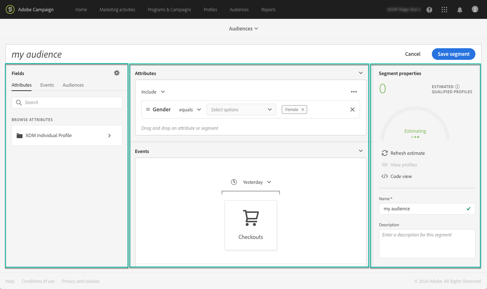

## セグメントの構築

セグメントを作成するには、次の手順に従います。

セグメントビルダーがワークスペースに表示されます。 Adobe Experience Platformのデータを使用してセグメントを構築し、オーディエンスの構築に活用できます。

1. セグメントに名前を付け、説明を入力します（オプション）。

   

1. 設定パネルで目的の結合ポリシーが選択されていることを確認します。

   結合ポリシーについて詳しくは、[ セグメントビルダーユーザーガイド ](https://experienceleague.adobe.com/docs/experience-platform/segmentation/ui/overview.html)の専用セクションを参照してください。

   

1. 左側のパネルで目的のフィールドを探し、中央のワークスペースにドラッグします。

   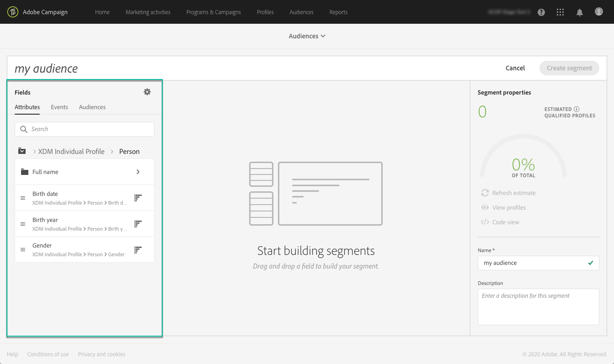

1. ドラッグしたフィールドに対応するルールを設定します。

   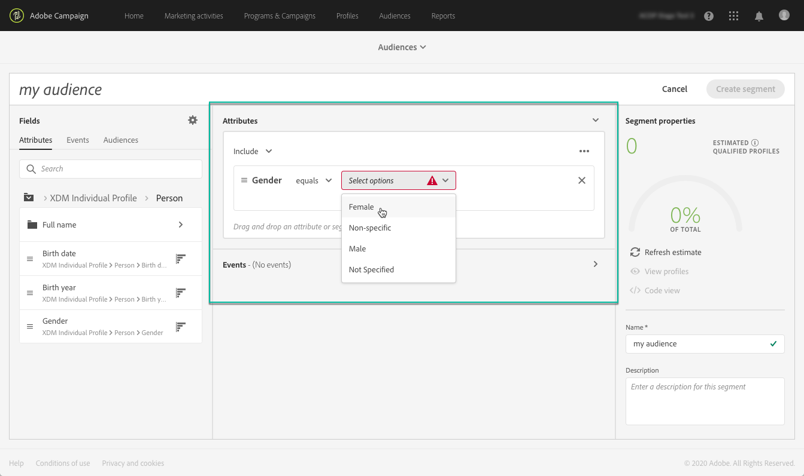

1. 「**[!UICONTROL Create segment]**」ボタンをクリックします。

## セグメントに適したフィールドの検索

左側のペインには、ルールの作成に使用できるすべての属性、イベント、オーディエンスが一覧表示されます。

リストされているフィールドは、会社によって取得された属性で、[Experience Data Model （XDM） システム ](https://experienceleague.adobe.com/docs/experience-platform/xdm/home.html)を通じて使用できるようになっています。

フィールドはタブに整理されます。

* **[!UICONTROL Attributes]**: Adobe Campaign データベースまたはAdobe Experience Platformから取得できる既存のプロファイル属性。 プロファイルに添付された静的情報（メールアドレス、居住国、ロイヤルティプログラムのステータスなど）を指します。

  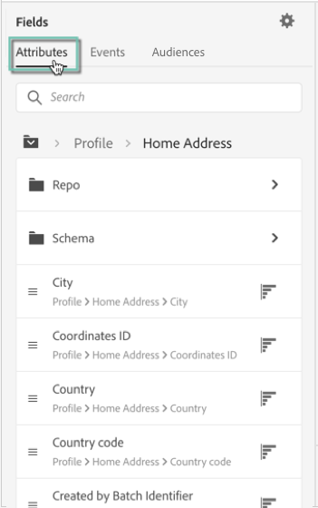

* **[!UICONTROL Events]**: 「2週間で2回注文した人」など、自社の顧客接点と何らかのインタラクションを行った消費者を特定するアクティビティ。 これは、Adobe Analyticsからストリーミングすることも、サードパーティのETL ツールを使用してAdobe Experience Platformに直接取り込むこともできます。

  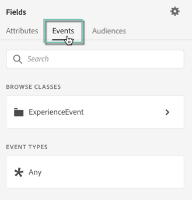

>[!NOTE]
>
>**複数エンティティのセグメント化**&#x200B;を使用すると、製品、店舗、またはその他のプロファイル以外のクラスに基づく追加データを使用して、プロファイルデータを拡張できます。 接続すると、追加のクラスのデータが、プロファイルスキーマにネイティブであるかのように、利用可能になります。
>
>詳しくは、[該当するドキュメント](https://experienceleague.adobe.com/docs/experience-platform/segmentation/multi-entity-segmentation.html)を参照してください。

デフォルトでは、セグメントビルダーにはデータが既に存在するフィールドが表示されます。 データが存在しないフィールドを含む完全なスキーマを表示するには、設定から&#x200B;**[!UICONTROL Show full XDM schema]** オプションを有効にします。

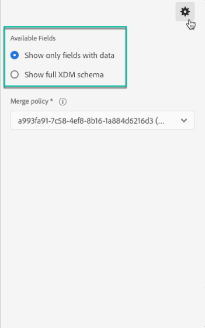

各フィールドの末尾にある記号は、属性とその使用方法に関する追加情報を提供します。

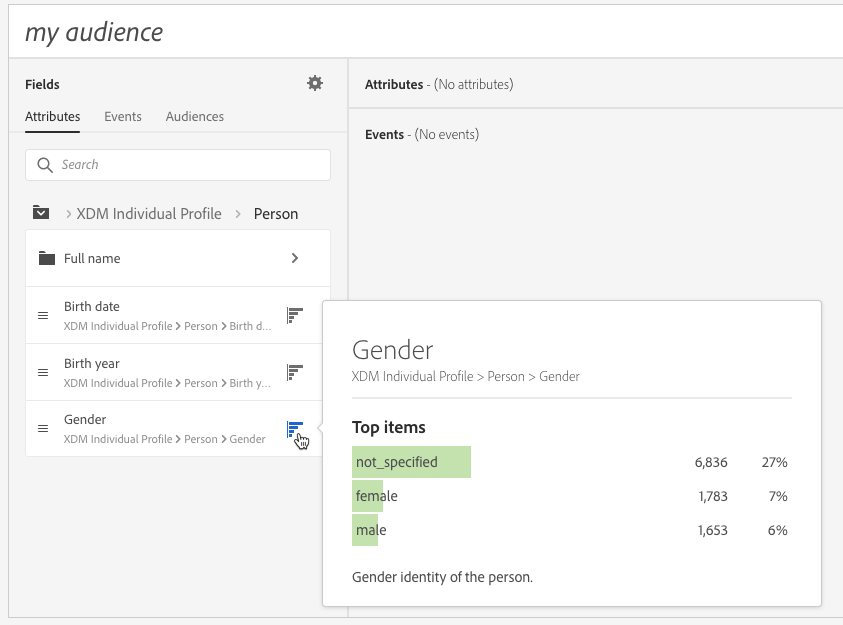

## セグメントのルールの定義

>[!NOTE]
>
>以下の節では、ルール定義に関するグローバル情報を提供します。 詳しくは、[ セグメントビルダーユーザーガイド ](https://experienceleague.adobe.com/docs/experience-platform/segmentation/ui/overview.html)を参照してください。

ルールを作成するには、次の手順に従います。

1. 左側のペインで、ルールの基になる属性またはイベントを反映するフィールドを検索します。

1. フィールドを中央のワークスペースにドラッグし、目的のセグメント定義に従って設定します。 これを行うには、いくつかの文字列関数と日付/時刻関数を使用できます。

   次の例では、ルールは「男性」に等しい性別のすべてのプロファイルをターゲットにします。

   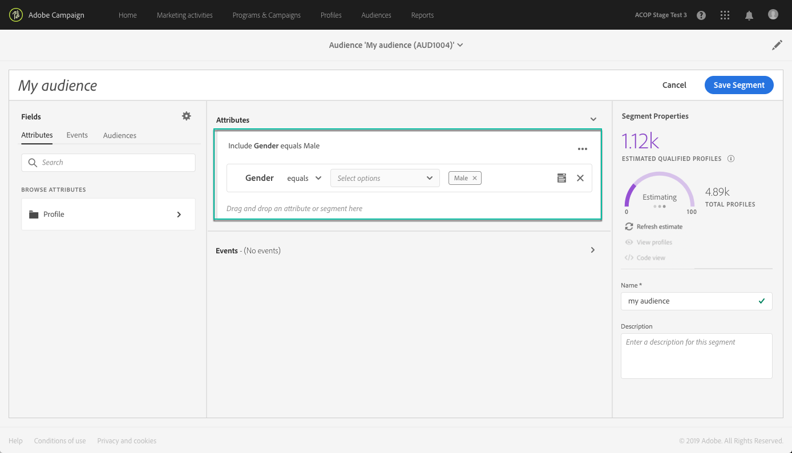

   セグメントに対応する推定母集団は、**[!UICONTROL Segment Properties]** セクションで自動的に再計算されます。

1. **[!UICONTROL View Profiles]** ボタンを使用すると、ルールに対応する最初の20件のレコードのプレビューが表示され、セグメントをすばやく検証できます。

   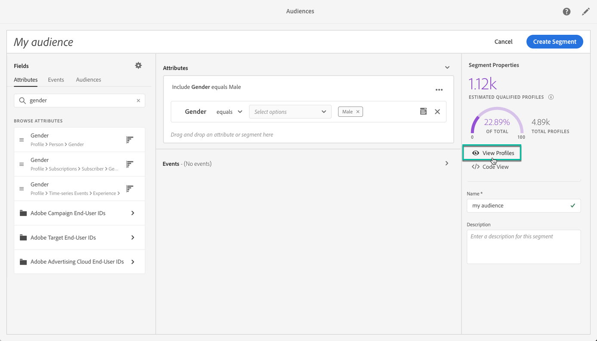

   適切なプロファイルをターゲットにするために、必要な数の追加ルールを追加できます。

   コンテナにルールを追加する場合、AND論理演算子を使用して既存のルールにルールが追加されます。 必要に応じて、論理演算子をクリックして変更します。

   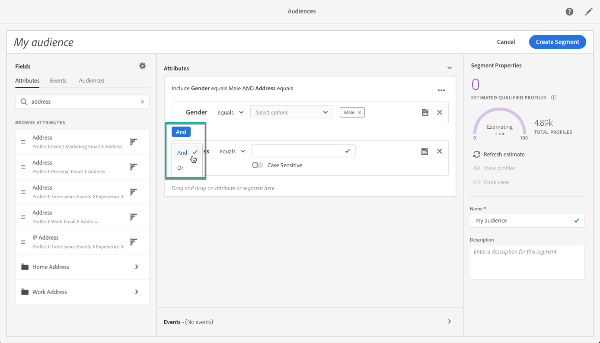

リンクすると、2つのルールがコンテナを形成します。

## フィールドの比較

セグメントビルダーでは、2つのフィールドを比較してルールを定義できます。 例えば、自宅の住所が職場の住所と異なる郵便番号の女性は、

これを行うには、次の手順に従います。

1. 比較する最初のフィールド（ホームアドレスの郵便番号など）を中央のワークスペースにドラッグします。

   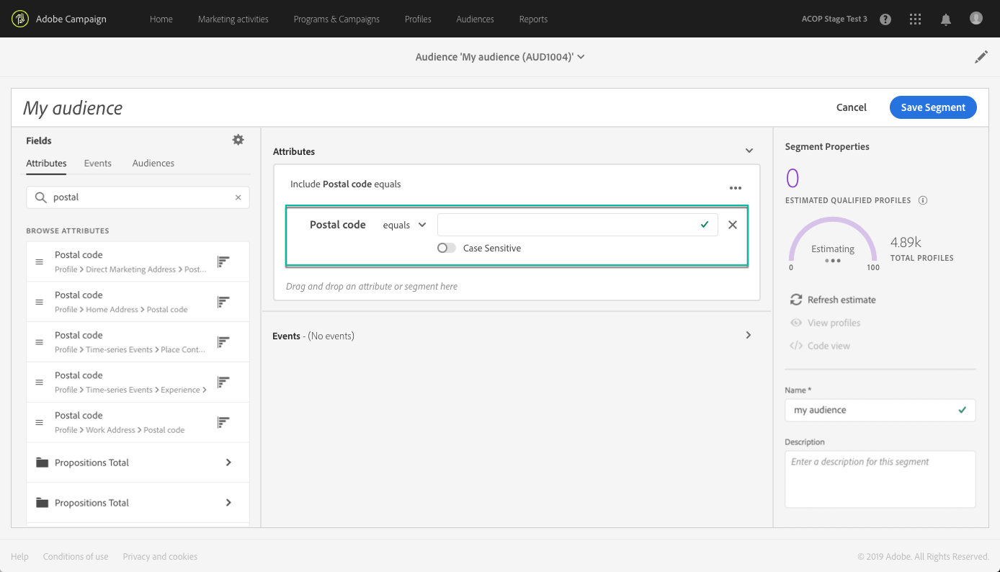

1. 最初のフィールドと比較する2番目のフィールド（作業先住所の郵便番号など）を選択します。

   **[!UICONTROL Drop here to compare operands]** ボックスの最初のフィールドと同じコンテナにある中央のワークスペースにドラッグします。

   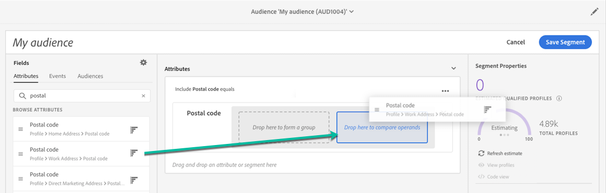

1. 必要に応じて、2つのフィールド間の演算子を設定します。 この例では、セグメントでホームアドレスと職場アドレスが異なるプロファイルをターゲットにしたい場合です。

   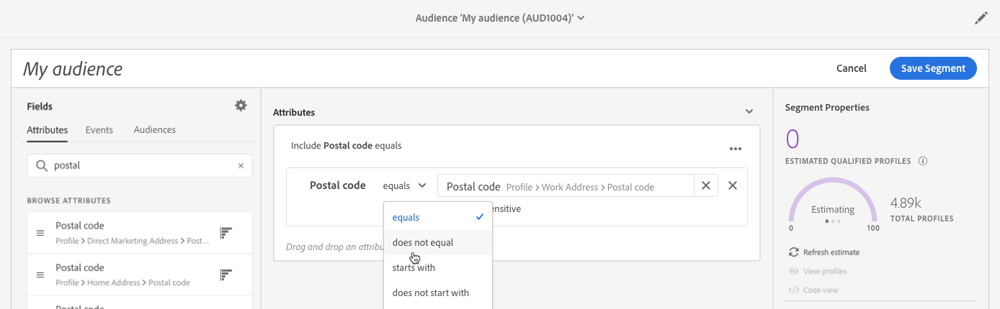

ルールが設定され、オーディエンスとしてアクティブ化する準備が整います。
