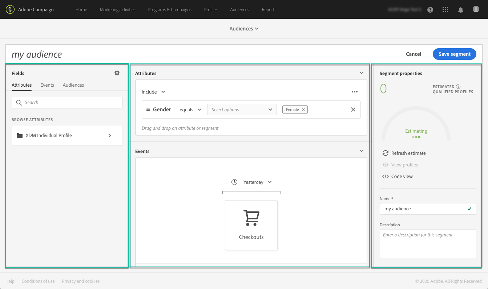
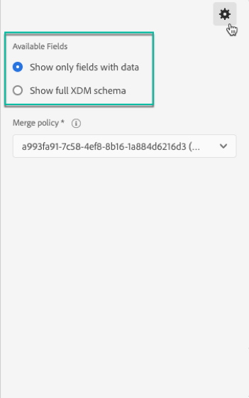

# セグメントビルダーの使用 {#using-the-segment-builder}

>[!IMPORTANT]
>
>Audience Destinations サービスは現在ベータ版です。予告なく頻繁に更新される場合があります。 これらの機能にアクセスするには、お客様を Azure でホストする必要があります（現在は北米向けのベータ版のみ）。 へのアクセスを希望する場合は、Adobe カスタマーケアにお問い合わせください。

セグメントビルダーを使用すると、（リアルタイム顧客プロファイル [ からのデータに基づいてルールを定義することで、オーディエンスを構築 ](https://experienceleague.adobe.com/docs/experience-platform/profile/home.html?lang=ja) きます。

この節では、セグメントを作成する際のグローバルな概念を示します。 セグメントビルダー自体の詳細については、『 [ セグメントビルダーユーザーガイド ](https://experienceleague.adobe.com/docs/experience-platform/segmentation/ui/overview.html) 』を参照してください。

セグメントビルダーインターフェイスは、次のように構成されます。

* 左側のペインには、目的のフィールドをセグメントビルダーワークスペースにドラッグ&amp;ドロップしてセグメントを作成するために使用できるすべての属性、イベントおよびオーディエンスが表示されます。
* 中央の領域には、使用可能なフィールドからルールを定義して組み合わせることで、セグメントを作成するためのワークスペースが表示されます。
* ヘッダーと右側のパネルにはセグメントのプロパティ（名前、説明、セグメントの推定認定プロファイルなど）が表示されます。

## セグメントの作成

セグメントを作成するには、次の手順に従います。

セグメントビルダーがワークスペースに表示されます。 これにより、Adobe Experience Platformのデータを使用してセグメントを作成し、最終的にオーディエンスの作成に使用できます。

1. セグメントに名前を付け、説明を入力します（オプション）。

   

1. 設定ペインで目的の結合ポリシーが選択されていることを確認します。

   結合ポリシーについて詳しくは、『 [ セグメントビルダーユーザーガイド ](https://experienceleague.adobe.com/docs/experience-platform/segmentation/ui/overview.html) の該当する節を参照してください。

   

1. 左側のペインで目的のフィールドを探し、中央のワークスペースにドラッグします。

   

1. ドラッグしたフィールドに対応するルールを設定します。

   

1. 「**[!UICONTROL Create segment]**」ボタンをクリックします。

## セグメントに適したフィールドの検索

左側のペインには、ルールの作成に使用できるすべての属性、イベントおよびオーディエンスが一覧表示されます。

一覧表示されるフィールドは、会社が取得した属性であり、[ エクスペリエンスデータモデル（XDM）システム ](https://experienceleague.adobe.com/docs/experience-platform/xdm/home.html) を通じて使用できます。

フィールドは次のタブに整理されます。

* **[!UICONTROL Attributes]**:Adobe Campaign データベースやAdobe Experience Platformから生成できる既存のプロファイル属性。 プロファイルに関連付けられた静的情報（メールアドレス、居住国、ロイヤルティプログラムのステータスなど）を指します。

  

* **[!UICONTROL Events]**:「2 週間で 2 回注文した任意のユーザー」など、会社の顧客タッチポイントと何らかのインタラクションを持つ消費者を識別するアクティビティ。 これは、Adobe Analyticsからストリーミングすることも、サードパーティの ETL ツールを使用してAdobe Experience Platformに直接取り込むこともできます。

  

>[!NOTE]
>
>**マルチエンティティのセグメント化** を使用すると、製品、ストア、その他のプロファイル以外のクラスに基づく追加データで、プロファイルデータを拡張できます。 接続すると、追加のクラスのデータは、プロファイルスキーマ本来のデータと同じように使用できるようになります。
>
>詳しくは、[該当するドキュメント](https://experienceleague.adobe.com/docs/experience-platform/segmentation/multi-entity-segmentation.html)を参照してください。

デフォルトでは、セグメントビルダーには、既にデータが存在するフィールドが表示されます。 データが存在しないフィールドを含むスキーマ全体を表示するには、設定から「**[!UICONTROL Show full XDM schema]**」オプションを有効にします。

各フィールドの最後にある記号は、属性とその使用方法に関する追加情報を提供します。

## セグメントのルールの定義

>[!NOTE]
>
>以下の節では、ルール定義に関する全体的な情報を示します。 詳しくは、[ セグメントビルダーユーザーガイド ](https://experienceleague.adobe.com/docs/experience-platform/segmentation/ui/overview.html) を参照してください。

ルールを作成するには、次の手順に従います。

1. ルールの基になる属性またはイベントを反映するフィールドを左側のペインから見つけます。

1. フィールドを中央のワークスペースにドラッグし、目的のセグメント定義に従って設定します。 これを行うには、複数の文字列関数と日付/時間関数を使用できます。

   次の例では、ルールは、「男性」と等しい性別を持つすべてのプロファイルをターゲットにします。

   

   セグメントに対応する推定母集団は、「**[!UICONTROL Segment Properties]**」セクションで自動的に再計算されます。

1. **[!UICONTROL View Profiles]** のボタンをクリックすると、ルールに対応する最初の 20 件のレコードのプレビューが表示され、セグメントをすばやく検証できます。

   

   適切なプロファイルをターゲットにするために、必要な数のルールを追加できます。

   コンテナにルールを追加すると、AND 論理演算子を使用して既存のルールに追加されます。 必要に応じて、論理演算子をクリックして変更します。

   

2 つのルールをリンクすると、コンテナが形成されます。

## フィールドの比較

セグメントビルダーを使用すると、2 つのフィールドを比較してルールを定義できます。 例えば、自宅の住所と勤務先の住所が異なる女性などです。

これを行うには、次の手順に従います。

1. 比較する最初のフィールド （自宅住所の郵便番号など）を中央作業領域にドラッグします。

   

1. 最初のフィールドと比較する 2 番目のフィールド（勤務先住所の郵便番号など）を選択します。

   それを中央のワークスペースにドラッグし、[**[!UICONTROL Drop here to compare operands]**] ボックスの最初のフィールドと同じコンテナに配置します。

   

1. 必要に応じて、2 つのフィールド間に演算子を設定します。 この例では、セグメントで、勤務先住所とは異なる自宅住所を持つプロファイルをターゲットにします。

   

ルールが設定され、オーディエンスとしてアクティブ化する準備が整いました。
