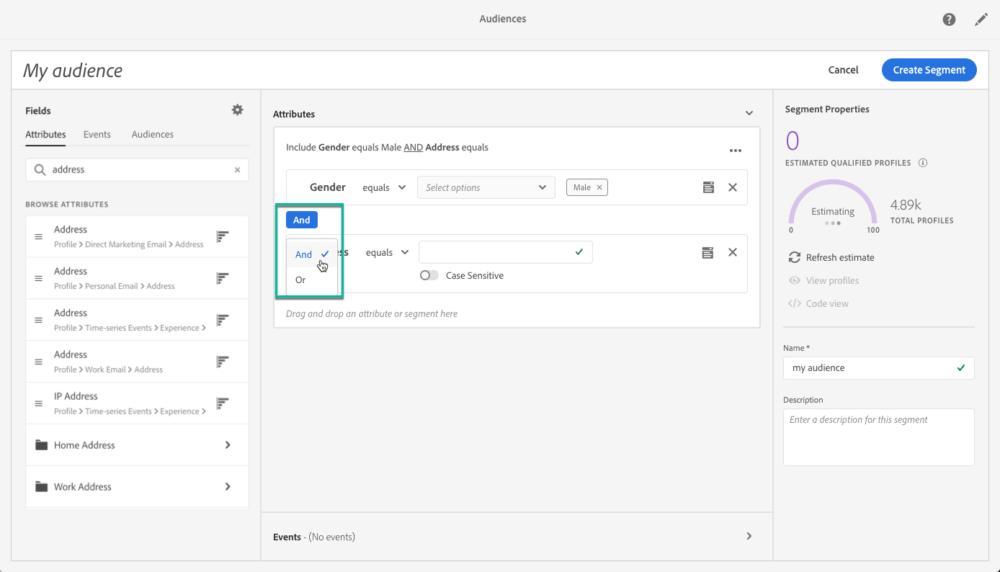

# セグメントビルダーの使用 {#using-the-segment-builder}

>[!IMPORTANT]
>
>Audience Destinations サービスは現在ベータ版です。通知なしに頻繁に更新される可能性があります。 お客様は、これらの機能にアクセスするには、Azure 上でホストされている必要があります（現在、北米ではベータ版のみ）。 にアクセスする場合は、Adobeカスタマーケアにお問い合わせください。

セグメントビルダーを使用すると、 [リアルタイム顧客プロファイル](https://experienceleague.adobe.com/docs/experience-platform/profile/home.html).

この節では、セグメントを作成する際のグローバルな概念について説明します。 セグメントビルダー自体について詳しくは、 [セグメントビルダーユーザーガイド](https://experienceleague.adobe.com/docs/experience-platform/segmentation/ui/overview.html).

セグメントビルダーのインターフェイスは、次のように構成されています。

* 左側のパネルには、必要なフィールドをセグメントビルダーのワークスペースにドラッグ&amp;ドロップすることで、セグメントの作成に使用できるすべての属性、イベントおよびオーディエンスが表示されます。
* 中央の領域には、使用可能なフィールドからルールを定義し組み合わせることで、セグメントを作成するためのワークスペースが用意されています。
* ヘッダーと右側のウィンドウには、セグメントのプロパティ（名前、説明、セグメントの推定認定プロファイル）が表示されます。

## セグメントの作成

セグメントを作成するには、次の手順に従います。

セグメントビルダーがワークスペースに表示されます。 これにより、Adobe Experience Platformのデータを使用してセグメントを構築し、最終的にオーディエンスの作成に使用できます。

1. セグメントに名前を付け、説明を入力します（オプション）。

   

1. 設定パネルで目的の結合ポリシーが選択されていることを確認します。

   結合ポリシーについて詳しくは、 [セグメントビルダーユーザーガイド](https://experienceleague.adobe.com/docs/experience-platform/segmentation/ui/overview.html).

   

1. 左側のパネルで目的のフィールドを探し、中央のワークスペースにドラッグします。

   

1. ドラッグしたフィールドに対応するルールを設定します。

   

1. 「**[!UICONTROL Create segment]**」ボタンをクリックします。

## セグメントに適したフィールドの検索

左側のウィンドウには、ルールの作成に使用できるすべての属性、イベント、オーディエンスが表示されます。

リストされるフィールドは、会社がキャプチャした属性で、 [エクスペリエンスデータモデル (XDM) システム](https://experienceleague.adobe.com/docs/experience-platform/xdm/home.html).

フィールドはタブに整理されています。

* **[!UICONTROL Attributes]**: Adobe CampaignデータベースまたはAdobe Experience Platformから取得できる既存のプロファイル属性。 プロファイルに添付される静的情報（E メールアドレス、居住国、ロイヤルティプログラムのステータスなど）を指します。

  

* **[!UICONTROL Events]**:「2 週間に 2 回注文したすべてのユーザー」など、会社の顧客タッチポイントと何らかのインタラクションを持つ消費者を識別するアクティビティ。 これは、Adobe Analyticsからストリーミングすることも、サードパーティの ETL ツールを使用してAdobe Experience Platformに直接取り込むこともできます。

  

>[!NOTE]
>
>**マルチエンティティセグメント化** を使用すると、製品、店舗または他のプロファイル以外のクラスに基づいて、プロファイルデータを追加データで拡張できます。 接続すると、追加のクラスのデータが、プロファイルスキーマ本来の方法と同じように使用可能になります。
>
>詳しくは、[該当するドキュメント](https://experienceleague.adobe.com/docs/experience-platform/segmentation/multi-entity-segmentation.html)を参照してください。

デフォルトでは、データが既に存在するフィールドがセグメントビルダーに表示されます。 データが存在しないフィールドを含む完全なスキーマを表示するには、 **[!UICONTROL Show full XDM schema]** 」オプションを選択します。

各フィールドの最後の記号は、属性とその使用方法に関する追加情報を提供します。

## セグメントのルールの定義

>[!NOTE]
>
>以下の節では、ルール定義に関する全体的な情報を示します。 詳しくは、 [セグメントビルダーユーザーガイド](https://experienceleague.adobe.com/docs/experience-platform/segmentation/ui/overview.html).

ルールを作成するには、次の手順に従います。

1. ルールの基になる属性やイベントを反映したフィールドを左側のペインから探します。

1. フィールドを中央のワークスペースにドラッグし、目的のセグメント定義に従って設定します。 これをおこなうには、いくつかの文字列関数と日付/時間関数を使用できます。

   次の例では、ルールのターゲットにする性別は「Male」に等しいすべてのプロファイルです。

   

   セグメントに対応する推定母集団が **[!UICONTROL Segment Properties]** 」セクションに入力します。

1. The **[!UICONTROL View Profiles]** ボタンをクリックすると、ルールに対応する最初の 20 件のレコードのプレビューが表示され、セグメントをすばやく検証できます。

   

   適切なプロファイルをターゲットにするために、必要な数のルールを追加できます。

   ルールをコンテナに追加する場合、 AND 論理演算子を使用して既存のルールに追加されます。 必要に応じて、論理演算子をクリックして変更します。

   

2 つのルールをリンクすると、1 つのコンテナが形成されます。

## フィールドの比較

セグメントビルダーでは、2 つのフィールドを比較してルールを定義できます。 例えば、自宅住所が勤務先住所とは異なる郵便番号の女性など。

これを行うには、次の手順に従います。

1. 比較する最初のフィールド（住所の郵便番号など）を中央のワークスペースにドラッグします。

   

1. 最初のフィールドと比較する 2 番目のフィールド（勤務先住所の郵便番号など）を選択します。

   中央のワークスペース ( 最初のフィールドと同じコンテナ内、 **[!UICONTROL Drop here to compare operands]** ボックス。

   

1. 必要に応じて、2 つのフィールド間の演算子を設定します。 この例では、セグメントで、勤務先住所とは異なる自宅住所を持つプロファイルをターゲットにします。

   

これで、ルールが設定され、オーディエンスとしてアクティブ化できる状態になります。
