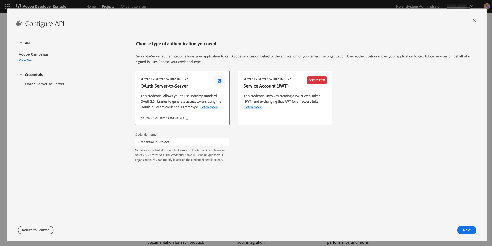

# Microsoft Dynamics 365 統合用の Adobe IO の設定

チャネル間の通信に関するCRMデータをアクティブにします。統合前のセットアップで、新しいAdobeIOプロジェクトを作成し、Microsoft Dynamics 365統合用に構成するために必要な手順を説明します。

## 概要

Adobe Campaign Standard- Microsoft Dynamics 365の統合については、 [このページで説明します](../../integrating/using/working-with-campaign-standard-and-microsoft-dynamics-365.md)。

この記事の統合前の設定を実行する前に、既にプロビジョニングが完了しており、組織のCampaign Standardインスタンスに対する管理者アクセス権があることを前提としています。  この問題が発生しない場合は、キャンペーンのプロビジョニングを完了するために、Adobeカスタマーケアにお問い合わせいただく必要があります。

>[!CAUTION]
>
>以下に説明する手順は、管理者が実行する必要があります。

## 設定

新しいAdobeI/Oプロジェクトを作成し、統合用に設定する必要があります。

### 新しいプロジェクトの作成

これを行うには、次の手順に従います。

1. 「 [AdobeI/Oコンソール](https://console.adobe.io/home#) 」に移動し、画面の右上にあるドロップダウンメニューからAdobeIMS組織IDを選択します。

1. 次に、 **[!UICONTROL Create new project]** の下をクリックし **[!UICONTROL Quick Start]**&#x200B;ます。

   

1. の下 **[!UICONTROL Get started with your new project]**&#x200B;のをクリックし **[!UICONTROL Add API]**&#x200B;ます。

   

1. Adobe CampaignAPIを選択し（下にスクロールする必要がある場合があります）、をクリックし **[!UICONTROL Next]**&#x200B;ます。

   

1. 次の画面では、独自の公開鍵をアップロードするか、AdobeI/Oで鍵ペアを生成するかを選択できます。 これらの手順は、後者のオプションに従います。 AdobeI/Oでキーペアを生成する場合は、オプション1をクリックします。次に、 **[!UICONTROL Generate keypair]** ボタンをクリックします。

   

1. 次の画面で、キーペアzipファイルのダウンロード先を指定し、名前を付けて選択するよう求められます。

ダウンロードしたファイルを解凍すると、公開鍵と秘密鍵が表示されます。 AdobeI/Oは既にAdobeI/Oプロジェクトに公開鍵を適用しています。 秘密鍵は後で保持する必要があります。秘密鍵は、統合ツールの統合前の設定時に使用されます。

1. クリック **[!UICONTROL Next]** して続行

   

1. 次の画面で、このプロジェクトに関連付ける製品プロファイルを選択します。 ソリューションに含まれる製品プロファイルを選択します。キャンペーン標準製品：campaigntitle:キャンペーンインスタンスのテナントID - [!UICONTROL Administrators]

   例：Campaign Standard-キャンペーン — テナントID — 管理者

1. 「**[!UICONTROL Save configured API]**」をクリックします。

   

1. 次の画面に、新しいAdobeI/Oプロジェクトの詳細が表示されます。 画面 **[!UICONTROL Add to Project]** の左上にあるをクリックし、ドロップダウンから **API** を選択します。

   

1. 次の画面で、I/OイベントAPIを選択し、をクリックし **[!UICONTROL Next]**&#x200B;ます。

1. 次の画面でをクリックし **[!UICONTROL Save the configured API]**&#x200B;ます。  プロジェクトの詳細画面に戻ります。

1. 画面の左上 **[!UICONTROL Add to Project]** にあるをクリックし、前と同様に、ドロップダウンから **API** を選択します。

1. 次の画面で、I/O Management APIを選択し、をクリックする必要があり **[!UICONTROL Next]**&#x200B;ます。

1. 次の画面でをクリックし **[!UICONTROL Save the configured API]**&#x200B;ます。

キャンペーンでの統合前の設定が完了しました。  Microsoft Dynamics 365の [統合前のセットアップを完了します](../../integrating/using/configure-microsoft-dynamics-365-for-campaign-integration.md)。

**関連トピック**

* [AdobeIO — サービスアカウント統合](https://www.adobe.io/authentication/auth-methods.html#!AdobeDocs/adobeio-auth/master/AuthenticationOverview/ServiceAccountIntegration.md)
* [Campaign Standard- APIアクセスの設定](../../api/using/setting-up-api-access.md)
* [Campaign Standard- Dynamics 365統合](../../integrating/using/configure-microsoft-dynamics-365-for-campaign-integration.md)