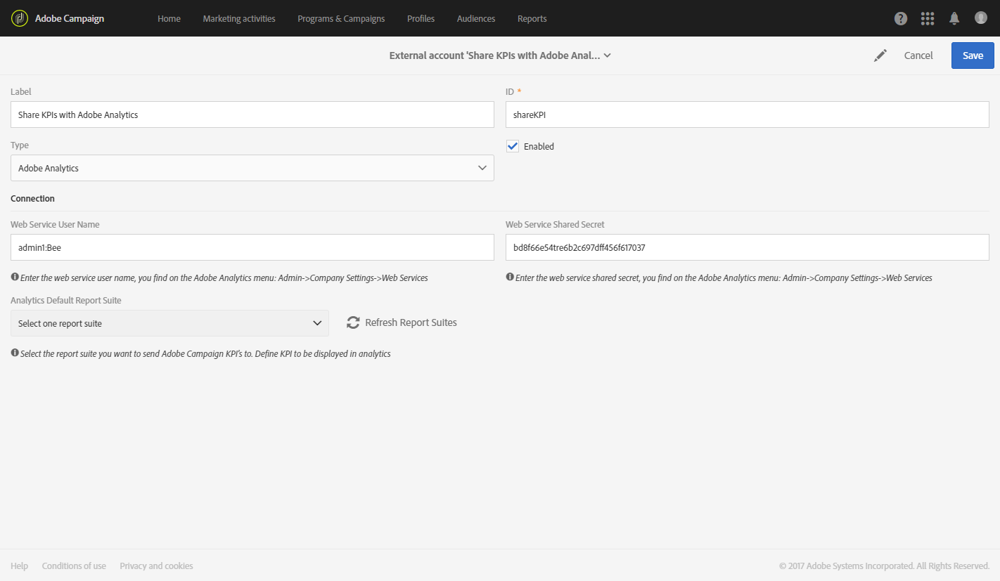

# Campaign と Analytics の統合の設定{#configure-campaign-analytics-integration}

この統合により、主要業績評価指標データをAdobe CampaignからAdobe Analytics Standardまたは Premium に直接共有できます。

Adobe Campaign StandardとAdobe Analyticsの統合を開始するには、まず、Adobe Analyticsにリンクされた外部アカウントを設定する必要があります。

外部アカウントとテクニカルワークフローは、プラットフォームの機能管理者のみが管理できます。

1. Adobe Campaign ロゴを使用して、詳細メニューから「**[!UICONTROL Administration > Application settings > External accounts]**」を選択します。
1. **[!UICONTROL Share KPIs with Adobe Analytics]** 外部アカウントを選択します。

   

1. **[!UICONTROL Connection]** フィールドに **[!UICONTROL Web services user name]** と **[!UICONTROL Web services share secret]** を指定します。

   これらのパラメーターは、**[!UICONTROL Admin > Company settings > Web services]** を選択すると Analytics で見つかります。

   

1. 「**[!UICONTROL Refresh report suites]**」ボタンをクリックします。
1. **[!UICONTROL Analytics default report suite]** ドロップダウンで、Adobe Campaign データをエンリッチメントするAdobe Analytics レポートスイートを選択します。

   これで外部アカウントの準備が整い、Adobe Analyticsとリンクされました。 **[!UICONTROL Enabled]** のチェックボックスをオンにすると、いつでも無効にすることができます。

   

**[!UICONTROL Share KPIs with Adobe Analytics]** テクニカルワークフローが自動的に起動し、「**[!UICONTROL Administration > Application settings > Workflow]**」を選択して、詳細メニューから表示できるようになりました。 このテクニカルワークフローでは、最大 6 か月前の broadlog を保持できます。 このワークフローは増分処理であり、前日のデータがプッシュされます。

これで、データをAdobe Analyticsで使用できるようになります。

**関連トピック：**

* [外部アカウント](../../administration/using/external-accounts.md)
* [テクニカルワークフロー](../../administration/using/technical-workflows.md)
* [ 統合キャンペーンレポート用の KPI の共有 ](https://helpx.adobe.com/marketing-cloud/how-to/email-marketing.html) ビデオ
