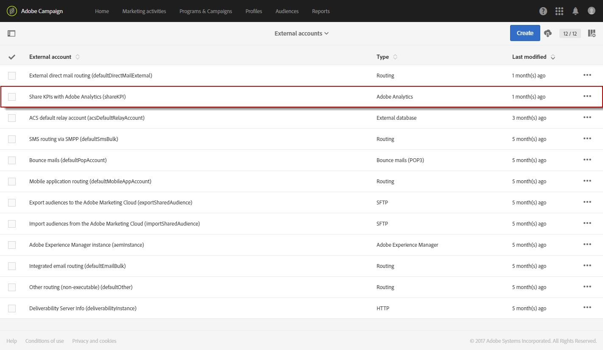

# Campaign と Analytics の統合の設定{#configure-campaign-analytics-integration}

この統合により、Adobe CampaignからAdobe Analytics StandardまたはPremiumに、主要業績評価指標データを直接共有できます。

Adobe Campaign StandardとAdobe Analyticsの統合を開始するには、まずAdobe Analyticsにリンクされた外部アカウントを設定する必要があります。

外部アカウントとテクニカルワークフローは、プラットフォームの機能管理者のみが管理できます。

1. 詳細設定メニューから、Adobe Campaign ロゴを使用して、**[!UICONTROL Administration > Application settings > External accounts]**&#x200B;を選択します。
1. **[!UICONTROL Share KPIs with Adobe Analytics]**&#x200B;外部アカウントを選択します。

   

1. **[!UICONTROL Connection]** フィールドに&#x200B;**[!UICONTROL Web services user name]**&#x200B;と&#x200B;**[!UICONTROL Web services share secret]**&#x200B;を指定します。

   これらのパラメーターは、**[!UICONTROL Admin > Company settings > Web services]**&#x200B;を選択してAnalyticsで見つけることができます。

   

1. 「**[!UICONTROL Refresh report suites]**」ボタンをクリックします。
1. Adobe Campaign データでエンリッチするAdobe Analytics レポートスイートを&#x200B;**[!UICONTROL Analytics default report suite]** ドロップダウンで選択します。

   これで、外部アカウントの準備が整い、Adobe Analyticsにリンクされました。 **[!UICONTROL Enabled]** ボックスをオンにすれば、いつでも無効にできます。

   

**[!UICONTROL Share KPIs with Adobe Analytics]** テクニカルワークフローが自動的に起動し、**[!UICONTROL Administration > Application settings > Workflow]**&#x200B;を選択して詳細メニューから表示できるようになります。 このテクニカルワークフローでは、最大6か月経過したブロードログを保持できます。 このワークフローは増分であり、前日のデータをプッシュすることに注意してください。

これで、Adobe Analyticsでデータを利用できるようになります。

**関連トピック：**

* [外部アカウント](../../administration/using/external-accounts.md)
* [テクニカルワークフロー](../../administration/using/technical-workflows.md)
* [統合キャンペーンレポート用のKPIの共有](https://helpx.adobe.com/marketing-cloud/how-to/email-marketing.html)動画
