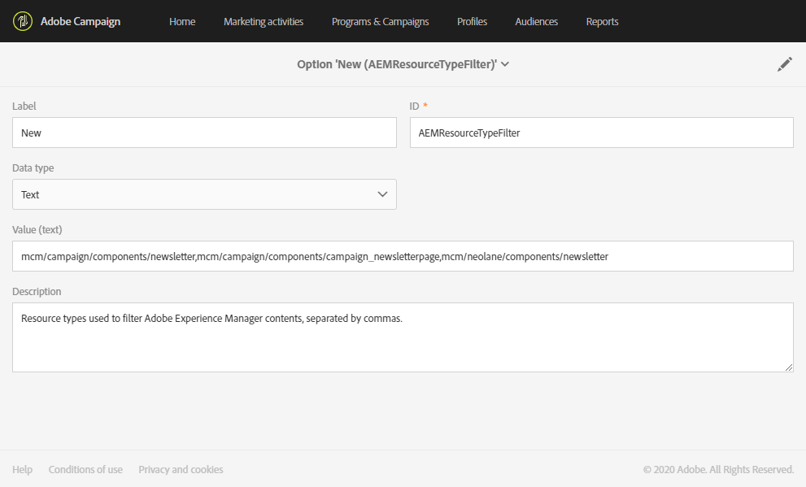

# Campaign と Experience Manager の統合の設定 {#configuration-aem}

Adobe Campaign StandardとAdobe Experience Managerの統合により、Adobe Experience Managerで作成されたコンテンツをAdobe Campaignのメールで使用できます。

このユースケースでは、Adobe Experience Managerでメールコンテンツを作成および管理し、メールに含めることでマーケティングキャンペーンに使用する方法をAdobe Campaign Standardで説明します。

## 前提条件 {#prerequisites}

事前に次の要素があることを確認する必要があります。

* Adobe Experience Manager **オーサリング** インスタンス
* Adobe Experience Manager **パブリッシング** インスタンス
* Adobe Campaign インスタンス

## Adobe Campaign Standardでの設定 {#config-acs}

これらの 2 つのソリューションを一緒に使用するには、相互に接続するように設定する必要があります。
Adobe Campaign を設定するには：

1. 最初に、**[!UICONTROL Administration]**/**[!UICONTROL Application settings]**/**[!UICONTROL External accounts menu]** で **[!UICONTROL Adobe Experience Manager instance]** 外部アカウントを設定する必要があります。

1. Adobe Experience Manager タイプの外部アカウントに **[!UICONTROL Server]** URL、**[!UICONTROL Account]**、**[!UICONTROL Password]** を設定します。

   

1. **[!UICONTROL AEMResourceTypeFilter]** オプションが正しく設定されていることを確認します。 **[!UICONTROL Administration]**/**[!UICONTROL Application settings]**/**[!UICONTROL Options]** メニューの下の **[!UICONTROL Options]** メニューにアクセスします。

1. 「**[!UICONTROL Value (text)]**」フィールドで、次の構文が正しいことを確認します。

   ```
   mcm/campaign/components/newsletter,mcm/campaign/components/campaign_newsletterpage,mcm/neolane/components/newsletter
   ```

   

1. 次に、**[!UICONTROL Resources]**/**[!UICONTROL Templates]**/**[!UICONTROL Delivery templates]** の下の詳細メニューで、既存のテンプレートの 1 つを複製して、Adobe Experience Manager固有のメールテンプレートを作成します。

   

1. **[!UICONTROL Edit properties]** アイコンをクリックします。

   

1. 「**[!UICONTROL Content]**」ドロップダウンで、「**[!UICONTROL Content source]**」フィールドの「**[!UICONTROL Adobe Experience Manager]**」を選択し、以前に作成した外部アカウントを **[!UICONTROL Adobe Experience Manager account]** で選択します。

ここで、Adobe Experience Managerで統合を設定する必要があります。

## Adobe Experience Managerでの設定 {#config-aem}

Adobe Experience ManagerとAdobe Campaign Standardを設定するには、次の手順に従う必要があります。

1. 最初に、Adobe Experience Manager オーサリングインスタンスとパブリッシュインスタンス間のレプリケーションを設定する必要があります。 [こちら](https://experienceleague.adobe.com/docs/experience-manager-65/administering/integration/campaignstandard.html?lang=ja#configuring-adobe-experience-manager)を参照してください。

1. 次に、専用の **[!UICONTROL Cloud Service]** を設定して、Adobe Experience ManagerをAdobe Campaignに接続します。 [こちら](https://experienceleague.adobe.com/docs/experience-manager-65/administering/integration/campaignstandard.html?lang=ja#connecting-aem-to-adobe-campaign)を参照してください。

1. ここで、オーサーインスタンスのAdobe Experience Managerで Externalizer を設定する必要があります。 [こちら](https://experienceleague.adobe.com/docs/experience-manager-65/administering/integration/campaignstandard.html?lang=ja#configuring-the-externalizer)を参照してください。
