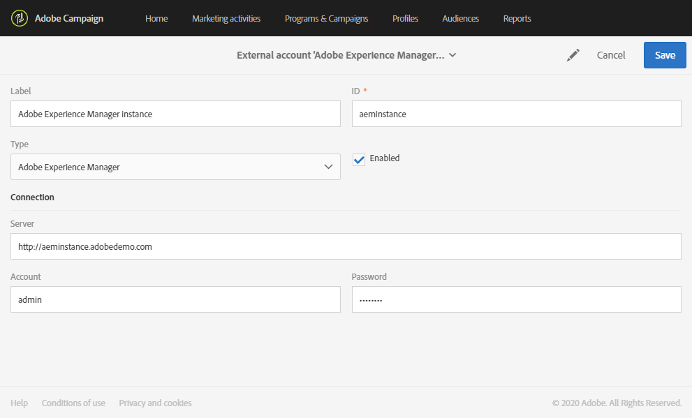
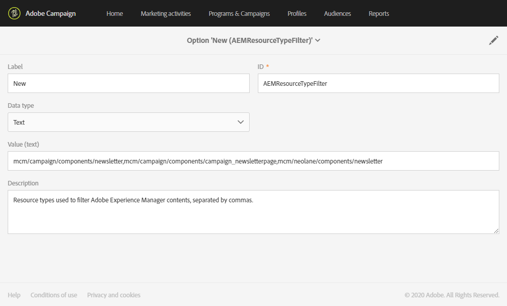
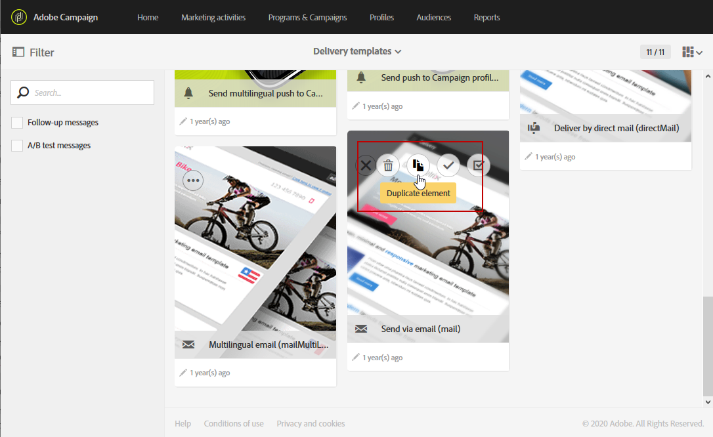
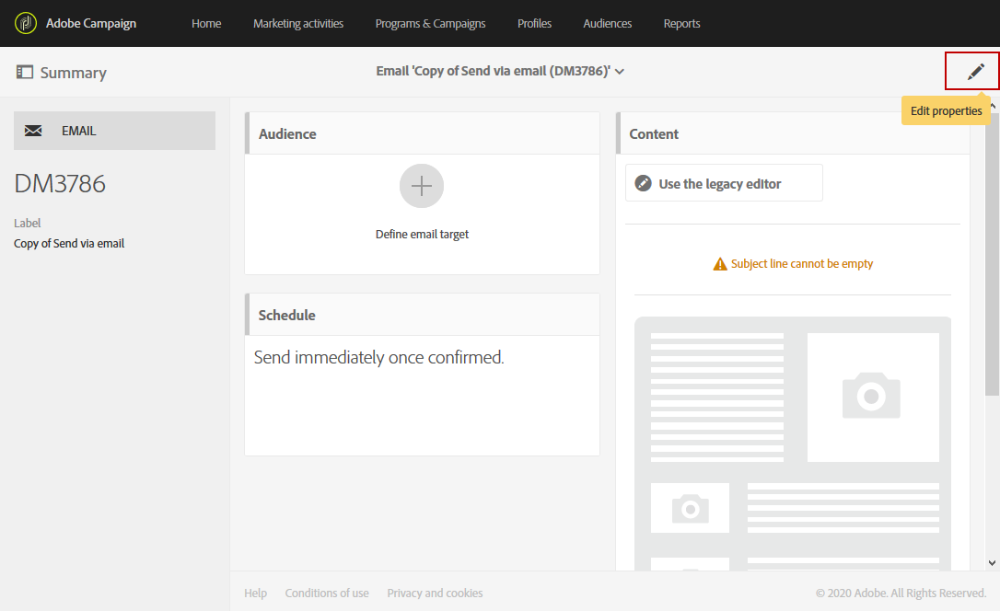

# Campaign と Experience Manager の統合の設定 {#configuration-aem}

Adobe Campaign StandardとAdobe Experience Managerの連携により、Adobe Experience Managerで作成したコンテンツをAdobe Campaignの電子メールで使用できるようになります。

このユースケースでは、Adobe Experience Managerでメールコンテンツを作成および管理し、メールでAdobe Campaign Standardに読み込むことでマーケティングキャンペーンに使用する方法を説明します。

## 前提条件 {#prerequisites}

事前に次の要素を確認する必要があります。

* Adobe Experience Manager **オーサリング** インスタンス
* Adobe Experience Manager **パブリッシング** インスタンス
* Adobe Campaign インスタンス

## Adobe Campaign Standardの設定 {#config-acs}

2 つのソリューションを同時に使用するには、相互接続を設定する必要があります。
Adobe Campaign を設定するには：

1. 最初に、**[!UICONTROL Administration]** > **[!UICONTROL Application settings]** > **[!UICONTROL External accounts menu]**&#x200B;の下の&#x200B;**[!UICONTROL Adobe Experience Manager instance]**&#x200B;外部アカウントを設定する必要があります。

1. **[!UICONTROL Server]** URL、**[!UICONTROL Account]**&#x200B;および&#x200B;**[!UICONTROL Password]**&#x200B;を使用して、Adobe Experience Manager タイプの外部アカウントを設定します。

   

1. **[!UICONTROL AEMResourceTypeFilter]** オプションが正しく設定されていることを確認してください。 **[!UICONTROL Administration]** > **[!UICONTROL Application settings]** > **[!UICONTROL Options]** メニューの下の&#x200B;**[!UICONTROL Options]** メニューにアクセスします。

1. **[!UICONTROL Value (text)]** フィールドで、次の構文が正しいことを確認します。

   ```
   mcm/campaign/components/newsletter,mcm/campaign/components/campaign_newsletterpage,mcm/neolane/components/newsletter
   ```

   

1. 次に、**[!UICONTROL Resources]** > **[!UICONTROL Templates]** > **[!UICONTROL Delivery templates]**&#x200B;の詳細メニューで、既存のテンプレートのいずれかを複製して、Adobe Experience Managerに固有のメールテンプレートを作成します。

   

1. **[!UICONTROL Edit properties]** アイコンをクリックします。

   

1. **[!UICONTROL Content]** ドロップダウンで、**[!UICONTROL Content source]** フィールドの&#x200B;**[!UICONTROL Adobe Experience Manager]**&#x200B;を選択し、次に&#x200B;**[!UICONTROL Adobe Experience Manager account]**&#x200B;で以前に作成した外部アカウントを選択します。

次に、Adobe Experience Managerで統合を設定する必要があります。

## Adobe Experience Managerの設定 {#config-aem}

Adobe Campaign StandardでAdobe Experience Managerを設定するには、次の手順に従う必要があります。

1. まず、Adobe Experience Manager オーサリングインスタンスとパブリッシングインスタンス間のレプリケーションを設定する必要があります。 [こちら](https://experienceleague.adobe.com/docs/experience-manager-65/administering/integration/campaignstandard.html#configuring-adobe-experience-manager)を参照してください。

1. 次に、専用の&#x200B;**[!UICONTROL Cloud Service]**&#x200B;を設定して、Adobe Experience ManagerをAdobe Campaignに接続します。 [こちら](https://experienceleague.adobe.com/docs/experience-manager-65/administering/integration/campaignstandard.html#connecting-aem-to-adobe-campaign)を参照してください。

1. 次に、オーサーインスタンスでAdobe Experience Managerのexternalizerを設定する必要があります。 [こちら](https://experienceleague.adobe.com/docs/experience-manager-65/administering/integration/campaignstandard.html#configuring-the-externalizer)を参照してください。
