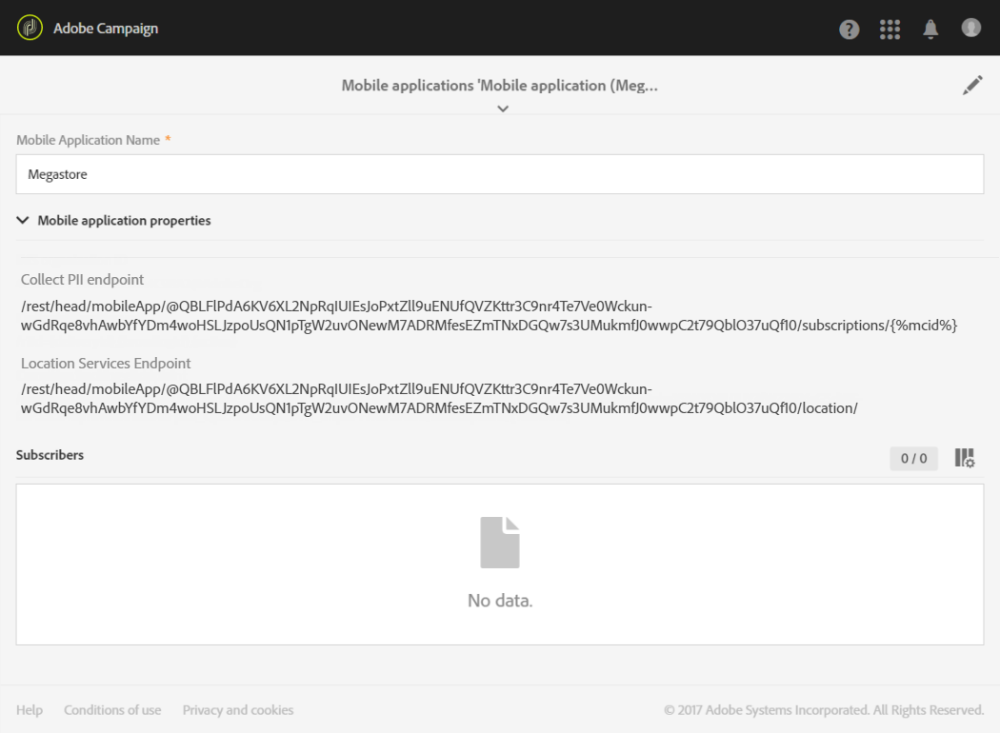
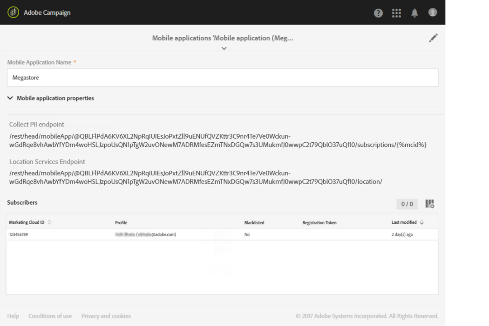
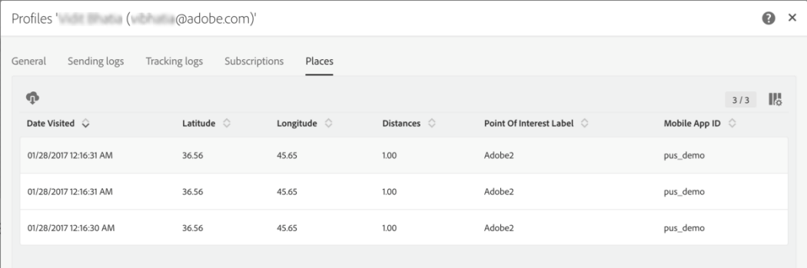

# Campaign と POI データの統合の設定{#configuring-campaign-points-of-interest-data-integration}

## Adobe Experience Platform SDKを使用したCampaign-Point of Interest データ統合の設定 {#configuring-campaign-poi-aep-sdk}

>[!NOTE]
>
>モバイルアプリケーションは、すでにAdobe Experience Platform SDKを使用してAdobe Campaign Standardで設定されている必要があります。 詳細な手順については、この[ ページ ](https://helpx.adobe.com/jp/campaign/kb/configuring-app-sdk.html)を参照してください。

位置情報の収集に使用するモバイルアプリケーションは、Adobe Campaign インターフェイスの&#x200B;**管理者**&#x200B;が設定する必要があります。

Adobe Experience Platform SDKで設定されたモバイルアプリケーションでAdobe Experience Platform Location Servicesを使用するには、次の操作が必要です。

1. データ収集UIで&#x200B;**[!UICONTROL Places]**&#x200B;拡張機能をモバイルアプリ設定に追加します。 Adobe Campaignでモバイルアプリケーションを設定します。 [Places拡張機能のインストール ](https://developer.adobe.com/client-sdks/solution/places)を参照してください。

1. 拡張機能を設定したら、データ収集UI内でデータ要素を作成して、これらの拡張機能からデータを取得します。 データ要素を作成するには、この[ ページ ](https://helpx.adobe.com/campaign/kb/config-app-in-launch.html#Step1Createdataelements)を参照してください。

1. 次に、データ収集UIで、Point of InterestとAdobe Campaign間のモバイルユースケースをサポートするルールを作成する必要があります。\
   このルールは、ユーザーがジオフェンス設定された&#x200B;**[!UICONTROL Point of Interest]**&#x200B;にエントリするとトリガーされます。 ルールを作成するには、この[ ページ ](https://helpx.adobe.com/campaign/kb/config-app-in-launch.html#Locationpostback)を参照してください。

1. 場所で&#x200B;**[!UICONTROL Points of Interest]**&#x200B;を定義します。 [Point of Interestの作成](https://experienceleague.adobe.com/docs/places/using/poi-mgmt-ui/create-a-poi-ui.html)を参照してください。

1. Adobe Campaignでモバイルアプリケーションと収集した位置情報にアクセスしていることを確認してください。 [位置情報の収集に使用されるモバイルアプリへのアクセス ](#accessing-mobile-apps-used-to-collect-location-data)および[収集された位置情報へのアクセス ](#accessing-collected-location-data)を参照してください。

## SDK V4を使用したCampaign-Point of Interest データ統合の設定 {#configuring-campaign-poi-sdkv4}

位置情報の収集に使用するモバイルアプリケーションは、Adobe Campaign インターフェイスの&#x200B;**管理者**&#x200B;が設定する必要があります。

SDK V4で設定されたモバイルアプリケーションでPoint of Interest データ機能を使用するには、次の操作が必要です。

1. Adobe Analytics モバイル版にアクセスします。 詳細については、使用許諾契約を確認するか、Adobe アカウントの担当者にお問い合わせください。
1. Adobe Campaignでモバイルアプリケーションを設定します。 詳しくは、[Campaignでのモバイルアプリの設定](#setting-up-a-mobile-app-in-campaign)を参照してください。
1. Adobe Mobile Services インターフェイスでモバイルアプリケーションを設定します。 これにより、Adobe Mobile Servicesによって収集されたデータがAdobe Campaignに確実に送信されます。 [Adobe Mobile Servicesでのモバイルアプリの設定](#configuring-a-mobile-app-in-adobe-mobile-services)を参照してください。
1. モバイルアプリケーションの特定の設定を実行します。

   * Adobe Mobile Services インターフェイスからダウンロードした設定ファイルをモバイルアプリケーションにパッケージ化します。
   * Experience Cloud Mobile SDKをモバイルアプリケーションに統合します。 [SDKのモバイルアプリケーションへの統合](#integrating-the-sdk-into-a-mobile-application)を参照してください。

1. Adobe Mobile ServicesのインターフェイスでPoints of Interestを定義します。 Adobe Mobile ServicesのPoiの定義[を参照してください](#defining-points-of-interest-in-adobe-mobile-services)。
1. モバイルアプリケーションのサブスクライバーから収集するデータを定義します。 [購読者のPoint of Interest データの収集](#collecting-subscribers--points-of-interest-data)を参照してください。
1. Adobe Campaignでモバイルアプリケーションと収集した位置情報にアクセスしていることを確認してください。 [位置情報の収集に使用されるモバイルアプリへのアクセス ](#accessing-mobile-apps-used-to-collect-location-data)および[収集された位置情報へのアクセス ](#accessing-collected-location-data)を参照してください。

### SDK V4を使用したAdobe Campaignでのモバイルアプリの設定 {#setting-up-a-mobile-app-in-campaign}

Adobe Campaignを使用してポイントオブインタレストのデータを収集するには、Adobe Campaignがデータを受信するモバイルアプリケーションを設定する必要があります。

1. 左上隅の&#x200B;**Adobe** ロゴをクリックし、**[!UICONTROL Administration]** > **[!UICONTROL Channels]** > **[!UICONTROL Mobile app]**&#x200B;を選択します。
1. **[!UICONTROL Create]**&#x200B;をクリックしてアプリケーションを設定します。
1. **[!UICONTROL Application name]** フィールドに名前を入力し、**[!UICONTROL Create]**&#x200B;をクリックします。

   **[!UICONTROL Device-specific settings]** セクションには入力しないでください。 これは、プッシュ通知を受信するアプリケーションの設定にのみ適用されます。

**[!UICONTROL Mobile application properties]** セクションには、次の2つのURLが表示されます：**[!UICONTROL Collect PII endpoint]**&#x200B;と&#x200B;**[!UICONTROL Location Services endpoint]**。 Adobe Mobile Servicesのインターフェイスで使用されます。 [Adobe Mobile Servicesでのモバイルアプリの設定](#configuring-a-mobile-app-in-adobe-mobile-services)を参照してください。

* **[!UICONTROL Collect PII endpoint]** URLは、モバイルアプリケーションの起動時に、ユーザーのExperience Cloud IDと登録トークンをモバイルアプリケーションから収集するために使用されます。 ユーザーが電子メール、名、姓などの資格情報を使用してアプリケーションにログインすると、このデータも収集され、Adobe Campaign プロファイルとユーザーの登録トークンを照合するために使用されます。
* **[!UICONTROL Location Services endpoint]** URLは、ユーザーの緯度、経度、半径などの位置データを目標点から収集するために使用されます。

Adobe Mobile Servicesでこれらの値を使用して設定を完了できるようになりました。詳しくは、「[Adobe Mobile Servicesでのモバイルアプリの設定](#configuring-a-mobile-app-in-adobe-mobile-services)」節を参照してください。



### Adobe Mobile ServicesでのV4 モバイルアプリの設定 {#configuring-a-mobile-app-in-adobe-mobile-services}

Adobe Mobile Servicesによって収集されたデータをAdobe Campaignに送信するには、Mobile Services インターフェイスでポストバックを設定する必要があります。

Adobe Campaignで設定したモバイルアプリケーションのパラメーターで確認できる具体的な情報が必要です（[Campaignでのモバイルアプリの設定](#setting-up-a-mobile-app-in-campaign)を参照）。

* **[!UICONTROL IMS Organization ID]**
* **[!UICONTROL Collect PII Endpoint]**
* **[!UICONTROL Location Services endpoint]**

次の設定を行うには、Adobe Analyticsにアクセスする必要があります。 Adobe Analytics ユーザーでない場合は、Adobe Campaign管理者にお問い合わせください。

1. [mobilemarketing.adobe.com](https://mobilemarketing.adobe.com/)にログインします。
1. アプリケーションを作成するか、既存のものを選択します。
1. **[!UICONTROL Manage App Settings]** ページに移動します。
1. **訪問者ID サービス** セクションで、**有効**&#x200B;にチェックを入れ、ドロップダウンリストから組織を選択します。 「**保存**」をクリックします。

   >[!CAUTION]
   >
   >この組織は、Adobe Campaign インスタンスで使用する組織と同じである必要があります。

1. 「**[!UICONTROL Manage Postbacks]**」をクリックします。
1. ポストバックを作成します。

   * **[!UICONTROL PII]**&#x200B;を&#x200B;**[!UICONTROL Postback Type]**&#x200B;として選択します。
   * 「**[!UICONTROL URL]**」フィールドで、Adobe Campaign インターフェイスで設定したモバイルアプリケーションから&#x200B;**[!UICONTROL Collect PII Endpoint]** URLを、先にサーバー名をコピーします。 詳しくは、[Campaignでのモバイルアプリの設定](#setting-up-a-mobile-app-in-campaign)を参照してください。
   * 次のように&#x200B;**[!UICONTROL Post Body]** フィールドに入力します。

     IOS用：

     ```
     {
     "userKey": "{userKey}",
     "pushPlatform":"apns",
     "marketingCloudId":"",
     "cusEmail":"{email}",
     "cusFirstName":"{firstName}",
     "cusLastName":"{lastName}"
     }
     ```

     Android用：

     ```
     {
     "userKey": "{userKey}",
     "pushPlatform":"gcm",
     "marketingCloudId":"",
     "cusEmail":"{email}",
     "cusFirstName":"{firstName}",
     "cusLastName":"{lastName}"
     }
     ```

   * **コンテンツタイプ**&#x200B;を&#x200B;**[!UICONTROL application/json]**&#x200B;に設定します。
   * **どのデータタグがポストバックをトリガーしますか？**&#x200B;で、任意のイベント（通常は&#x200B;**[!UICONTROL Launched]**&#x200B;と&#x200B;**[!UICONTROL exists]**）を選択します。
   * 「**[!UICONTROL Save & Activate]**」をクリックします。

1. 2つ目のポストバックを作成します。

   * **[!UICONTROL Postback]**&#x200B;を&#x200B;**[!UICONTROL Postback Type]**&#x200B;として選択します。
   * 「**[!UICONTROL URL]**」フィールドで、Adobe Campaign インターフェイスで設定したモバイルアプリケーションから&#x200B;**[!UICONTROL Location Services Endpoint]** URLを、先にサーバー名をコピーします。 詳しくは、[Campaignでのモバイルアプリの設定](#setting-up-a-mobile-app-in-campaign)を参照してください。
   * 次のように&#x200B;**[!UICONTROL Post Body]** フィールドに入力します。

     ```
     {
     "locationData":{
     "distances":"{a.loc.dist}",
     "poiLabel":"{a.loc.poi}",
     "latitude.a":"{a.loc.lat.a}",
     "latitude.b":"{a.loc.lat.b}",
     "latitude.c":"{a.loc.lat.c}",
     "longitude.a":"{a.loc.lon.a}",
     "longitude.b":"{a.loc.lon.b}",
     "longitude.c":"{a.loc.lon.c}",
     "appId":"{a.appid}",
     "marketingCloudId":"{mid}"
     }
     }
     ```

   * **コンテンツタイプ**&#x200B;を&#x200B;**[!UICONTROL application/json]**&#x200B;に設定します。
   * **どのデータタグがポストバックをトリガーしますか？**&#x200B;で、**[!UICONTROL campaign.test]**&#x200B;と&#x200B;**[!UICONTROL exists]**&#x200B;を選択します。
   * 「**[!UICONTROL Save & Activate]**」をクリックします。

>[!NOTE]
>
>ポストバックの設定について詳しくは、[Adobe Mobile Services ドキュメント ](https://experienceleague.adobe.com/docs/mobile-services/using/manage-app-settings-ug/configuring-app/signals.html)を参照してください。

### SDKのモバイルアプリケーションへの統合 {#integrating-the-sdk-into-a-mobile-application}

Mobile コアサービスのソフトウェア開発キット（SDK）は、モバイルアプリケーションをAdobe Campaignに簡単に統合できます。

この手順については、この[ ページ ](https://docs.adobe.com/content/help/ja-JP/campaign-standard/using/administrating/configuring-channels/configuring-a-mobile-application.html)で説明します。

### Adobe Mobile Servicesにおける位置情報の定義 {#defining-points-of-interest-in-adobe-mobile-services}

位置情報データの収集に使用するPOIを定義するには、次の手順に従います。

1. Adobe Mobile Servicesのインターフェイスに移動します。
1. アプリケーションを追加します。

   Mobile Servicesでのアプリケーションの管理について詳しくは、[Adobe Mobile Services ドキュメント ](https://experienceleague.adobe.com/docs/mobile-services/using/manage-apps-ug/t-new-app.html)を参照してください。

1. Points of Interestを定義します。

   Poiの管理について詳しくは、[Adobe Mobile Services ドキュメント ](https://experienceleague.adobe.com/docs/mobile-services/using/location-ug/t-manage-points.html)を参照してください。

### 顧客のPoi データの収集 {#collecting-subscribers--points-of-interest-data}

特定のカスタムリソースを使用すると、アプリケーションのサブスクライバーから収集するデータを定義できます。

この手順については、[SDK V4](https://docs.adobe.com/content/help/ja-JP/campaign-standard/using/administrating/configuring-channels/configuring-a-mobile-application.html)を使用したモバイルアプリケーションの設定ページを参照してください。

## 位置情報の収集に使用されるモバイルアプリへのアクセス {#accessing-mobile-apps-used-to-collect-location-data}

Adobe Campaignで正常に作成されたアプリケーションにアクセスするには：

1. 左上隅の&#x200B;**Adobe** ロゴをクリックします。
1. SDKに応じて、**[!UICONTROL Administration]** > **[!UICONTROL Channels]** > **[!UICONTROL Mobile app (SDK v4)]**&#x200B;または&#x200B;**[!UICONTROL Mobile app (AEP SDK)]**&#x200B;を選択します。
1. リストからモバイルアプリケーションを選択して、そのプロパティを表示します。

   

アプリケーションの購読者のリストも&#x200B;**[!UICONTROL Mobile application subscribers]** タブに表示されます。 加入者は、モバイルデバイスにアプリケーションをインストールしたユーザー全員です。 Adobe Campaign データベース プロファイルは、登録トークンで識別されます。

## 収集した位置情報へのアクセス {#accessing-collected-location-data}

設定が完了すると、収集されたPoints of Interest データが各プロファイルの&#x200B;**[!UICONTROL Places]** タブに一覧表示されます。 リストにアクセスするには：

1. プロファイルを選択します。
1. 右側の「**[!UICONTROL Edit profile properties]**」ボタンをクリックします。
1. 「**[!UICONTROL Places]**」タブを選択します。

   

現在のプロファイルに対して収集されたPoints of Interest データが一覧表示されます。 位置情報は、Adobe Campaignのデータベースに6 ヶ月間保存されます。

プロファイルへのアクセスと編集について詳しくは、[ プロファイル ](../../audiences/using/about-profiles.md)を参照してください。
