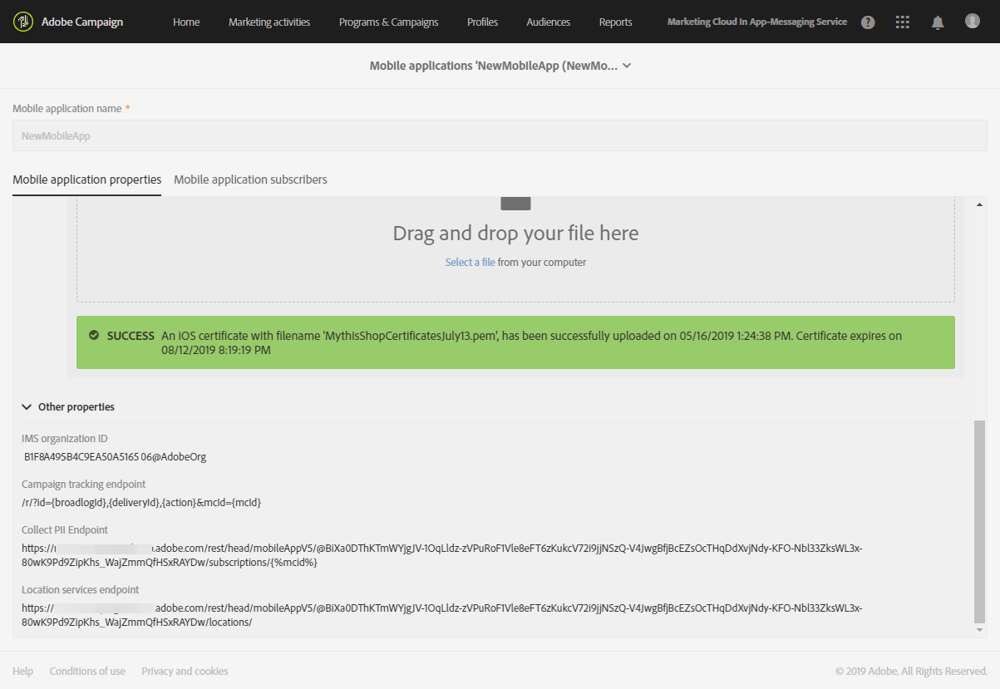

# Campaign と POI データの統合の設定{#configuring-campaign-points-of-interest-data-integration}

## Adobe Experience Platform SDK との Campaign と POI データの統合の設定 {#configuring-campaign-poi-aep-sdk}

>[!NOTE]
>
>Adobe Experience Platform SDK を使用して、モバイルアプリケーションがAdobe Campaign Standardで既に設定されているはずです。 詳細な手順については、 [ページ](https://helpx.adobe.com/jp/campaign/kb/configuring-app-sdk.html).

場所データの収集に使用するモバイルアプリケーションは、 **administrator** Adobe Campaignインターフェイスの

Adobe Experience Platform SDK を使用して設定されたモバイルアプリケーションでAdobe Experience Platform Location Services を使用するには、次の操作が必要です。

1. を **[!UICONTROL Places]** データ収集 UI のモバイルアプリ設定の拡張。 Adobe Campaignでモバイルアプリケーションを設定します。 詳しくは、 [Places 拡張機能のインストール](https://experienceleague.adobe.com/docs/places/using/places-ext-aep-sdks/places-extension/places-extension.html#install-the-places-extension-in-adobe-experience-platform-launch).

1. 拡張機能を設定したら、データ収集 UI 内でデータ要素を作成して、これらの拡張機能からデータを取得します。 詳しくは、 [ページ](https://helpx.adobe.com/campaign/kb/config-app-in-launch.html#Step1Createdataelements) をクリックして、データ要素を作成します。

1. 次に、データ収集 UI で、目標地点とAdobe Campaignの間でモバイルを使用する場合に対応するルールを作成する必要があります。\
   このルールは、ユーザーが地域に入るとトリガーされます **[!UICONTROL Point of Interest]**. 詳しくは、 [ページ](https://helpx.adobe.com/campaign/kb/config-app-in-launch.html#Locationpostback) をクリックして、ルールを作成します。

1. を定義 **[!UICONTROL Points of Interest]** 場所で 詳しくは、 [目標地点の作成](https://experienceleague.adobe.com/docs/places/using/poi-mgmt-ui/create-a-poi-ui.html).

1. モバイルアプリケーションと、Adobe Campaignで収集された場所データにアクセスしていることを確認します。 詳しくは、 [場所データの収集に使用するモバイルアプリへのアクセス](#accessing-mobile-apps-used-to-collect-location-data) および [収集された場所データへのアクセス](#accessing-collected-location-data).

## SDK V4 を使用した Campaign と POI データの統合の設定 {#configuring-campaign-poi-sdkv4}

場所データの収集に使用するモバイルアプリケーションは、 **administrator** Adobe Campaignインターフェイスの

SDK V4 を使用して設定されたモバイルアプリケーションで POI データ機能を使用するには、次の操作が必要です。

1. Adobe Analytics for Mobile にアクセスできる。 詳しくは、ライセンス契約を確認するか、Adobeのアカウント担当者にお問い合わせください。
1. Adobe Campaignでモバイルアプリケーションを設定します。 詳しくは、 [Campaign でのモバイルアプリの設定](#setting-up-a-mobile-app-in-campaign).
1. Mobile Services インターフェイスでモバイルAdobeを設定します。 これにより、Mobile Services で収集されたAdobeを確実にAdobe Campaignに送信できます。 詳しくは、 [Mobile Services でのモバイルアプリのAdobe](#configuring-a-mobile-app-in-adobe-mobile-services).
1. モバイルアプリケーション固有の設定を実行します。

   * Mobile Services インターフェイスからダウンロードした設定ファイルを、Adobeアプリケーションにパッケージ化します。
   * Experience CloudMobile SDK をモバイルアプリケーションに統合します。 詳しくは、 [SDK をモバイルアプリケーションに統合する](#integrating-the-sdk-into-a-mobile-application).

1. Mobile Services インターフェイスで目標地点をAdobeします。 詳しくは、 [Mobile Services でのAdobe点の定義](#defining-points-of-interest-in-adobe-mobile-services).
1. モバイルアプリケーションの購読者から収集するデータを定義します。 詳しくは、 [購読者の目標地点データの収集](#collecting-subscribers--points-of-interest-data).
1. モバイルアプリケーションと、Adobe Campaignで収集された場所データにアクセスしていることを確認します。 詳しくは、 [場所データの収集に使用するモバイルアプリへのアクセス](#accessing-mobile-apps-used-to-collect-location-data) および [収集された場所データへのアクセス](#accessing-collected-location-data).

### SDK V4 を使用したAdobe Campaignでのモバイルアプリの設定 {#setting-up-a-mobile-app-in-campaign}

Adobe Campaignで目標地点データを収集できるようにするには、Adobe Campaignがデータを受け取るモバイルアプリを設定する必要があります。

1. 次をクリック： **Adobe** ロゴ（左上隅）に移動し、「 **[!UICONTROL Administration]** > **[!UICONTROL Channels]** > **[!UICONTROL Mobile app]**.
1. クリック **[!UICONTROL Create]** をクリックして、アプリケーションを設定します。
1. 名前を **[!UICONTROL Application name]** フィールドとクリック **[!UICONTROL Create]**.

   次の項目に入力しない **[!UICONTROL Device-specific settings]** 」セクションに入力します。 これは、プッシュ通知を受信するアプリケーションを設定する場合にのみ適用されます。

内 **[!UICONTROL Mobile application properties]** セクションに、次の 2 つの URL が表示されます。 **[!UICONTROL Collect PII endpoint]** および **[!UICONTROL Location Services endpoint]**. これらは、Mobile Services のAdobeインターフェイスで使用されます。 詳しくは、 [Mobile Services でのモバイルアプリのAdobe](#configuring-a-mobile-app-in-adobe-mobile-services).

* この **[!UICONTROL Collect PII endpoint]** URL は、モバイルアプリケーションの起動時に、ユーザーのExperience CloudID と登録トークンを収集するために使用されます。 ユーザーが電子メール、名、姓などの資格情報を使用してアプリケーションにログインすると、このデータも収集され、ユーザーの登録トークンをAdobe Campaignプロファイルと紐付けするために使用されます。
* この **[!UICONTROL Location Services endpoint]** URL は、目標地点からユーザーの緯度、経度、半径などの位置データを収集するために使用されます。

これらの値をAdobeMobile Services で使用して、設定を完了できます。詳しくは、 [Mobile Services でのモバイルアプリのAdobe](#configuring-a-mobile-app-in-adobe-mobile-services) 」セクションに入力します。


### Mobile Services での V4 モバイルアプリのAdobe {#configuring-a-mobile-app-in-adobe-mobile-services}

Mobile Services で収集されたデータをAdobe CampaignにAdobeするには、Mobile Services インターフェイスでポストバックを設定する必要があります。

Adobe Campaignのモバイルアプリケーションパラメーターセットにある特定の情報が必要になります ( [Campaign でのモバイルアプリの設定](#setting-up-a-mobile-app-in-campaign)):

* **[!UICONTROL IMS Organization ID]**
* **[!UICONTROL Collect PII Endpoint]**
* **[!UICONTROL Location Services endpoint]**

次の設定をおこなうには、Adobe Analyticsへのアクセス権が必要です。 Adobe Analyticsユーザーでない場合は、Adobe Campaign管理者にお問い合わせください。

1. ログイン [mobilemarketing.adobe.com](https://mobilemarketing.adobe.com/).
1. アプリケーションを作成するか、既存のアプリケーションを選択します。
1. 次に移動： **[!UICONTROL Manage App Settings]** ページ。
1. 内 **訪問者 ID サービス** セクション、チェック **有効にする** をクリックし、ドロップダウンリストから組織を選択します。 「**保存**」をクリックします。

   >[!CAUTION]
   >
   >この組織は、Adobe Campaignインスタンスで使用する組織と同じである必要があります。

1. 「**[!UICONTROL Manage Postbacks]**」をクリックします。
1. ポストバックを作成します。

   * 選択 **[!UICONTROL PII]** を **[!UICONTROL Postback Type]**.
   * 内 **[!UICONTROL URL]** フィールド、 **[!UICONTROL Collect PII Endpoint]** Adobe Campaignインターフェイスで設定したモバイルアプリケーションからの URL。前にサーバー名が付きます。 詳しくは、 [Campaign でのモバイルアプリの設定](#setting-up-a-mobile-app-in-campaign).
   * 次の項目に入力： **[!UICONTROL Post Body]** フィールドに次のように入力します。

      iOS の場合:

      ```
      {
      "userKey": "{userKey}",
      "pushPlatform":"apns",
      "marketingCloudId":"",
      "cusEmail":"{email}",
      "cusFirstName":"{firstName}",
      "cusLastName":"{lastName}"
      }
      ```

      Android の場合:

      ```
      {
      "userKey": "{userKey}",
      "pushPlatform":"gcm",
      "marketingCloudId":"",
      "cusEmail":"{email}",
      "cusFirstName":"{firstName}",
      "cusLastName":"{lastName}"
      }
      ```

   * 設定 **コンテンツタイプ** as **[!UICONTROL application/json]**.
   * 内 **ポストバックのトリガーに使用するデータタグ**、任意のイベントを選択します。通常は、 **[!UICONTROL Launched]** および **[!UICONTROL exists]**.
   * 「**[!UICONTROL Save & Activate]**」をクリックします。

1. 2 つ目のポストバックを作成します。

   * 選択 **[!UICONTROL Postback]** を **[!UICONTROL Postback Type]**.
   * 内 **[!UICONTROL URL]** フィールド、 **[!UICONTROL Location Services Endpoint]** Adobe Campaignインターフェイスで設定したモバイルアプリケーションからの URL。前にサーバー名が付きます。 詳しくは、 [Campaign でのモバイルアプリの設定](#setting-up-a-mobile-app-in-campaign).
   * 次の項目に入力： **[!UICONTROL Post Body]** フィールドに次のように入力します。

      ```
      {
      "locationData":{
      "distances":"{a.loc.dist}",
      "poiLabel":"{a.loc.poi}",
      "latitude.a":"{a.loc.lat.a}",
      "latitude.b":"{a.loc.lat.b}",
      "latitude.c":"{a.loc.lat.c}",
      "longitude.a":"{a.loc.lon.a}",
      "longitude.b":"{a.loc.lon.b}",
      "longitude.c":"{a.loc.lon.c}",
      "appId":"{a.appid}",
      "marketingCloudId":"{mid}"
      }
      }
      ```

   * 設定 **コンテンツタイプ** as **[!UICONTROL application/json]**.
   * 内 **ポストバックのトリガーに使用するデータタグ**&#x200B;を選択します。 **[!UICONTROL campaign.test]** および **[!UICONTROL exists]**.
   * 「**[!UICONTROL Save & Activate]**」をクリックします。

>[!NOTE]
>
>ポストバックの設定の詳細については、 [AdobeMobile Services ドキュメント](https://experienceleague.adobe.com/docs/mobile-services/using/manage-app-settings-ug/configuring-app/signals.html).

### SDK をモバイルアプリケーションに統合する {#integrating-the-sdk-into-a-mobile-application}

Mobile コアサービスのソフトウェア開発キット (SDK) は、モバイルアプリケーションをAdobe Campaignに統合する際に役立ちます。

この手順については、 [ページ](https://docs.adobe.com/content/help/ja-JP/campaign-standard/using/administrating/configuring-channels/configuring-a-mobile-application.html).

### Mobile Services でのAdobe点の定義 {#defining-points-of-interest-in-adobe-mobile-services}

ロケーションデータの収集に使用する目標地点を定義するには：

1. Mobile Services インターフェイスをAdobeします。
1. アプリを追加します。

   Mobile Services でのアプリケーション管理について詳しくは、 [AdobeMobile Services ドキュメント](https://experienceleague.adobe.com/docs/mobile-services/using/manage-apps-ug/t-new-app.html).

1. 目標地点を定義します。

   目標地点の管理の詳細については、 [AdobeMobile Services ドキュメント](https://experienceleague.adobe.com/docs/mobile-services/using/location-ug/t-manage-points.html).

### 購読者の目標地点データの収集 {#collecting-subscribers--points-of-interest-data}

特定のカスタムリソースを使用すると、アプリケーション購読者から収集するデータを定義できます。

この手順については、 [SDK V4 を使用したモバイルアプリケーションの設定](https://docs.adobe.com/content/help/ja-JP/campaign-standard/using/administrating/configuring-channels/configuring-a-mobile-application.html) ページ。

## 場所データの収集に使用するモバイルアプリへのアクセス {#accessing-mobile-apps-used-to-collect-location-data}

Adobe Campaignで正常に作成されたアプリケーションにアクセスするには：

1. 次をクリック： **Adobe** ロゴ（左上隅）
1. 選択 **[!UICONTROL Administration]** > **[!UICONTROL Channels]** > **[!UICONTROL Mobile app (SDK v4)]** または **[!UICONTROL Mobile app (AEP SDK)]** SDK に応じて変更されます。
1. リストからモバイルアプリを選択して、そのプロパティを表示します。

   

アプリケーションの購読者のリストも、 **[!UICONTROL Mobile application subscribers]** タブをクリックします。 購読者とは、モバイルデバイスにアプリケーションをインストールしたすべてのユーザーです。 Adobe Campaignデータベースプロファイルは、登録トークンで識別されます。

## 収集された場所データへのアクセス {#accessing-collected-location-data}

設定が完了すると、収集した目標地点データが **[!UICONTROL Places]** 」タブをクリックします。 リストにアクセスするには：

1. プロファイルを選択します。
1. 次をクリック： **[!UICONTROL Edit profile properties]** 」ボタンをクリックします。
1. 「**[!UICONTROL Places]**」タブを選択します。

   

現在のプロファイルで収集された目標地点データが表示されます。 場所のデータは、6 か月間Adobe Campaignデータベースに保存されます。

プロファイルへのアクセスと編集について詳しくは、 [プロファイル](../../audiences/using/about-profiles.md).
