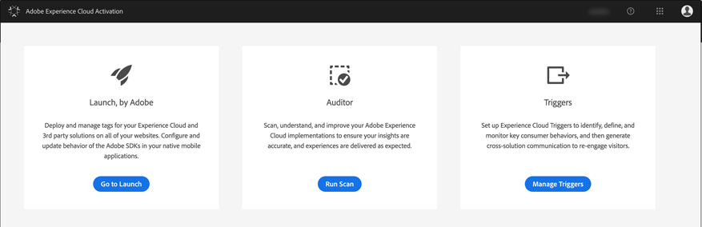
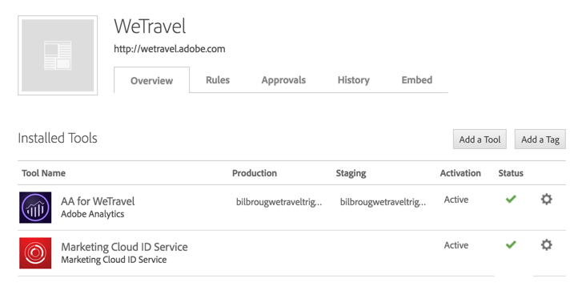
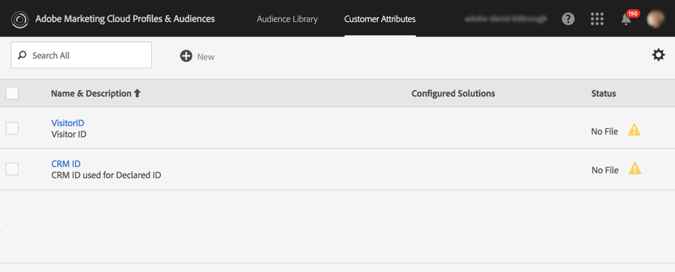
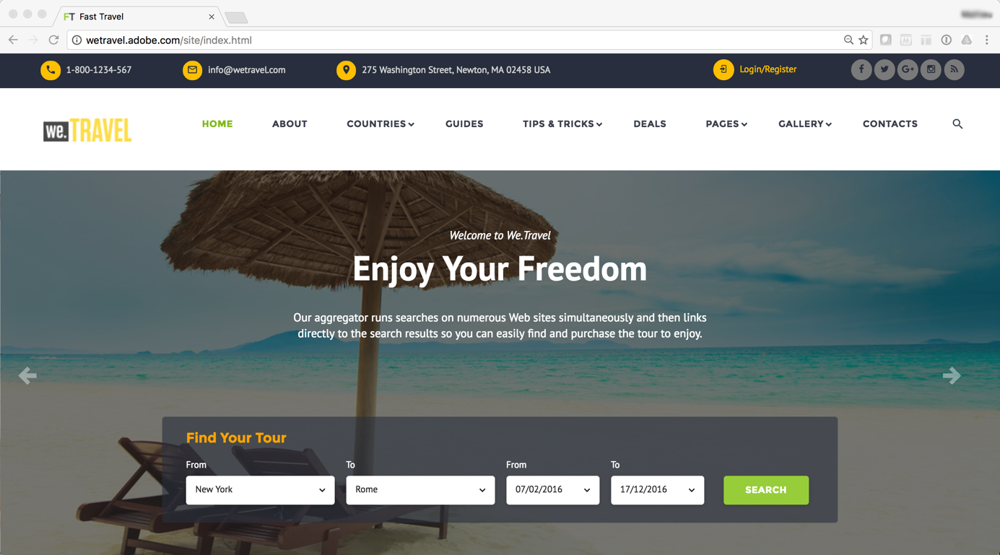
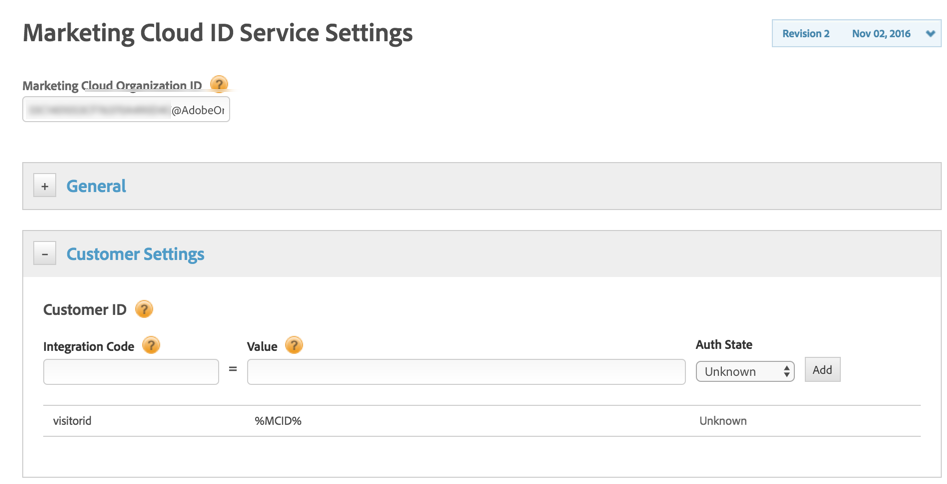
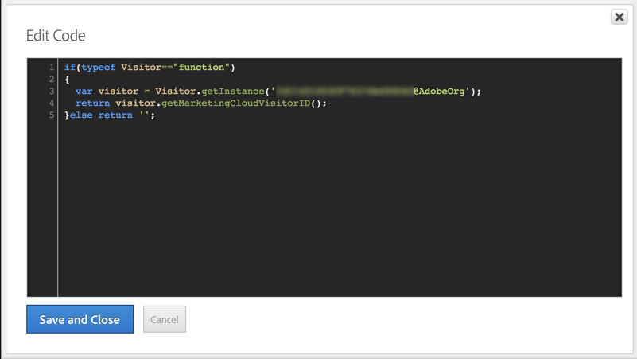
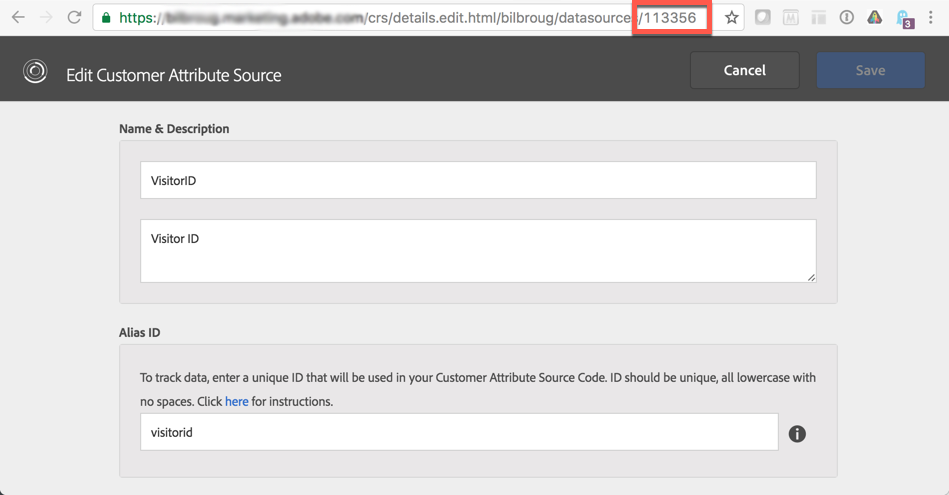
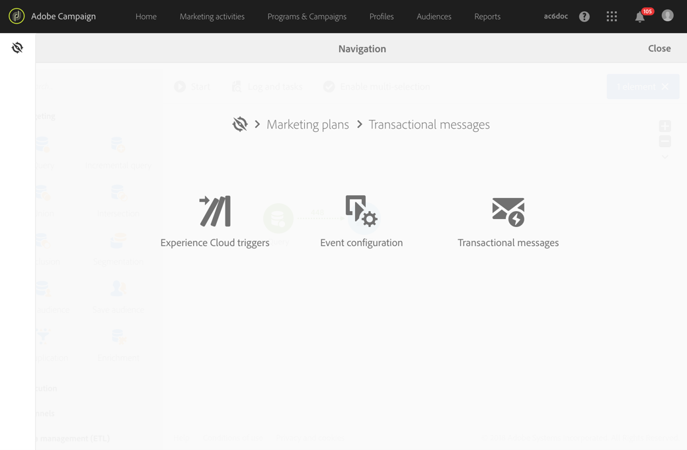
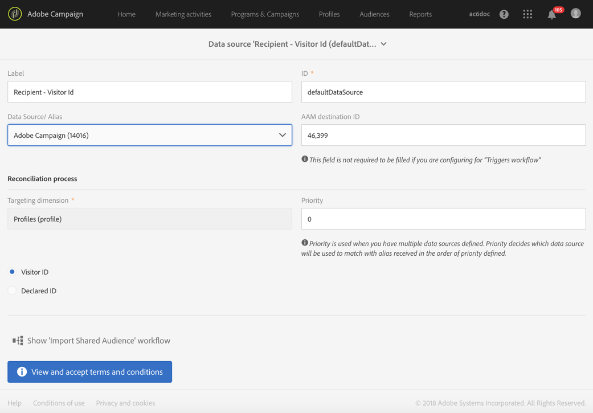

# Experience Cloud での Triggers の設定{#configuring-triggers-in-experience-cloud}

## 機能のアクティブ化 {#activating-the-functionality}

この機能は、AdobeによってAdobe Campaignでアクティブ化する必要があります。 Adobeのアカウントエグゼクティブまたはプロフェッショナルサービスパートナーにお問い合わせください。

Adobe チームは、トリガーをアクティベートするために次の情報を必要とします。

* Marketing Cloudの会社名
* 組織 ID
* Analytics Login Company （Marketing Cloudの会社名と同じ場合があります）

## ソリューションとサービスの設定 {#configuring-solutions-and-services}

この機能を使用するには、次のソリューション/コアサービスにアクセスする必要があります。

* Adobe Campaign
* Adobe Analytics Ultimate、Premium、Foundation、OD、Select、Prime、Mobile Apps、Select、または Standard。
* Experience Cloud Triggers コアサービス

  

* Experience Cloud DTM コアサービス

  

* Experience Cloud 訪問者 ID と Experience Cloud People コアサービス

  

また、稼働中の Web サイトも必要です。

>[!CAUTION]
>
>サブドメイン設定は、配信品質キー要素です。 Adobe Campaignの電子メールが、web サイトで使用されるものと同じドメインから送信されていることを確認します。

これらのユースケースを実行するには、[Experience Cloud DTM コアサービス ](#configuring-experience-cloud-dtm-core-service)、[Experience Cloud People コアサービス ](#configuring-experience-cloud-people-core-service)および[Campaign](#configuring-triggers-and-aliases-in-campaign)を設定する必要があります。

### Experience Cloud DTM コアサービスの設定 {#configuring-experience-cloud-dtm-core-service}

1. Experience Cloud DTM コアサービス（Dynamic Tag Management）で、web サイトページのExperience Cloud IDとAdobe Analyticsを有効にします。

   

1. Web サイト、Adobe Analytics、Adobe Campaign間のID紐付けには、エイリアスを使用する必要があります。 例えば、「visitorid」というエイリアスを作成します。

   

### Experience Cloud People コアサービスの設定 {#configuring-experience-cloud-people-core-service}

DTMで以前に参照したエイリアスは、顧客属性を通じてExperience Cloud People コアサービスで作成する必要があります。 新しいDTM エイリアスを作成し、統合コードで同じDTM エイリアスを参照してください（例：「visitorid」）。

>[!NOTE]
>
>Adobe Campaignのデータソースでこの顧客属性を使用します（次のステップ）。

### Campaignでのトリガーとエイリアスの設定 {#configuring-triggers-and-aliases-in-campaign}

1. Adobe Campaign Standard インスタンスに&#x200B;**[!UICONTROL Experience Cloud triggers]**&#x200B;が表示されていることを確認します。 正しくない場合は、Adobe Campaign管理者にお問い合わせください。

   

1. エイリアスを使用すると、Analyticsの連絡先をCampaignのプロファイルと紐付けることができます。 Experience Cloud ID サービスで定義されたエイリアスと、CampaignのShared Data Sourceを一致させる必要があります。 データソースを使用して、Adobe Campaignでエイリアス解決を設定する必要があります（**[!UICONTROL Administration]** > **[!UICONTROL Application Settings]** > **[!UICONTROL Shared Data Sources]**）。 **[!UICONTROL Data Source/Alias]** ドロップダウンメニューで正しいデータソースを選択してください。これは、前の手順で作成したのと同じ顧客属性データソースでマッピングされます。

   

   >[!NOTE]
   >
   >匿名の利用者とログインした利用者の両方に対して、トリガーを紐付けることができます。 匿名ユーザーの場合、プロファイルはAdobe Campaignに存在する必要があり、以前にメールが送信されたことがあります。 そのためには、訪問者IDの設定で十分です。 ただし、ログインしたユーザーのトリガーを紐付けする場合は、Declared ID Data Sourceを設定する必要があります。 詳しくは、[Data Source設定](../../integrating/using/integration-with-audience-manager-or-people-core-service.md#step-2--configure-the-data-sources)を参照してください。

## Experience Cloud インターフェイスでのトリガーの作成 {#creating-a-trigger-in-the-experience-cloud-interface}

Campaignで使用できるように、Adobe Experience Cloud トリガーを作成する必要があります。

Experience Cloudで新しいトリガーを作成し、web サイトで使用するレポートスイートを必ず選択します。 トリガーが起動するように適切な寸法を選択してください。

[Adobe Experience Cloud ドキュメント ](https://experienceleague.adobe.com/docs/experience-cloud/triggers/create.html?lang=ja)を参照してください。

## トリガーのベストプラクティスと制限事項 {#triggers-best-practices-and-limitations}

Campaign - トリガー統合の使用に関するベストプラクティスと制限事項の一覧を次に示します。

* Campaign Standardのインスタンスが複数ある場合は、同じ組織に存在する限り、すべてのインスタンスでトリガーを受信できます。 分析も同様の組織で行う必要があります。
* 2つの異なるレポートスイートのトリガーを使用して、トリガーコアサービスでイベントを作成することはできません。
* トリガーは、トランザクションメッセージに基づいています。 トランザクションメッセージは、メッセージをすばやく送信する必要がある場合にいつでも使用できます。 トランザクションメッセージをキューに入れ、それらをバッチでループすることはできません。
* トリガーは本質的には決定論的ではない。 トリガーが生成されると、cookieに関連付けられたすべてのエイリアスが送信されるため、リテールキオスク、ライブラリ、サイバーカフェ、または自宅の共有デバイス（夫と妻が同じデバイスからログイン）などの共有ブラウザーの場合、適切なIDにマッピングできません。 ブラウザーでログインするために使用されるすべてのIDは、最初の紐付けに基づいてメッセージを送信するCampaignに送信されます。 紐付けの対象となる「メール ID」が複数ある場合、Campaignはメールを送信しません。 Adobe Campaignでは、Adobe Analyticsによって取得および送信されない限り、適切な電子メール IDを把握することはできません。
* ペイロードの内容をCampaignに保存することはできません。 トリガーを使用してプロファイルのデータを更新することはできません。
* 顧客属性はトリガーではサポートされていません（つまり、レポートスイートデータのみを使用してトリガービジネスルールを定義できます）。
* コレクションのコレクションは、Campaignではサポートされていません。

>[!CAUTION]
>
>Web サイトは、Adobe Campaign サーバーと同じドメインで動作している必要があります。 そうでない場合は、訪問者IDを使用して調整し、web サイトに匿名でアクセスしているユーザーに連絡することはできません。
