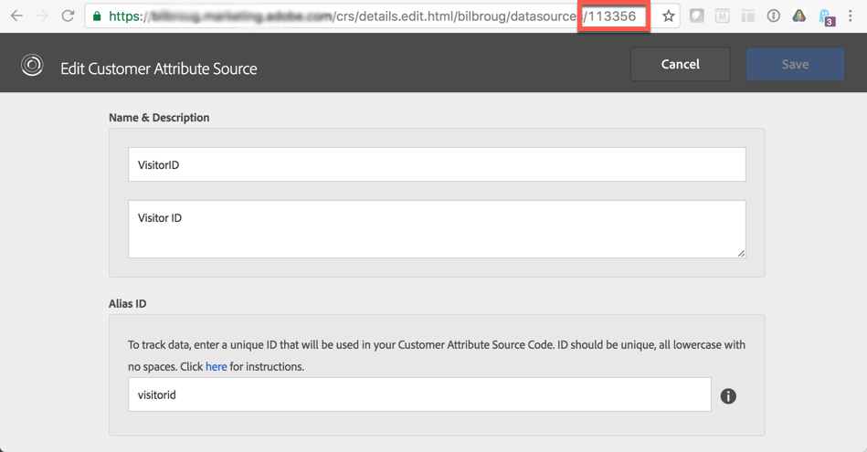

# Experience Cloud での Triggers の設定{#configuring-triggers-in-experience-cloud}

## 機能の有効化 {#activating-the-functionality}

機能は、Adobe CampaignでAdobeによって有効化する必要があります。 担当のAdobeアカウントエグゼクティブまたはプロフェッショナルサービスパートナーにお問い合わせください。

Adobeをアクティブ化するには、次の情報がトリガーチームに必要です。

* Marketing Cloud会社名
* IMS 組織 ID
* Analyticsログイン会社名(Marketing Cloud会社名と同じ)

## ソリューションおよびサービスの設定 {#configuring-solutions-and-services}

この機能を使用するには、次のソリューション/コアサービスにアクセスできる必要があります。

* Adobe Campaign
* Adobe Analytics Ultimate、Premium、Foundation、OD、Select、Prime、Mobile Apps、Select、または Standard。
* Experience Cloud Triggers コアサービス

   

* Experience Cloud DTM コアサービス

   

* Experience Cloud 訪問者 ID と Experience Cloud People コアサービス

   

また、稼働中の Web サイトも必要です。

>[!CAUTION]
>
>サブドメイン設定は、配信品質の主要要素です。 Adobe Campaign Eメールは、Webサイトで使用されるドメインと同じドメインから送信されるようにします。

これらの使用例を実行するには、[Experience CloudDTMコアサービス](#configuring-experience-cloud-dtm-core-service)、[Experience Cloudユーザーコアサービス](#configuring-experience-cloud-people-core-service)および[Campaign](#configuring-triggers-and-aliases-in-campaign)を設定する必要があります。

### Experience CloudDTMコアサービスの設定 {#configuring-experience-cloud-dtm-core-service}

1. Experience CloudDTMコアサービス(Dynamic Tag Management)で、WebサイトページのExperience CloudIDとAdobe Analyticsをアクティブ化します。

   

1. Webサイト、Adobe Analytics、Adobe Campaign間のID紐付けでは、エイリアスを使用する必要があります。 エイリアス（例：「visitorid」）を作成します。

   

### Experience CloudPeopleコアサービスの設定 {#configuring-experience-cloud-people-core-service}

DTMで以前に参照されたエイリアスは、顧客属性を通じてExperience CloudPeopleコアサービスで作成する必要があります。 新しいエイリアスを作成し、統合コードで同じDTMエイリアスを参照していることを確認してください（例：「visitorid」）。

>[!NOTE]
>
>この顧客属性をAdobe Campaignのデータソースで使用します（次の手順）。

### Campaignでのトリガーとエイリアスの設定 {#configuring-triggers-and-aliases-in-campaign}

1. **[!UICONTROL Experience Cloud triggers]**&#x200B;がAdobe Campaign Standardインスタンス上に表示されていることを確認します。 割り当てられていない場合は、Adobe Campaign管理者にお問い合わせください。

   

1. エイリアスにより、Analyticsの連絡先をCampaignのプロファイルと紐付けできます。 Experience CloudIDサービスで定義されたエイリアスをCampaignの共有データソースと照合する必要があります。 データソース( **[!UICONTROL Administration]** / **[!UICONTROL Application Settings]** / **[!UICONTROL Shared Data Sources]** )を使用して、Adobe Campaignでエイリアスの解決を設定する必要があります。 **[!UICONTROL Data Source/Alias]**&#x200B;ドロップダウンメニューで正しいデータソースを選択してください。このデータソースは、前の手順で作成したのと同じ顧客属性データソースにマッピングされています。

   

   >[!NOTE]
   >
   >匿名ユーザーとログイントリガーの両方に対してユーザーを紐付けできます。 匿名ユーザーの場合、プロファイルはAdobe Campaignに存在し、以前にユーザーに電子メールが送信されている必要があります。 そのためには、訪問者IDの設定で十分です。 ただし、ログインしたユーザーのトリガーを紐付けする場合は、宣言済みIDデータソースを設定する必要があります。 詳しくは、[データソースの設定](../../integrating/using/provisioning-and-configuring-integration-with-audience-manager-or-people-core-service.md#step-2--configure-the-data-sources)を参照してください。

## Experience Cloudインターフェイスでのトリガーの作成 {#creating-a-trigger-in-the-experience-cloud-interface}

Adobe Experience CloudトリガーをCampaignで使用できるようにする必要があります。

「 」Experience Cloudで新しいトリガーを作成し、Webサイトで使用するレポートスイートを必ず選択してください。 トリガーが実行されるように、適切なディメンションを選択していることを確認します。

[Adobe Experience Cloudのドキュメント](https://experienceleague.adobe.com/docs/core-services/interface/activation/triggers.html)を参照し、この[ビデオ](https://helpx.adobe.com/jp/marketing-cloud/how-to/email-marketing.html#step-two)を見てください。

## トリガーのベストプラクティスと制限事項 {#triggers-best-practices-and-limitations}

以下に、Campaignとトリガーの統合の使用に関するベストプラクティスと制限のリストを示します。

* Campaign Standardの複数のインスタンスがある場合、同じIMSトリガーIDにある限り、すべてのインスタンスが組織を受け取ることができます。 また、Analyticsは、同じIMS組織ID上にある必要があります。
* 2つの異なるレポートスイートのトリガーを使用して、トリガーコアサービスでイベントを作成することはできません。
* トリガーは、トランザクションメッセージに基づいています。 トランザクションメッセージは、非常に迅速にメッセージを送信する必要がある場合に使用されます。 トランザクションメッセージをキューに入れてからバッチでループすることはできません。
* トリガーは本質的には決定論的ではありません。 トリガーが生成されると、cookieに関連付けられているすべてのエイリアスが送信されるので、小売キオスク、ライブラリ、サイバーカフェ、自宅の共有デバイス（同じデバイスからログインする夫婦）などの共有ブラウザーの場合、適切なIDにマッピングできません。 ブラウザーでのログインに使用されるすべてのIDは、最初の紐付けに基づいてメッセージを送信するCampaignに送信されます。 紐付けの対象となる「電子メールID」が複数ある場合、Campaignは電子メールを送信しません。 Analyticsで取り込まれて送信されない限り、Campaignが適切な電子メールIDを把握する方法はありません。
* ペイロードのコンテンツをCampaignに保存することはできません。 トリガーは、プロファイルのデータの更新には使用できません。
* 顧客属性は、トリガーではサポートされていません(つまり、レポートスイートデータのみを使用してトリガービジネスルールを定義できます)。
* コレクションのコレクションは、Campaignではサポートされていません。

>[!CAUTION]
>
>WebサイトがAdobe Campaignサーバーと同じドメインで実行されている。 そうでない場合、訪問者IDを使用して紐付けを行い、Webサイトに匿名でアクセスするユーザーにリーチアウトすることはできません。
