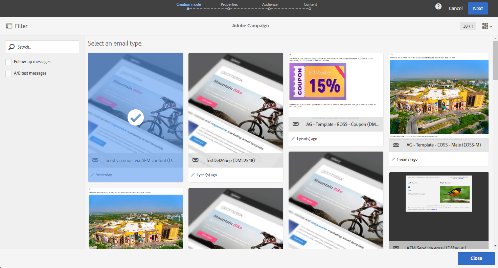

# Adobe Experience ManagerコンテンツのAdobe Campaign E メールへの読み込み {#creating-email-aem}

このドキュメントを使用して、Adobe Experience Managerで E メールコンテンツを作成および管理し、E メールでAdobe Campaign Standardにインポートしてマーケティングキャンペーンで使用する方法を学びます。

前提は次のとおりです。

* 統合用に設定されたAEMインスタンスへのアクセス。
* 統合用に設定されたAdobe Campaignインスタンスへのアクセス。
* AEMコンテンツを受け取るように設定されたAdobe Campaign E メールテンプレート。

## Adobe Experience Managerでの E メールへのアクセス {#email-content-aem}

Adobe Experience Managerオーサリングインスタンスにログインし、サイトを参照して、電子メールコンテンツが格納されているフォルダーにアクセスします。

>[!VIDEO](https://video.tv.adobe.com/v/29996)

## Adobe Experience Manager での新しい E メールコンテンツの作成 {#creating-email-content-aem}

Adobe Campaign 専用のいくつかのテンプレートを使用できます。これらのテンプレートには Adobe Campaign でサポートされる定義済みのコンポーネントが含まれているので、これらのいずれかを必ず使用してください。

デフォルトでは、2 つの定義済みテンプレートを使用して、Adobe Campaign用の E メールコンテンツを作成できます。

* **[!UICONTROL Adobe Campaign Email]**：このテンプレートには、パーソナライズできる標準コンテンツが含まれています。 Adobe Campaign電子メール (AC6.1) とAdobe Campaign電子メール (ACS) のどちらかを選択できます。
* **[!UICONTROL Importer Page]**：このテンプレートを使用すると、HTMLファイルを含む ZIP ファイルをインポートし、そのコンテンツをパーソナライズできます。

1. Adobe Experience Managerで、 **[!UICONTROL Page]**.

1. を選択します。 **[!UICONTROL Adobe Campaign Email]** テンプレート。 詳細な手順については、次のビデオを参照してください。

   >[!VIDEO](https://video.tv.adobe.com/v/29997)

1. 新しい E メールコンテンツを開きます。

1. Adobe Analytics の **[!UICONTROL Page properties]**，設定 **[!UICONTROL Adobe Campaign]** として **[!UICONTROL Cloud Service Configuration]**. これにより、コンテンツと Adobe Campaign インスタンスの間の通信が可能になります。

   詳しくは、次のビデオをご覧ください。

   >[!VIDEO](https://video.tv.adobe.com/v/29999)

## E メールの編集と送信 {#editing-email-aem}

コンポーネントやアセットを追加して、E メールのコンテンツを編集できます。 パーソナライゼーションフィールドを使用して、Adobe Campaignで受信者のデータに基づいて、より関連性の高いメッセージを配信できます。

Adobe Experience Managerで E メールコンテンツを作成するには：

1. 件名と **[!UICONTROL Plain text]** 電子メールのバージョン ( **[!UICONTROL Page properties]** > **[!UICONTROL Email]** タブをサイドキックから開きます。

1. 追加 **[!UICONTROL Personalization fields]** から **[!UICONTROL Text & Personalization]** コンポーネント。 各コンポーネントは、画像の挿入、パーソナライゼーションの追加など、特定の使用方法に対応します。

   詳しくは、次のビデオをご覧ください。

   >[!VIDEO](https://video.tv.adobe.com/v/29998)

1. 次から： **[!UICONTROL Workflow]** タブで、 **[!UICONTROL Approve for Adobe Campaign]** 検証ワークフロー。 E メールに未承認のコンテンツを使用している場合、その E メールを Adobe Campaign で送信することはできません。

Adobe Campaign Standardで E メールを送信するには：

1. コンテンツおよび送信パラメーターを定義したら、Adobe Campaign StandardでAEM固有の E メールテンプレートに基づいて E メールを作成します。

+++ AEM固有のテンプレートについて詳しくは、こちらを参照してください。

   1. 詳細設定メニューから、 **[!UICONTROL Resources]** `>` **[!UICONTROL Templates]** `>` **[!UICONTROL Delivery templates]**.

      

   1. 配信テンプレートを複製するか、1 つ選択します。

   1. 次から： **[!UICONTROL Properties]** を選択します。 **[!UICONTROL Content]** ドロップダウンで、「 **[!UICONTROL Adobe Experience Manager as Content mode]** 次に、Adobe Experience Managerアカウントを作成します。

      

+++

   

1. E メールのプロパティを入力し、「 **[!UICONTROL Create]** AEMコンテンツを選択できるようにします。

1. 次にアクセス： **[!UICONTROL Content]** ブロック。

   

1. 次から： **[!UICONTROL Use Adobe Experience Manager content]** メニュー、クリック **[!UICONTROL Link AEM content]**.

   次に、E メールで使用するコンテンツを選択します。

   

1. ダッシュボードでターゲットオーディエンスや実行スケジュールなどの追加のパラメーターを指定して、電子メールをさらにカスタマイズします。 設定が完了すると、E メール配信を送信できるようになります。 [詳細情報](../../sending/using/confirming-the-send.md)

