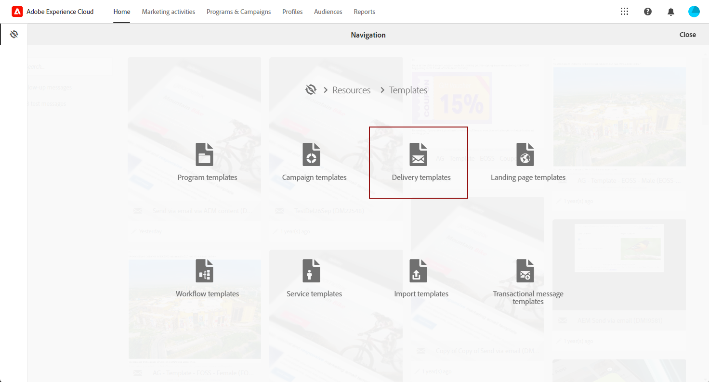
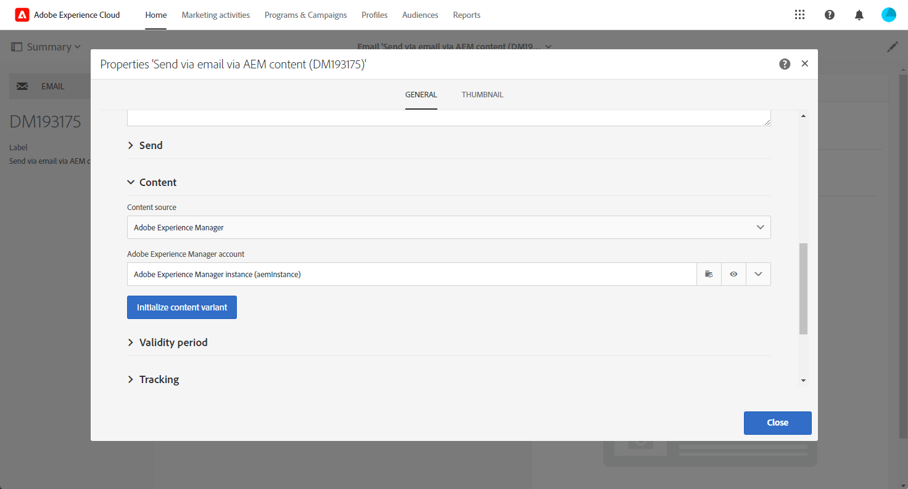
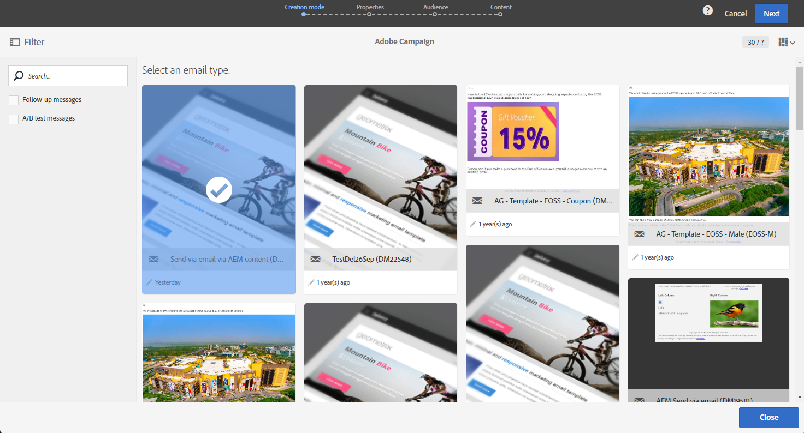
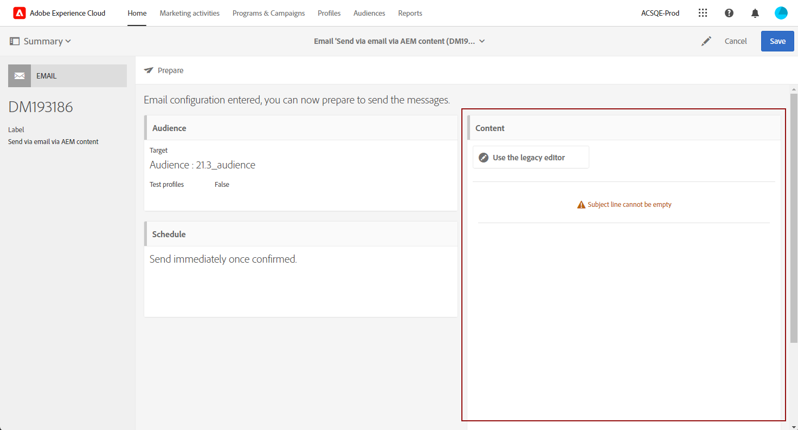
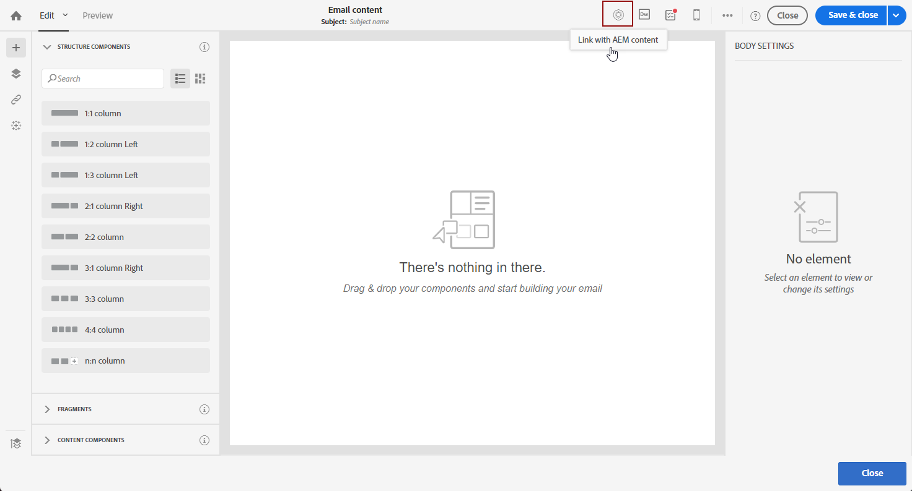

# Adobe Campaign メールへのAdobe Experience Manager コンテンツの読み込み {#creating-email-aem}

このドキュメントでは、Adobe Experience Managerでメールコンテンツを作成および管理し、メールでAdobe Campaign Standardに読み込むことで、マーケティングキャンペーンに使用する方法を説明します。

前提は次のとおりです。

* 統合用に設定されたAEM インスタンスへのアクセス。
* 統合用に設定されたAdobe Campaign インスタンスへのアクセス。
* AEM コンテンツを受信するように設定されたAdobe Campaign メールテンプレート。

## Adobe Experience Managerでの電子メールへのアクセス {#email-content-aem}

Adobe Experience Manager オーサリングインスタンスにログインし、サイトを参照して、メール内容を含むフォルダーにアクセスします。

>[!VIDEO](https://video.tv.adobe.com/v/29996)

## Adobe Experience Manager での新しい E メールコンテンツの作成 {#creating-email-content-aem}

Adobe Campaign専用のテンプレートがいくつか用意されています。 これらのテンプレートには Adobe Campaign でサポートされる定義済みのコンポーネントが含まれているので、これらのいずれかを必ず使用してください。

デフォルトでは、2つの定義済みテンプレートを使用して、Adobe Campaignのメールコンテンツを作成できます。

* **[!UICONTROL Adobe Campaign Email]**：このテンプレートには、パーソナライズできる標準コンテンツが含まれています。 Adobe Campaign メール（AC6.1）とAdobe Campaign メール（ACS）のいずれかを選択できます。
* **[!UICONTROL Importer Page]**：このテンプレートを使用すると、HTML ファイルを含むZIP ファイルを読み込み、コンテンツをパーソナライズできます。

1. Adobe Experience Managerで、新しい&#x200B;**[!UICONTROL Page]**&#x200B;を作成します。

1. **[!UICONTROL Adobe Campaign Email]** テンプレートを選択します。 詳細な手順については、次のビデオを参照してください。

   >[!VIDEO](https://video.tv.adobe.com/v/29997)

1. 新しいメールコンテンツを開きます。

1. **[!UICONTROL Page properties]**&#x200B;で、**[!UICONTROL Adobe Campaign]**&#x200B;を&#x200B;**[!UICONTROL Cloud Service Configuration]**&#x200B;に設定します。 これにより、コンテンツと Adobe Campaign インスタンスの間の通信が可能になります。

   詳しくは、次のビデオをご覧ください。

   >[!VIDEO](https://video.tv.adobe.com/v/29999)

## 電子メールの編集と送信 {#editing-email-aem}

コンポーネントとアセットを追加して、メールコンテンツを編集できます。 パーソナライゼーションフィールドを使用すると、Adobe Campaignの受信者データに基づいて、より適切なメッセージを配信できます。

Adobe Experience Managerでメールコンテンツを作成するには：

1. サイドキックから「**[!UICONTROL Page properties]** > **[!UICONTROL Email]**」タブにアクセスして、メールの件名と&#x200B;**[!UICONTROL Plain text]** バージョンを編集します。

1. **[!UICONTROL Text & Personalization]** コンポーネントを使用して&#x200B;**[!UICONTROL Personalization fields]**&#x200B;を追加します。 各コンポーネントは、画像の挿入、パーソナライゼーションの追加など、特定の用途に対応します。

   詳しくは、次のビデオをご覧ください。

   >[!VIDEO](https://video.tv.adobe.com/v/29998)

1. 「**[!UICONTROL Workflow]**」タブから、**[!UICONTROL Approve for Adobe Campaign]**&#x200B;検証ワークフローを選択します。 E メールに未承認のコンテンツを使用している場合、その E メールを Adobe Campaign で送信することはできません。

Adobe Campaign Standardでメールを送信するには：

1. コンテンツと送信パラメーターを定義したら、Adobe Campaign StandardのAEM固有のメールテンプレートに基づいてメールを作成します。

   +++ AEM固有のテンプレートについて詳しく見る。

   1. 詳細設定メニューから、**[!UICONTROL Resources]** `>` **[!UICONTROL Templates]** `>` **[!UICONTROL Delivery templates]**&#x200B;にアクセスします。

      

   1. いずれかの配信テンプレートを複製または選択します。

   1. テンプレートの&#x200B;**[!UICONTROL Properties]**&#x200B;から、**[!UICONTROL Content]** ドロップダウンで、**[!UICONTROL Adobe Experience Manager as Content mode]**、次にAdobe Experience Manager アカウントを選択します。

      

   +++

   

1. メールのプロパティを入力し、**[!UICONTROL Create]**&#x200B;をクリックすると、AEM コンテンツを選択できます。

1. **[!UICONTROL Content]** ブロックにアクセスします。

   

1. **[!UICONTROL Use Adobe Experience Manager content]** メニューから、**[!UICONTROL Link AEM content]**&#x200B;をクリックします。

   次に、メールで使用するコンテンツを選択します。

   

1. ターゲットオーディエンスや実行スケジュールなどの追加パラメーターをダッシュボードで指定することで、メールをさらにカスタマイズできます。 設定が完了したら、メール配信を送信できるようになります。 [詳細情報](../../sending/using/confirming-the-send.md)

