# Adobe Experience Manager との統合による多言語メールの作成 {#creating-multilingual-email-aem}

このドキュメントでは、Adobe Experience Managerのコンテンツと言語コピーを使用して多言語メールを作成する方法について説明します。

前提は次のとおりです。

* 統合用に設定されたAEM インスタンスへのアクセス。
* 統合用に設定されたAdobe Campaign インスタンスへのアクセス。
* AEM コンテンツを受信するように設定されたAdobe Campaign多言語メールテンプレート。

## Adobe Experience Manager での新しい E メールコンテンツの作成 {#creating-email-content-aem}

1. Adobe Experience Managerのホームページから、**[!UICONTROL Site]**&#x200B;を選択します。

   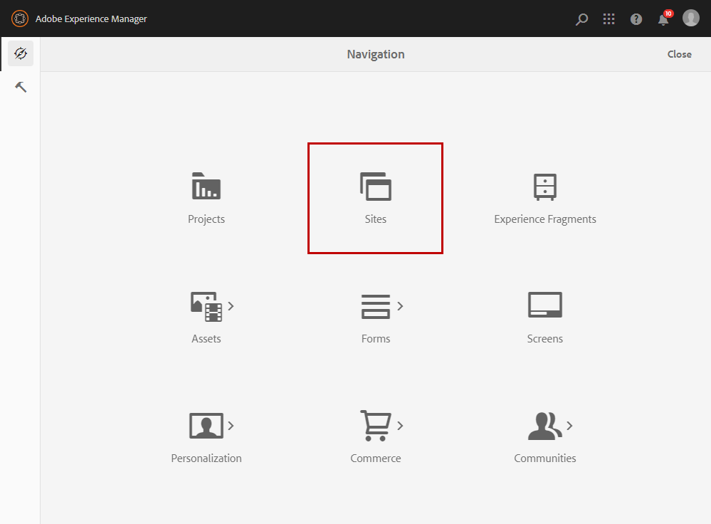

1. ページを作成するフォルダーを選択し、**[!UICONTROL Create]**、**[!UICONTROL Page]**&#x200B;の順にクリックします。 ここでは、デフォルト言語となるen_us フォルダーにページを作成します。

   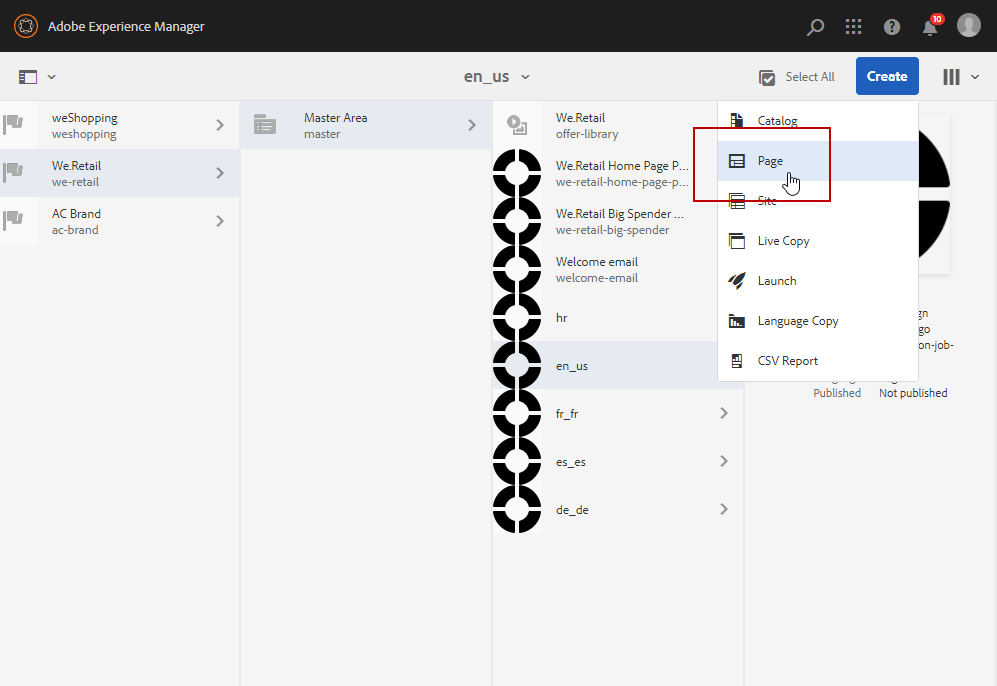

1. **[!UICONTROL Adobe Campaign Email (ACS)]** テンプレートを選択します。

1. メールのプロパティを入力し、**[!UICONTROL Create]**&#x200B;をクリックします。

   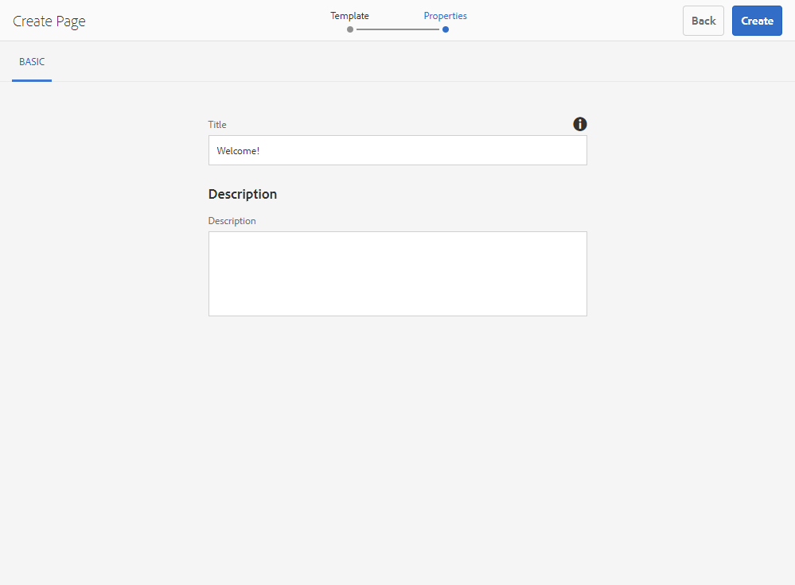

1. 新しいメールコンテンツを開き、必要に応じてパーソナライズします。 詳しくは、この[ページ](../../integrating/using/creating-email-experience-manager.md#editing-email-aem)を参照してください。

   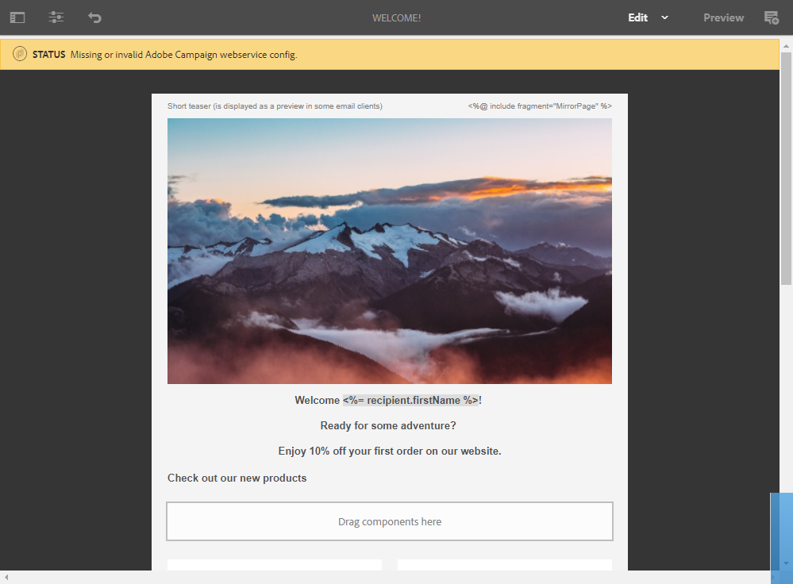

1. 「**[!UICONTROL Workflow]**」タブから、**[!UICONTROL Approve for Adobe Campaign]**&#x200B;検証ワークフローを選択します。 E メールに未承認のコンテンツを使用している場合、その E メールを Adobe Campaign で送信することはできません。

   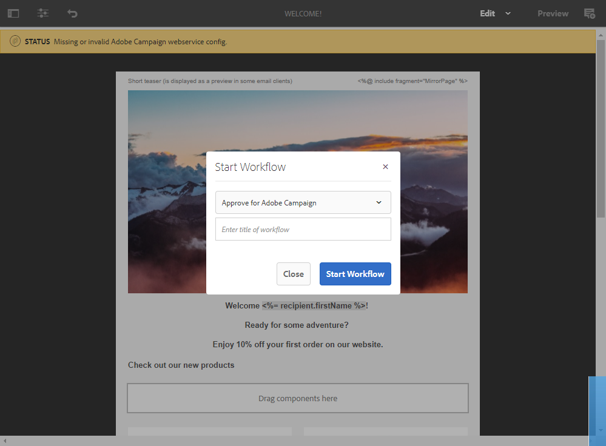

1. **[!UICONTROL Complete work item]** ウィンドウから&#x200B;**[!UICONTROL Complete]**、次に&#x200B;**[!UICONTROL Newsletter review]**&#x200B;をクリックします。

1. 「**[!UICONTROL Complete]**」、「**[!UICONTROL Newsletter approval]**」の順にクリックします。 コンテンツと送信パラメーターを定義したら、Adobe Campaign Standardでメールの承認、準備、送信に進むことができます。

   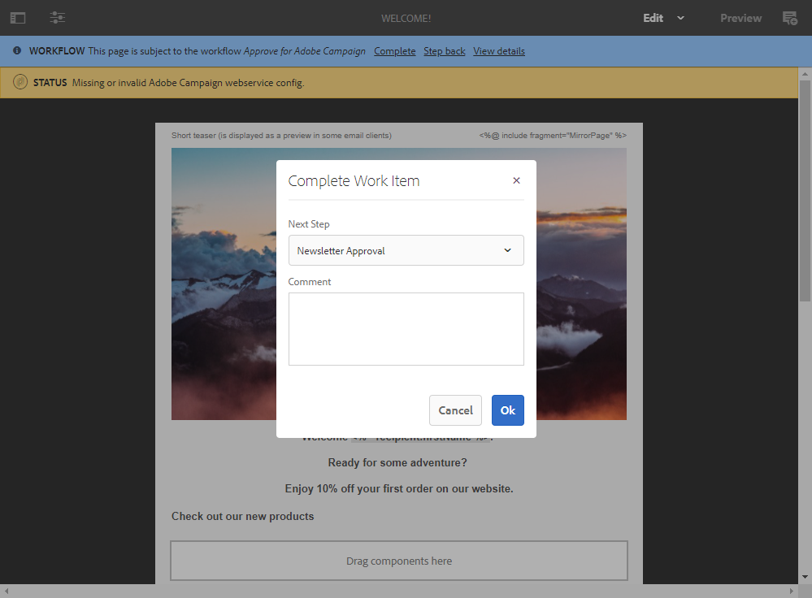

## 言語コピーの作成 {#creating-language-copies}

メールコンテンツをデザインしたら、言語コピーを作成する必要があります。このコピーは、バリエーションとしてAdobe Campaign Standardと同期されます。

1. 以前に作成したページを選択し、**[!UICONTROL Create]**、**[!UICONTROL Language Copy]**&#x200B;の順にクリックします。

   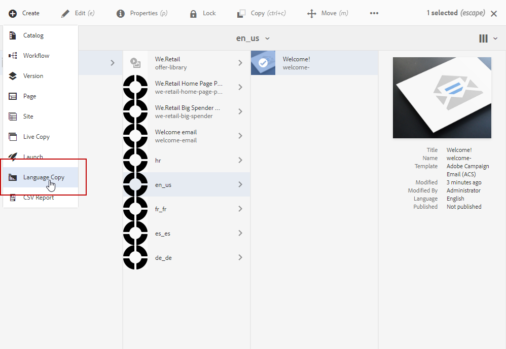

1. 選択した言語で翻訳される以前に作成したメールコンテンツを選択し、**[!UICONTROL Next]**&#x200B;をクリックします。

   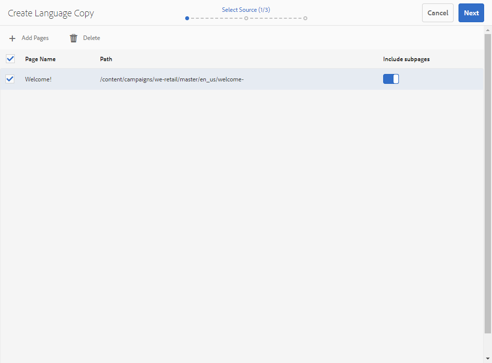

1. **[!UICONTROL Target language(s)]** ドロップダウンで、コンテンツを翻訳する言語を選択し、**[!UICONTROL Next]**&#x200B;をクリックします。

   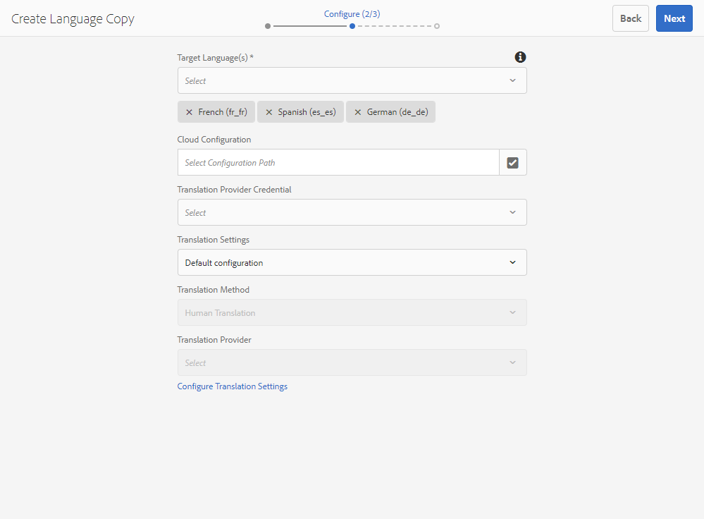

1. 「**[!UICONTROL Create]**」をクリックします。

言語コピーが作成されました。選択した言語に応じてコンテンツを編集できるようになりました。

>[!CAUTION]
>
>すべての言語コピーは、**[!UICONTROL Approve for Adobe Campaign]**&#x200B;検証ワークフローを介して承認する必要があります。 E メールに未承認のコンテンツを使用している場合、その E メールを Adobe Campaign で送信することはできません。

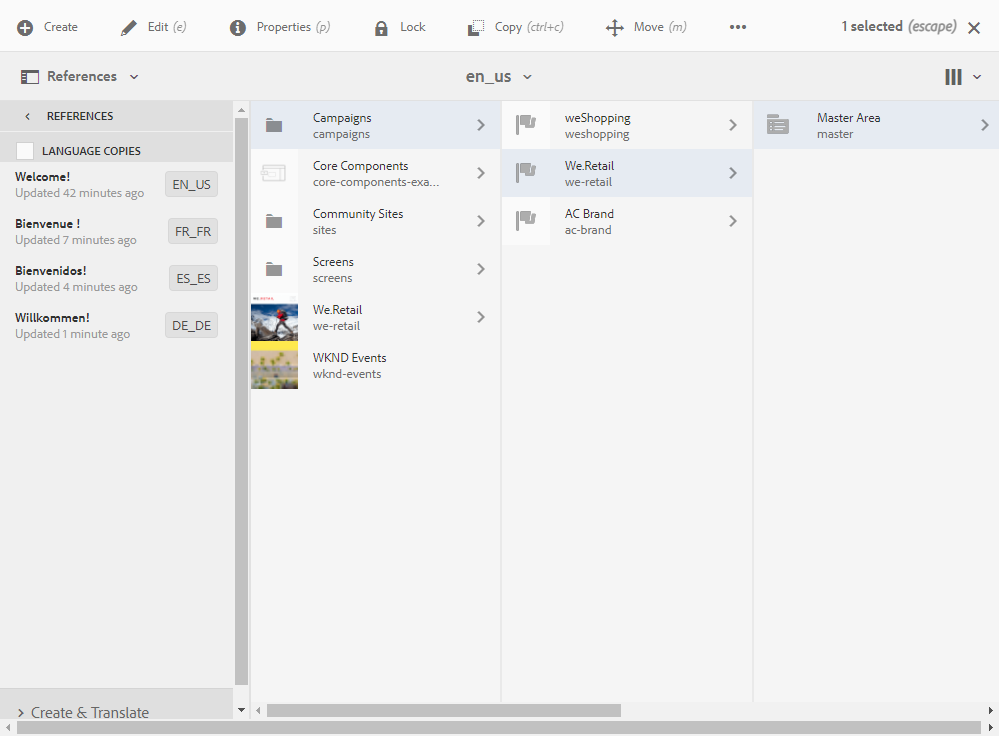

## Adobe Campaign Standardでの多言語コンテンツの作成 {#multilingual-acs}

1. Adobe Campaign Standardのホームページから、**[!UICONTROL Create an email]**&#x200B;をクリックします。

   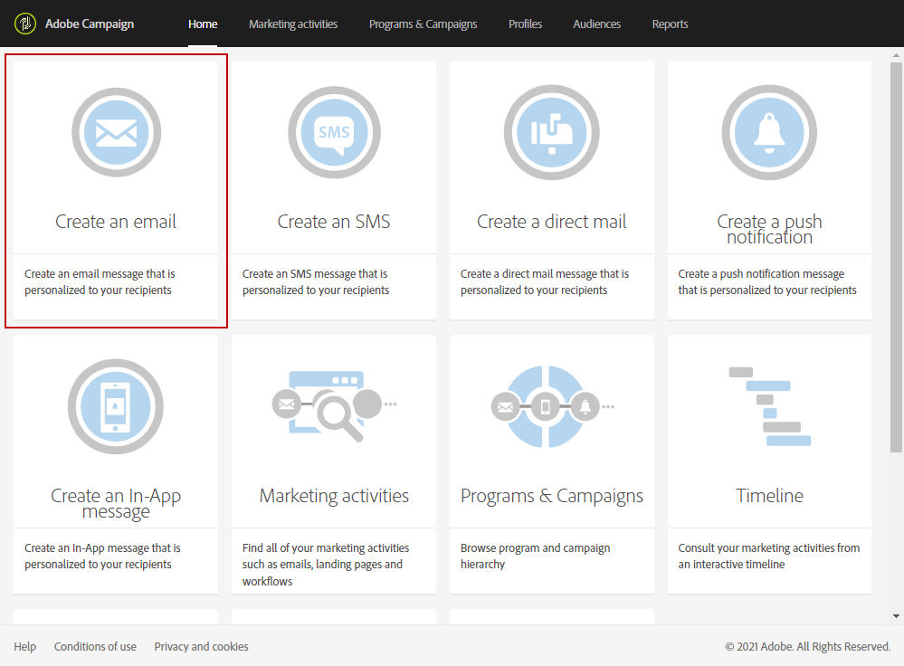

1. Adobe Experience Manager コンテンツの受信に設定されているAdobe Campaign多言語メールテンプレートを選択します。 Adobe Experience Manager インスタンスにリンクされたテンプレートの作成方法について詳しくは、この[page](../../integrating/using/configure-experience-manager.md#config-acs)を参照してください。

   >[!NOTE]
   >
   >この場合、多言語メールを送信するには、組み込みテンプレート **[!UICONTROL Multilingual email (mailMultiLang)]**&#x200B;を複製する必要があります。

   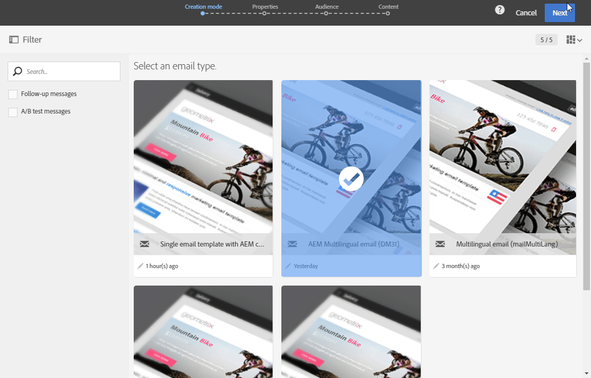

1. メールの&#x200B;**[!UICONTROL Properties]**&#x200B;と&#x200B;**[!UICONTROL Audience]**&#x200B;を入力し、**[!UICONTROL Create]**&#x200B;をクリックします。

1. **[!UICONTROL Edit properties]**&#x200B;で、Adobe Experience Manager アカウントが&#x200B;**[!UICONTROL Content]** ドロップダウンで正しく設定されていることを確認します。

   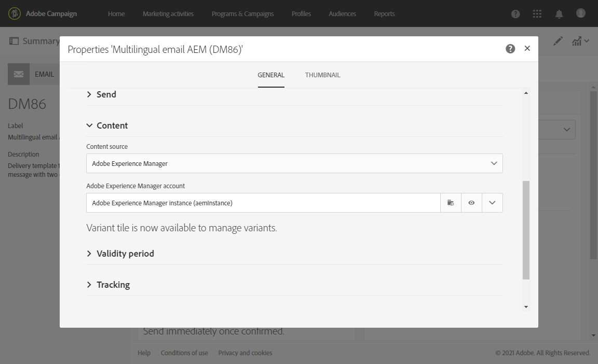

1. 「**[!UICONTROL Language copy creation]**」をクリックします。

   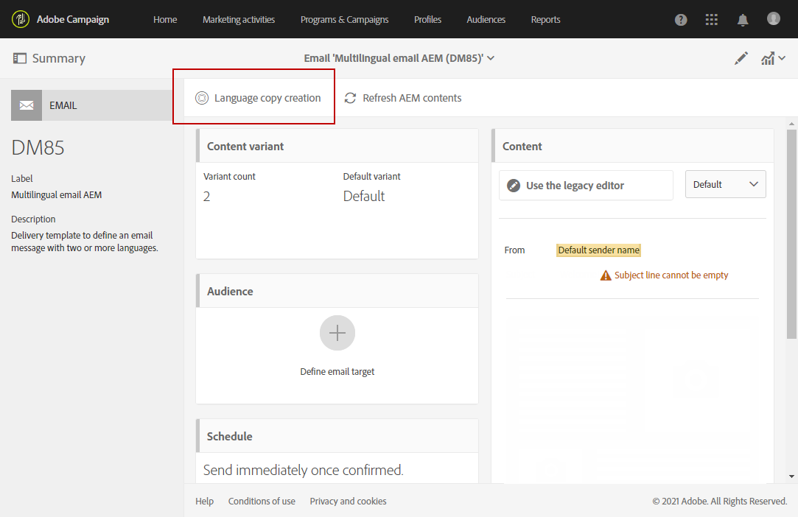

1. 以前に作成したAdobe Experience Manager コンテンツを選択し、**[!UICONTROL Confirm]**&#x200B;をクリックします。 ここに表示されているAdobe Experience Manager コンテンツは、検証済みのコンテンツのみであり、**[!UICONTROL Label]**&#x200B;と&#x200B;**[!UICONTROL Path]**&#x200B;でフィルタリングできます。

   >[!NOTE]
   >
   >選択した言語コピーはデフォルトとして設定されます。後で&#x200B;**[!UICONTROL Content variant]** ブロックで変更できます。

   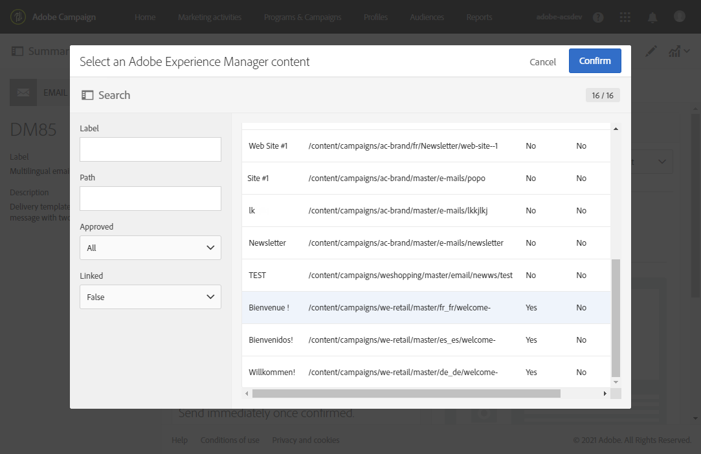

1. 多言語コンテンツをリンクするには、**[!UICONTROL Create variants]**&#x200B;をクリックします。 Adobe Campaign Standardは、その他の言語コピーをこのコンテンツに自動的にリンクします。 作成されたバリエーションは、Adobe Experience Managerで選択したラベルとコード言語と同じです。

   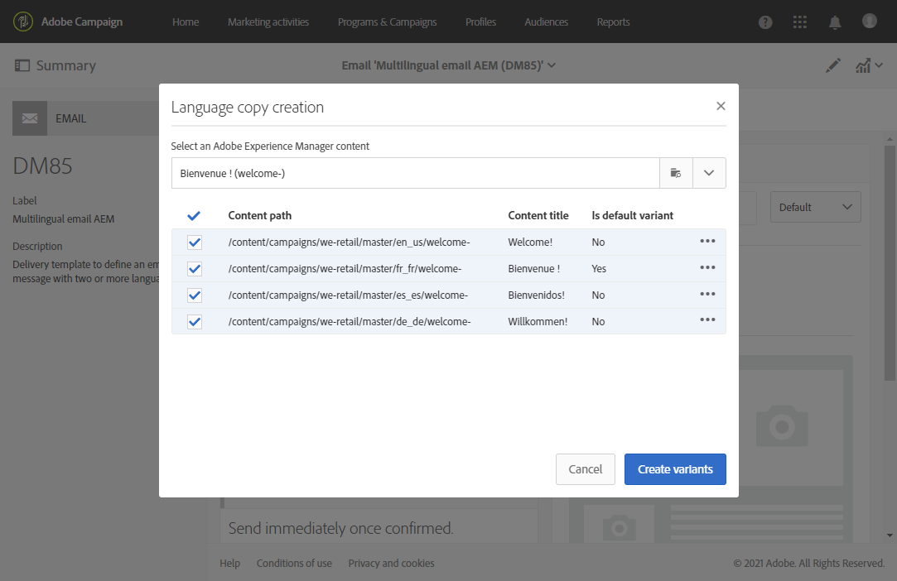

1. 必要に応じて&#x200B;**[!UICONTROL Content variant]** ブロックをクリックして、デフォルトバリアントを変更し、**[!UICONTROL Confirm]**&#x200B;をクリックします。

   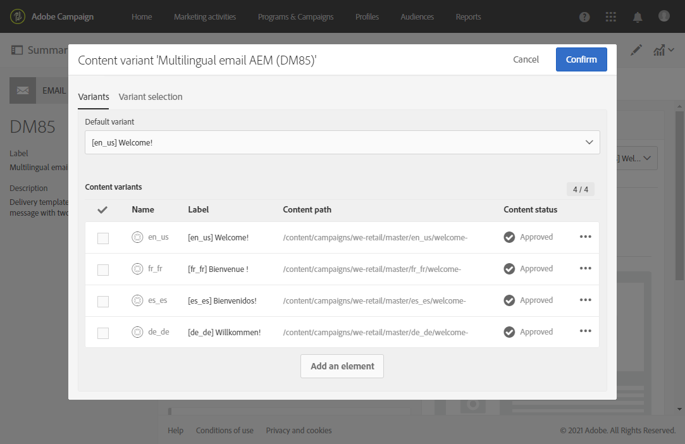

1. コンテンツまたはバリエーションがAdobe Experience Managerで更新された場合は、Adobe Campaign Standardで&#x200B;**[!UICONTROL Refresh AEM contents]** ボタンと直接同期できます。

1. これでメールを送信する準備ができました。 これについて詳しくは、この[ページ](../../sending/using/get-started-sending-messages.md)を参照してください。

   >[!NOTE]
   >
   >承認されていないAEM コンテンツを使用している場合、Adobe Campaignで電子メールを送信することはできません。

オーディエンスは、**[!UICONTROL Profiles]**&#x200B;に設定されている&#x200B;**[!UICONTROL Preferred languages]**&#x200B;に応じて電子メールを受け取ります。 プロファイルと優先言語の編集方法について詳しくは、この[&#x200B; ページ &#x200B;](../../audiences/using/editing-profiles.md)を参照してください。
