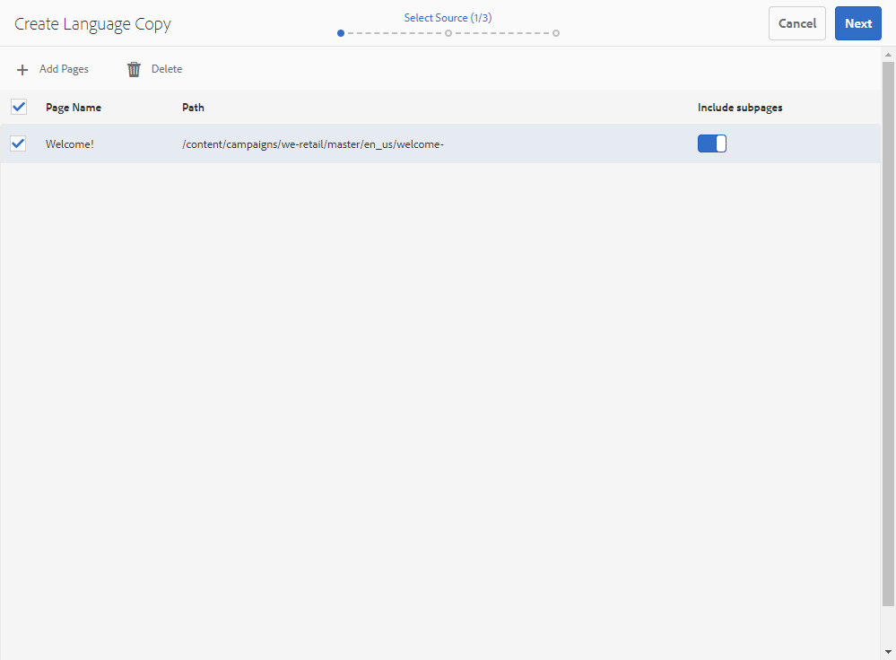

# Adobe Experience Manager との統合による多言語メールの作成 {#creating-multilingual-email-aem}

このドキュメントでは、Adobe Experience Managerのコンテンツと言語コピーを使用して、多言語のメールを作成する方法を説明します。

前提は次のとおりです。

* 統合用に設定されたAEM インスタンスへのアクセス。
* 統合用に設定されたAdobe Campaign インスタンスへのアクセス。
* AEM コンテンツを受け取るように設定されたAdobe Campaignの多言語メールテンプレート。

## Adobe Experience Manager での新しい E メールコンテンツの作成 {#creating-email-content-aem}

1. Adobe Experience Manager ホームページで「**[!UICONTROL Site]**」を選択します。

   

1. ページを作成するフォルダーを選択し、「**[!UICONTROL Create]**」をクリックして「**[!UICONTROL Page]**」をクリックします。 ここでは、デフォルトの言語となる en_us フォルダーにページを作成します。

   

1. **[!UICONTROL Adobe Campaign Email (ACS)]** テンプレートを選択します。

1. メールのプロパティを入力し、「**[!UICONTROL Create]**」をクリックします。

   

1. 新しいメールコンテンツを開き、必要に応じてパーソナライズします。 詳しくは、この[ページ](../../integrating/using/creating-email-experience-manager.md#editing-email-aem)を参照してください。

   

1. 「**[!UICONTROL Workflow]**」タブから、**[!UICONTROL Approve for Adobe Campaign]** 検証ワークフローを選択します。 E メールに未承認のコンテンツを使用している場合、その E メールを Adobe Campaign で送信することはできません。

   

1. 「」 **[!UICONTROL Complete]** クリックして、**[!UICONTROL Complete work item]** のウィンドウから **[!UICONTROL Newsletter review]** をクリックします。

1. 「**[!UICONTROL Complete]**」をクリックし、「**[!UICONTROL Newsletter approval]**」をクリックします。 コンテンツと送信パラメーターを定義したら、Adobe Campaign Standardでメールの承認、準備、送信に進むことができます。

   

## 言語コピーの作成 {#creating-language-copies}

メールコンテンツをデザインしたら、言語コピーを作成する必要があります。この言語コピーは、バリアントとしてAdobe Campaign Standardと同期されます。

1. 以前に作成したページを選択し、「**[!UICONTROL Create]**」をクリックして「**[!UICONTROL Language Copy]**」をクリックします。

   

1. 以前作成した、選択した言語に翻訳されるメールコンテンツを選択し、「**[!UICONTROL Next]**」をクリックします。

   

1. **[!UICONTROL Target language(s)]** ドロップダウンで、コンテンツを翻訳する言語を選択し、「**[!UICONTROL Next]**」をクリックします。

   

1. 「**[!UICONTROL Create]**」をクリックします。

これで言語コピーが作成され、選択した言語に応じてコンテンツを編集できるようになりました。

>[!CAUTION]
>
>すべての言語コピーは、**[!UICONTROL Approve for Adobe Campaign]** の検証ワークフローで承認する必要があります。 E メールに未承認のコンテンツを使用している場合、その E メールを Adobe Campaign で送信することはできません。

## Adobe Campaign Standardでの多言語コンテンツの作成 {#multilingual-acs}

1. Adobe Campaign Standard ホームページで、「**[!UICONTROL Create an email]**」をクリックします。

   

1. Adobe Experience Manager コンテンツを受け取るように設定されたAdobe Campaignの多言語メールテンプレートを選択します。 Adobe Experience Manager インスタンスにリンクされたテンプレートの作成方法については、この [ ページ ](../../integrating/using/configure-experience-manager.md#config-acs) を参照してください。

   >[!NOTE]
   >
   >この場合、ビルトインテンプレート **[!UICONTROL Multilingual email (mailMultiLang)]** を複製して、多言語メールを送信できるようにする必要があります。

   

1. メールの **[!UICONTROL Properties]** と **[!UICONTROL Audience]** を入力し、「**[!UICONTROL Create]**」をクリックします。

1. **[!UICONTROL Edit properties]** で、「**[!UICONTROL Content]**」ドロップダウンにAdobe Experience Manager アカウントが正しく設定されていることを確認します。

   

1. 「**[!UICONTROL Language copy creation]**」をクリックします。

   

1. 以前に作成したAdobe Experience Manager コンテンツを選択し、「**[!UICONTROL Confirm]**」をクリックします。 ここに表示されるAdobe Experience Manager コンテンツは検証済みのコンテンツのみで、**[!UICONTROL Label]** と **[!UICONTROL Path]** に基づいてフィルタリングできます。

   >[!NOTE]
   >
   >選択した言語コピーがデフォルトとして設定されます。後から **[!UICONTROL Content variant]** ブロックで変更できます。

   

1. 「**[!UICONTROL Create variants]**」をクリックして、多言語コンテンツをリンクします。 Adobe Campaign Standardは、他の言語コピーをこのコンテンツに自動的にリンクします。 作成されたバリアントは、Adobe Experience Managerで選択されたものと同じラベルとコード言語を持ちます。

   

1. 必要に応じて、**[!UICONTROL Content variant]** ブロックをクリックしてデフォルトのバリアントを変更し、「変 **[!UICONTROL Confirm]**」をクリックします。

   

1. Adobe Experience Managerでコンテンツまたはバリアントを更新した場合は、「**[!UICONTROL Refresh AEM contents]**」ボタンを使用して、Adobe Campaign Standardで直接同期させることができます。

1. これで、メールを送信する準備が整いました。 詳しくは、この [ ページ ](../../sending/using/get-started-sending-messages.md) を参照してください。

   >[!NOTE]
   >
   >承認されていないAEM コンテンツを使用した場合、Adobe Campaignでメールを送信することはできません。

オーディエンスは、**[!UICONTROL Profiles]** ージで設定された **[!UICONTROL Preferred languages]** に応じてメールを受け取ります。 プロファイルと優先言語の編集方法について詳しくは、この [ ページ ](../../audiences/using/editing-profiles.md) を参照してください。
