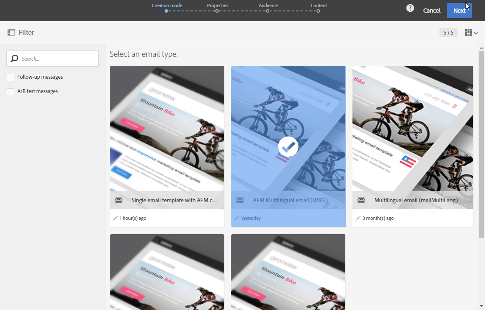

# Adobe Experience Manager との統合による多言語 E メールの作成 {#creating-multilingual-email-aem}

このドキュメントを使用して、Adobe Experience Managerのコンテンツと言語コピーを使用して多言語電子メールを作成する方法を学びます。

前提は次のとおりです。

* 統合用に設定されたAEMインスタンスへのアクセス。
* 統合用に設定されたAdobe Campaignインスタンスへのアクセス。
* AEMコンテンツを受け取るように設定されたAdobe Campaignの多言語電子メールテンプレート。

## Adobe Experience Manager での新しい E メールコンテンツの作成 {#creating-email-content-aem}

1. Adobe Experience Managerのホームページから&#x200B;**[!UICONTROL Site]**&#x200B;を選択します。

   

1. ページを作成するフォルダーを選択し、「**[!UICONTROL Create]**」、「**[!UICONTROL Page]**」の順にクリックします。 ここでは、デフォルト言語となるen_usフォルダーにページを作成します。

   

1. **[!UICONTROL Adobe Campaign Email (ACS)]**&#x200B;テンプレートを選択します。

1. 電子メールのプロパティを入力し、「**[!UICONTROL Create]**」をクリックします。

   

1. 新しい電子メールコンテンツを開き、必要に応じてパーソナライズします。 詳しくは、この[ページ](../../integrating/using/creating-email-experience-manager.md#editing-email-aem)を参照してください。

   

1. 「**[!UICONTROL Workflow]**」タブから、**[!UICONTROL Approve for Adobe Campaign]**&#x200B;検証ワークフローを選択します。 E メールに未承認のコンテンツを使用している場合、その E メールを Adobe Campaign で送信することはできません。

   

1. **[!UICONTROL Complete work item]**&#x200B;ウィンドウで&#x200B;**[!UICONTROL Complete]**&#x200B;をクリックし、**[!UICONTROL Newsletter review]**&#x200B;をクリックします。

1. 「**[!UICONTROL Complete]**」、「**[!UICONTROL Newsletter approval]**」の順にクリックします。コンテンツと送信パラメーターが定義されたら、Adobe Campaign Standardでの電子メールの承認、準備および送信に進むことができます。

   

## 言語コピーの作成{#creating-language-copies}

電子メールコンテンツを設計した後、Adobe Campaign Standardとバリエーションとして同期する言語コピーを作成する必要があります。

1. 以前に作成したページを選択し、「**[!UICONTROL Create]**」、「**[!UICONTROL Language Copy]**」の順にクリックします。

   

1. 以前に作成した電子メールコンテンツを選択し、選択した言語で翻訳してから&#x200B;**[!UICONTROL Next]**&#x200B;をクリックします。

   

1. 「**[!UICONTROL Target language(s)]**」ドロップダウンで、コンテンツを翻訳する言語を選択し、「**[!UICONTROL Next]**」をクリックします。

   

1. 「**[!UICONTROL Create]**」をクリックします。

これで言語コピーが作成され、選択した言語に応じてコンテンツを編集できるようになります。

>[!CAUTION]
>
>すべての言語コピーは、**[!UICONTROL Approve for Adobe Campaign]**&#x200B;検証ワークフローを介して承認する必要があります。 E メールに未承認のコンテンツを使用している場合、その E メールを Adobe Campaign で送信することはできません。

## Adobe Campaign Standard{#multilingual-acs}で多言語コンテンツを作成する

1. Adobe Campaign Standardのホームページで&#x200B;**[!UICONTROL Create an email]**&#x200B;をクリックします。

   

1. Adobe Experience Managerコンテンツを受け取るように設定されたAdobe Campaignの多言語電子メールテンプレートを選択します。 お使いのAdobe Experience Managerインスタンスにリンクしたテンプレートを作成する方法について詳しくは、[ページ](../../integrating/using/configure-experience-manager.md#config-acs)を参照してください。

   >[!NOTE]
   >
   >この場合、多言語の電子メールを送信できるように、組み込みのテンプレート&#x200B;**[!UICONTROL Multilingual email (mailMultiLang)]**&#x200B;を重複する必要があります。

   

1. 電子メールの&#x200B;**[!UICONTROL Properties]**&#x200B;と&#x200B;**[!UICONTROL Audience]**&#x200B;を入力し、**[!UICONTROL Create]**&#x200B;をクリックします。

1. **[!UICONTROL Edit properties]**&#x200B;で、**[!UICONTROL Content]**&#x200B;ドロップダウンにAdobe Experience Managerアカウントが正しく設定されていることを確認します。

   

1. 「**[!UICONTROL Language copy creation]**」をクリックします。

   

1. 以前に作成したAdobe Experience Managerコンテンツを選択し、**[!UICONTROL Confirm]**&#x200B;をクリックします。 ここに表示されるAdobe Experience Managerのコンテンツは検証済みのコンテンツであり、**[!UICONTROL Label]**&#x200B;と&#x200B;**[!UICONTROL Path]**&#x200B;でフィルタリングできます。

   >[!NOTE]
   >
   >選択した言語コピーはデフォルトとして設定され、後で&#x200B;**[!UICONTROL Content variant]**&#x200B;ブロックで変更できます。

   

1. 多言語コンテンツをリンクするには、**[!UICONTROL Create variants]**&#x200B;をクリックします。 その後、Adobe Campaign Standardは他の言語コピーを自動的にこのコンテンツにリンクします。 作成されたバリアントは、Adobe Experience Managerで選択されたものと同じラベルおよびコード言語を持ちます。

   

1. 必要に応じて&#x200B;**[!UICONTROL Content variant]**&#x200B;ブロックをクリックし、デフォルトのバリアントを変更して&#x200B;**[!UICONTROL Confirm]**&#x200B;をクリックします。

   

1. コンテンツやバリアントがAdobe Experience Managerで更新された場合は、Adobe Campaign Standardで&#x200B;**[!UICONTROL Refresh AEM contents]**&#x200B;ボタンを使用して直接同期できます。

1. これで、電子メールを送信する準備が整いました。 これについて詳しくは、この[ページ](../../sending/using/get-started-sending-messages.md)を参照してください。

**[!UICONTROL Profiles]**&#x200B;に設定されている&#x200B;**[!UICONTROL Preferred languages]**&#x200B;に応じて、オーディエンスに電子メールが届きます。 プロファイルや好みの言語を編集する方法について詳しくは、[ページ](../../audiences/using/editing-profiles.md)を参照してください。
