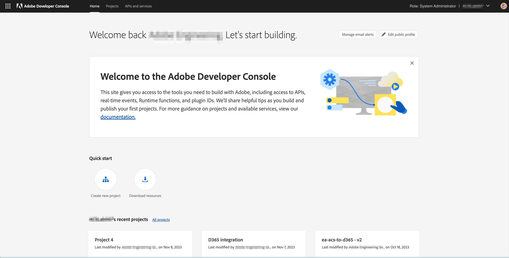
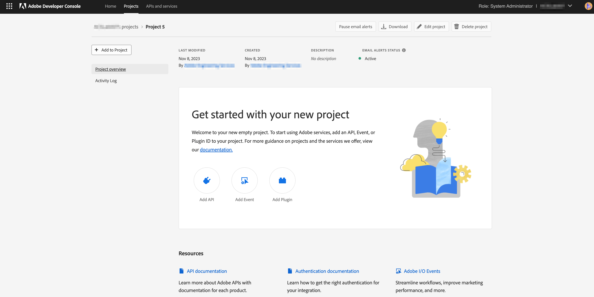
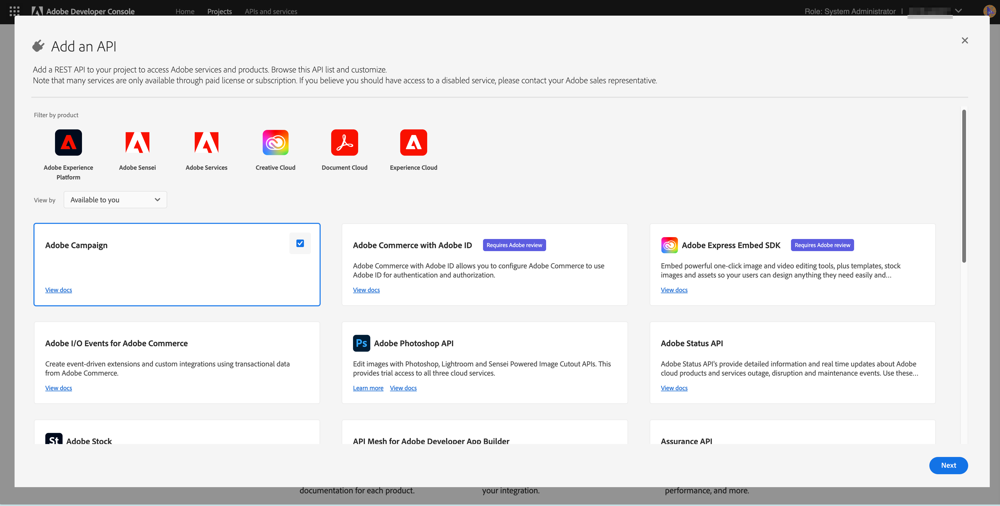
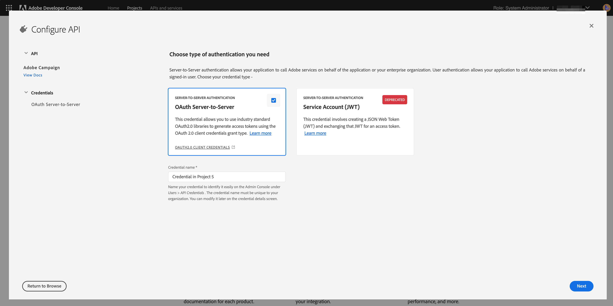
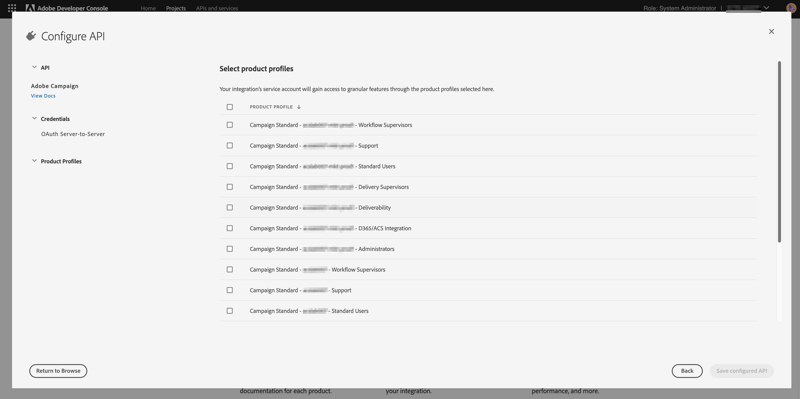
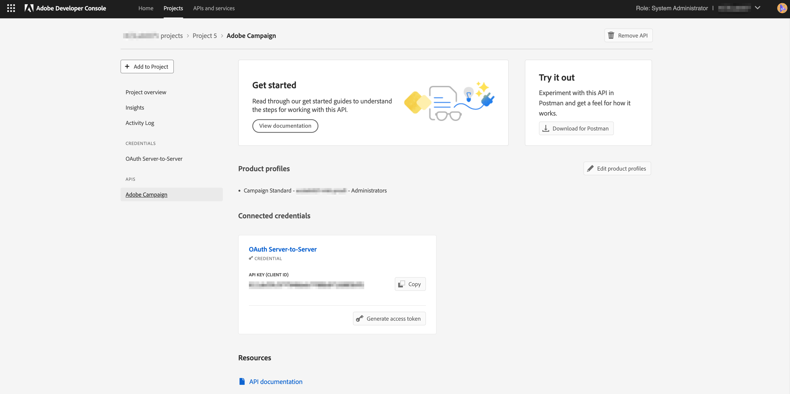

# Microsoft Dynamics 365統合用のAdobe Campaign StandardとAdobe Developerの設定

この記事では、Adobe Campaign StandardとAdobe I/Oを設定して、統合アプリケーションにデータへのアクセス権を付与する方法について説明します。

## Adobe Campaign Standardの設定 {#campaign-standard}

### プロファイル拡張機能

Adobe Campaign Standardで「プロフィール拡張機能」を有効にしてください。   これは、プロファイルリソースのカスタムフィールドをMicrosoft Dynamics 365と同期するために必要です。   有効にする手順は次のとおりです。

1. 設定/管理/開発/公開に移動します。
1. 「公開の準備」をクリックして、公開を準備します。
1. 準備が完了したら、「Create the Profiles &amp; Services Ext API」にチェックを入れ、「Publish」をクリックします。

## Adobe I/Oの設定 {#adobe-io}

Adobe I/Oでは、Adobe Campaign Standardおよびその他のAdobe製品へのAPI アクセスを有効にできます。   この記事では、Adobe Campaign StandardとMicrosoft Dynamics 365の統合でデータを同期するためのアクセス権を付与するために、Adobe I/Oを設定する方法について詳しく説明します。

### 概要

この記事で事前統合設定を実行する前に、既にプロビジョニングされており、組織のCampaign Standard インスタンスに管理者アクセス権を持っていることが前提となります。  それでも解決しない場合は、Adobe カスタマーケアに連絡してCampaign プロビジョニングを完了する必要があります。

>[!CAUTION]
>
>以下の手順は、管理者が実行する必要があります。

### 設定

新しいAdobe Developer プロジェクトを作成し、統合用に設定する必要があります。

#### 新しいプロジェクトの作成

これを実現するには、次の手順に従います。

1. [Adobe Developer Console](https://console.adobe.io/home#)に移動し、画面の右上にあるドロップダウンメニューからAdobe組織IDを選択します。

1. 次に、**[!UICONTROL Quick Start]**&#x200B;の下の&#x200B;**[!UICONTROL Create new project]**&#x200B;をクリックします。

   

1. **[!UICONTROL Get started with your new project]**&#x200B;で、**[!UICONTROL Add API]**&#x200B;をクリックします。

   

1. Adobe Campaignを選択し、**[!UICONTROL Next]**&#x200B;をクリックします。

   

1. 次の画面では、認証の種類を選択するオプションがあります。 OAuth サーバー間またはサービスアカウント（JWT）のいずれかを選択できます。 新しいプロジェクトでは、サービスアカウント（JWT）資格情報は推奨されなくなったため、新しいOAuth サーバー間の資格情報に代わって非推奨となりました。 このガイドに記載されている手順は、OAuth サーバー間の認証にのみ適用されます。

   

1. 次の画面で、このプロジェクトに関連付ける製品プロファイルを選択します。 タイトルに含まれる製品プロファイルを選択：Campaign インスタンスのテナント ID - [!UICONTROL Administrators]

   例：Campaign Standard - your-campaign-tenantID – 管理者

1. 「**[!UICONTROL Save configured API]**」をクリックします。

   

1. 次の画面では、新しいAdobe Developer プロジェクトの詳細が表示されます。 画面の左上にある「**[!UICONTROL Add to Project]**」をクリックし、ドロップダウンから「**API**」を選択します。

   

1. 次の画面で、I/O Events APIを選択し、**[!UICONTROL Next]**&#x200B;をクリックする必要があります。

1. 次の画面で「**[!UICONTROL Save the configured API]**」をクリックします。  プロジェクトの詳細画面に戻ります。

1. 次に、画面の左上にある「**[!UICONTROL Add to Project]**」をクリックし、以前と同様に、ドロップダウンから「**API**」を選択します。

1. 次の画面で、I/O Management APIを選択して「**[!UICONTROL Next]**」をクリックする必要があります。

1. 次の画面で「**[!UICONTROL Save the configured API]**」をクリックします。

Campaignでの事前統合設定が完了しました。

**関連トピック**

* [Microsoft Dynamics 365統合用Adobe Developerの設定](../../integrating/using/d365-acs-configure-adobe-io.md)は、統合を設定する次の手順です
* [統合セルフサービス アプリケーションの概要](../../integrating/using/d365-acs-self-service-app-quick-start-guide.md)には、統合を実行するための手順の完全なリストが含まれています。
* [Adobe Developer - サービスアカウントの統合](https://developer.adobe.com/developer-console/docs/guides/#!AdobeDocs/adobeio-auth/master/AuthenticationOverview/ServiceAccountIntegration.md)
* [Campaign Standard - API アクセス設定](../../api/using/setting-up-api-access.md)
* [Campaign Standard - Dynamics 365との統合](../../integrating/using/d365-acs-configure-d365.md)
* [資格情報をJWTからOAuth サーバー間に移行](../../integrating/using/d365-acs-self-service-app-migrate-credentials.md)には、資格情報をJWTからOAuth サーバー間に移行する手順が含まれています。
