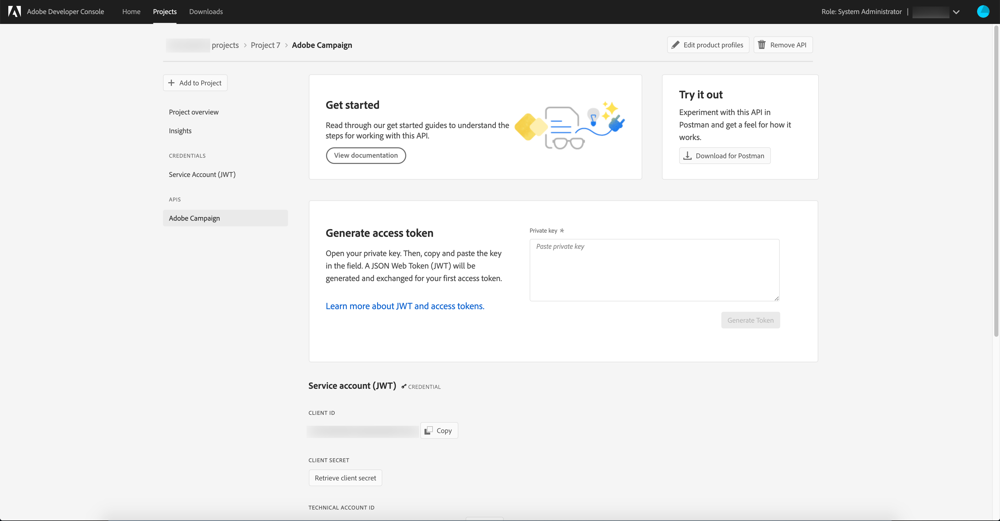

# Microsoft Dynamics 365 統合のAdobe Campaign StandardとAdobe I/Oの設定

この記事では、統合アプリケーションがデータにアクセスできるようにAdobe Campaign StandardとAdobe I/Oを設定する方法について説明します。

## Adobe Campaign Standardの設定 {#campaign-standard}

### プロファイル拡張機能

Adobe Campaign Standardで「プロファイル拡張機能」を有効にしてください。   これは、プロファイルリソースのカスタムフィールドを Microsoft Dynamics 365 から同期するために必要です。   これらを有効にする手順は次のとおりです。

1. 設定/管理/開発/公開に移動します。
1. 「公開を準備」をクリックして、公開を準備します。
1. 準備が完了したら、「Profiles &amp; Services Ext API の作成」をチェックし、「公開」をクリックします。

## Adobe I/O の設定 {#adobe-io}

Adobe I/Oを使用すると、Adobe Campaign Standardおよびその他のAdobe製品への API アクセスを有効にできます。   この記事では、Adobe Campaign Standardと Microsoft Dynamics 365 の統合にデータを同期させるためのAdobe I/Oの設定方法について説明します。

### 概要

この記事の統合前の設定を実行する前に、既にプロビジョニング済みで、組織のCampaign Standardインスタンスへの管理者アクセス権を持っていることを前提としています。  この問題が発生していない場合は、Adobeカスタマーケアに問い合わせて、Campaign のプロビジョニングを完了する必要があります。

>[!CAUTION]
>
>以下に説明する手順は、管理者が実行する必要があります。

### 設定

新しいAdobeI/O プロジェクトを作成し、統合用に設定する必要があります。

#### 新しいプロジェクトの作成

これをおこなうには、次の手順に従います。

1. [AdobeI/O コンソール ](https://console.adobe.io/home#) に移動し、画面の右上にあるドロップダウンメニューからAdobe IMS組織 ID を選択します。

1. 次に、**[!UICONTROL Quick Start]** の下の **[!UICONTROL Create new project]** をクリックします。

   

1. **[!UICONTROL Get started with your new project]** の下で、**[!UICONTROL Add API]** をクリックします。

   

1. Adobe Campaign API を選択し（下までスクロールする必要がある場合があります）、**[!UICONTROL Next]** をクリックします。

   

1. 次の画面では、独自の公開鍵をアップロードするか、AdobeI/O でキーペアを生成するかを選択できます。 これらの手順は、後者のオプションに従います。 AdobeI/O にキーペアを生成させる場合は、オプション 1 をクリックします。次に、「**[!UICONTROL Generate keypair]**」ボタンをクリックします。

   

1. 次の画面で、キーペア zip ファイルのダウンロード場所を指定し、名前を付けるよう求められます。

ダウンロードが完了したら、ファイルを解凍して、公開鍵と秘密鍵を表示できます。 AdobeI/O は、既に公開鍵をAdobeI/O プロジェクトに適用しています。 秘密鍵は後で保持する必要があります。秘密鍵は、統合ツールの統合前の設定時に使用されます。

1. **[!UICONTROL Next]** をクリックして続行します

   

1. 次の画面で、このプロジェクトに関連付ける製品プロファイルを選択します。 タイトルに「 」を含む製品プロファイルを選択します。Campaign インスタンスのテナント ID - [!UICONTROL Administrators]

   例：Campaign Standard- your-campaign-tenantID — 管理者

1. 「**[!UICONTROL Save configured API]**」をクリックします。

   

1. 次の画面に、新しいAdobeI/O プロジェクトの詳細が表示されます。 画面の左上にある **[!UICONTROL Add to Project]** をクリックし、ドロップダウンから **API** を選択します。

   

1. 次の画面で、I/O イベント API を選択し、**[!UICONTROL Next]** をクリックします。

1. 次の画面で **[!UICONTROL Save the configured API]** をクリックします。  プロジェクトの詳細画面に戻ります。

1. 画面の左上にある **[!UICONTROL Add to Project]** をクリックし、前におこなったように、ドロップダウンから **API** を選択します。

1. 次の画面で、I/O Management API を選択し、**[!UICONTROL Next]** をクリックします。

1. 次の画面で **[!UICONTROL Save the configured API]** をクリックします。

これで、Campaign の統合前の設定が完了しました。

**関連トピック**

* [AdobeI/O を Microsoft Dynamics 365 統合用に設](../../integrating/using/d365-acs-configure-adobe-io.md) 定する手順は、統合を設定する次の手順です
* [統合セルフサービスアプリケー](../../integrating/using/d365-acs-self-service-app-quick-start-guide.md) ションの概要には、統合を導入するための手順の完全なリストが含まれています。

* [AdobeIO — サービスアカウントの統合](https://www.adobe.io/authentication/auth-methods.html#!AdobeDocs/adobeio-auth/master/AuthenticationOverview/ServiceAccountIntegration.md)
* [Campaign Standard- API アクセスの設定](../../api/using/setting-up-api-access.md)
* [Campaign Standard- Dynamics 365 統合](../../integrating/using/d365-acs-configure-d365.md)
