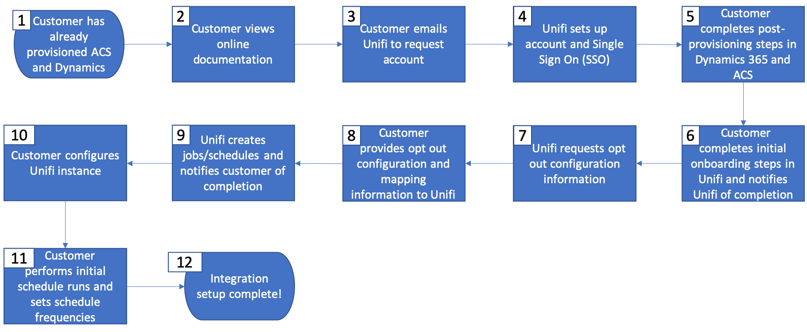

# Microsoft Dynamics 365との連携の概要

クロスチャネルコミュニケーションでCRM データをアクティベートする：Microsoft Dynamics 365からAdobe Campaignに連絡先を引き継ぎ、Adobe CampaignからMicrosoft Dynamics 365にキャンペーンパフォーマンスデータ（送信、開封、クリック、バウンス）を送り返す方法について説明します。

この統合には、次のソフトウェアバージョンが必要です。

* Microsoft Dynamics 365 for Sales Onlineのみ、最新バージョン

* Adobe Campaign Standard最新版

>[!CAUTION]
>
>この機能は、製品の一部として標準搭載はされていません。 実装するには、アドビのコンサルティングサービス部門に依頼する必要があります。 詳しくは、アドビ担当者にお問い合わせください。
>

## 原則

Adobe Campaign StandardとMicrosoft Dynamics 365の連携により、CRM システムで利用可能なあらゆる連絡先データを同期でき、キャンペーン活動で関連するあらゆる連絡先データを利用できるようになります。

逆に、Adobe Campaign Standard内のプロファイルがメッセージを操作すると、それらのデータ（送信、開封、クリック、バウンスなど）は自動的にMicrosoft Dynamics 365に流れ込み、連絡先記録とマーケティング活動の両方を維持できます。

統合では、Dynamics 365の[ カスタムエンティティ ](../../integrating/using/d365-acs-self-service-app-settings.md)を、Campaignの対応する&#x200B;**カスタムリソース**&#x200B;に同期することもサポートしています。

この統合は、次の4つの主要なユースケースをサポートするように設計されています。

1. Dynamics 365からCampaignに連絡先を同期して、マーケティングキャンペーンでターゲットにできるようにします
1. カスタムエンティティをDynamics 365からCampaignに同期して、セグメント化やパーソナライゼーションに使用できるようにする
1. CampaignからDynamics 365にメールマーケティングイベント（送信、開封、クリック、バウンス）を送信して、Dynamics 365 インターフェイスのセールスリポジトリに表示する
1. 顧客のプライバシー設定を維持するために、Dynamics 365とCampaignの間でオプトアウトのステータス（電子メールを送信しないなど）を同期する。

主なメリットは次のとおりです。

* 営業部門とマーケティング部門の一貫したメッセージ：Dynamics 365とのAdobe Campaign Standard統合により、両方のシステムから顧客のinsightにアクセスし、メールマーケティング履歴を確認できるため、顧客へのあらゆるメッセージで同じ一貫したメッセージを共有できます。

* あらゆる見込み客と顧客のデータを包括的に把握：Adobe Campaign StandardとDynamics 365を統合することで、CRM システム内で各コンタクトのメールマーケティング履歴を共有し、それにアクセスすることができます。

* 任意のチャネルでDynamics 365 データをアクティベートする：連絡先データをAdobe Campaignに同期することで、Campaignを使用して、モバイルプッシュ、アプリ内、電子メール、ダイレクトメールなど、オンラインまたはオフラインのあらゆるチャネルでコミュニケーションを送信できます。 各連絡先の好みのチャネルに関係なく、キャンペーンを「カバーしました」。

>[!CAUTION]
>
>この統合では、Dynamics 365を連絡先とカスタムエンティティの同期のための信頼できる唯一の情報源と見なします。  同期属性の変更は、Adobe Campaign StandardではなくDynamics 365で行う必要があります。  Campaignで変更を行うと、同期中に上書きされる可能性があります。
>

## Microsoft Dynamics 365統合を導入するための主な手順{#request-and-implement-this-integration}

この統合をプロビジョニングするには、次の手順に従う必要があります。

以下のフローチャートとフローチャートの詳細に従って、統合をリクエストおよび設定してください。

フローチャートの詳細（上記の手順にマップ）:

* **手順1** – お客様は、セールスおよびAdobe Campaign Standard向けMicrosoft Dynamics 365のライセンスを既に保有しているか、現在購入中であると見なされます。
* **手順2** – 標準の統合機能は、すべてのお客様が無料で利用できます。ただし、必要に応じて追加コストが適用される場合があります。 [ ベストプラクティスと制限事項](../../integrating/using/d365-acs-notices-and-recommendations.md)について詳しく説明します。 元のSOに含まれていない場合、統合を利用するには、新しい販売注文（SO）に署名する必要があります。
* **手順3** - Dynamics 365とCampaignの事前統合手順を完了します。 [この統合の設定](#configure-this-integration)を参照してください。
* **手順4** - Adobe オンボーディングチームから、統合アプリケーションユーザーインターフェイス （UI）へのアクセス権が提供されます。
* **手順5** - データマッピング、置換、フィルターなどを設定し、統合アプリケーション UI内から統合をテストできます。

  >[!IMPORTANT]
  >
  > 双方向またはCampaignからDynamics 365へのオプトアウト設定が必要な場合は、Campaign インスタンスで設定するオプトアウトワークフローについて、Adobeの技術担当者にリクエストする必要があります。 [詳細情報](../../integrating/using/d365-acs-notices-and-recommendations.md#opt-out)。

### この統合を設定 {#configure-this-integration}

この統合のために3つのシステムをプロビジョニングして設定する必要があります。

* **Adobe Campaign Standard**: API アクセスを設定し、統合ツールの新しい統合を設定する必要があります。 これを実現するには、[この記事](../../integrating/using/d365-acs-configure-adobe-io.md)を参照してください。
* **Microsoft Dynamics 365**：新しいアプリ登録を作成し、アプリケーションユーザーが統合を使用できるようにする必要があります。  この統合にMicrosoft Dynamics 365を設定するには、[この記事](../../integrating/using/d365-acs-configure-d365.md)を参照してください。
* **Adobe Campaign StandardとMicrosoft Dynamics 365 セルフサービスアプリ**&#x200B;の統合：[この記事](../../integrating/using/d365-acs-self-service-app-control-access.md)の手順に従う必要があります。

>[!IMPORTANT]
>
>各システムについて、これらの手順は&#x200B;**管理者**&#x200B;が実行する必要があります。
>
>このドキュメントの手順では、権限の割り当てや管理者アクセスに関連する統合／登録の作成手順を説明します。  お客様の責任として、事前に会社のポリシーに従って手順を確認し、慎重に実行する必要があります。
>

### サポートを依頼

サポートチケットは、Adobe カスタマーケアで記録できます。

統合データフローに関する問題がある場合は、次の情報を必ず含めてください。

* **プロセス所有者**: エンジニアリング アーキテクト
* **ES プロセス ID**: オンボーディングプロセス中に指定されました
* **プロセスタイトル**: Microsoft Dynamics 365 / Adobe Campaign Standardとの連携
* **問題説明**：問題の説明

統合サポートの対象は現在24時間週5日です（Adobeの休日と休業期間を除く、月曜日から金曜日まで利用可能）。
