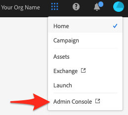
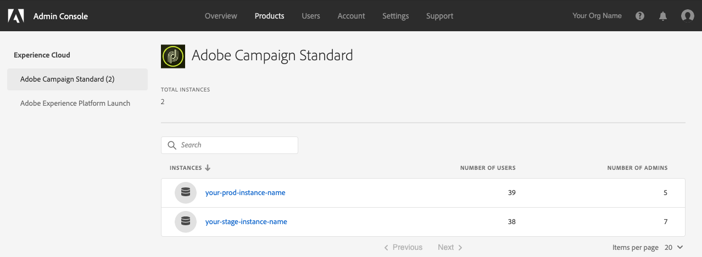
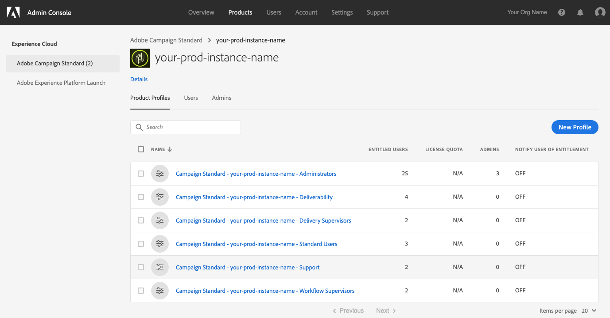
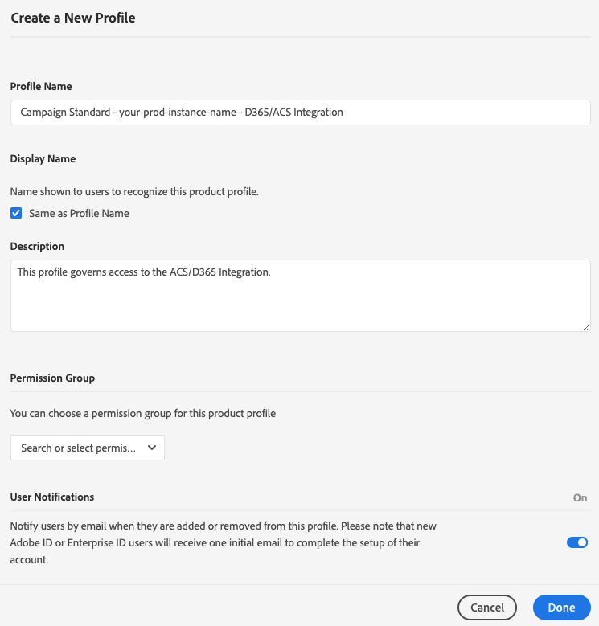
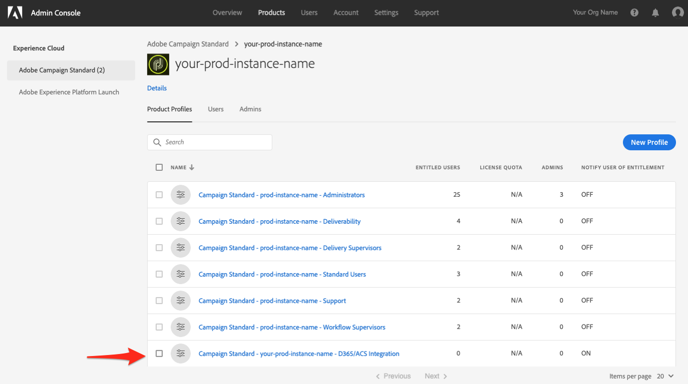
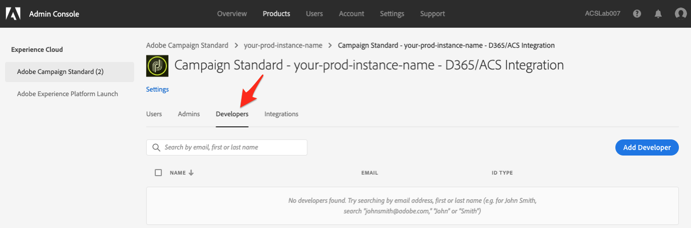

# Microsoft Dynamics 365 セルフサービスアプリでのAdobe Campaign Standard統合へのアクセス

この設定では、Experience Cloud（EC）管理者と連携する必要があります。 これらは、セルフサービス統合アプリケーションインターフェイスへのアクセスを許可するために必要な最初の手順です。 ツールにアクセスできたら、データへの接続を設定し、Adobe CampaignとMicrosoft Dynamics 365間のデータフローを設定します。

>[!NOTE]
>
>Adobe担当者に連絡し、Adobe Campaign Standardの組織名とインスタンス名を指定する必要があります。 統合アプリが組織で有効になるようにリクエストするために、チケットがログに記録されます。

## 製品プロファイルの追加

この節では、Microsoft Dynamics 365 セルフサービスアプリでAdobe Campaign Standard統合へのアクセス権を付与する方法について説明します。 Adobe Experience Cloudで組織にアクセスできるユーザーは、以下の手順に従ってアクセス権を付与しない限り、統合セルフサービスアプリにアクセスできません。

>[!IMPORTANT]
>
> これらの手順を実行するには、組織のExperience Cloudで&#x200B;**Administrator**&#x200B;の役割が必要です。
>

1. https://experience.adobe.com/を参照し、Adobe Experience Cloudにログインします。
1. **Admin Console**&#x200B;にアクセスします。

   

1. **[!UICONTROL Products]**&#x200B;をクリックして、Experience Cloud ソリューションにアクセスします。

   

   >[!IMPORTANT]
   >
   >この節の残りの手順は、Campaign インスタンス（開発、テキスト、実稼動）ごとに実行されます。
   >

1. 最初のインスタンスをクリックして設定します。

   

   インスタンスページは次のようになります。

   

1. 「**[!UICONTROL New Profile]**」ボタンをクリックし、**Campaign Standard - your-prod-instance-name - D365/ACS Integration**&#x200B;という名前の新しいエントリを追加します。

   * リストにこのエントリが表示された場合は、続行する必要はありません。 左側のメニューで「**Adobe Campaign Standard**」をクリックし、他のCampaign インスタンスを確認します。

   * 「your-prod-instance-name」をインスタンスの実際の名前に置き換えてください。

1. **[!UICONTROL Permission Group]** ドロップダウンはデフォルト値のままにできます。

1. エントリが次のようになっている場合は、「**[!UICONTROL Done]**」ボタンをクリックします。

   

   新しい製品プロファイルが追加されました。

   

## ユーザーへのアクセスの許可 {#add-users-to-profile}

**[!UICONTROL Products]** ページから、Campaign インスタンスを選択し、次の手順に従います。

1. 以前に作成した新しいプロファイルをクリックします。**Campaign Standard - your-prod-instance-name - D365/ACS Integration**

   

1. 「**[!UICONTROL Developers]**」タブをクリックします。

   

1. 「**[!UICONTROL Add Developer]**」ボタンをクリックします

1. 追加するユーザーの名前または電子メールアドレスを入力します。  ユーザーに一致する結果を選択します。

   ユーザーが初めて組織に追加される場合は、詳細を入力します。

1. 「**[!UICONTROL Save]**」をクリックして確定します。
