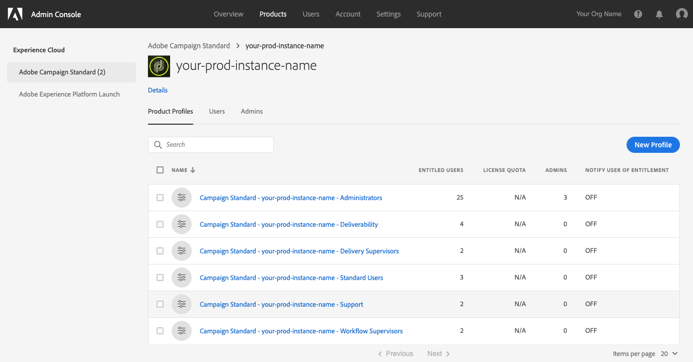

# Microsoft Dynamics 365 セルフサービスアプリとのAdobe Campaign Standard統合へのアクセス

この設定では、組織のExperience Cloud(EC) 管理者と連携する必要があります。 これらは、セルフサービス統合アプリケーションインターフェイスにアクセスするために必要な最初の手順です。 ツールにアクセスできたら、データへの接続を設定し、Adobe CampaignとMicrosoft Dynamics 365 間のデータのフローを設定します。

>[!NOTE]
>
>Adobe担当者に連絡し、Adobe Campaign Standard組織とインスタンス名を提供する必要があります。 チケットがログに記録され、組織で統合アプリを有効にするようリクエストされます。

## 製品プロファイルの追加

この節では、Microsoft Dynamics 365 セルフサービスアプリとのAdobe Campaign Standard統合へのアクセス権を付与する方法について説明します。 Adobe Experience Cloudで組織にアクセス権を持つユーザーは、次の手順に従ってアクセス権を付与しない限り、統合セルフサービスアプリにアクセスできません。

>[!IMPORTANT]
>
> これらの手順には、 **管理者** 組織のExperience Cloud内での役割。
>

1. https://experience.adobe.com/を参照し、Adobe Experience Cloudにログインします。
1. 次にアクセス： **Admin Console**.

   

1. クリック： **[!UICONTROL Products]** をクリックして、Experience Cloudソリューションにアクセスします。

   

   >[!IMPORTANT]
   >
   >この節の残りの手順は、Campaign インスタンス（開発、テキスト、実稼動）ごとに実行されます。
   >

1. 設定する最初のインスタンスをクリックします。

   

   インスタンスページは次のようになります。

   

1. 次をクリック： **[!UICONTROL New Profile]** ボタンをクリックし、次の名前の新しいエントリを追加します。 **Campaign Standard- your-prod-instance-name - D365/ACS 統合**

   * このエントリがリストに表示されている場合は、続行する必要はありません。 クリック： **Adobe Campaign Standard** 左側のメニューで、他の Campaign インスタンスを確認します。

   * 「your-prod-instance-name」は、必ずインスタンスの実際の名前に置き換えてください。

1. この **[!UICONTROL Permission Group]** ドロップダウンにデフォルト値が表示されます。

1. 次のようなエントリが表示された場合は、 **[!UICONTROL Done]** 」ボタンをクリックします。

   

   新しい製品プロファイルが追加されました。

   

## ユーザーへのアクセスの許可 {#add-users-to-profile}

次から： **[!UICONTROL Products]**  ページで、Campaign インスタンスを選択し、次の手順に従います。

1. 前に作成した新しいプロファイルをクリックします。  **Campaign Standard- your-prod-instance-name - D365/ACS 統合**

   

1. をクリックします。 **[!UICONTROL Developers]** タブをクリックします。

   

1. をクリックします。 **[!UICONTROL Add Developer]** ボタン

1. 追加するユーザーの名前または電子メールアドレスを入力します。  ユーザーに一致する結果を選択します。

   これが初めてユーザーが組織に追加される場合は、詳細を入力します。

1. 「**[!UICONTROL Save]**」をクリックして確定します。
