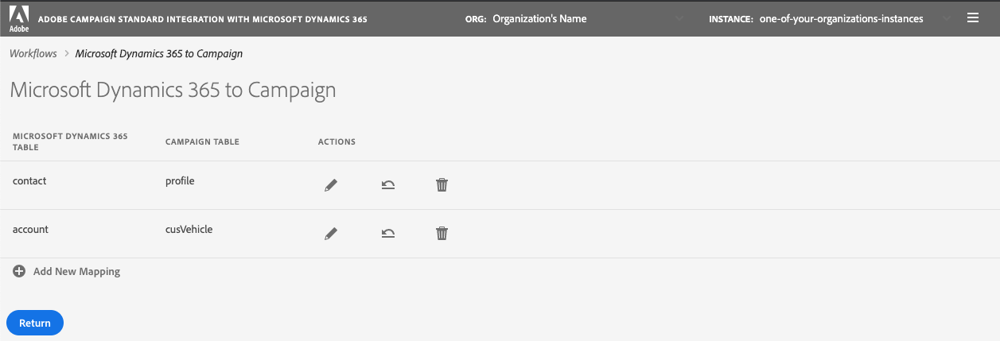
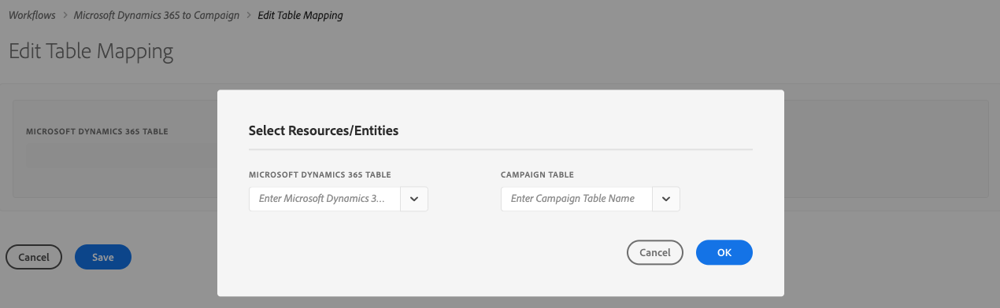
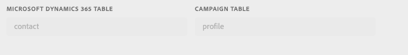
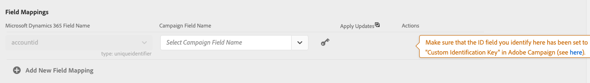
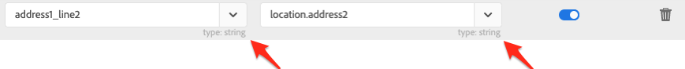
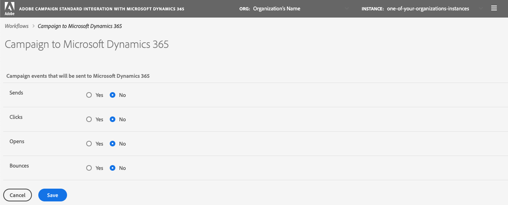
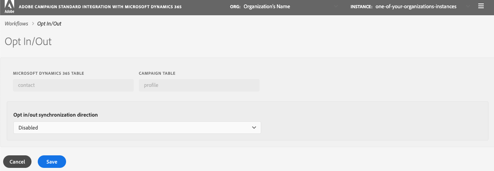

# データの同期

Microsoft Dynamics 365からCampaignおよびCampaign マーケティング指標にテーブルをMicrosoft Dynamics 365に同期できます。 同期は、3つの専用テクニカルワークフロー（**[!UICONTROL Microsoft Dynamics 365 to Campaign]**、**[!UICONTROL Campaign to Microsoft Dynamics 365]**、**[!UICONTROL Opt-In/Out]**）を通じて実行されます。 この節では、[詳細情報](../../integrating/using/d365-acs-self-service-app-workflows.md)を参照してください。

>[!IMPORTANT]
>変更を考慮に入れるには、**[!UICONTROL Microsoft Dynamics 365 to Campaign]** ワークフローを停止または開始する必要があります。 [詳細情報](../../integrating/using/d365-acs-self-service-app-workflows.md)
>

## Microsoft Dynamics 365からCampaignへのテーブルのマッピング

**[!UICONTROL Microsoft Dynamics 365 to Campaign]** ページには、Microsoft Dynamics 365のエンティティのリストと、それらが同期されるAdobe Campaignのカスタムリソースが表示されます。 新しいマッピングを追加したり、既存のマッピングを編集または削除したりできます。

以下に、この表の各列の説明を示します。

* **[!UICONTROL MICROSOFT DYNAMICS 365 TABLE]**：この列は、マッピングのデータ ソースとなるMicrosoft Dynamics 365のエンティティを特定します。

* **[!UICONTROL CAMPAIGN TABLE]**：この列は、Adobe Campaignのどのリソースがマッピングのデータの宛先になるかを特定します。

* **[!UICONTROL ACTIONS]**：可能なアクションを以下に示します：

   * このマッピングを編集するには、**[!UICONTROL Edit]** アイコンをクリックします。

   * テーブル マッピングを削除するには、**[!UICONTROL Delete]** アイコンを使用します。

   * **[!UICONTROL Replay Data]** アイコンをクリックして、Microsoft Dynamics 365 テーブル内のすべてのデータを再同期します。 通常、統合アプリケーションは、最近変更されたMicrosoft Dynamics 365のデータのみを同期します。  ただし、場合によっては（変更やミスなど）、すべてのデータを再同期したい場合があります。  この場合、このボタンをクリックすると、次回&#x200B;**[!UICONTROL Microsoft Dynamics 365 to Campaign]** ワークフローを停止または開始すると、データの同期が開始されます。

     「**[!UICONTROL Replay Data]**」ボタンをクリックしてチェックが成功すると、このアイコンは無効になります。このテーブルマッピングペアのデータが、**[!UICONTROL Microsoft Dynamics 365 to Campaign]** ワークフローの次の実行と再同期されることを示します。

     次の条件に当てはまる場合、データを再生することはできません。

      * **[!UICONTROL Microsoft Dynamics 365 to Campaign]** ワークフローに関連付けられているバックログ指標に2,000,000件以上の項目がある場合（**[!UICONTROL Workflows]** ページに表示）
      * Microsoft Dynamics 365 テーブルに2,000,000以上のレコードがある場合

     再同期が必要なレコードの数は異なります。 レコード数が多い場合は、同期プロセスを完了するのに時間がかかる場合があります。 統合アプリケーションが同期プロセスを完了するために動作するので、**[!UICONTROL Workflows]** ページの&#x200B;**[!UICONTROL Backlog]**&#x200B;指標を参照してください。

     >[!IMPORTANT]
     >
     > Adobe Campaign StandardまたはMicrosoft Dynamics 365に変更を公開する場合は、統合ワークフローを停止することを強くお勧めします。 適用可能な変更には、リソース/エンティティ（および関連するフィールド）、リンク、識別子の列など、統合で現在使用されている更新が含まれます。
     >

## 新しいマッピングの作成 {#add-a-new-mapping}

新しいマッピングを作成するには、次の手順に従います。

1. **[!UICONTROL Microsoft Dynamics 365 to Campaign]** ページで、「**[!UICONTROL Add New Mapping]**」ボタンをクリックします。

1. ドロップダウンリストを使用して、マッピングするMicrosoft Dynamics 365およびCampaign テーブルを選択します。
ページのその他の入力のほとんどは、選択したテーブルに依存します。

   

   >[!NOTE]
   >各テーブルを複数回マッピングすることはできません。 したがって、ドロップダウン選択には、既にマッピングされているテーブルが含まれていないことがわかります。

1. 「**[!UICONTROL OK]**」をクリックして確認します。選択したテーブルに関連付けられているフィールド情報を読み取るには、アプリケーションに短い時間が必要です。

その後、マッピング設定を続行できます。 [詳細情報](#new-mapping-settings)

>[!IMPORTANT]
>
>最初にマッピングを追加する際にのみ、このページのテーブルを選択できます。 **[!UICONTROL Save]** ボタンをクリックする前に、正しいテーブルを選択していることを確認してください。保存すると、テーブル選択フィールドは&#x200B;**読み取り専用**&#x200B;になります。

### 既存のマッピングの編集

既存のマッピングを編集すると、テーブルの選択が編集できないことがわかります。

これは、ページの下部にある入力が、これらのテーブルに関連付けられたフィールドに基づいているため、意図的に行われています。 テーブルを変更すると、これらのテーブルに関連付けられているすべてのフィールドが無効になります。  テーブルをに変更する場合は、前のページに戻り、変更するマッピングを削除し、新しいマッピングを追加する必要があります。

### 個々のテーブルマッピングの設定 {#new-mapping-settings}

この節では、1つのAdobe Campaign テーブルに1つのMicrosoft Dynamics 365 テーブルを&#x200B;**single** マッピングする方法について説明します。

次の設定を定義できます。

* **[!UICONTROL Tables]**：このセクションには、Microsoft Dynamics 365 テーブルの名前と、マッピング先のCampaign テーブルが一覧表示されます。
* **[!UICONTROL Field Mappings]**：詳細については、[このセクション &#x200B;](#field-mappings)を参照してください
* **[!UICONTROL Field Replacements]**：詳細については、[このセクション &#x200B;](#field-replacements)を参照してください
* **[!UICONTROL Filters]**：詳細については、[このセクション &#x200B;](#filters)を参照してください
* **[!UICONTROL Advanced Settings]**：詳細については、[このセクション &#x200B;](#advanced-settings)を参照してください

### フィールドマッピング {#field-mappings}

#### プライマリキー

新しいMicrosoft Dynamics 365をCampaign テーブルマッピングに追加する場合は、ID フィールドを特定する必要があります。

Microsoft Dynamics 365のプライマリキーは、アプリケーションが検出するため、読み取り専用です。

Campaignの場合、一意のキーとなるフィールドを選択する必要があります。 [CRM ID カスタムリソース &#x200B;](../../developing/using/uc-calling-resource-id-key.md)として設定する必要があり、重複を持たない必要があります。

>[!NOTE]
>
>テーブルのID フィールドは、**[!UICONTROL Add New Mapping]**&#x200B;を選択した場合にのみ選択できます。 「編集」ボタンをクリックして既存のテーブルマッピングを編集すると、ID フィールドは読み取り専用になります。

プライマリキーは、常に&#x200B;**[!UICONTROL Field Mappings]** セクションに記載されている最初のフィールド名になります。 次のアイコンは、プライマリキーであることを思い出させるために右側に表示されます。

#### 他のフィールドマッピングの追加

**[!UICONTROL Field Mappings]** セクションでは、プライマリキー以外のフィールドマッピングを追加できます。 Microsoft Dynamics 365からAdobe Campaignにフィールドの新しいマッピングを追加するには、「**[!UICONTROL Add new field mapping]**」ボタンをクリックします。

リストからMicrosoft Dynamics 365とCampaign フィールドを選択します。

これらのリストには、ページの上部で選択したMicrosoft Dynamics 365およびCampaign テーブルに関連付けられているフィールド名が含まれています。

**[!UICONTROL Apply updates]** スイッチャーを使用すると、このフィールドの更新をMicrosoft Dynamics 365からCampaignに反映するかどうかを制御できます。
* がオンになっている場合、更新が発生すると、Microsoft Dynamics 365の値に対する更新がAdobe Campaignに反映されます。

* をオフにすると、データが最初に読み込まれる（または再生される）ときに値が反映されますが、Microsoft Dynamics 365のフィールドに対する増分更新は反映されません。

>[!NOTE]
>
>**[!UICONTROL Apply updates]**&#x200B;列の見出しをクリックして、スイッチの&#x200B;**すべての**&#x200B;をオンまたはオフに更新します。
>

フィールド値を選択すると、ドロップダウンメニューの下にデータタイプが表示されます。   これは、あるフィールドから別のフィールドに値をマッピングする際に考慮すべき点です。

>[!NOTE]
>
> 複数のMicrosoft Dynamics 365 フィールドを1つのCampaign フィールドにマッピングすることはできません。

### フィールドの置換 {#field-replacements}

**[!UICONTROL Add New Field Replacement]** ボタンを使用して、新しいフィールドの置換を定義します。

フィールドの置き換えにより、次の項目を特定できます。

* Microsoft Dynamics 365 フィールド名（フィールドマッピングの節で上記に追加されています）。
* 既存の値（Microsoft Dynamics 365に存在）、および
* Adobe Campaignに書き込む新しい値

ピックリスト、列挙、およびブール値のドロップダウンリストが提供されます。 テキストボックスは、他の文字列や数値の型に使用されます。

### フィルター {#filters}

**[!UICONTROL Add New Filter]** ボタンを使用して、Campaignに反映するMicrosoft Dynamics 365 レコードを選択します。 フィルターに追加するレコードに関連付けられているフィールドを選択できます（フィールド名をフィールドマッピングに追加する必要はありません）。

フィルターを指定するには、次の情報を入力します。

* Microsoft Dynamics 365 フィールド名
* 比較値、および
* 値（Microsoft Dynamics 365から）
フィールド名、比較、値が特定のレコードに対してtrueと評価される場合、レコードはAdobe Campaignに反映されます。

これらのフィルターの評価方法を選択するには、**[!UICONTROL Choose the filter comparison operator]**&#x200B;というラベルの付いた入力を設定します。  **And**&#x200B;を選択した場合、レコードをCampaignに反映するには、すべてのフィルターがtrueである必要があります。 **または**&#x200B;を選択すると、いずれかのレコードがtrueと評価された場合、レコードが反映されます。

オプション **[!UICONTROL Do you want to delete records in Adobe Campaign Standard that will be filtered out from Microsoft Dynamics 365?]**&#x200B;は、フィルタリングされたレコードをCampaignから削除するかどうかを制御します。 **No**&#x200B;を選択すると、レコードはAdobe Campaignに残ります。 統合ロジックによって削除するには、**はい**&#x200B;を選択します。

>[!NOTE]
>
> フィルターが追加されない場合、変更されたすべてのレコードがAdobe Campaignに反映されます。
>

### 詳細設定 {#advanced-settings}

マッピングを設定する際に、次の追加オプションを設定できます。

* Microsoft Dynamics 365で発生した削除を（フィールド名マッピングに基づいて）Adobe Campaignの対応するフィールドに反映する場合は、**[!UICONTROL Apply deletes in Microsoft Dynamics 365 to Campaign?]** オプションを&#x200B;**Yes**&#x200B;に設定します。 Microsoft Dynamics 365での削除を無視するには、**No**&#x200B;を選択します。

* CampaignにMicrosoft Dynamics 365の選択リストに関連付けられた表示値を反映する場合は、**[!UICONTROL Use technical values in Microsoft Dynamics 365 picklists?]** オプションを&#x200B;**No**&#x200B;に設定します。 **Yes**&#x200B;を選択して、技術的価値を反映します。

## Campaign マーケティングイベントをMicrosoft Dynamics 365に同期する

**[!UICONTROL Campaign to Microsoft Dynamics 365]** ページでは、Adobe CampaignからMicrosoft Dynamics 365にマッピングされるメールマーケティングイベントを特定できます。

制御できる4つの指標は、**送信**、**クリック**、**開封数**、および&#x200B;**バウンス**&#x200B;です。

**はい**&#x200B;を選択して、その種類のイベントがMicrosoft Dynamics 365に流れるようにすることを確認します。

これらの電子メールイベントフローの詳細については、[ここ](../../integrating/using/d365-acs-self-service-app-workflows.md)をクリックしてください。

## オプトイン/オプトアウトワークフロー {#opt-in-out-wf}

**オプトイン/オプトアウト** ワークフローを使用すると、Microsoft Dynamics 365とAdobe Campaign間のオプトイン/オプトアウト情報の流れを特定できます。 これは、データがMicrosoft Dynamics 365 エンティティ「連絡先」およびAdobe Campaign リソース「プロファイル」に関連付けられていることを前提としています。

オプトアウト管理について詳しくは、[この節](../../integrating/using/d365-acs-notices-and-recommendations.md#opt-out)を参照してください。

「保存」をクリックして選択を保存する必要があることを忘れないでください。 また、**CampaignからMicrosoft Dynamics 365**&#x200B;へのワークフローを停止し、「再生」をクリックして統合を実行して、変更内容を組み込む必要があることも覚えておいてください。

### オプトイン/オプトアウト同期方向

データの同期に使用できるオプションのリストを以下に示します。

* **[!UICONTROL Disabled]**：このオプションを選択すると、Adobe CampaignとMicrosoft Dynamics 365の間でオプトイン/オプトアウト情報が移動しません。

* **[!UICONTROL Unidirectional (Microsoft Dynamics 365 to Campaign)]**：このオプションは、Microsoft Dynamics 365からAdobe Campaignへのオプトイン/アウトのフローにのみ使用されます。 統合アプリケーションでは、この画面でフローを設定することはできません。代わりに、**[!UICONTROL Save button]**&#x200B;をクリックし、**[!UICONTROL Microsoft Dynamics 365 to Campaign]** ワークフローに移動します。 このワークフローでは、連絡先/プロファイルテーブルのマッピングを編集して、オプトインフィールド/アウトフィールドのマッピング方法を指定できます。

* **[!UICONTROL Unidirectional (Campaign to Microsoft Dynamics 365)]**：このオプションを選択すると、**マッピング** セクションが表示されます。 これらの入力を使用すると、どのAdobe Campaign フィールドがMicrosoft Dynamics 365のどのフィールドにデータをマッピングするかを定義できます。 つまり、Microsoft Dynamics 365で値を手動で更新した場合、その値が変更された場合、その値はAdobe Campaign値によって上書きされます。

* **[!UICONTROL Bidirectional]**：このオプションを選択すると、**マッピング** セクションが表示されます。 これらのペアは、Microsoft Dynamics 365とAdobe Campaignで相互にマッピングされるフィールドを識別します。 [詳細情報](../../integrating/using/d365-acs-notices-and-recommendations.md)。

### マッピング

このセクションは、オプトイン/アウト同期方向フィールドが&#x200B;**[!UICONTROL Unidirectional (Campaign to Microsoft Dynamics 365)]**&#x200B;または&#x200B;**[!UICONTROL Bidirectional]**&#x200B;に設定されている場合にのみ適用されます。 Microsoft Dynamics 365のどのフィールドをAdobe Campaignのどの入力にマッピングするかを定義できます。

Microsoft Dynamics 365 フィールド名には、**ブール値**&#x200B;型のすべてのフィールド名が含まれます。

Adobe Campaign フィールド名は、オプトイン/オプトアウトに固有の固定された値セットです。 Adobe Campaign フィールド名は、オプトイン/オプトアウトに固有の固定された値セットです。 **このリストの値セットを変更できません**。
