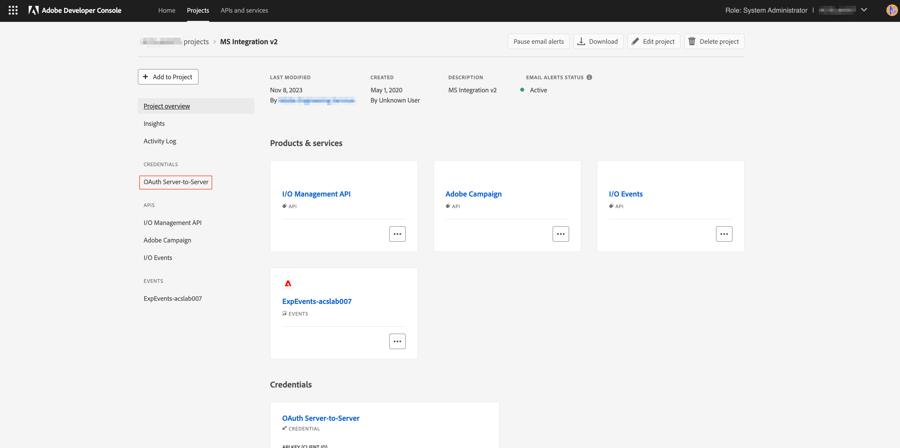

# JWT から OAuth へのサーバー間での資格情報の移行

サービスアカウント（JWT）資格情報は廃止され、新しい OAuth サーバー間資格情報に置き換わりました。 新しい資格情報により、Adobe アプリケーションのメンテナンスが容易になります。 また、証明書を定期的にローテーションする必要がなくなり、標準の OAuth2 ライブラリを使用してすぐに機能します。

サービスアカウント（JWT）資格情報は廃止予定としてマークされていますが、2025 年 1 月 1 日（PT）まで引き続き機能します。 したがって、2025 年 1 月 1 日（PT）より前に、新しい OAuth サーバー間資格情報を使用するように統合を移行する必要があります。 詳しくは、[&#x200B; 非推奨タイムライン &#x200B;](https://developer.adobe.com/developer-console/docs/guides/authentication/ServerToServerAuthentication/migration/#deperecation-timelines) を確認してください

## JWT から OAuth サーバー間で資格情報を移行する手順

OAuth サーバー間資格情報への移行は、アプリケーションのダウンタイムなしの移行を可能にするシンプルなプロセスです。 次の手順に従って、資格情報を移行できます。

1. [Adobe Developer Console](https://developer.adobe.com/console) にログインします
2. 左側のフィルタリングメニューから、「サービスアカウント（JWT）資格情報を持つ」オプションを選択します。 この方法では、サービスアカウント（JWT）資格情報を持つすべてのプロジェクトが表示されます。 プロジェクトのリストで、移行するプロジェクトをクリックします。

   

3. 左側のナビゲーションから「サービスアカウント （JWT）資格情報」タブを開き、移行カードを表示します。 移行カードで、「**新しい資格情報を追加**」ボタンをクリックして、同等の OAuth サーバー間資格情報を追加します。 OAuth サーバー間資格情報をプロジェクトに追加すると、移行が開始されます。
   
4. 新しい資格情報 **OAuth サーバー間** が左側のナビゲーションに追加されます。
   * 移行をキャンセルする場合は、「移行をキャンセル」をクリックします。
   * 新しい資格情報 OAuth サーバー間で認証が機能しているかどうかを確認するまでは、「確認して削除」ボタンをクリックしないでください。
     

5. Microsoft Dynamics 365 の資格情報をAdobe Campaign Standard アプリに更新します。
   * 統合アプリにログインし、設定ページに移動します。
   * 認証タイプとして「OAuth」を選択します。
   * 新しい OAuth サーバー間資格情報は、古いサービスアカウント（JWT）資格情報と同じ資格情報を使用するので、ほとんどのフィールドは既に入力されています。
   * クライアント ID とクライアント秘密鍵を入力します。 これらは、Adobe Developer Consoleのプロジェクトにあります。
   * 「保存」をクリックして、設定を保存します。
     

6. 新しい資格情報が機能しているかどうかを確認
   * 統合アプリにログインし、ワークフローページに移動します。
   * アクティブなワークフローを停止 ワークフローが停止するまで待ちます。
   * ワークフローを開始します。 ワークフローが実行中状態になるまで待ちます。
   * ワークフローが正しく動作していることを確認するため、ワークフローを数分間監視します。 また、Adobe Campaign StandardおよびMicrosoft Dynamics 365 でデータをチェックして、データが正しく同期されていることを確認することもできます。

7. JWT 資格情報を削除して移行を完了します
   * [Adobe Developer Console](https://developer.adobe.com/console) にログインします
   * プロジェクトをクリックし、移行したプロジェクトを選択します。
   * 左側のナビゲーションから「サービスアカウント （JWT）資格情報」タブをクリックします。
   * 「確認と削除」ボタンをクリックします。
     
   * 最後のアクセス メニューまたは最後に使用されたメニューのタイムスタンプを確認し、統合アプリが新しい OAuth 資格情報を使用してアクセストークンを生成しているか、古い JWT 資格情報を引き続き使用しているかを検証します。
     
   * 統合アプリが新しい OAuth 認証情報を使用しており、JWT 認証情報を使用していないことを確認したら、「**確認して続行**」ボタンをクリックして古い認証情報を削除し、移行を完了します。
     
