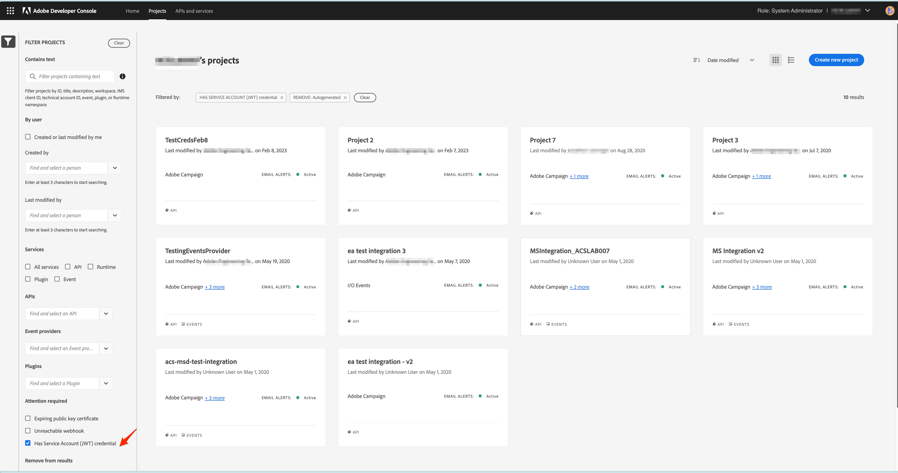
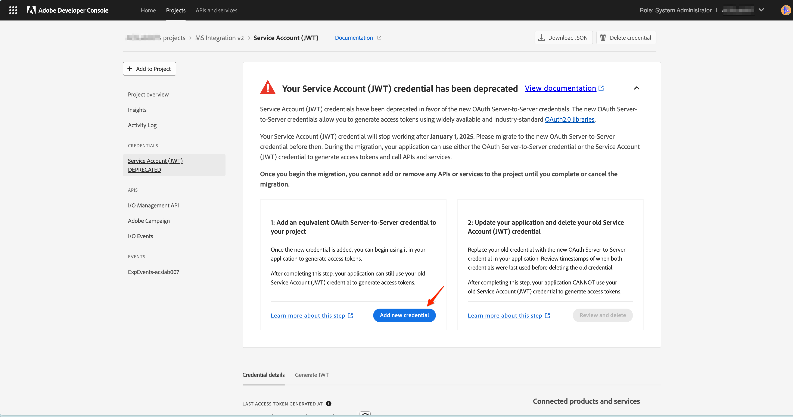
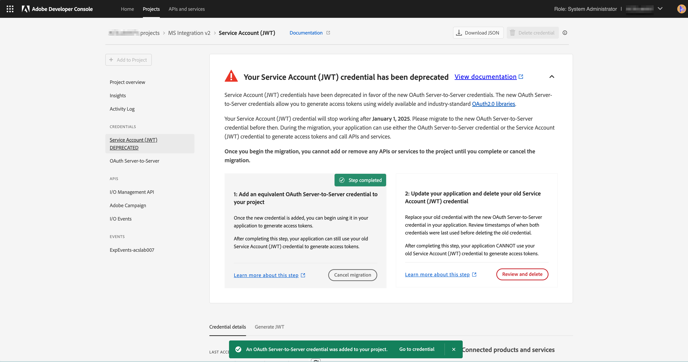
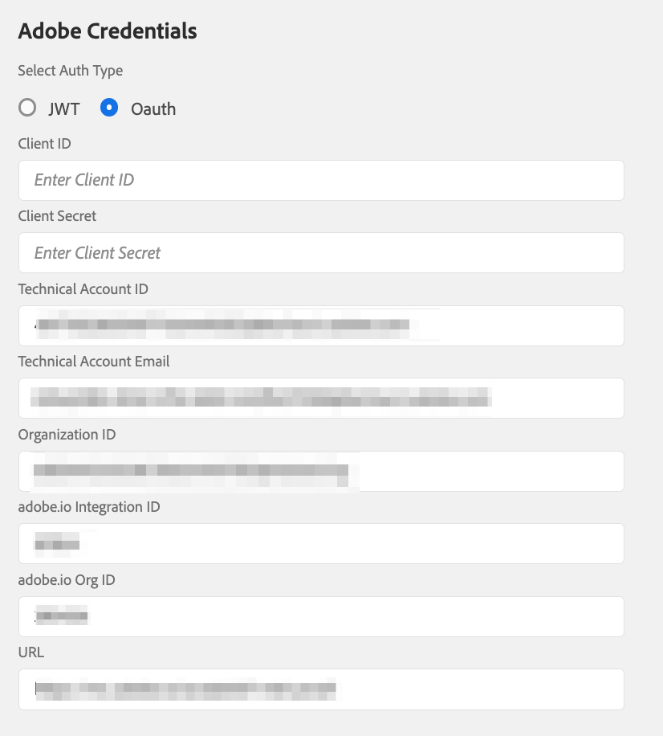
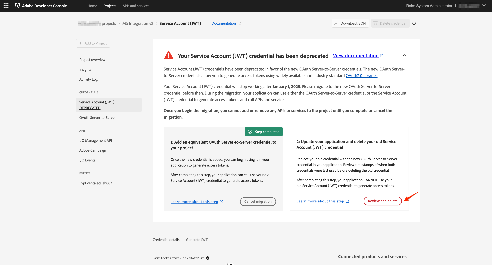
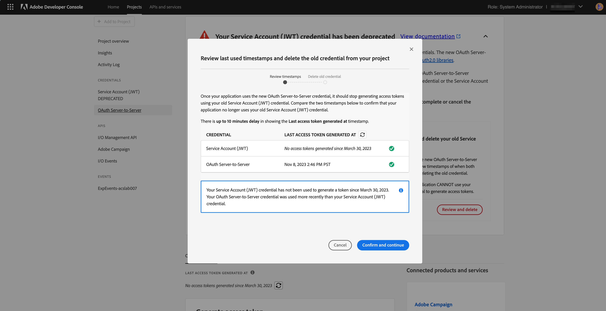
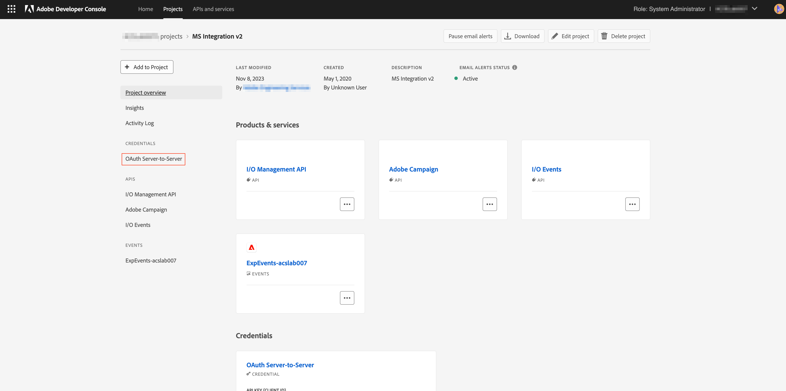

# JWT から OAuth へのサーバー間での資格情報の移行

新しいOAuth サーバー間資格情報のために、サービスアカウント （JWT）資格情報が非推奨になりました。 新しい資格情報を使用すると、Adobe アプリケーションの保守が簡単になります。 また、証明書を定期的にローテーションする必要がなくなり、標準のOAuth2 ライブラリを使用してすぐに使用できます。

サービスアカウント（JWT）資格情報は非推奨とマークされていますが、2025年1月1日まで引き続き機能します。 したがって、2025年1月1日より前に、新しいOAuth サーバー間資格情報を使用するように統合を移行する必要があります。 詳しくは、[非推奨タイムライン &#x200B;](https://developer.adobe.com/developer-console/docs/guides/authentication/ServerToServerAuthentication/migration/#deperecation-timelines)を確認してください

## JWTからOAuth サーバー間で資格情報を移行する手順

OAuth サーバー間の資格情報への移行は、アプリケーションのダウンタイムのない移行を可能にするシンプルなプロセスです。 資格情報を移行するには、次の手順に従います。

1. [Adobe Developer Console](https://developer.adobe.com/console)にログインします
2. 左側のフィルタリングメニューから、「サービスアカウント（JWT）資格情報を持つ」オプションを選択します。 これにより、サービスアカウント（JWT）資格情報を持つすべてのプロジェクトが表示されます。 プロジェクトのリストから、移行するプロジェクトをクリックします。

   

3. 左側のナビゲーションから「サービスアカウント（JWT）資格情報」タブを開き、移行カードを表示します。 移行カードで、「**新しい資格情報を追加**」ボタンをクリックして、同等のOAuth サーバー間の資格情報を追加します。 プロジェクトにOAuth サーバー間資格情報を追加すると、移行が開始されます。
   
4. 新しい資格情報&#x200B;**OAuth サーバー間**&#x200B;が左側のナビゲーションに追加されます。
   * 移行をキャンセルする場合は、「移行をキャンセル」をクリックします。
   * 新しい資格情報OAuth サーバー間サーバーが機能しているかどうかを確認するまで、「確認して削除」ボタンをクリックしないでください。
     

5. Microsoft Dynamics 365の資格情報をAdobe Campaign Standard アプリに更新する
   * 統合アプリにログインし、設定ページに移動します。
   * 認証タイプとして「OAuth」を選択します。
   * 新しいOAuth サーバー間の資格情報は、古いサービスアカウント（JWT）資格情報と同じ資格情報を使用するため、ほとんどのフィールドは既に入力されています。
   * クライアント IDとクライアントシークレットを入力します。 これらは、Adobe Developer Consoleのプロジェクトで見つけることができます。
   * 「保存」をクリックして、設定を保存します。
     

6. 新しい資格情報が機能しているかどうかを確認します
   * 統合アプリにログインし、ワークフローページに移動します。
   * アクティブなワークフローを停止します。 ワークフローが停止されるまで待ちます。
   * ワークフローを開始します。 ワークフローが実行状態になるまで待ちます。
   * ワークフローが正しく動作していることを確認するために、ワークフローを数分間監視します。 また、Adobe Campaign StandardとMicrosoft Dynamics 365のデータを確認して、データが正しく同期されていることを確認することもできます。

7. 移行を完了するには、JWT資格情報を削除します
   * [Adobe Developer Console](https://developer.adobe.com/console)にログインします
   * プロジェクトをクリックし、移行したプロジェクトを選択します。
   * 左側のナビゲーションから「サービスアカウント（JWT）資格情報」タブをクリックします。
   * 「Review and Delete」ボタンをクリックします。
     
   * 最後のアクセスまたは最後に使用したメニューのタイムスタンプを確認して、統合アプリが新しいOAuth資格情報を使用してアクセストークンを生成しているか、古いJWT資格情報を使用しているかどうかを確認します。
     
   * 統合アプリが新しいOAuth資格情報を使用しており、JWT資格情報を使用していないことが確認されたら、「**確認して続行**」ボタンをクリックして、古い資格情報の削除に進み、移行を完了します。
     
