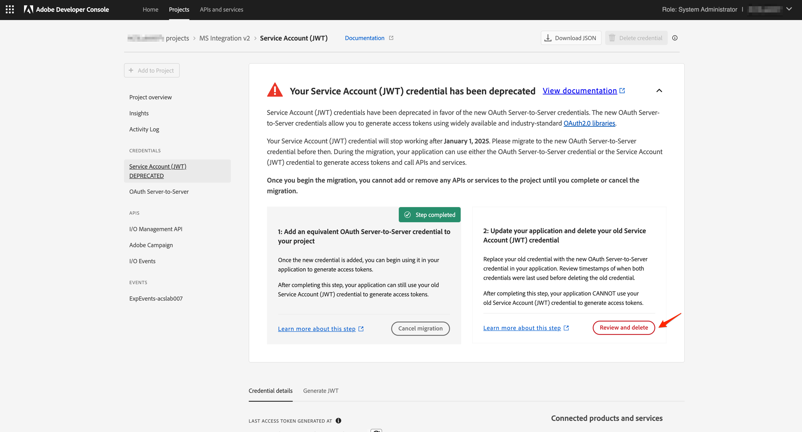

# JWT から OAuth へのサーバー間での資格情報の移行

新しい OAuth サーバー間秘密鍵証明書のために、サービスアカウント (JWT) 秘密鍵証明書は非推奨になりました。 新しい資格情報により、Adobe・アプリケーションの保守が容易になります。 また、証明書を定期的に交換する必要がなくなり、標準の OAuth2 ライブラリを使用して標準で動作します。

サービスアカウント (JWT) 資格情報は非推奨とマークされていますが、2025 年 1 月 1 日まで引き続き機能します。 そのため、2025 年 1 月 1 日より前に、新しい OAuth サーバー間資格情報を使用するには、統合を移行する必要があります。 確認してください [廃止のタイムライン](https://developer.adobe.com/developer-console/docs/guides/authentication/ServerToServerAuthentication/migration/#deperecation-timelines) 詳細情報

## 資格情報を JWT から OAuth サーバー間に移行する手順

OAuth サーバー間秘密鍵証明書への移行は、アプリケーションのダウンタイムなしの移行を可能にする簡単なプロセスです。 次の手順に従って、資格情報を移行できます。

1. にログインします。 [Adobe Developer Console](https://developer.adobe.com/console)
2. 左側のフィルターメニューで、「サービスアカウント (JWT) を持つ」秘密鍵証明書をオプションで選択します。 これにより、サービスアカウント (JWT) 資格情報を持つすべてのプロジェクトが表示されます。 プロジェクトのリストで、移行するプロジェクトをクリックします。

   

3. 左側のナビゲーションから「サービスアカウント (JWT) 秘密鍵証明書」タブを開き、移行カードを表示します。 移行カードで、「 」ボタンをクリックします。 **新しい資格情報を追加** をクリックして、同等の OAuth サーバー間秘密鍵証明書を追加します。 プロジェクトに OAuth サーバー間資格情報を追加すると、移行が開始されます。
   
4. 新しい秘密鍵証明書 **OAuth サーバー間通信** が左側のナビゲーションに追加されます。
   * 移行をキャンセルする場合は、[ 移行のキャンセル ] をクリックします。
   * 新しい秘密鍵証明書 OAuth Server-to-Server が機能しているかどうかを確認するまで、「Review and Delete」ボタンをクリックしないでください。
     

5. Microsoft Dynamics 365 の資格情報をAdobe Campaign Standardアプリに更新します
   * 統合アプリにログインし、設定ページに移動します。
   * 認証タイプとして「 OAuth 」を選択します。
   * 新しい OAuth サーバー間秘密鍵証明書は、古いサービスアカウント (JWT) 秘密鍵証明書と同じ資格情報を使用するので、ほとんどのフィールドは既に入力されています。
   * クライアント ID とクライアント秘密鍵を入力します。 これらは、Adobe Developer Console のプロジェクトに含まれています。
   * 「保存」をクリックして設定を保存します。
     

6. 新しい資格情報が機能しているかどうかを確認します。
   * 統合アプリケーションにログインし、ワークフローページに移動します。
   * アクティブなワークフローを停止します。 ワークフローが停止するまで待ちます。
   * ワークフローを開始します。 ワークフローが RUNNING 状態になるまで待ちます。
   * 数分間ワークフローを監視し、ワークフローが正しく機能していることを確認します。 また、Adobe Campaign StandardとMicrosoft Dynamics 365 のデータを調べて、データが正しく同期されていることを確認することもできます。

7. JWT 秘密鍵証明書を削除して移行を完了します。
   * にログインします。 [Adobe Developer Console](https://developer.adobe.com/console)
   * プロジェクトをクリックし、移行したプロジェクトを選択します。
   * 左側のナビゲーションで「サービスアカウント (JWT) 秘密鍵証明書」タブをクリックします。
   * 「レビューと削除」ボタンをクリックします。
     
   * 前回のアクセスまたは前回使用したメニューのタイムスタンプを確認して、統合アプリが新しい OAuth 資格情報を使用してアクセストークンを生成しているか、古い JWT 資格情報をまだ使用しているかを確認します。
     
   * 統合アプリが新しい OAuth 秘密鍵証明書を使用していて、JWT 秘密鍵証明書を使用していないことを確認したら、次のページをクリックして、古い秘密鍵証明書の削除に進みます。 **確認して続行** ボタンをクリックして、移行を完了します。
     
