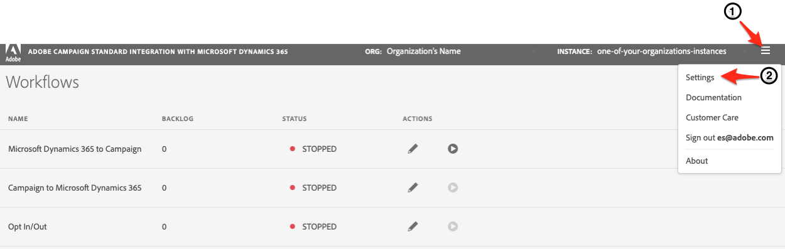
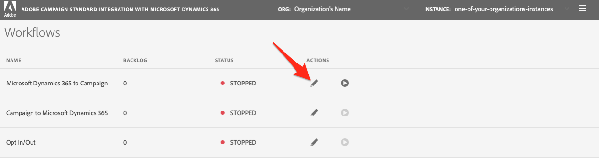
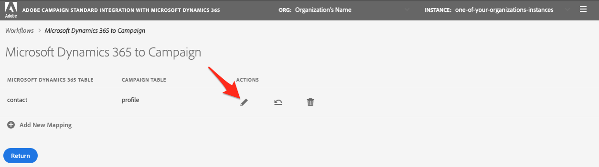
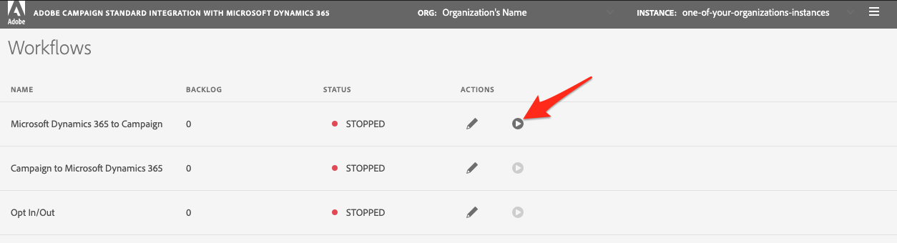
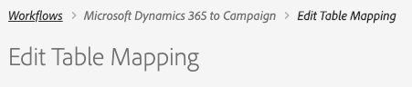

# セルフサービス統合アプリの概要 {#gs-self-service-app}

Adobe Campaign StandardとMicrosoft Dynamics 365のセルフサービス連携アプリケーションにより、データフローを設定し、実行しているかどうか、どの環境かを制御できます。 ただし、セルフサービス統合アプリケーションを使用する前に、いくつかの前提条件を完了する必要があります。

## 概念と制限 {#concepts-and-restrictions}

統合ツールを開始する前に、統合に関連する概念とガードレールを理解し、アクセスを得るための最初の手順を実行する必要があります。

詳しくは、以下の節を参照してください。

* [Microsoft Dynamics 365との連携の概要](../../integrating/using/d365-acs-get-started.md)
* [統合のベストプラクティスと制限事項](../../integrating/using/d365-acs-notices-and-recommendations.md)
* [この統合を実装するための主な手順を説明します](../../integrating/using/d365-acs-get-started.md#request-and-implement-this-integration)
* [Microsoft Dynamics 365 統合の使用](../../integrating/using/d365-acs-using-the-integration.md)

## 前提条件 {#self-service-app-prerequisites}

統合アプリがデータにアクセスできるように、Microsoft Dynamics 365とAdobe Campaign Standardを設定する必要があります。 Dynamics 365、Adobe Campaign Standard、Adobe I/Oでは、設定に時間がかかります。ただし、設定が完了すると、セルフサービス統合アプリケーションのユーザーインターフェイスを使用して統合を制御できるようになります。

詳しくは、以下の節を参照してください。

* [Campaign統合用のMicrosoft Dynamics 365の設定](../../integrating/using/d365-acs-configure-d365.md)
* [Adobe I/Oの設定](../../integrating/using/d365-acs-configure-adobe-io.md)
* [Campaign カスタムリソースとMicrosoft Dynamics 365 カスタムエンティティのマッピング](../../integrating/using/d365-acs-notices-and-recommendations.md)

## セルフサービス統合アプリを設定するための主な手順 {#self-service-app-configuration-steps}

そして、統合ツールから始めることができます。 次の手順に従います。

1. [統合アプリにアクセスする](../../integrating/using/d365-acs-self-service-app-control-access.md)
1. [使用に合わせて統合アプリを設定](../../integrating/using/d365-acs-self-service-app-settings.md)
1. [データ同期の実装](../../integrating/using/d365-acs-self-service-app-data-sync.md)
1. [同期ワークフローの設定](../../integrating/using/d365-acs-self-service-app-workflows.md)

## 統合アプリへのリンク {#self-service-app-link}

ブラウザーを開き、地域に関連付けられているコネクタを参照します。

* [アジア太平洋](https://d365-acs-ap.ea.adobe.com/)
* [ヨーロッパ、中東、またはアフリカ（EMEA）](https://d365-acs-em.ea.adobe.com/)
* [アメリカ](https://d365-acs-am.ea.adobe.com/)

## プライバシーリクエストの確認 {#self-service-app-acknowledgement}

初めてセルフサービス UIを参照する場合は、プライバシー確認が表示されます。 続行する前に、CampaignとMicrosoft Dynamics 365でプライバシーリクエストを個別に実行する際の役割を理解していることを確認する必要があります。
プライバシーの責任とプライバシーリクエストの管理方法について詳しくは、[この節](../../integrating/using/d365-acs-notices-and-recommendations.md#acs-msdyn-manage-privacy)を参照してください。

## 資格情報の設定 {#self-service-app-credentials}

初めてUIを参照する場合は、次のようなヘッダーを持つページが表示されます。

>[!NOTE]
>
> アプリの設定がまだ設定されていない場合、Adobe Campaign StandardまたはMicrosoft Dynamics 365に「接続できません」というアラートが表示されるのは通常です。

「組織」および「インスタンス」の選択が、設定する予定のものであることを確認してください。  そうでない場合は、ドロップダウンリストをクリックし、正しい組織とインスタンスを選択します。

>[!IMPORTANT]
>
> 初めてコネクタを設定する場合、またはこのプロセスを初めて使用する場合は、「**強く**」で「ステージ」または「開発」インスタンスを選択することをお勧めします。 本番環境での設定を試す前に、設定がうまく機能することを確認する必要があります。

正しい組織とインスタンスがある場合は、「ハンバーガー」メニューをクリックしてドロップダウンメニューを表示します。 次に、ドロップダウンメニューの「**[!UICONTROL Settings...]**」をクリックして、Microsoft Dynamics 365およびCampaignの資格情報を入力するページにアクセスします（以下を参照）。

**[!UICONTROL Settings]** ページで、次のセクションに入力します。

* Microsoft Dynamics 365資格情報
* Adobe資格情報

各入力の情報を見つける場所に関する詳細な情報を見つけるには、[ここ](../../integrating/using/d365-acs-self-service-app-settings.md)に移動します。 完了したら、下部の「**[!UICONTROL Save]**」ボタンをクリックします。

## 初期設定の確認 {#self-service-app-initial-config}

上記の前提条件を完了し、すべての資格情報を正しく追加したと仮定して、**[!UICONTROL Workflows]** ページに移動します。 統合アプリのワークフローについて詳しくは、[このページ ](../../integrating/using/d365-acs-self-service-app-workflows.md)を参照してください。

**[!UICONTROL Workflows]** ページで、**[!UICONTROL Microsoft Dynamics 365 to Campaign]** ワークフローに関連付けられている鉛筆アイコンをクリックして、その設定を編集します。

**[!UICONTROL Microsoft Dynamics 365 to Campaign]** ページで、設定したテーブル マッピングのリストにアクセスできます。  デフォルトでは、標準で連絡先/プロファイルマッピングが使用されます。 その他すべてのカスタムエンティティは別途設定する必要があります。

**[!UICONTROL Edit Table Mapping]** ページで、**[!UICONTROL Mappings]** セクションを確認して、Microsoft Dynamics 365のフィールドがCampaignの正しいフィールドにマッピングされていることを確認します。 その他のマッピングを追加する必要がある場合は、その他の置き換えやフィルターも追加します。 [詳細情報](../../integrating/using/d365-acs-self-service-app-data-sync.md)。

新しいマッピングを追加する場合は、詳しくは[この節](../../integrating/using/d365-acs-self-service-app-data-sync.md#add-a-new-mapping)を参照してください。

設定が正しければ、**[!UICONTROL Microsoft Dynamics 365 to Campaign]** ワークフローの横にある&#x200B;**[!UICONTROL Play]** ボタンをクリックして、統合とデータのフローを開始します。

>[!IMPORTANT]
>
>実稼動環境で実行する前に、まずステージ環境または開発環境でこれを実行することをお勧めします。**強く** ステージ/開発インスタンスがヘッダーで選択されていることを確認してください。
>

実行すると、Microsoft Dynamics 365でエントリを追加または変更し、数分以内にAdobe Campaignでそれらの変更を確認してテストできるようになります。 このプロセスをいつでも停止する必要がある場合は、同じボタンを押すだけで停止できます。 [詳細情報](../../integrating/using/d365-acs-self-service-app-workflows.md#workflow-status)

## 統合アプリワークスペース {#self-service-app-workspace}

### アプリヘッダー {#app-header}

セルフサービスアプリ内のヘッダーを使用すると、現在表示または設定している組織やインスタンスを定義できます。

表示または編集する&#x200B;**組織**&#x200B;と&#x200B;**インスタンス**&#x200B;を選択します。 これらのフィールドは読み取り専用で表示されますが、マウスカーソルを置くと編集できるようになります。

ヘッダーの右側にある3本の水平線を含むボタンをクリックすると、ドロップダウンメニューが表示されます。

ドロップダウンメニューのエントリは次のとおりです。

* **Settings**：このオプションを選択すると、Microsoft Dynamics 365およびAdobe CampaignのAPI資格情報と、その他の一般的な設定を指定できる画面に移動します。

* **ドキュメント**：このオプションは、この統合機能に固有のAdobe Campaign ドキュメントへのリンクです

* **カスタマーケア**: カスタマーケア チケットの開封に関するExperience Cloud ドキュメントへのリンクです

* **ログアウト**：これにより、アプリケーションからログアウトし、別のユーザーとして再度ログインできるようになります。

* **バージョン情報**：著作権情報を含むアプリケーションに関する情報を含むダイアログが表示されます。

### パンくず {#app-breadcrumbs}

アプリを操作すると、一部の画面の上部にパンくずリストが表示されます。

**例：**

以下は、パンくずリストとページタイトルを表示している&#x200B;**[!UICONTROL Edit Table Mapping]**&#x200B;画面の例です。 この場合、**[!UICONTROL Workflows]**&#x200B;または&#x200B;**[!UICONTROL Microsoft Dynamics 365 to Campaign]**&#x200B;のテキストをクリックすると、以前の画面のいずれかに移動できます。 この場合、パンくずリストの&#x200B;**[!UICONTROL Edit Table Mapping]**&#x200B;は現在の画面なのでクリックできません。

### 共通ボタン {#app-buttons}

次のアイコンは、セルフサービスアプリの複数のページで使用されます。

 - リストに新しい項目を追加します。

 – 既に存在するものを編集します

 - アイテムのリストからアイテムを削除します
