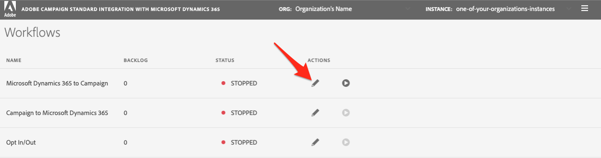

# セルフサービス統合アプリの概要 {#gs-self-service-app}

Adobe Campaign StandardとMicrosoft Dynamics 365 のセルフサービス統合アプリケーションの統合により、データフローの設定、実行の有無と実行する環境の制御が可能になります。 ただし、セルフサービス統合アプリケーションの使用を開始する前に、いくつかの前提条件を満たす必要があります。

## 概念と制限 {#concepts-and-restrictions}

統合ツールを使用する前に、統合に関連する概念とガードレールを理解し、アクセス権を取得するための最初の手順を実行する必要があります。

詳しくは、次の節を参照してください。

* [Microsoft Dynamics 365 統合の概要](../../integrating/using/d365-acs-get-started.md)
* [統合のベストプラクティスと制限事項](../../integrating/using/d365-acs-notices-and-recommendations.md)
* [この統合を実装するための主な手順を説明します。](../../integrating/using/d365-acs-get-started.md#request-and-implement-this-integration)
* [Microsoft Dynamics 365 統合の使用](../../integrating/using/d365-acs-using-the-integration.md)

## 前提条件 {#self-service-app-prerequisites}

統合アプリがデータにアクセスできるように、Microsoft Dynamics 365 とAdobe Campaign Standardを設定する必要があります。 Dynamics 365、Adobe Campaign Standard、およびAdobe I/Oでの設定には、時間がかかります。ただし、設定が完了すると、セルフサービス統合アプリケーションのユーザーインターフェイスを通じて統合を制御できるようになります。

詳しくは、次の節を参照してください。

* [Campaign 統合用の Microsoft Dynamics 365 の設定](../../integrating/using/d365-acs-configure-d365.md)
* [Adobe I/O の設定](../../integrating/using/d365-acs-configure-adobe-io.md)
* [Campaign のカスタムリソースとMicrosoft Dynamics 365 カスタムエンティティのマッピング](../../integrating/using/d365-acs-notices-and-recommendations.md)

## セルフサービス統合アプリを設定するための主な手順 {#self-service-app-configuration-steps}

その後、統合ツールから開始できます。 次の手順に従います。

1. [統合アプリへのアクセス権を取得します](../../integrating/using/d365-acs-self-service-app-control-access.md)
1. [使用する統合アプリの設定](../../integrating/using/d365-acs-self-service-app-settings.md)
1. [データ同期の実装](../../integrating/using/d365-acs-self-service-app-data-sync.md)
1. [同期ワークフローの設定](../../integrating/using/d365-acs-self-service-app-workflows.md)

## 統合アプリへのリンク {#self-service-app-link}

ブラウザーを開き、地域に関連付けられたコネクタを参照します。

* [アジア太平洋](https://d365-acs-ap.ea.adobe.com/)
* [ヨーロッパ、中東、アフリカ (EMEA)](https://d365-acs-em.ea.adobe.com/)
* [南北アメリカ](https://d365-acs-am.ea.adobe.com/)

## プライバシーリクエストの確認 {#self-service-app-acknowledgement}

初めてセルフサービス UI を参照する際には、プライバシー確認が表示されます。 続行する前に、Campaign とMicrosoft Dynamics 365 で個別にプライバシーリクエストを実行する際の役割を理解しておく必要があります。
プライバシーに関する責任と、 [この節](../../integrating/using/d365-acs-notices-and-recommendations.md#acs-msdyn-manage-privacy).

## 資格情報の設定 {#self-service-app-credentials}

初めて UI を参照すると、次のようなヘッダーを持つページが表示されます。

>[!NOTE]
>
> アプリ設定がまだ構成されていない場合、Adobe Campaign StandardまたはMicrosoft Dynamics 365 に「接続できません」というメッセージが表示されるアラートを受け取るのが普通です。

「ORG」と「INSTANCE」の選択が、設定する予定の選択であることを確認してください。  そうでない場合は、ドロップダウンリストをクリックし、正しい組織とインスタンスを選択します。

>[!IMPORTANT]
>
> 初めてコネクタを設定する場合や、このプロセスを初めて使用する場合は、 **強く** 「stage」または「dev」インスタンスを選択するよう促します。 実稼動環境で設定を試みる前に、設定が正常に機能することを確認する必要があります。

正しい組織とインスタンスがある場合は、「ハンバーガー」メニューをクリックしてドロップダウンメニューを表示します。 次に、 **[!UICONTROL Settings...]** 「 」ドロップダウンメニューで、Microsoft Dynamics 365 および Campaign の資格情報を入力したページにアクセスします（以下を参照）。

内 **[!UICONTROL Settings]** ページで、次のセクションに入力します。

* Microsoft Dynamics 365 資格情報
* Adobe資格情報

移動 [ここ](../../integrating/using/d365-acs-self-service-app-settings.md) をクリックして、各入力の情報を見つける場所に関する詳細情報を確認します。 完了したら、 **[!UICONTROL Save]** ボタンをクリックします。

## 初期設定を確認 {#self-service-app-initial-config}

上記の前提条件を完了し、すべての資格情報を正しく追加している場合は、次に、 **[!UICONTROL Workflows]** ページ。 統合アプリのワークフローについて詳しくは、 [このページ](../../integrating/using/d365-acs-self-service-app-workflows.md).

内  **[!UICONTROL Workflows]** ページで、 **[!UICONTROL Microsoft Dynamics 365 to Campaign]** ワークフローを使用して、設定を編集できます。

内 **[!UICONTROL Microsoft Dynamics 365 to Campaign]** ページから、設定したテーブルマッピングのリストにアクセスできます。  デフォルトでは、デフォルトで標準の連絡先/プロファイルマッピングが使用されます。 その他のすべてのカスタムエンティティは、別々に設定する必要があります。

内 **[!UICONTROL Edit Table Mapping]** ページで、 **[!UICONTROL Mappings]** 「 」セクションを使用して、Microsoft Dynamics 365 のフィールドが Campaign の正しいフィールドにマッピングされていることを確認してください。 他のマッピングを追加する必要がある場合は、今すぐ追加し、置換やフィルターも追加します。 [詳細情報](../../integrating/using/d365-acs-self-service-app-data-sync.md)。

新しいマッピングを追加する場合は、 [この節](../../integrating/using/d365-acs-self-service-app-data-sync.md#add-a-new-mapping) を参照してください。

設定が正しくなったら、 **[!UICONTROL Play]** ボタン **[!UICONTROL Microsoft Dynamics 365 to Campaign]** ワークフローを使用して、統合とデータのフローを開始できます。

>[!IMPORTANT]
>
>水 **強く** 実稼動環境で実行する前に、ステージ環境または開発環境で実行することをお勧めします。 ヘッダーでステージ/開発インスタンスが選択されていることを確認してください。

実行したら、Microsoft Dynamics 365 でエントリを追加または変更し、数分以内にAdobe Campaignでこれらの変更を観察することで、テストできます。 このプロセスを停止する必要がある場合は、同じボタンを押して停止します。 [詳細情報](../../integrating/using/d365-acs-self-service-app-workflows.md#workflow-status)

## 統合アプリワークスペース {#self-service-app-workspace}

### アプリのヘッダー {#app-header}

セルフサービスアプリ内のヘッダーを使用すると、現在表示している組織とインスタンスを定義したり、設定したりできます。

を選択します。 **組織** そして **インスタンス** 表示/編集を行います。 これらのフィールドは読み取り専用として表示されますが、マウスカーソルを置くと編集可能になります。

3 本の水平線を含むボタンをクリックすると、ドロップダウンメニューが表示されます  をクリックします。

ドロップダウンメニューのエントリは次のとおりです。

* **設定**:このオプションを選択すると、Microsoft Dynamics 365 とAdobe Campaignの API 資格情報や、アプリケーションのその他の一般的な設定を指定できる画面が表示されます。

* **ドキュメント**:このオプションは、この統合に固有のAdobe Campaignドキュメントへのリンクです

* **カスタマーケア**:これは、カスタマーケアチケットの開始に関するExperience Cloudドキュメントへのリンクです

* **ログアウト**:これにより、アプリケーションからログアウトし、別のユーザーとして再度サインインできます。

* **について**:これにより、著作権情報を含む、アプリケーションに関する情報を含むダイアログが表示されます。

### パンくずリスト {#app-breadcrumbs}

アプリを移動すると、一部の画面の上部にパンくずリストが表示されます。

**例：**

以下に、 **[!UICONTROL Edit Table Mapping]** パンくずリストとページタイトルを表示する画面。 この場合、 **[!UICONTROL Workflows]** または **[!UICONTROL Microsoft Dynamics 365 to Campaign]** 前の画面に移動するためのテキスト。 **[!UICONTROL Edit Table Mapping]** （パンくずリスト）は、現在の画面なので、クリックできません。

### 共通ボタン {#app-buttons}

以下のアイコンは、セルフサービスアプリの複数のページで使用されます。

  — リストに新しい項目を追加します。

  — 既に存在するものを編集します

  — 項目のリストから項目を削除します
