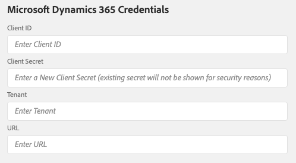
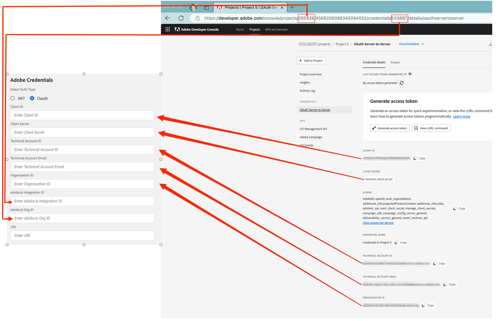
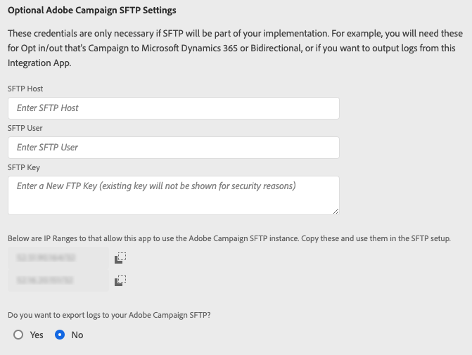

# システムと統合アプリの接続

## 統合アプリに資格情報を追加する

**[!UICONTROL Settings]**&#x200B;画面では、Microsoft Dynamics 365とAdobe APIの資格情報を指定できます。 Adobe Campaign SFTP インスタンスに関連する設定を行うこともできます。

### Microsoft Dynamics 365資格情報

Microsoft Dynamics 365資格情報は、統合アプリケーションにMicrosoft Dynamics 365からデータを取得する権限を与えます。  この画面に貼り付ける値を生成するには、最初に画面[Microsoft Dynamics 365 for Campaign integration](../../integrating/using/d365-acs-configure-d365.md)の手順に従う必要があります。 以下で説明する入力は、この画面を参照します。

* **[!UICONTROL Client ID]**: [このセクション &#x200B;](../../integrating/using/d365-acs-configure-d365.md#register-a-new-app)でクライアント IDを参照する方法について説明します

* **[!UICONTROL Client Secret]**: [このセクション &#x200B;](../../integrating/using/d365-acs-configure-d365.md#generate-a-client-secret)でクライアントシークレットを生成する方法について説明します

* **[!UICONTROL Tenant]**: [このセクション &#x200B;](../../integrating/using/d365-acs-configure-d365.md#get-the-tenant-id)でテナント IDを見つける方法について説明します

* **[!UICONTROL URL]**: URLの形式は`https://&lt;servername&gt;.api.crm.dynamics.com/`です

### Adobe API資格情報

Adobe Campaignの資格情報は、[Adobe I/O](https://www.adobe.io/)を使用して生成されます。このセクションの入力を入力するには、画面[Adobe I/O](../../integrating/using/d365-acs-configure-adobe-io.md)にアクセスし、画面の指示に従う必要があります。

* JWT ベースの認証は非推奨（廃止予定）であるため、認証タイプをOauthとして選択します。
* 次の図では、Adobe I/Oと設定画面の入力のマッピングについて詳しく説明します。

* *URL*：この値は、パターン https\://mc.adobe.io/&lt;campaign-instance-name>に適合します。 統合アプリのヘッダーには、「組織」と「インスタンス」の両方が含まれます。 URLの「campaign-instance-name」部分は、このインスタンス値に見つかった名前になります。

## Adobe Campaign SFTPの設定 {#ac-smtp-settings}

これらの設定はオプションです。 Adobe Campaign SFTP インスタンスを使用してコネクタからログを出力する場合は、それらを定義する必要があります。 これは、統合の実行中に問題が発生し、出力が期待に応えられない理由をデバッグする必要がある場合に役立ちます。

SFTP サーバーを設定するもう1つの理由は、オプトイン/アウトワークフローを実行する予定で、Adobe CampaignからMicrosoft Dynamics 365へのデータのフロー（**[!UICONTROL Unidirectional (Campaign to Microsoft Dynamics 365)]**&#x200B;または&#x200B;**[!UICONTROL Bidirectional]**）がある場合です。

>[!IMPORTANT]
>
>SFTP フォルダーからアクセスおよびダウンロードする情報は、お客様の責任です。 情報に個人データが含まれる場合、適用されるプライバシー法および規制を遵守する責任があります。 [詳細情報](../../integrating/using/d365-acs-notices-and-recommendations.md#acs-msdyn-manage-privacy)。
>

Microsoft Dynamics 365統合用のCampaign SFTP設定を定義するには、次の節にアクセスします。

次を指定する必要があります。

* **SFTP ホスト**：このフィールドには&lt;campaign-instance-name>.campaign.adobe.comが含まれます。 統合アプリのヘッダーには、**組織**&#x200B;と&#x200B;**インスタンス**&#x200B;の両方が含まれます。 URLの「campaign-instance-name」部分は、このインスタンス値に見つかった名前になります。

* **SFTP ユーザー**: SFTP ユーザーがある場合は、ここに追加します。 それ以外は、[このセクション &#x200B;](#ac-control-panel-settings)を参照してください。 プロセスの一部として、ユーザー名が表示されます。

* **SFTP キー**: SSH キーがある場合は、ここに追加します。 それ以外は、[このセクション &#x200B;](#ac-control-panel-settings)を参照してください。

* **IP範囲**&#x200B;は、Adobe Campaign SFTP設定に含める必要があります。 統合でSFTP エンドポイントを使用するには、これらを許可リストに加えるする必要があります。

* **ログをAdobe Campaign SFTPにエクスポートしますか？** を使用すると、統合がSFTP エンドポイントにログ情報を出力するかどうかを判断できます。 これは、Adobe CampaignまたはMicrosoft Dynamics 365で想定される情報が表示されない場合のデバッグに役立ちます。

## Adobe CampaignでのSFTP設定 {#ac-control-panel-settings}

次のセクションでは、[&#x200B; キャンペーンCampaign コントロールパネル](https://experienceleague.adobe.com/docs/control-panel/using/control-panel-home.html?lang=ja)を使用したSFTP管理について説明します。

* [SFTP の管理について](https://experienceleague.adobe.com/docs/control-panel/using/sftp-management/about-sftp-management.html?lang=ja#sftp-management)

* [SFTP ストレージの管理](https://experienceleague.adobe.com/docs/control-panel/using/sftp-management/key-management.html#installing-ssh-key)

* [IP範囲の追加](https://experienceleague.adobe.com/docs/control-panel/using/sftp-management/ip-range-allow-listing.html#sftp-management)

* [キーの管理](https://experienceleague.adobe.com/docs/control-panel/using/sftp-management/key-management.html#sftp-management)

* [SFTP サーバーにログオンします](https://experienceleague.adobe.com/docs/control-panel/using/sftp-management/logging-into-sftp-server.html#sftp-management)

設定が完了したら、秘密鍵を使用してSFTP サーバーにログインし、「d365_loads/exports」ディレクトリを作成します。

Adobe Campaign Standard SFTP サーバーについて詳しくは、[このページ &#x200B;](https://experienceleague.adobe.com/docs/campaign-standard-learn/control-panel/sftp-management/monitoring-server-capacity.html?lang=ja#sftp-management)を参照してください。
