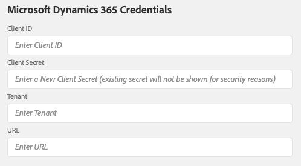

# システムと統合アプリの接続

## 統合アプリへの資格情報の追加

**[!UICONTROL Settings]** の画面では、Microsoft Dynamics 365 とAdobe API の資格情報を指定できます。 また、Adobe Campaign SFTP インスタンスに関連する設定を行うこともできます。

### Microsoft Dynamics 365 資格情報

Microsoft Dynamics 365 資格情報は、Microsoft Dynamics 365 からデータを取り込むための権限を統合アプリケーションに付与します。  この画面に貼り付ける値を生成するには、まず画面に表示される手順 [Campaign 統合用のMicrosoft Dynamics 365 の設定 &#x200B;](../../integrating/using/d365-acs-configure-d365.md) に従う必要があります。 以下に説明する入力は、この画面を参照します。

* **[!UICONTROL Client ID]**: クライアント ID を参照する方法については、[&#x200B; この節 &#x200B;](../../integrating/using/d365-acs-configure-d365.md#register-a-new-app) を参照してください

* **[!UICONTROL Client Secret]**: クライアント秘密鍵の生成方法については、[&#x200B; この節 &#x200B;](../../integrating/using/d365-acs-configure-d365.md#generate-a-client-secret) を参照してください

* **[!UICONTROL Tenant]**: テナント ID を見つける方法については、[&#x200B; この節 &#x200B;](../../integrating/using/d365-acs-configure-d365.md#get-the-tenant-id) を参照してください

* **[!UICONTROL URL]**:URL の形式は `https://&lt;servername&gt;.api.crm.dynamics.com/` になります

### Adobe API 資格情報

Adobe Campaign資格情報は、[Adobe I/O](https://www.adobe.io/) を使用して生成されます。 [Adobe I/Oの設定 &#x200B;](../../integrating/using/d365-acs-configure-adobe-io.md) 画面にアクセスし、その指示に従って操作してから、この節の入力を入力する必要があります。

* JWT ベースの認証は非推奨なので、「認証タイプ」で「OAUTH」を選択します。
* 次の画像では、Adobe I/Oと設定画面の入力とのマッピングについて詳しく説明します。

* *URL*：この値は、https\://mc.adobe.io/&lt;campaign-instance-name> のパターンに適合します。 統合アプリのヘッダーには、「組織」と「インスタンス」の両方が含まれます。 URL の「campaign-instance-name」部分は、このインスタンス値で見つかった名前のみです。

## Adobe Campaign SFTP の設定 {#ac-smtp-settings}

これらの設定はオプションです。 Adobe Campaign SFTP インスタンスを使用してコネクタからログを出力する予定がある場合は、それらを定義する必要があります。 これは、統合の実行中に問題が発生し、出力が期待に沿わない理由をデバッグする必要がある場合に役立ちます。

SFTP サーバーを設定するもう 1 つの理由は、オプトイン/オプトアウトワークフローを実行する予定で、Adobe CampaignからMicrosoft Dynamics 365 へのデータのフロー（**[!UICONTROL Unidirectional (Campaign to Microsoft Dynamics 365)]** または **[!UICONTROL Bidirectional]**）がある場合です。

>[!IMPORTANT]
>
>SFTP フォルダーにアクセスしてダウンロードする情報については、ユーザーが責任を負います。 情報に個人データが含まれている場合、適用されるプライバシー法および規制を遵守する責任があります。 [詳細情報](../../integrating/using/d365-acs-notices-and-recommendations.md#acs-msdyn-manage-privacy)。
>

Microsoft Dynamics 365 統合用の Campaign SFTP 設定を定義するには、次のセクションにアクセスします。

次を指定する必要があります。

* **SFTP ホスト**：このフィールドには、&lt;campaign-instance-name>.campaign.adobe.comが含まれます。 統合アプリのヘッダーには、**Org** と **Instance** の両方が含まれます。 URL の「campaign-instance-name」部分は、このインスタンス値で見つかった名前のみです。

* **SFTP ユーザー**:SFTP ユーザーがある場合は、ここに追加します。 それ以外の場合は、[&#x200B; この節 &#x200B;](#ac-control-panel-settings) を参照してください。 プロセスの一環として、ユーザー名が表示されます。

* **SFTP キー**:SSH キーがある場合は、ここに追加します。 それ以外の場合は、[&#x200B; この節 &#x200B;](#ac-control-panel-settings) を参照してください。

* **IP 範囲** をAdobe Campaign SFTP 設定に含める必要があります。 これらは、統合で SFTP エンドポイントを利用するために許可リストに加えるする必要があります。

* **Adobe Campaign SFTP にログを書き出しますか？統合** ログ情報を SFTP エンドポイントに出力するかどうかを指定できます。 これは、Adobe CampaignまたはMicrosoft Dynamics 365 で想定する情報が表示されない場合のデバッグに役立ちます。

## Adobe Campaignでの SFTP 設定 {#ac-control-panel-settings}

[&#x200B; キャンペーン管理 &#x200B;](https://experienceleague.adobe.com/docs/control-panel/using/control-panel-home.html?lang=ja) を使用した SFTPCampaign コントロールパネルについては、次の節を参照してください。

* [SFTP 管理について](https://experienceleague.adobe.com/docs/control-panel/using/sftp-management/about-sftp-management.html?lang=ja#sftp-management)

* [SFTP ストレージ管理](https://experienceleague.adobe.com/docs/control-panel/using/sftp-management/key-management.html?lang=ja#installing-ssh-key)

* [IP 範囲の追加 &#x200B;](https://experienceleague.adobe.com/docs/control-panel/using/sftp-management/ip-range-allow-listing.html?lang=ja#sftp-management)

* [&#x200B; キーの管理 &#x200B;](https://experienceleague.adobe.com/docs/control-panel/using/sftp-management/key-management.html?lang=ja#sftp-management)

* [SFTP サーバーへのログオン &#x200B;](https://experienceleague.adobe.com/docs/control-panel/using/sftp-management/logging-into-sftp-server.html?lang=ja#sftp-management)

設定が完了したら、秘密鍵を使用して SFTP サーバーにログインし、「d365_loads/exports」ディレクトリを作成します。

Adobe Campaign Standard SFTP サーバーについて詳しくは [&#x200B; このページを参照 &#x200B;](https://experienceleague.adobe.com/docs/campaign-standard-learn/control-panel/sftp-management/monitoring-server-capacity.html?lang=ja#sftp-management) てください。
