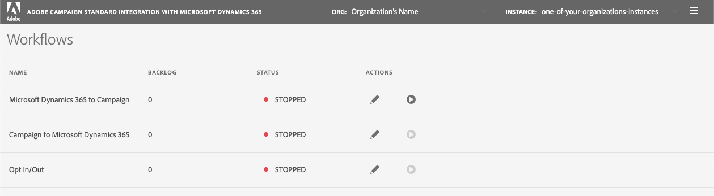

# キャンペーン- Microsoft Dynamics 365統合ワークフロー

**[!UICONTROL Workflows]**&#x200B;ページには、テクニカルワークフローとそのステータスがリストされます。

統合アプリケーションには、次の3つのワークフローが用意されています。

**Microsoft Dynamics 365からキャンペーン**
* Microsoft Dynamics 365から&#x200B;*連絡先*&#x200B;をAdobe Campaignに送信
* *カスタムエンティティ*:Microsoft Dynamics 365からAdobe Campaignにカスタムテーブルを取り込みます。[詳細情報](../../integrating/using/d365-acs-using-the-integration.md#data-flows)
* これは、**入力**&#x200B;とも呼ばれます(Microsoft Dynamics 365からAdobe Campaignにデータを入力することを参照)

**Microsoft Dynamics 365へのキャンペーン**
* Adobe Campaign Standardからの電子メールマーケティングイベントがDynamics 365（電子メール送信、開く、クリック、バウンス）に送信されます。 [詳細情報](../../integrating/using/d365-acs-using-the-integration.md#email-marketing-event-flow)
* これは、**出口**&#x200B;とも呼ばれます(Adobe CampaignからMicrosoft Dynamics 365へのデータの出口を参照)

**オプトイン/オプトアウト**

オプトアウトステータス(例：ブロックリスト)は、Microsoft Dynamics 365からAdobe Campaignに、またはAdobe CampaignからMicrosoft Dynamics 365に同期できます。 また、双方向に同期する（つまり、両方向にデータをフローする）こともできます。 [詳細情報](../../integrating/using/d365-acs-self-service-app-data-sync.md#opt-in-out-wf)。

>[!IMPORTANT]
>
>**Microsoft Dynamics 365からキャンペーン**&#x200B;へのワークフローを停止してから、Adobe Campaign StandardまたはMicrosoft Dynamics 365に変更を発行することを強くお勧めします。 これらの変更には、統合で現在使用されているリソース/エンティティ（および関連するフィールド）、リンク、識別子列などへの更新が含まれます。 そうしないと、データが失われたり、ワークフローが予期せず停止したりする可能性があります。

## ワークフローバックログ

この統合アプリケーションは、最初にデータを読み込み、次にデータを宛先に書き込みます。 **[!UICONTROL Backlog]**&#x200B;列は、キューに入れられ、書き込みを待機しているレコードの数を示します。 処理するデータ量が多い場合（例えば、初めて統合を実行している場合、データを再生する場合など）は、この値の増加が期待されます。

>[!NOTE]
>Microsoft Dynamics 365またはキャンペーンレコードが更新されていない場合は、まず、宛先に書き込まれるのを待っているレコードが多数あるかどうかを確認する必要があります。

## ワークフローの状態{#workflow-status}

**[!UICONTROL Status]**&#x200B;列は、ワークフローに関連付けられているバックグラウンドプロセスの状態を示します。 次のような値を選択できます。

* **実行中**:プロセスは現在実行中で、データを同期する必要があります。
* **STOPPED**:プロセスは現在実行中でないので、データが同期されることを期待しないでください。
* **開始**:ワークフロープロセスの開始を要求しました。アプリケーションは、このワークフローに関連付けられたデータの同期をまだ開始していませんが、数分後（その後&#x200B;**実行中**&#x200B;の状態が表示される）に同期されると期待できます
* **失敗**:ワークフロープロセスは実行中ですが、エラーが発生し、これらから回復できませんでした。

## 使用可能なアクション

可能なアクションを以下に示します。

* **編集**:鉛筆アイコンをクリックすると、別のページに移動し、ワークフローを更新できます。ワークフローを停止してから再起動するまで、行った変更は有効になりません。

* **開始**:開始ボタンは、停止されたワークフローの開始を要求します。このボタンは、ワークフローに関連付けられたプロセスが現在停止している場合にのみ表示されます。 プロセスは最初に「STARTING」に変わり、次に「RUNNING」に変わります。 ワークフローに関連付けられたデータは、ワークフローが「実行中」の状態になるまで開始同期されません。

   開始ボタンは切り替えです。 ワークフロープロセスが既に開始されている場合、ボタンは&#x200B;**「停止**」ボタンに変わります。

* **停止**:Stopbuttonは、実行中のワークフローの停止を **** 要求します。このボタンは、ワークフローに関連付けられたプロセスが現在実行中の場合にのみ表示されます。

ワークフローを編集する場合、ワークフローを停止してから「開始&#x200B;**」ボタンをクリックするまで、更新は実行中のプロセスのルールに直ちに反映されません。**&#x200B;次に、更新内容が実行中のプロセスに組み込まれます（プロセスが&#x200B;**RUNNING**&#x200B;状態に戻ったら）。

**「Stop**」ボタンに警告表示が追加され、(a)ワークフローを更新したが、(b)このワークフローの停止/開始を行っていないことを知らせます。

