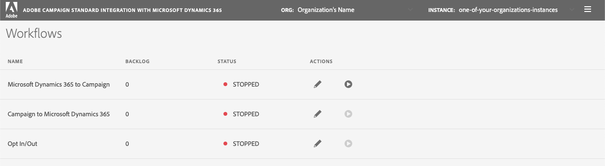

# Campaign - Microsoft Dynamics 365統合ワークフロー

**[!UICONTROL Workflows]** ページには、テクニカルワークフローとそのステータスが一覧表示されます。

統合アプリケーションには、次の3つのワークフローがあります。

**Microsoft Dynamics 365からCampaign**
* Microsoft Dynamics 365から&#x200B;*連絡先*&#x200B;をAdobe Campaignに送信する
* *カスタムエンティティ*: Microsoft Dynamics 365からAdobe Campaignにカスタムテーブルを取り込みます。 [詳細情報](../../integrating/using/d365-acs-using-the-integration.md#data-flows)
* これは&#x200B;**Ingress**&#x200B;とも呼ばれます（Microsoft Dynamics 365からAdobe Campaignへのデータのイングレスを指します）

**Microsoft Dynamics 365**&#x200B;へのキャンペーン
* Adobe Campaign Standardのメールマーケティングイベントは、Dynamics 365 （メール送信、開封、クリック、バウンス）に送信されます。 [詳細情報](../../integrating/using/d365-acs-using-the-integration.md#email-marketing-event-flow)
* これは&#x200B;**Egress**&#x200B;とも呼ばれます（Adobe CampaignからMicrosoft Dynamics 365へのデータの出力を指します）

**オプトイン/アウト**

オプトアウトステータス（例：「Adobe CampaignをMicrosoft Dynamics」など）は、Microsoft Dynamics 365からAdobe Campaignに、またはブロックリストに加えるから365に同期できます。 データは、双方向で同期することもできます（つまり、両方向のデータフロー）。 [詳細情報](../../integrating/using/d365-acs-self-service-app-data-sync.md#opt-in-out-wf)。

>[!IMPORTANT]
>
>Adobe Campaign StandardまたはMicrosoft Dynamics 365に変更を公開する前に、**Microsoft Dynamics 365 to Campaign** ワークフローを停止することを強くお勧めします。 これらの変更には、リソース/エンティティ（および関連するフィールド）、リンク、識別子の列などの更新が含まれ、統合で現在使用されています。 これを怠ると、データが失われたり、ワークフローが予期せず停止したりする可能性があります。

## ワークフローバックログ

この統合アプリケーションは、まずデータを読み込み、次に宛先にデータを書き込みます。 **[!UICONTROL Backlog]**&#x200B;列は、キューに入れられ、書き込み待ちになっているレコードの数を示します。 この値は、処理するデータ量が多い場合（例えば、統合を初めて実行する、データを再生するなど）に大きくなることが期待されます。

>[!NOTE]
>Microsoft Dynamics 365やCampaign レコードが更新されない場合は、まず、宛先への書き込みを待っているレコードが大量にあるかどうかを確認する必要があります。
>

## ワークフローステータス {#workflow-status}

**[!UICONTROL Status]**&#x200B;列は、ワークフローに関連付けられているバックグラウンド プロセスの状態を示します。 次のような値を選択できます。

* **実行中**: プロセスは現在実行中で、データを同期する必要があります。
* **停止**: プロセスは現在実行されていないため、データを同期する必要はありません。
* **開始**: ワークフロープロセスを開始するように要求しました。 アプリケーションは、このワークフローに関連付けられたデータの同期をまだ開始していませんが、数分後に開始されると予想できます（その後、**RUNNING**&#x200B;のステータスが表示されます）
* **失敗**: ワークフロープロセスは実行中でしたが、エラーが発生したため、これらのプロセスから回復できませんでした。

## 使用可能なアクション

考えられるアクションを以下に示します。

* **編集**：鉛筆アイコンをクリックすると、ワークフローを更新できる別のページに移動します。 変更は、ワークフローを停止してから再起動するまで有効にならないことに注意してください。

* **開始**：開始ボタンは、停止したワークフローの開始を要求します。 このボタンは、ワークフローに関連付けられているプロセスが現在停止している場合にのみ表示されます。 プロセスはまず「開始」に変わり、次に「実行」に変わります。 ワークフローに関連付けられているデータは、ワークフローが「実行中」状態になるまで同期を開始しません。

  開始ボタンはトグルです。 ワークフロープロセスが既に開始されている場合、ボタンは&#x200B;**停止** ボタンに変わります。

* **停止**: **停止** ボタンは、実行中のワークフローを停止することを要求します。 このボタンは、ワークフローに関連付けられているプロセスが現在実行中の場合にのみ表示されます。

ワークフローを編集する場合、ワークフローを停止して「**開始**」ボタンをクリックするまで、更新は実行中のプロセスのルールにすぐに組み込まれません。 次に、更新が実行中のプロセスに組み込まれます（プロセスが&#x200B;**RUNNING**&#x200B;状態に戻ると）。

**停止** ボタンに警告の表示が追加され、（a）ワークフローの更新を行ったが、（b）このワークフローの停止/開始を行っていない場合に通知されます。

