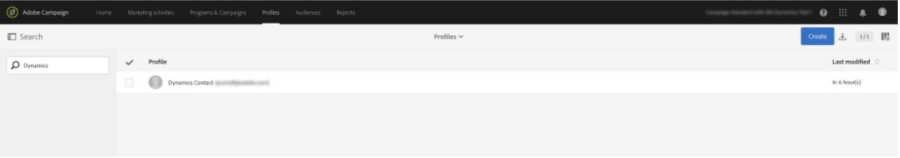
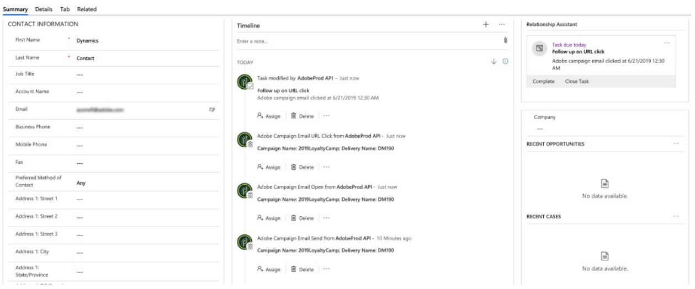
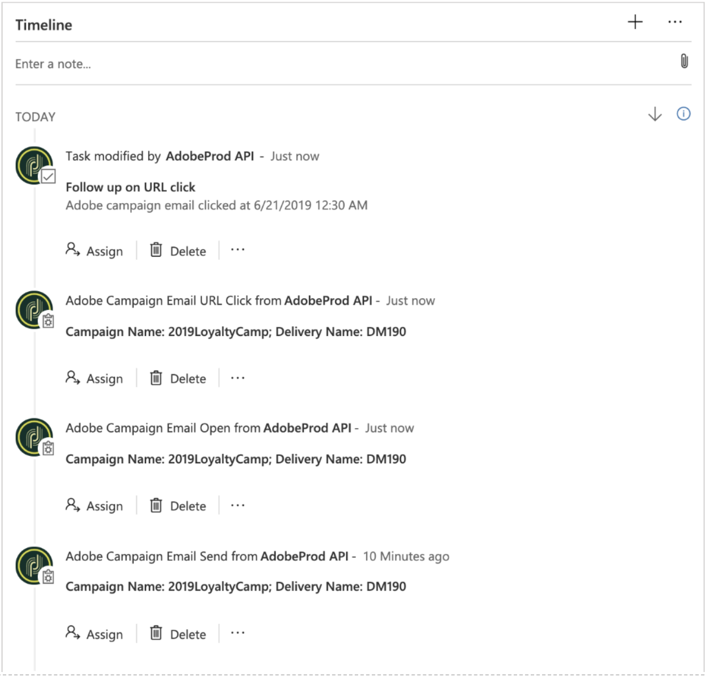
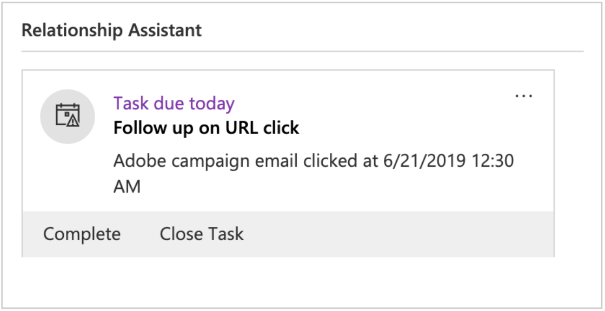
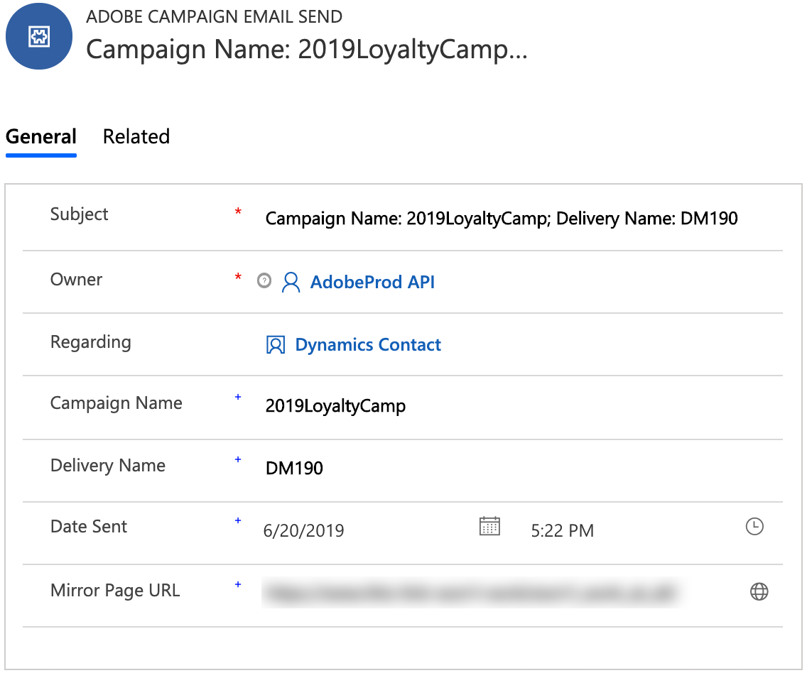
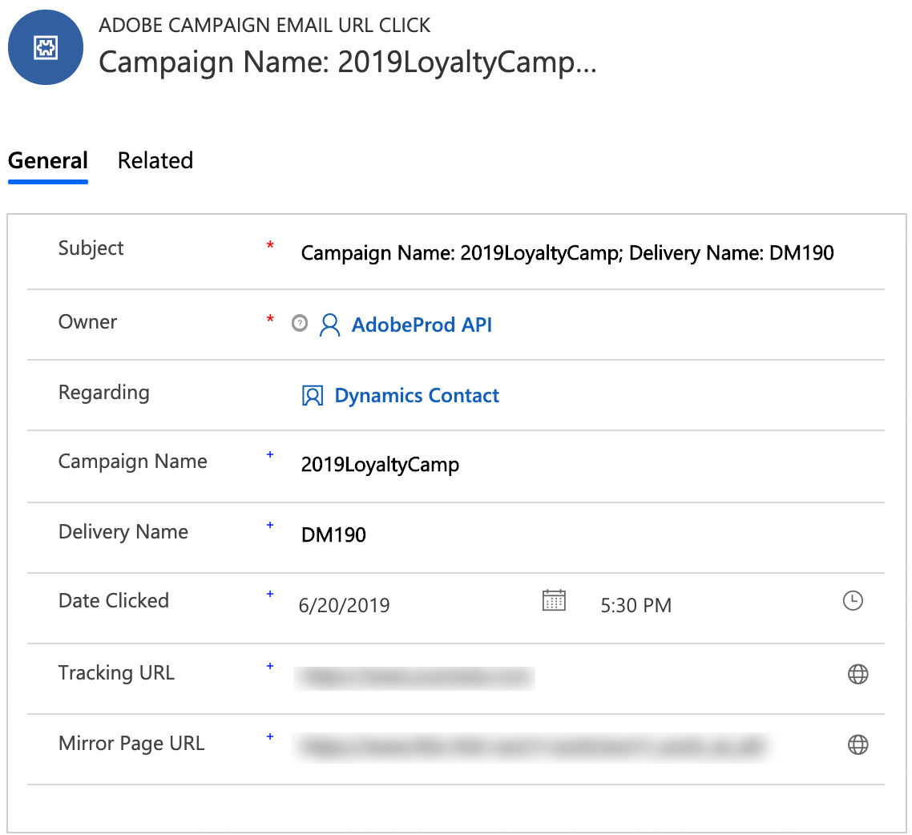

# Microsoft Dynamics 365統合の使用

Microsoft Dynamics 365とのAdobe Campaign Standard統合では、いくつかのデータフローが実行されます。 これらのフローについて詳しくは、[このページ &#x200B;](../../integrating/using/d365-acs-self-service-app-workflows.md)を参照してください。

データフローの詳細については、このドキュメントの[&#x200B; データフロー](#data-flows) セクションを参照してください。

## Adobe Campaign Standard ユーザーエクスペリエンス

Microsoft Dynamics 365で連絡先が作成、変更、または削除された場合（削除が有効になっている場合）、連絡先はCampaign Standardに送信されます。 これらの連絡先は、Campaignのプロファイル画面に表示され、マーケティングキャンペーンでターゲットにすることができます。 以下のプロファイル画面を参照してください。

Campaignでオプトアウト属性が変更されると、**一方向（CampaignからMicrosoft Dynamics 365）**&#x200B;または&#x200B;**双方向**&#x200B;のオプトアウト設定を選択した場合、および特定の属性が正しくマッピングされている場合、その属性はDynamics 365に反映されます。

## Microsoft Dynamics 365 ユーザーエクスペリエンス

出力の場合、次のメールマーケティングイベントがCampaignからDynamics 365に送信され、Microsoft Dynamics 365 タイムラインビューにカスタムアクティビティとして表示されます。

* Adobe Campaign メール送信

* Adobe Campaign メールを開く

* Adobe Campaign電子メール URL クリック

* Adobe Campaign メールバウンス

連絡先のタイムラインを表示するには、Dynamics 365 ドロップダウンメニューからSales Hubをクリックして、連絡先リストに移動します。 次に、左側のメニューバーの「連絡先」をクリックし、連絡先を選択します。

>[!NOTE]
>
>これらのイベントを表示するには、AppSourceの&#x200B;**Adobe Campaign for Microsoft Dynamics 365** アプリをMicrosoft Dynamics 365 インスタンスにインストールする必要があります。 [詳細情報](../../integrating/using/d365-acs-configure-d365.md#install-appsource-app)。

以下に、「Dynamics ユーザー」の連絡先画面のスナップショットを示します。 タイムラインビューでは、Dynamics ユーザーがキャンペーン名「2019LoyaltyCamp」と配信名「DM190」に関連付けられたメールを送信したことがわかります。 Dynamics ユーザーが電子メールを開き、電子メールのURLをクリックしました。これらのアクションは両方とも、以下にも表示されるイベントを作成しました。 右隅を見ると、リレーションシップアシスタント（RA）カードが表示されます。現在、クリックしたURLをフォローアップするタスクが含まれています。

Dynamics ユーザーのタイムラインビューの詳細については、以下を参照してください。

以下は、リレーションシップアシスタント（RA）カードのクローズアップです。 AppSource アプリには、Adobe メール URL クリック イベントを監視するワークフローが含まれています。 このイベントが発生すると、タスクが作成され、期日が設定されます。 これにより、タスクがRA カードに表示され、さらに可視化されます。 Adobe メールバウンスのイベントには、同様のワークフローがあり、無効なメールアドレスを紐付けるタスクが追加されます。 これらのワークフローは、ソリューションでオフにすることができます。

送信イベントの件名をクリックすると、以下のようなフォームが表示されます。 オープンイベントとバウンスイベントのフォームは類似しています。

メール URL クリックイベントのフォームは、クリックされたURLに追加の属性を追加します。

次に、属性と説明のリストを示します。

* **件名**: イベントの件名。メール配信のキャンペーン IDと配信IDで構成されます

* **所有者**: プロビジョニング後の手順で作成されたアプリケーションユーザー

* **関連**：連絡先の名前

* **キャンペーン名**: Campaign Standardのキャンペーン ID

* **配信名**: Campaign Standardの配信ID

* **送信日/開封日/クリック日/バウンス日**: イベントが作成された日時

* **トラッキング URL**: クリックされたURL

* **ミラーページ URL**：送信/開封/クリック/バウンスされたメールのミラーページのURL。 メールミラーページの有効期限は、対応するCampaign メールチャネルアクティビティの設定画面で変更できます。 [詳細情報](../../administration/using/configuring-email-channel.md#validity-period-parameters)。

>[!NOTE]
>
>オプトアウトの場合、オプトアウト属性がMicrosoft Dynamics 365で変更されると、**一方向（CampaignからMicrosoft Dynamics 365）**&#x200B;または&#x200B;**双方向** オプトアウト設定を選択した場合、および特定の属性が正しくマッピングされている場合、その属性はCampaignに反映されます。

## データフロー {#data-flows}

### 連絡先とカスタムエンティティのイングレス

新しいレコード、更新されたレコード、および削除されたレコード（メモ：削除は有効にする必要があります）は、Microsoft Dynamics 365連絡先テーブルからCampaign プロファイルテーブルに送信されます。

統合アプリケーション UIでテーブルマッピングを設定して、Microsoft Dynamics 365のテーブル属性をCampaign テーブル属性にマッピングできます。 必要に応じて、テーブルマッピングを変更して属性を追加または削除できます。

データフローの最初の実行は、「非アクティブ」とマークされたレコードを含む、マッピングされたすべてのレコードを転送するように設計されています。その後、統合は増分更新のみを処理します。 例外は、データが再生される場合や、フィルターが設定されている場合です。基本的な属性ベースのフィルタールールを設定して、Campaignに同期するレコードを決定できます。

基本的な置換ルールは、統合アプリケーション UIで属性値を別の値（例えば、「#00FF00」の「green」、「F」の1など）に置き換えるように設定できます。

レコードのボリュームによっては、最初のデータ転送にCampaign SFTP ストレージを使用する必要がある場合があります。 [詳細情報](#initial-data-transfer)。

連絡先のイングレスを機能させるには、Campaign プロファイルテーブル属性externalIdにDynamics 365 contact属性contactIdを入力する必要があります。 Campaign カスタムエンティティには、Dynamics 365の一意のID属性も入力する必要がありますが、この属性は、任意のCampaign カスタムエンティティ属性に保存できます（つまり、externalIdである必要はありません）。

>[!NOTE]
>
>カスタムエンティティのイングレスの場合、同期されたカスタムエンティティに対してDynamics 365内で変更追跡を有効にする必要があります。

#### カスタムエンティティ

[Microsoft Dynamics 365-Adobe Campaign Standard統合](../../integrating/using/d365-acs-get-started.md)では、カスタムエンティティがサポートされているため、Dynamics 365のカスタムエンティティをCampaignの対応するカスタムリソースに同期できます。

カスタムリソースの新しいデータは、セグメンテーションやパーソナライゼーションなど、いくつかの目的で使用できます。

統合では、リンクされたテーブルとリンクされていないテーブルの両方をサポートしています。 リンクは、最大3つのレベル（つまり、level1->level2->level3）までサポートされます。

>[!IMPORTANT]
>
>Campaign カスタムリソースレコードに個人情報が含まれている場合は、特定の推奨事項が適用されます。 詳しくは、[この節](../../integrating/using/d365-acs-notices-and-recommendations.md#acs-msdyn-manage-data)を参照してください。
>

カスタムエンティティデータフローを設定する際は、次の点に注意することが重要です。

* Campaign カスタムリソースの作成と変更は機密性の高い操作であり、エキスパートユーザーのみが実行する必要があります。
* カスタムエンティティのデータフローの場合、同期されたカスタムエンティティに対してDynamics 365内で変更追跡を有効にする必要があります。
* 統合の並列処理により、親レコードとリンクされた子レコードがDynamics 365で同じ時間に近いタイミングで作成された場合、新しい子レコードが親レコードの前にCampaignに書き込まれる可能性が少しあります。

* **1基数のシンプルリンク** オプションを使用して親と子がCampaign側でリンクされている場合、親レコードがCampaignに届くまで、子レコードは非表示のままになり、（UIまたはAPIを介して）アクセスできません。

* （Campaignで&#x200B;**1個の基数の単純なリンク**&#x200B;を想定）子レコードがDynamics 365で更新または削除され、その変更がCampaignに書き込まれる前に親レコードがCampaignに表示される場合（可能性は低いが、リモートの可能性がある）、その更新または削除はCampaignで処理されず、エラーがスローされます。 更新の場合、更新されたレコードを同期するために、該当するレコードをDynamics 365で再度更新する必要があります。 削除の場合、削除または更新するレコードがDynamics 365に存在しなくなったため、問題のレコードはCampaign側で個別に処理する必要があります。

* 隠れた子レコードがあり、それにアクセスする方法がないと思われる状況に遭遇した場合は、カーディナリティリンクの種類を&#x200B;**0または1つのカーディナリティシンプルリンク**&#x200B;に一時的に変更して、これらのレコードにアクセスできます。

Campaign カスタムリソースのより包括的な概要については、この節[を参照してください](../../developing/using/key-steps-to-add-a-resource.md)。

### メールマーケティングイベントフロー{#email-marketing-event-flow}

メールマーケティングイベントは、CampaignからMicrosoft Dynamics 365に送信され、タイムラインビューに表示されます。

サポートされるマーケティングイベントタイプ：
* 送信 – 受信者にメールを送信
* 開封 – 受信者が開封した電子メール
* クリック – 受信者がクリックしたメール内のURL
* バウンス – 受信者への電子メールでハードバウンスが発生した

Dynamics 365内には、次のイベント属性が表示されます。
* マーケティングキャンペーン名
* メール配信名
* タイムスタンプ
* メールミラーページ URL
* URL クリック済み（クリックイベントのみ）

メールマーケティングイベントは、タイプ（送信、開く、クリック、バウンス）によって有効/無効にできるため、選択したイベントタイプのみがDynamics 365に渡されます。

### オプトアウトフロー {#opt-out-flow}

オプトアウト（例：「をブロックリストに加える」など）値は、システム間で同期されます。オンボーディング時に次のオプションから選択できます。

* **単方向（Microsoft Dynamics 365からCampaign）**: Dynamics 365はオプトアウトの信頼できる唯一の情報源です。 オプトアウト属性は、Dynamics 365からCampaign Standardに一方向で同期されます。」
* **単方向（キャンペーンからMicrosoft Dynamics 365）**: Campaign Standardはオプトアウトの信頼できる唯一の情報源です。 オプトアウト属性は、Campaign StandardからDynamics 365まで一方向に同期されます
* **双方向**: Dynamics 365とCampaign Standardはどちらも信頼できる情報源です。 オプトアウト属性は、Campaign StandardとDynamics 365間で双方向で同期されます

別の方法として、システム間のオプトアウト同期を管理する個別のプロセスがある場合、統合のオプトアウトデータフローを無効にすることができます。

>[!NOTE]
>
>統合アプリケーション UIでは、**一方向（Microsoft Dynamics 365からCampaignへ）**&#x200B;と&#x200B;**双方向**&#x200B;のオプトアウトユースケースが別のオプトアウトワークフローで設定されています。 [詳細情報](../../integrating/using/d365-acs-self-service-app-data-sync.md#opt-in-out-wf)。
>
>**一方向（Campaign to Microsoft Dynamics 365）** オプトアウトのユースケースは例外です。このユースケースはingress （Contact to Profile）ワークフロー内で設定されます。
>

ビジネス要件は企業間で異なる場合があるため、オプトアウトフローマッピングは、お客様が指定する必要があります。 Campaign側では、オプトアウトマッピングに使用できるのはOOTB オプトアウト属性のみです。

* ⌥ブロックリストに加える
* denyListEmail
* denyListFax
* denyListMobile
* denyListPhone
* denyListPostalMail
* denyListPushnotification
* ccpaOptOut

Dynamics 365では、ほとんどのオプトアウトフィールドに「donot」というプレフィックスが付いています。ただし、データタイプが互換性がある場合は、オプトアウトの目的で他の属性を使用することもできます。

### 初期データ転送 {#initial-data-transfer}

Microsoft Dynamics 365から取り込むレコード数によっては、最初のデータ転送に時間がかかる場合があります。 最初のデータ転送後、統合は増分更新を取得します。
