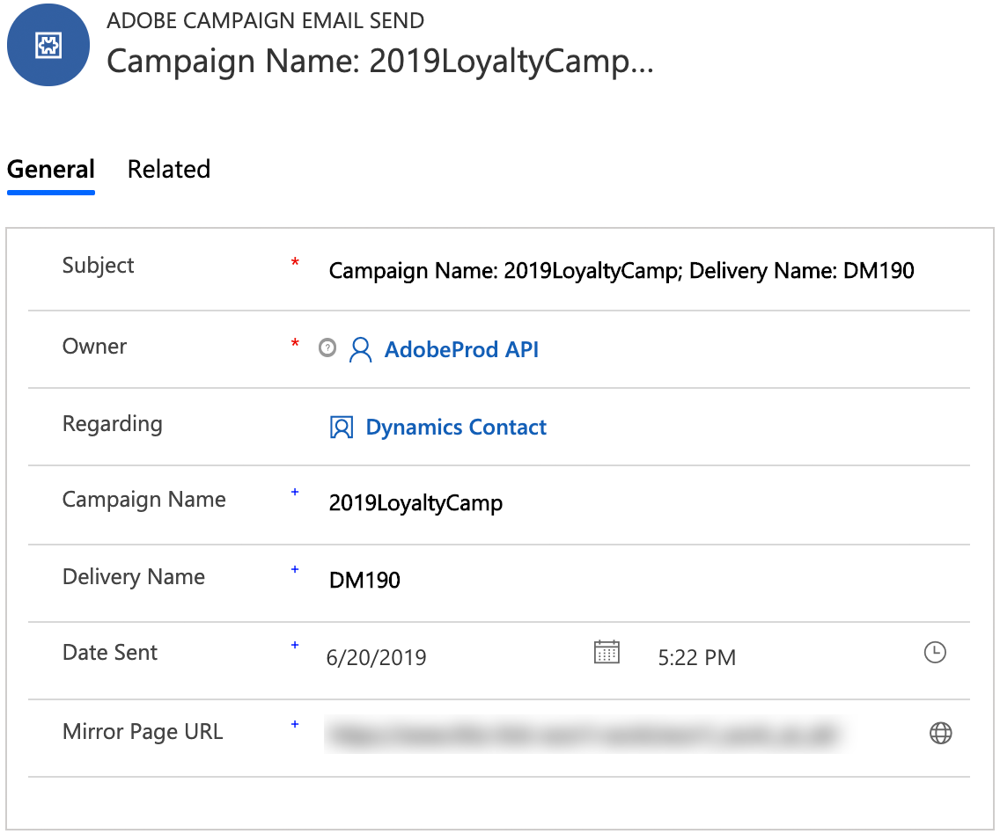

# Microsoft Dynamics 365統合を使用する

Microsoft Dynamics 365とのAdobe Campaign Standard統合で実行されるデータフローはいくつかあります。 これらのフローの詳細は[このページ](../../integrating/using/d365-acs-self-service-app-workflows.md)に記載されています。

データフローの詳細については、このドキュメントの[データフロー](#data-flows)のセクションを参照してください。

## Adobe Campaign Standardユーザーエクスペリエンス

Microsoft Dynamics 365で連絡先が作成、変更、または削除された場合（削除が有効な場合）、その連絡先はCampaign Standardに送信されます。 これらの連絡先は、キャンペーンのプロファイル画面に表示され、マーケティングキャンペーンでターゲット設定できます。 下のプロファイル画面を参照してください。

キャンペーンでオプトアウト属性を変更すると、**単方向(Microsoft Dynamics 365へのキャンペーン)**&#x200B;または&#x200B;**双方向**&#x200B;オプトアウト設定を選択し、その特定の属性が正しくマッピングされている場合、Dynamics 365に反映されます。

## Microsoft Dynamics 365ユーザーエクスペリエンス

出力の場合、次の電子メールマーケティングイベントがキャンペーンからDynamics 365に送信され、Microsoft Dynamics 365タイムライン表示にカスタムアクティビティとして表示されます。

* Adobe Campaign電子メール送信

* Adobe Campaign電子メールを開く

* Adobe Campaign電子メールのURLのクリック

* Adobe Campaignの電子メールのバウンス

連絡先のタイムラインを表示するには、[Dynamics 365]ドロップダウンメニューの[販売ハブ]をクリックして、連絡先リストに移動します。 次に、左側のメニューバーで[接触]をクリックし、接触を選択します。

>[!NOTE]
>
>これらのイベントを表示するには、AppSourceのMicrosoft Dynamics 365 **アプリの** Adobe CampaignをMicrosoft Dynamics 365インスタンスにインストールする必要があります。 [詳細情報](../../integrating/using/d365-acs-configure-d365.md#install-appsource-app)。

下に、「Dynamics User」の連絡先画面のスナップショットが表示されます。 タイムライン表示で、Dynamics Userがキャンペーン名&quot;2019LoyaltyCamp&quot;と配信名&quot;DM190&quot;に関連付けられた電子メールを送信したことがわかります。 Dynamicsユーザーが電子メールを開き、電子メール内のURLもクリックしました。これらの操作の両方でイベントが作成され、次にも示します。 右隅を見ると、Relationship Assistant(RA)カードが表示されます。現在、クリックされたURLを追跡するためのタスクが含まれています。

Dynamics Userのタイムライン表示を閉じる方法については、以下を参照してください。

以下は、Relationship Assistant(RA)カードのクローズアップです。 AppSourceアプリには、Adobeの電子メールURLクリックイベントを監視するワークフローが含まれています。 このイベントが発生すると、タスクが作成され、期限が設定されます。 これにより、タスクがRAカードに表示され、さらに目に見えるようになります。 Adobeの電子メールバウンスイベントにも同様のワークフローがあり、無効な電子メールアドレスを調整するタスクを追加します。 これらのワークフローは、ソリューションでオフにできます。

送信イベントの件名をクリックすると、次のようなフォームが表示されます。 「開く」と「バウンス」のイベントのフォームは似ています。

電子メールURLのクリックイベントのフォームに、クリックされたURLの属性が追加されます。

属性と説明のリストを次に示します。

* **件名**:イベントの主題電子メール配信のキャンペーンIDと配信IDで構成される

* **所有者**:プロビジョニング後の手順で作成されるアプリケーションユーザー

* **関連**:連絡先の名前

* **キャンペーン名**:Campaign Standard内のキャンペーンID

* **配信名**:Campaign Standard内の配信ID

* **送信日/開封日/クリック日/バウンス日**:イベントが作成された日時

* **追跡URL**:クリックされたURL

* **ミラーページURL**:送信、開く、クリック、バウンスされた電子メールのミラーページのURL。電子メールミラーページの有効期限は、対応するキャンペーン電子メールチャネルアクティビティの設定画面で変更できます。 [詳細情報](../../administration/using/configuring-email-channel.md#validity-period-parameters)。

>[!NOTE]
>
>オプトアウトの場合、オプトアウト属性がMicrosoft Dynamics 365で変更されると、**単方向(Microsoft Dynamics 365へのキャンペーン)**&#x200B;または&#x200B;**双方向**&#x200B;オプトアウト設定を選択し、その属性が正しくマッピングされている場合、キャンペーンに反映されます。

## データフロー {#data-flows}

### 連絡先とカスタムエンティティの入力

新しいレコード、更新されたレコード、削除されたレコード(注意：削除する必要があります)が、Microsoft Dynamics 365連絡先テーブルからキャンペーンプロファイルテーブルに送信されます。

統合アプリケーションUIでテーブルマッピングを設定して、Microsoft Dynamics 365のテーブル属性をキャンペーンテーブル属性にマップできます。 必要に応じて、テーブルのマッピングを変更し、属性を追加または削除できます。

データ・フローの最初の実行は、「非アクティブ」とマークされたレコードを含む、すべてのマッピング済みレコードを転送するように設計されています。その後、統合は増分更新のみ処理します。 例外は、データが再生される場合、またはフィルターが設定されている場合です。基本的な属性ベースのフィルタリングルールを設定して、キャンペーンに同期するレコードを決定できます。

統合アプリケーションUIで基本的な置換ルールを設定して、属性値を別の値に置き換えることができます（例：「#00FF00」の場合は「green」、1の場合は「F」）。

レコードの量に応じて、キャンペーンのSFTPストレージを初期データ転送に使用する必要がある場合があります。 [詳細情報](#initial-data-transfer)。

キャンペーンプロファイルテーブルの属性externalIdには、連絡先の入力が機能するように、Dynamics 365連絡先属性contactIdを設定する必要があります。 キャンペーンのカスタムエンティティにもDynamics 365の一意のID属性を設定する必要があります。ただし、この属性は、キャンペーンのカスタムエンティティ属性に格納できます（externalIdである必要はありません）。

>[!NOTE]
>
>カスタムエンティティの入力の場合、同期されたカスタムエンティティに対してDynamics 365内で変更追跡を有効にする必要があります。

#### カスタムエンティティ

[Microsoft Dynamics 365-Adobe Campaign Standard統合](../../integrating/using/d365-acs-get-started.md)は、カスタムエンティティをサポートしており、Dynamics 365のカスタムエンティティをキャンペーン内の対応するカスタムリソースと同期できます。

カスタムリソースの新しいデータは、セグメント化やパーソナライゼーションなど、いくつかの目的で使用できます。

統合では、リンクされたテーブルとリンクされていないテーブルの両方がサポートされます。 リンクは、最大3つのレベル(level1->level2->level3)までサポートされます。

>[!IMPORTANT]
>
>キャンペーンのカスタムリソースレコードに個人情報が含まれている場合は、特定のレコメンデーションが適用されます。 詳しくは、[この節](../../integrating/using/d365-acs-notices-and-recommendations.md#acs-msdyn-manage-data)を参照してください。

カスタムエンティティデータフローを設定する場合は、次の点に注意してください。

* キャンペーンのカスタムリソースを作成および変更する操作は、機密性の高い操作です。この操作は、エキスパートユーザーのみが実行する必要があります。
* カスタムエンティティデータフローの場合、同期されたカスタムエンティティに対して、Dynamics 365内で変更追跡を有効にする必要があります。
* Dynamics 365で親子レコードとリンク子レコードがほぼ同時に作成された場合、統合の並行処理が原因で、新しい子レコードが親レコードの前にキャンペーンに書き込まれる可能性が少しあります。

* 親レコードと子レコードがキャンペーン側で&#x200B;**1基の基数単純リンク**&#x200B;オプションを使用してリンクされている場合、親レコードがキャンペーンに到達するまで、子レコードは非表示になり、アクセスできなくなります。

* (キャンペーン内の&#x200B;**1個の基数単純リンク**)Dynamics 365で子レコードが更新または削除され、親レコードがキャンペーンに表示される前にその変更がキャンペーンに書き込まれた場合、その更新または削除はキャンペーンで処理されず、エラーが発生します。 更新の場合、更新したレコードを同期するには、問題のレコードをDynamics 365で再び更新する必要があります。 削除の場合、削除または更新するDynamics 365にレコードがなくなったので、問題のレコードは、キャンペーン側で別々に処理する必要があります。

* 非表示の子レコードがあり、それらにアクセスできないと思われる状況に陥った場合は、カーディナリティリンクの種類を&#x200B;**0または1カーディナリティ単純リンク**&#x200B;に一時的に変更して、これらのレコードにアクセスできます。

キャンペーンのカスタムリソースの詳細な概要は、この節](../../developing/using/key-steps-to-add-a-resource.md)に[あります。

### 電子メールマーケティングイベントのフロー{#email-marketing-event-flow}

電子メールマーケティングイベントは、キャンペーンからMicrosoft Dynamics 365に送信され、タイムライン表示に表示されます。

サポートされるマーケティングイベントタイプ:
* 送信 —受信者に電子メールを送信
* 開く —受信者が開いた電子メール
* クリック —受信者がクリックした電子メール内のURL
* バウンス —受信者への電子メールがハードバウンスを経験した

Dynamics 365内には、次のイベント属性が表示されます。
* マーケティングキャンペーン名
* 電子メール配信名
* タイムスタンプ
* 電子メールミラーページURL
* URLがクリックされました(クリックイベントのみ)

電子メールマーケティングイベントは、タイプ（送信、開く、クリック、バウンス）別に有効/無効を切り替えることができるので、選択したイベントタイプのみがDynamics 365に渡されます。

### オプトアウトフロー{#opt-out-flow}

オプトアウト(例：ブロックリスト)値はシステム間で同期されます。オンボーディングの際は、次のオプションから選択できます。

* **単方向(Microsoft Dynamics 365からキャンペーン)**:Dynamics 365は、オプトアウトの真実の源です。オプトアウト属性は、Dynamics 365からCampaign Standardに一方向で同期されます」
* **単方向(Microsoft Dynamics 365とのキャンペーン)**:Campaign Standardは、オプトアウトの真の原因です。オプトアウト属性は、Campaign StandardからDynamics 365への一方向で同期されます
* **双方向**:Dynamics 365 ANDCampaign Standardはどちらも真実の源です。オプトアウト属性は、Campaign StandardとDynamics 365の間で双方向に同期されます

また、システム間のオプトアウト同期を別のプロセスで管理する場合は、統合のオプトアウトデータフローを無効にできます。

>[!NOTE]
>
>統合アプリケーションUIでは、**単方向(Microsoft Dynamics 365からキャンペーン)**&#x200B;および&#x200B;**双方向**&#x200B;オプトアウトの使用例が、個別のオプトアウトワークフローで設定されています。 [詳細情報](../../integrating/using/d365-acs-self-service-app-data-sync.md#opt-in-out-wf)。
>
>**単方向(Microsoft Dynamics 365へのキャンペーン)**&#x200B;オプトアウトの使用例は例外です。入力(プロファイルへの接触)ワークフロー内で設定されます。

オプトアウトフローマッピングは、会社間でビジネス要件が異なる場合があるので、顧客が指定します。 キャンペーン側では、OOTBオプトアウト属性のみがオプトアウトマッピングに使用できます。

* ブロックリスト
* denyListEmail
* denyListFax
* denyListMobile
* denyListPhone
* denyListPostalMail
* denyListPushnotification
* ccpaOptOut

Dynamics 365では、ほとんどのオプトアウトフィールドには「ドノット」プレフィックスが付きます。ただし、データタイプに互換性がある場合は、他の属性をオプトアウト目的に使用することもできます。

### 初期データ転送{#initial-data-transfer}

Microsoft Dynamics 365から取り込むレコードの数によっては、初期データ転送に時間がかかる場合があります。 最初のデータ転送の後、統合は増分更新を取得します。
