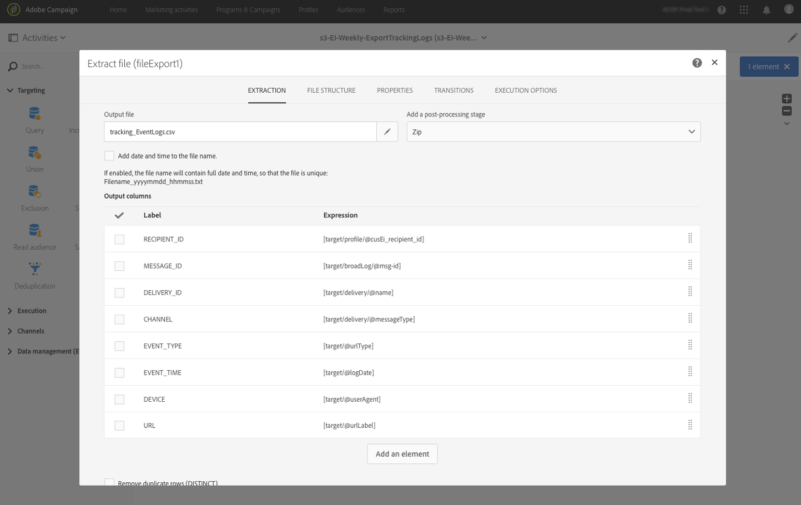

# Campaign から Adobe Experience Platform へのデータのエクスポート {#sources}

Campaign StandardデータをAdobe Real-time Customer Data Platform(RTCDP) に書き出すには、まずCampaign Standardでワークフローを作成し、Amazonストレージサービス (S3) または Azure Blob ストレージの場所に、共有するデータを書き出す必要があります。

ワークフローを構成し、ストレージの場所にデータが送信されたら、S3 または Azure Blob のストレージの場所を Adobe Experience Platform の&#x200B;**ソース**&#x200B;として接続する必要があります。

>[!NOTE]
>
>Campaign で生成されたデータのみ（送信数、開封数、クリック数など）をAdobe Experience Platform にエクスポートすることをお勧めします。サードパーティのソース（CRM など）から取り込まれたデータは、Adobe Experience Platform に直接読み込む必要があります。

## 「Campaign Standard」でのエクスポートワークフローの作成

Campaign Standardから S3 または Azure BLOB ストレージの場所にデータをエクスポートするには、エクスポートするデータをターゲティングするワークフローを作成し、ストレージの場所に送信する必要があります。

これをおこなうには、以下を追加して設定します。

* A **[!UICONTROL Extract file]** 「 」アクティビティを使用してターゲットデータを CSV ファイルに抽出します。 このアクティビティの設定方法について詳しくは、[こちらの節](../../automating/using/extract-file.md)を参照してください。

  

* A **[!UICONTROL Transfer file]** 「 」アクティビティを使用して、CSV ファイルをストレージの場所に転送します。 分割アクティビティの設定方法について詳しくは、[こちらの節](../../automating/using/transfer-file.md)を参照してください。

  

例えば、以下のワークフローでは、ログを定期的に CSV ファイルに抽出し、そのファイルをストレージの場所に転送します。

データ管理ワークフローの例は、 [ワークフローの使用例](../../automating/using/about-workflow-use-cases.md#management) 」セクションに入力します。

関連トピック ： 

* [データ管理アクティビティ](../../automating/using/about-data-management-activities.md)
* [データのインポートおよびエクスポートについて](../../automating/using/about-data-import-and-export.md)

## ストレージの場所をソースとして接続する

Amazonストレージサービス (S3) または Azure BLOB ストレージの場所を **ソース** のAdobeexperience Platform は、次のとおりです。 これらの各手順について詳しくは、[ソースコネクタのドキュメント](https://experienceleague.adobe.com/docs/experience-platform/sources/home.html?lang=ja)を参照してください。

1. AdobeExperience Platform 内 **[!UICONTROL Sources]** メニューで、ストレージの場所への接続を作成します。

   * [Amazon S3 ソース接続の作成](https://experienceleague.adobe.com/docs/experience-platform/sources/ui-tutorials/create/cloud-storage/s3.html?lang=ja)
   * [Azure Blob コネクタ](https://experienceleague.adobe.com/docs/experience-platform/sources/connectors/cloud-storage/blob.html?lang=ja)

   >[!NOTE]
   >
   >ストレージの場所は、Amazon S3、パスワードを使用した SFTP、SSH キーを使用した SFTP、または Azure Blob 接続に設定できます。 Adobe Campaign にデータを送信する際には、Amazon S3 または Azure Blob を使用する方法を推奨します。

   

1. クラウドストレージのバッチ接続のデータフローを設定します。 データフローとは、ストレージの場所からデータを取得し、Adobe Experience Platform データセットに取り込むようスケジュール設定されたタスクです。 この手順では、データ選択や、CSV フィールドの XDM スキーマへのマッピングを含め、ストレージの場所からのデータ取り込みを設定できます。

   詳しくは、[このページ](https://experienceleague.adobe.com/docs/experience-platform/sources/ui-tutorials/dataflow/cloud-storage.html?lang=ja)を参照してください。

   

1. ソースの設定が完了すると、Adobe Experience Platform は指定したストレージの場所からファイルをインポートします。

   この操作は、必要に応じてスケジュールできます。 エクスポートの実行回数は、インスタンスに既に存在する負荷に応じて、1 日最大 6 回までとすることをお勧めします。
