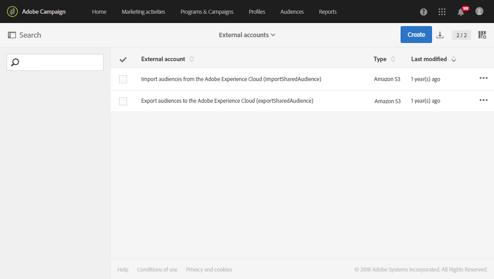
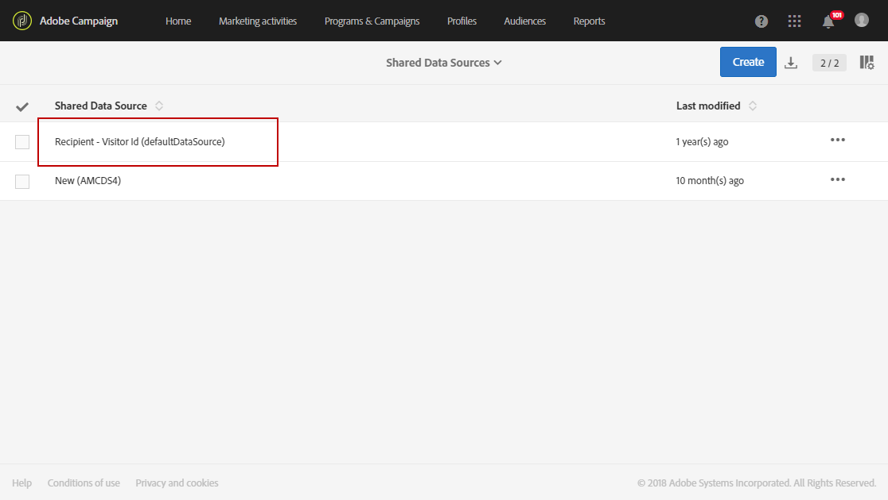
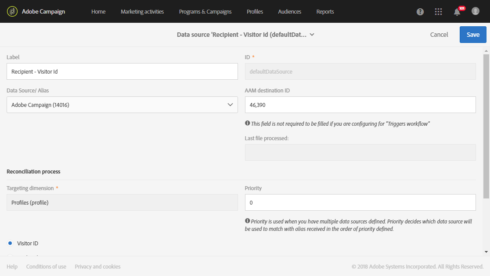

# Audience Manager または People コアサービスとの統合のプロビジョニングと設定{#integration-with-audience-manager-or-people-core-service}

Adobe CampaignのAudience ManagerとPeople コアのプロビジョニングと設定には、次の2つの手順が実行されます。[Adobeへのリクエストの送信](#submitting-request-to-adobe)、[Adobe Campaignでの統合の設定](#configuring-the-integration-in-adobe-campaign)。

## アドビへのリクエストの送信 {#submitting-request-to-adobe}

Audience Manager（AAM）またはPeople コアサービスとの統合により、Adobe Campaignでオーディエンスまたはセグメントをインポートおよびエクスポートできます。

この統合を最初に設定する必要があります。 この統合のプロビジョニングをリクエストするには、Adobe サポートに次の情報をお問い合わせください。

<table> 
 <tbody> 
  <tr> 
   <td> <strong>依頼のタイプ：</strong>  </td> 
   <td> AAM／People コアサービスと Campaign の統合の設定 </td> 
  </tr> 
  <tr> 
   <td> <strong>組織名：</strong>  </td> 
   <td> 所属する組織の名前 </td> 
  </tr> 
  <tr> 
   <td> <strong>IMS Org ID</strong>  </td> 
   <td> 組織ID。  組織IDを見つけるには、<a href="https://experienceleague.adobe.com/docs/core-services/interface/administration/organizations.html?lang=ja">このページ </a>を参照してください</td> 
  </tr> 
  <tr> 
   <td> <strong>環境：</strong>  </td> 
   <td> 例：本番環境 </td> 
  </tr> 
  <tr> 
   <td> <strong>AAM または People コアサービス</strong>  </td> 
   <td> 例： Adobe Audience Manager プロビジョニングチームに Audience Manager のライセンスを所有しているかどうかを確認してください。</td> 
  </tr> 
  <tr> 
   <td> <strong>宣言済み ID または訪問者 ID</strong>  </td> 
   <td> 例：宣言済み ID </td> 
  </tr> 
  <tr> 
   <td> <strong>追加情報</strong>  </td> 
   <td> 役に立つ情報またはコメント（ある場合） </td> 
  </tr> 
 </tbody> 
</table>

## Adobe Campaignでの統合の設定 {#configuring-the-integration-in-adobe-campaign}

このリクエストを送信した後、Adobeは統合のプロビジョニングに進み、設定を確定するための詳細と情報を提供するためにお客様に連絡します。

* [手順 1：Adobe Campaign での外部アカウントの設定または確認](#step-1--configure-or-check-the-external-accounts-in-adobe-campaign)
* [手順2：データソースの設定](#step-2--configure-the-data-sources)
* [手順 3：Campaignトラッキングサーバーの設定](#step-3--configure-campaign-tracking-server)
* [手順 4：訪問者 ID サービスの設定](#step-4--configure-the-visitor-id-service)

### 手順 1：Adobe Campaign での外部アカウントの設定または確認 {#step-1--configure-or-check-the-external-accounts-in-adobe-campaign}

まず、Adobe Campaignで外部アカウントを設定または確認する必要があります。 これらのアカウントは、Adobeによって設定され、必要な情報を伝える必要があります。

それには、次の手順に従います。

1. 詳細設定メニューから、**管理/ アプリケーション設定/外部アカウント**&#x200B;を選択します。

   この統合で使用可能な次の外部アカウントのいずれかを選択します。

   

1. **[!UICONTROL Receiver server]**&#x200B;を次の形式で入力
1. **[!UICONTROL AWS Access Key ID]**、**[!UICONTROL Secret Access Key]**、**[!UICONTROL AWS Region]**&#x200B;を入力します。

これで、この統合に対して外部アカウントが設定されました。

### 手順2：データソースの設定 {#step-2--configure-the-data-sources}

Audience manager内で、Adobe Campaign（MID）とAdobe Campaign（DeclaredId）の2つのデータソースが作成されます。 同時に、Adobe Campaignでは、次のふたつのデータソースを利用できます。

* **[!UICONTROL Recipient - Visitor ID (Defaultdatasources)]**：これは、訪問者ID用にデフォルトで設定された、すぐに使用できるデータソースです。 Campaign から作成されたセグメントは、このデータソースの一部になります。
* **宣言済みID** データソース：このデータソースを作成し、Audience Managerの&#x200B;**[!UICONTROL DeclaredId]** データソース定義とマッピングする必要があります。

ドメインが異なる複数のweb サイトの場合、Adobe CampaignはECIDに基づく紐付けをサポートしません。

**[!UICONTROL Recipient - Visitor ID (Defaultdatasources)]** データソースを設定するには：

1. **[!UICONTROL Administration]** > **[!UICONTROL Application settings]** > **[!UICONTROL Shared Data Sources]**&#x200B;で、**[!UICONTROL Recipient - Visitor ID (Defaultdatasources)]**&#x200B;を選択します。

   

1. **[!UICONTROL Data Source/ Alias]** ドロップダウンで「**[!UICONTROL Adobe Campaign]**」を選択します。
1. Adobeから提供された&#x200B;**[!UICONTROL AAM Destination ID]**&#x200B;を入力します。

   

1. **[!UICONTROL Reconciliation process]** カテゴリでは、紐付け条件を変更せず、常に&#x200B;**[!UICONTROL Visitor ID]**&#x200B;を使用することをお勧めします。
1. 「**[!UICONTROL Save]**」をクリックします。

**[!UICONTROL Declared ID]** データソースを作成するには：

1. **[!UICONTROL Administration]** > **[!UICONTROL Application settings]** > **[!UICONTROL Shared Data Sources]**&#x200B;で、「**[!UICONTROL Create]**」ボタンをクリックします。
1. データソースの&#x200B;**[!UICONTROL Label]**&#x200B;を編集します。
1. **[!UICONTROL Data Source/ Alias]** ドロップダウンで、Audience Managerの&#x200B;**[!UICONTROL DeclaredID]** データソースに対応するData Sourceを選択します。
1. Adobeが提供する&#x200B;**[!UICONTROL Data Source / Alias]**&#x200B;と&#x200B;**[!UICONTROL AAM Destination ID]**&#x200B;を入力して、データソースを設定します。
1. 必要に応じて&#x200B;**[!UICONTROL Reconciliation process]**&#x200B;を設定します。
1. 「**[!UICONTROL Save]**」をクリックします。

>[!NOTE]
>
>[Campaign-トリガー統合](../../integrating/using/configuring-triggers-in-experience-cloud.md)の共有データソースを設定する場合、**[!UICONTROL AAM Destination ID]** フィールドは必須ではありません。 **[!UICONTROL Priority]**&#x200B;は、トリガー - Campaign統合を設定する場合にのみ必要です。 優先度は、最初に設定するData Sourceを決定します。 優先度には、1または100などの任意の数値を指定できます。 優先度が高いほど、紐付け時の優先度が高くなります。

### 手順 3：Campaignトラッキングサーバーの設定 {#step-3--configure-campaign-tracking-server}

People コアサービスまたは Audience Manager との統合を設定する場合は、Campaign トラッキングサーバーも設定する必要があります。

共有オーディエンスが訪問者 ID で機能できるようにするには、トラッキングサーバードメインを、クリックした URL またはメイン web サイトのサブドメインにする必要があります。

>[!IMPORTANT]
>
> Campaign トラッキングサーバーがドメインに登録されていることを確認する必要があります（CNAME）。 ドメイン名設定に関する詳細については、[この記事](https://helpx.adobe.com/jp/campaign/kb/domain-name-delegation.html)を参照してください。

### 手順 4：訪問者 ID サービスの設定 {#step-4--configure-the-visitor-id-service}

訪問者 ID サービスを web プロパティや web サイトで設定したことがない場合は、次の[ドキュメント](https://experienceleague.adobe.com/docs/id-service/using/implementation/setup-aam-analytics.html?lang=ja)を参照してサービスの設定方法を確認するか、次の[ビデオ](https://helpx.adobe.com/jp/marketing-cloud/how-to/email-marketing.html#step-two)をご覧ください。

Experience Cloud ID サービスの `setCustomerID` 関数と統合コード `AdobeCampaignID` を使用して、顧客 ID を宣言済み ID と同期します。 `AdobeCampaignID` は、[手順 2：データソースの設定](#step-2--configure-the-data-sources)で設定した受信者データソースに設定された調整キーの値と一致させる必要があります。

設定とプロビジョニングが完了し、統合を使用してオーディエンスやセグメントのインポートおよびエクスポートを行えるようになりました。
