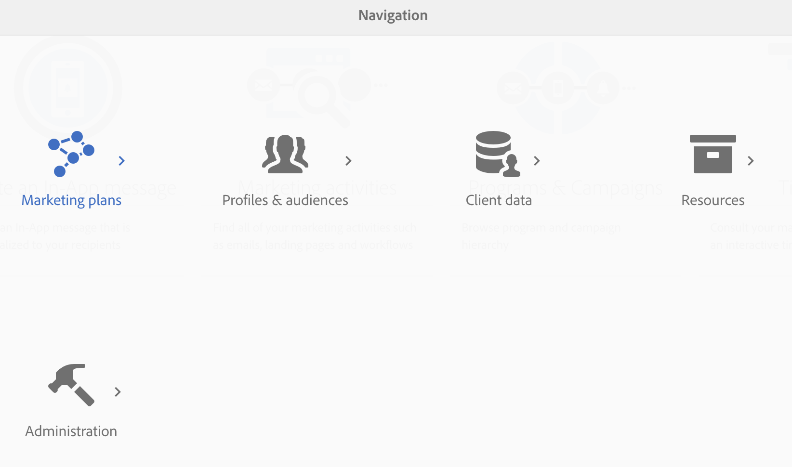
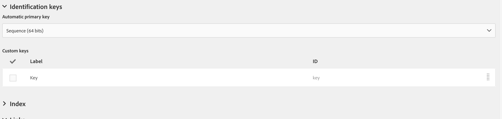
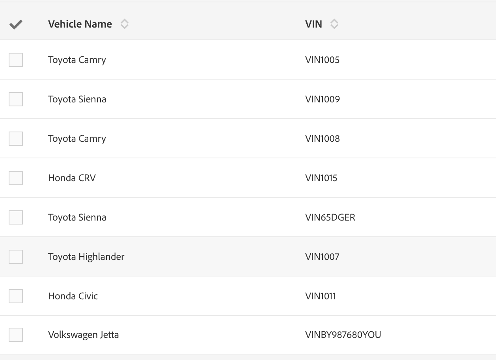

# キャンペーンのカスタムリソースとDynamics 365カスタムエンティティのマッピング

Adobe Campaign StandardとMicrosoft Dynamics 365の統合のコンテキストで、カスタムリソースとカスタムエンティティをマッピングする方法を説明します。

## 前提条件

新しいバージョンの [Microsoft Dynamics 365とAdobe Campaign Standardの統合により](../../integrating/using/working-with-campaign-standard-and-microsoft-dynamics-365.md) 、カスタムエンティティがサポートされます。  これにより、Dynamics 365のカスタムエンティティを、対応するカスタムリソースにキャンペーンで複製できます。

複製が完了すると、カスタムリソースの新しいデータは、セグメント化やパーソナライゼーションなど、複数の目的で使用できます。

>[!CAUTION]
>
>キャンペーンのカスタムキャンペーンレコードに、顧客の使用に適した個人情報が含まれている場合は、そのレコードを対応するキャンペーンプロファイルレコード（直接または他のカスタムリソースを介して）にリンクし、プロファイルレコードのプライバシー関連の削除で個人情報を削除できます。エンティティ間のリンクおよび削除のオプションは、この連鎖的な削除を有効にするように設定する必要があります。 個人情報は、リソースにリンクされていないカスタムリソースに入力しないでください。プロファイル

このリンクで、キャンペーンのカスタムリソースの詳細な概 [要を確認できます](../../developing/using/key-steps-to-add-a-resource.md)。

カスタムエンティティの統合を設定するには、adobe-support@unifisoftware.comにアクセスし [て](mailto:adobe-support@unifisoftware.com) 、この処理をリクエストします。  Unifiでは、両方のシステムのカスタムエンティティテーブルの名前と、必要な属性マッピングが必要です。  その後、Unifiは対応するジョブとスケジュールを作成します。

カスタムエンティティのサポートの使用例は、「使用事例」の節に [示されています](../../integrating/using/map-campaign-custom-resources-and-dynamics-365-custom-entities.md#UC)。

>[!CAUTION]
>
>* 統合で使用するには、Campaign Standard19.4のバージ **ョンより前に発行されたカスタムリソースを** 、再発行する必要があります。
>* Campaign Standardのカスタムリソースの作成と変更は、機密性の高い操作で、エキスパートユーザーのみが実行する必要があります。

## 使用例

### 開始状態

顧客は、Dynamics 365で事前定義されたカスタムエンティティ車両と、対応するカスタムリソース車両をCampaign Standardで事前定義。  顧客がUnifiにカスタムエンティティマッピングの詳細を提供し、UnifiはUnifiで車両カスタムリソースのジョブとスケジュールを設定しました。

|   | Microsoft Dynamics 365 | Adobe Campaign Standard | メモ |
|---|---|---|---|
| トップレベルエンティティ | 連絡先 | プロファイル | 標準の、あらかじめ用意されているエンティティ |
| リンクエンティティ | 車両 — 新しいカスタムエンティティ | 車両 — 新しいカスタムリソース | 新しいカスタムエンティティ |
| リンクタイプ | N:1との連絡先への親のリンク | Dynamics 365と同様 — 詳しくは、以下のキャンペーンの節を参照してください |   |

### Dynamics 365の構成

Dynamics 365のこの顧客のカスタムエンティティは、Dynamics 365の横のドロップダウンをクリックして、Salesダッシュボードで表示できます。  この顧客のカスタムエンティティは、の下にグループ化されま **[!UICONTROL Extensions]**&#x200B;す。

車両のデータは、カスタムエンティティをクリックすることで表 **[!UICONTROL vehicle]** 示できます。  下記の車のリストを参照。

エンティティとエンテ **[!UICONTROL vehicle]** ィティの関 **[!UICONTROL Contact]** 係は以下のとおりです。 **[!UICONTROL Parental]** が選択されました **[!UICONTROL Type of Behavior]**。

### Campaign Standard

キャンペーンでは、左上隅のをクリックし、を選択することで、顧客 **[!UICONTROL Adobe Campaign]** のカスタムリソースを表示できま **[!UICONTROL Client data]**&#x200B;す。

### カスタムリソースとカスタムエンティティのマッピング

カスタ **[!UICONTROL vehicle]** ムリソースは、顧客が事前に定義し、クライアントデータに表示する必要があります。ただし、以下に示すカスタムリソースの作成手順に **[!UICONTROL vehicle]** ついて説明します。

左上隅 **[!UICONTROL Adobe Campaign]** のをクリックし、をクリックします **[!UICONTROL Administration > Development > Custom Resources]**。

1. をクリックしま **[!UICONTROL Custom Resources]**&#x200B;す。
1. ボタンをクリッ **[!UICONTROL Create]** クします。  ポップアップウィンドウが開きます。
1. を選択 **[!UICONTROL Create a new resource]** し、ラベ **[!UICONTROL Vehicle]** ルとIDとして入力します。
1. クリック **[!UICONTROL Create]** .

キャンペーンは、データ構造とリンクページを表示します。  複数のフィールドが追加されていることがわかります。

* 車両IDは、エンティティの一意の識 **[!UICONTROL Vehicle]** 別子。統合が機能するためには、 **[!UICONTROL externalId]**&#x200B;次に示すように、IDを正確に指定する必要があります。
* 関連プロファイルは、車両レコードがリンクされているプロファイルのIDです。リンクすると、リンクテーブルのフィールドにリ **[!UICONTROL externalId]** ンクされます。
* VINと車両名は、車両に関する情報を取り込むためのフィールドです。

>[!CAUTION]
>
>各カスタムリソースには、externalId（正確に）のIDを持つ一意のフィールドが必要です。  このフィールドは、Dynamics 365のカスタムリソースのIDフィールドにマップされます（以下を参照）。

### 識別キーの定義

次の手順は、識別キーを定義することです。  まず、以下に示すように、IDキーを作成します。

キー定義画面で、フィールドを選択します。 **[!UICONTROL externalId]**

>[!CAUTION]
>
>各カスタムリソースには、「externalId」（正確に）のパスを持つIDキーが必要です。

### フィルターの定義

次の手順は、フィルター定義を指定することです。

で、をク **[!UICONTROL Filter Definition]**&#x200B;リックしま **[!UICONTROL Add an element]**&#x200B;す。\
ラベルとIDに名前を付けま **[!UICONTROL ExternalId]**す。
クリック **[!UICONTROL Add]** .

次に、新しく追加されたフィルター要素の「編集」をクリックし、以下の画像に基づいてフィルターを設定します。  フィールドに **[!UICONTROL externalId]** 入力し、プ **[!UICONTROL Parameters]** ラス記号をクリックすると、が **[!UICONTROL externalId_parameter]** 表示されます。  パラメーターとして選択します。

### リンクの定義

次に、カスタムリソースのリンクを指定します。  この場合、を使用して、カスタムエンティティ（ソース） **[!UICONTROL Vehicles]** からプロファイルエンティティ(ターゲット)にリンクすることを選択しま **[!UICONTROL 1 cardinality simple link]**&#x200B;す。

(../assets/DefineTheLink.png)

1. 画面で、削 **[!UICONTROL Link definitions]** 除オプションを選択します。 **[!UICONTROL Deleting the target record implies deleting records referenced by the link]**. このオプションを選択すると、プロファイルを削除すると、そのプロファイルにリ **[!UICONTROL Vehicle]** ンクされているレコードもすべて削除されます。
1. でを選 **[!UICONTROL Join Definitions]**&#x200B;択します **[!UICONTROL Define specific join conditions]**。
1. 次に、をクリックしま **[!UICONTROL Add an element]**&#x200B;す。

結合定義の場合、以下に値を入力します。

エントリはプロファイル **[!UICONTROL @externalId]** テーブルのexternalIdフィールドで、エントリは乗物のカスタ **[!UICONTROL ProfileExternalId]** ムリソースの対応するフィールドのIDです。  プロファイルレコードのexternalId値が車両レコードのフィー **[!UICONTROL ProfileExternalId]** ルドに入力されると、2つのレコードがリンクされます。

変更を確認し、カスタムエンティティを保存します。

### 公開して更新を確認する

最後の手順は、カスタムリソースを発行することです。

1. 左上隅 **[!UICONTROL Adobe Campaign]** のをクリックし、をクリックします **[!UICONTROL Administration > Development > Publishing]**。
1. デフォルトのオプションを維持します。 **[!UICONTROL Determine modifications since the last publication]**.
1. をクリ **[!UICONTROL Prepare Publication]** ックし、完了するまで待ちます。

次に、をク **[!UICONTROL Publish]** リックし、完了するまで待ちます。

### Unifi入力スケジュール

顧客がDynamics 365で既に車両のカスタムエンティティを設定し、Unifiが車両のカスタムエンティティのジョブとスケジュールを設定している場合、顧客は車両エンティティの入力スケジュールを開始できる必要があります。

入力ジョブが完了した後、車両データは、新たに入力されたカスタムリソース内でキャンペーンに **[!UICONTROL Vehicle]** 表示されます。

**関連トピック**

* Adobe Campaign Standardの使用 — Microsoft Dynamics 365
* カスタムリソースを追加するための主要な手順をキャンペーン
