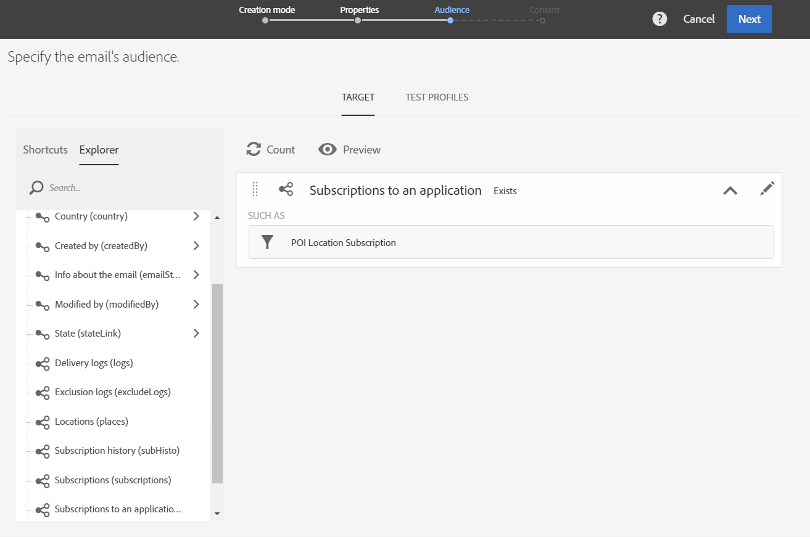

# POI データを使用した Campaign メッセージのパーソナライズ{#personalizing-campaign-messages-with-point-of-interest-data}

Adobe Campaignでは、モバイルアプリケーションの購読者から収集した目標地点データを使用して、電子メールなどのパーソナライズされたマーケティングメッセージを送信できます。

目標地点データに対する反応は、標準の配信でのみ可能です。 [トランザクションメッセージ](../../channels/using/getting-started-with-transactional-msg.md) 場所データを使用できません。

最も早い反応は約 10 分です。

この場合、過去 2 週間以内にボストンストアを訪問したすべての購読者に E メールを送信することにします。

1. 電子メールマーケティングアクティビティを作成します。
1. 配信のオーディエンスを定義する際に、 **[!UICONTROL Subscriptions to an application]** 要素をワークスペースに追加します。

   

   オーディエンスの管理について詳しくは、 [オーディエンスの定義](../../audiences/using/creating-audiences.md) 」セクションに入力します。

1. 内 **[!UICONTROL Add a rule - Profile/Subscriptions to an application]** ウィンドウで、 **[!UICONTROL POI Location Subscription]** 要素をワークスペースに追加します。

   

1. 内 **[!UICONTROL Add a rule - POI Location Subscription]** ウィンドウで、使用する目標地点のラベルを入力します。

   

1. 「**[!UICONTROL Filter type]**」フィールドで「**[!UICONTROL Relative]**」を選択します。
1. 次を確認します。 **[!UICONTROL Preceding days]** オプションと入力 **[!UICONTROL 15]** を選択します。
1. ユーザーが目標地点を訪問する必要がある回数を定義します。
1. クリック **[!UICONTROL Confirm]** オーディエンスを保存します。

   

1. E メールにコンテンツを追加します。

   

1. E メールのダッシュボードを表示するアクティビティの作成を確認します。
1. メッセージを送信します。

10%の割引オファーを含む E メールは、次の条件を満たす購読者に送信されます。

* ボストンの店舗を過去 2 週間以内に少なくとも 1 回訪問しました。
* 訪問中にモバイルアプリがフォアグラウンドにあったとき。

**関連トピック：**

* [E メールの作成](../../channels/using/creating-an-email.md)
* [コンテンツの定義](../../designing/using/personalization.md#example-email-personalization)
* [メッセージの送信](../../sending/using/confirming-the-send.md)
