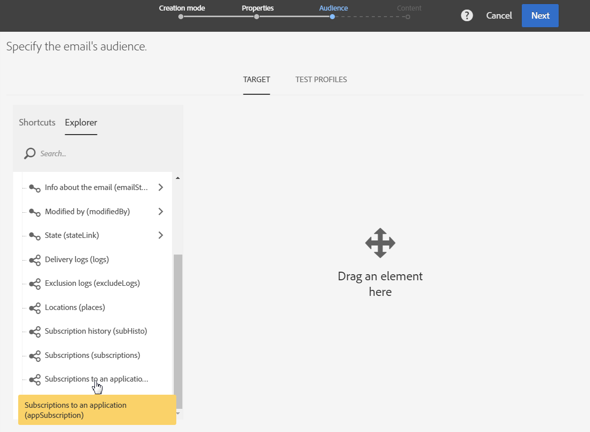
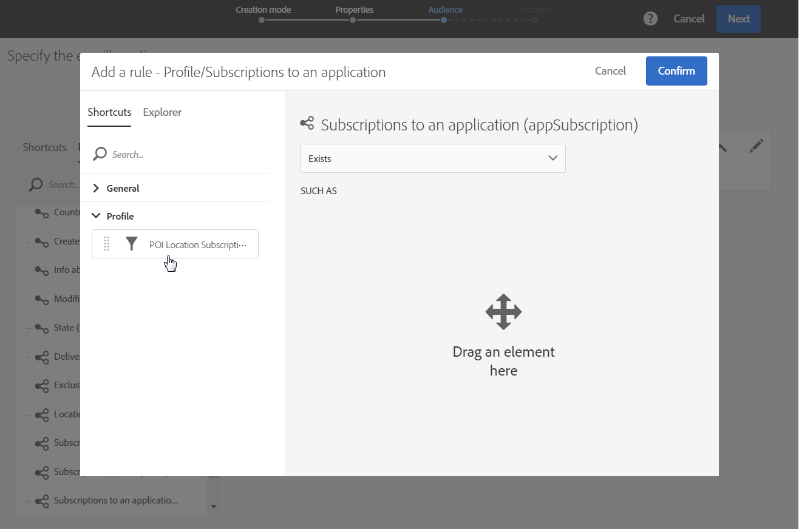
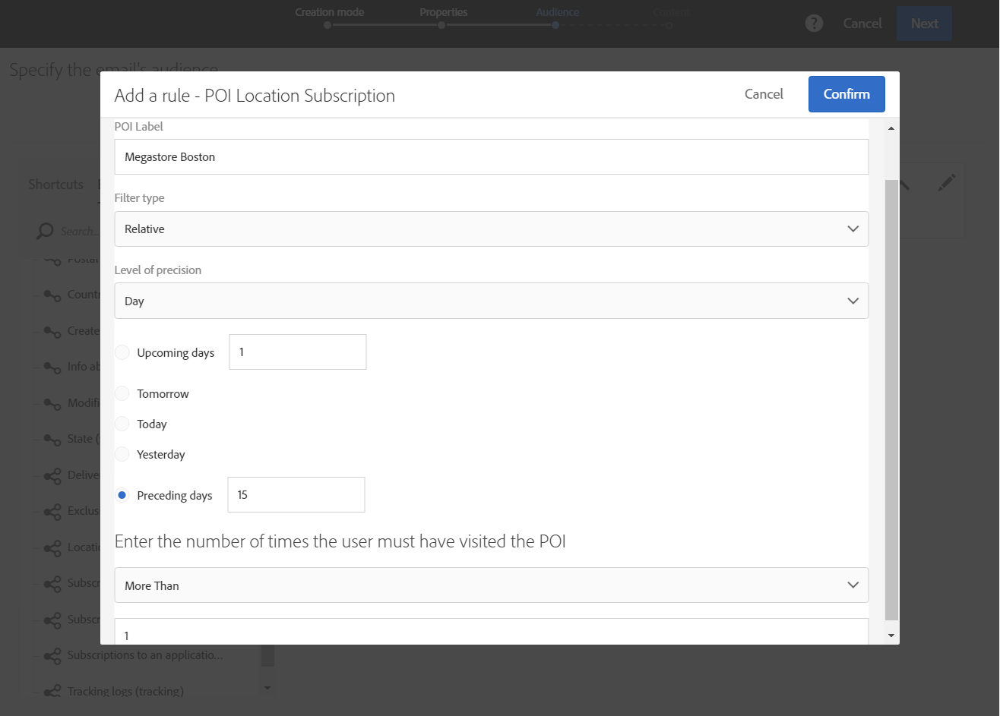
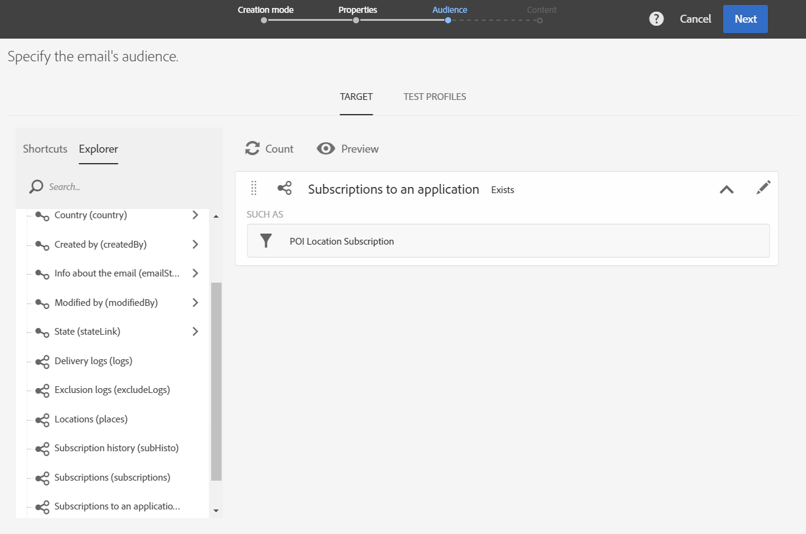
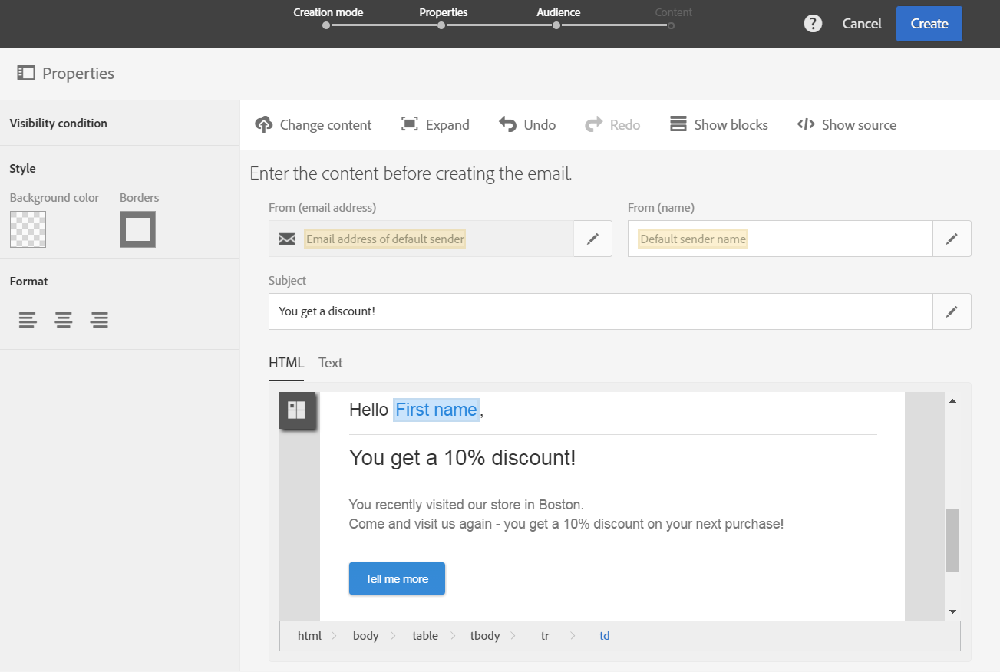

# POI データを使用した Campaign メッセージのパーソナライズ{#personalizing-campaign-messages-with-point-of-interest-data}

Adobe Campaignでは、モバイルアプリケーションの購読者から収集したPoints of Interest データを使用して、電子メールなどのパーソナライズされたマーケティングメッセージを送信できます。

標準的な配信では、Point of Interest データでのみ対応できます。 [&#x200B; トランザクションメッセージ &#x200B;](../../channels/using/getting-started-with-transactional-msg.md)は場所データを使用できません。

最も早く反応できるのは約10分です。

この場合、過去2週間以内にボストンの店舗を訪問したすべての購読者にメールを送信することにします。

1. メールマーケティングアクティビティの作成。
1. 配信のオーディエンスを定義する際に、**[!UICONTROL Subscriptions to an application]**&#x200B;要素をワークスペースにドラッグ&amp;ドロップします。

   

   オーディエンスの管理について詳しくは、[&#x200B; オーディエンスの定義](../../audiences/using/creating-audiences.md) セクションを参照してください。

1. **[!UICONTROL Add a rule - Profile/Subscriptions to an application]** ウィンドウで、**[!UICONTROL POI Location Subscription]**&#x200B;要素をワークスペースにドラッグ&amp;ドロップします。

   

1. **[!UICONTROL Add a rule - POI Location Subscription]** ウィンドウで、使用するPoint of Interestのラベルを入力します。

   

1. 「**[!UICONTROL Filter type]**」フィールドで「**[!UICONTROL Relative]**」を選択します。
1. 「**[!UICONTROL Preceding days]**」オプションをオンにし、対応するフィールドに「**[!UICONTROL 15]**」と入力します。
1. ユーザーがPoint of Interestにアクセスした回数を定義します。
1. 「**[!UICONTROL Confirm]**」をクリックして、オーディエンスを保存します。

   

1. メールにコンテンツを追加する：

   

1. メールのダッシュボードを表示するアクティビティの作成を確認します。
1. メッセージを送信。

10%割引オファーの電子メールは、次のような顧客に送信されます。

* 過去2週間に少なくとも1回はボストンの店舗を訪れた。
* 訪問中に少なくとも1回はモバイルアプリケーションを前面に配置していました。

**関連トピック：**

* [メールの作成](../../channels/using/creating-an-email.md)
* [コンテンツの定義](../../designing/using/personalization.md#example-email-personalization)
* [メッセージの送信](../../sending/using/confirming-the-send.md)
