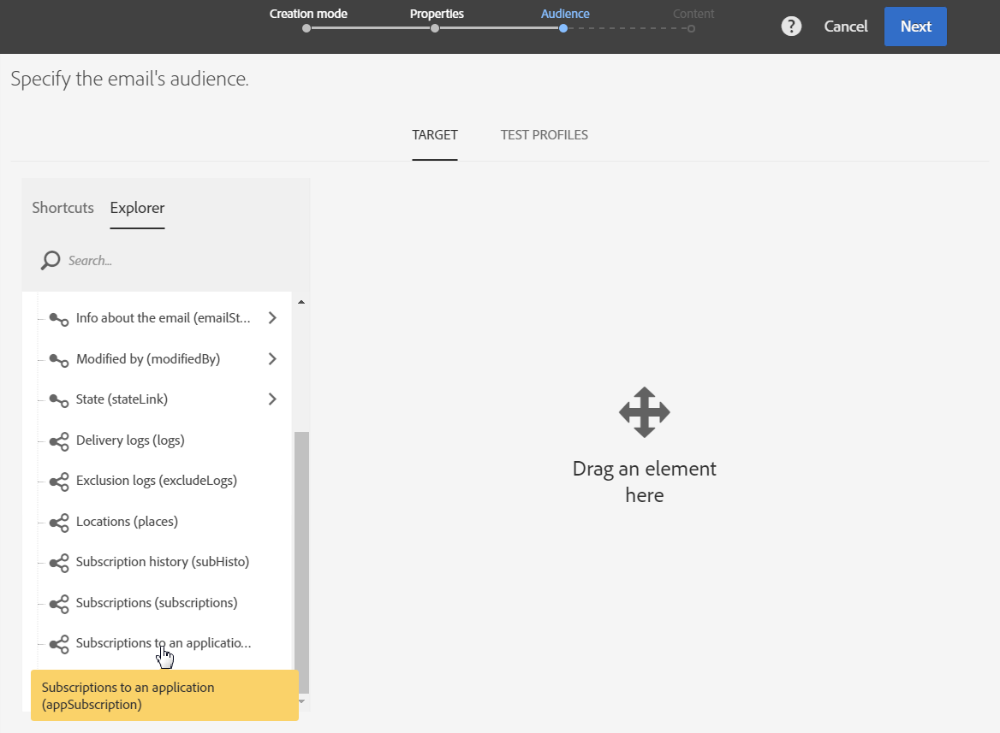

# POI データを使用した Campaign メッセージのパーソナライズ{#personalizing-campaign-messages-with-point-of-interest-data}

Adobe Campaignでは、モバイルアプリの購読者から収集した目標地点データを使用して、電子メールなどのパーソナライズされたマーケティングメッセージを送信できます。

目標地点データは、標準配信とのみ反応できます。 [トランザクションメッセージは場所データを使用できません](../../channels/using/getting-started-with-transactional-msg.md) 。

反応が早いのは約10分です。

この場合、過去2週間以内にボストンストアを訪問したすべての購読者に電子メールを送信することにします。

1. 電子メールマーケティングアクティビティを作成します。
1. 配信のオーディエンスを定義する場合は、要素をワークスペースにドラッグ&amp;ドロップし **[!UICONTROL Subscriptions to an application]** ます。

   

   オーディエンスの管理の詳細は、「 [オーディエンスの定義](../../audiences/using/creating-audiences.md) 」の項を参照してください。

1. In the **[!UICONTROL Add a rule - Profile/Subscriptions to an application]** window, drag and drop the **[!UICONTROL POI Location Subscription]** element into the workspace.

   

1. ウィン **[!UICONTROL Add a rule - POI Location Subscription]** ドウで、使用する目標地点のラベルを入力します。

   

1. 「**[!UICONTROL Filter type]**」フィールドで「**[!UICONTROL Relative]**」を選択します。
1. オプションをチェックし、対応するフィ **[!UICONTROL Preceding days]** ールド **[!UICONTROL 15]** に入力します。
1. ユーザーが目標地点を訪問した回数を定義します。
1. Click **[!UICONTROL Confirm]** to save your audience.

   

1. 電子メールの追加内容。

   

1. 電子メールのダッシュボードを表示するアクティビティの作成を確認します。
1. メッセージを送信します。

10%割引オファーの電子メールは、次の条件を満たすサブスクライバーに送信されます。

* 過去2週間以内に少なくとも1回はボストンの店を訪問した。
* 訪問中、モバイルアプリがフォアグラウンドになっていた。

**関連トピック：**

* [E メールの作成](../../channels/using/creating-an-email.md)
* [コンテンツの定義](../../designing/using/personalization.md#example-email-personalization)
* [メッセージの送信](../../sending/using/confirming-the-send.md)

