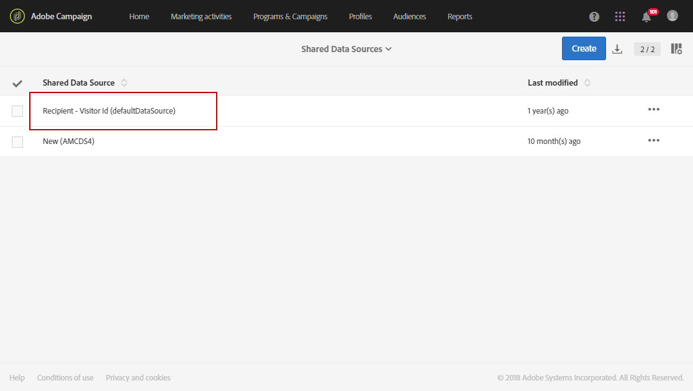

# Audience Manager または People コアサービスとの統合のプロビジョニングと設定{#provisioning-and-configuring-integration-with-audience-manager-or-people-core-service}

Adobe CampaignのAudience ManagerとPeopleコアのプロビジョニングと設定には、2つの手順があります。 [Adobeにリクエストを送信し](#submitting-request-to-adobe) 、Adobe Campaignで統合を [設定する](#configuring-the-integration-in-adobe-campaign)。

## アドビへの依頼の送信 {#submitting-request-to-adobe}

Audience Manager(AAM)またはPeopleコアサービスの統合により、オーディエンスやセグメントの読み込みと書き出しをAdobe Campaignで実行できます。

この統合を最初に設定する必要があります。この統合のプロビジョニングをリクエストするには、次の情報を記載のうえ、[Digital-Request@adobe.com](mailto:Digital-Request@adobe.com) まで E メールを送信します。

<table> 
 <tbody> 
  <tr> 
   <td> <strong>依頼のタイプ：</strong>  </td> 
   <td> AAM／People コアサービスと Campaign の統合の設定 </td> 
  </tr> 
  <tr> 
   <td> <strong>組織名：</strong>  </td> 
   <td> 所属する組織の名前 </td> 
  </tr> 
  <tr> 
   <td> <strong>IMS Org ID</strong>  </td> 
   <td> 所属する組織の IMS 組織 ID。  IMS 組織 ID は、Adobe Experience Cloud の管理メニューで確認できます。これは、Adobe Experience Cloud への初回接続時に付与されるものです。 </td> 
  </tr> 
  <tr> 
   <td> <strong>環境：</strong>  </td> 
   <td> 例：本番環境 </td> 
  </tr> 
  <tr> 
   <td> <strong>AAM または People コアサービス</strong>  </td> 
   <td> 例： Adobe Audience Managerプロビジョニングチームに Audience Manager のライセンスを所有しているかどうかを確認してください。</td> 
  </tr> 
  <tr> 
   <td> <strong>宣言済み ID または訪問者 ID</strong>  </td> 
   <td> 例：宣言済み ID </td> 
  </tr> 
  <tr> 
   <td> <strong>追加情報</strong>  </td> 
   <td> 役に立つ情報またはコメント（ある場合） </td> 
  </tr> 
 </tbody> 
</table>

## Adobe Campaignでの統合の設定 {#configuring-the-integration-in-adobe-campaign}

このリクエストを提出した後、Adobeは統合のプロビジョニングに進み、お客様に連絡して、設定の最終決定に必要な詳細と情報を提供します。

* [手順 1：Adobe Campaign での外部アカウントの設定または確認](#step-1--configure-or-check-the-external-accounts-in-adobe-campaign)
* [手順2:データソースの設定](#step-2--configure-the-data-sources)
* [手順 3：キャンペーントラッキングサーバーの設定](#step-3--configure-campaign-tracking-server)
* [手順 4：訪問者 ID サービスの設定](#step-4--configure-the-visitor-id-service)

### 手順 1：Adobe Campaign での外部アカウントの設定または確認 {#step-1--configure-or-check-the-external-accounts-in-adobe-campaign}

まず、Adobe Campaign中の外部アカウントを設定または確認する必要があります。 これらのアカウントはAdobeが設定し、必要な情報がお客様に伝えている必要があります。

それには、次の手順に従います。

1. 詳細設定メニューで、 **管理/アプリケーション設定/外部アカウントを選択します**。

   この統合で使用できる次の外部アカウントのいずれかを選択します。

   

1. 次の形式 **[!UICONTROL Receiver server]** で入力します。
1. と **[!UICONTROL AWS Access Key ID]**&#x200B;入力し **[!UICONTROL Secret Access Key]** ま **[!UICONTROL AWS Region]**&#x200B;す。

これで、外部アカウントはこの統合用に設定されます。

### Step 2: Configure the Data Sources {#step-2--configure-the-data-sources}

次の2つのデータソースがオーディエンスマネージャー内に作成されます。Adobe Campaign(MID)とAdobe Campaign(DeclaredId)。 同時に、次の2つのデータソースをAdobe Campaignで使用できます。

* **[!UICONTROL Recipient - Visitor ID (Defaultdatasources)]**:これは、デフォルトで訪問者IDに設定される、すぐに使用できるデータソースです。 Campaign から作成されたセグメントは、このデータソースの一部になります。
* **宣言済みID** データソース：このデータソースを作成し、Audience Managerの **[!UICONTROL DeclaredId]** データソース定義にマッピングする必要があります。

異なるドメインを持つ複数のWebサイトの場合、Adobe CampaignはECIDに基づく調整をサポートしません。

To configure the **[!UICONTROL Recipient - Visitor ID (Defaultdatasources)]** data source:

1. In **[!UICONTROL Administration]** > **[!UICONTROL Application settings]** > **[!UICONTROL Shared Data Sources]**, select **[!UICONTROL Recipient - Visitor ID (Defaultdatasources)]**.

   

1. Choose **[!UICONTROL Adobe Campaign]** in the **[!UICONTROL Data Source/ Alias]** drop-down.
1. Adobeが **[!UICONTROL AAM Destination ID]** 提供するを入力します。

   

1. カテゴリでは、調整条件を変更せず、常に調整条件を使用することをお勧めし **[!UICONTROL Reconciliation process]****[!UICONTROL Visitor ID]**&#x200B;ます。
1. 「**[!UICONTROL Save]**」をクリックします。

データソースを作成するには、次の手順を実行し **[!UICONTROL Declared ID]** ます。

1. > **[!UICONTROL Administration]** > **[!UICONTROL Application settings]** > **[!UICONTROL Shared Data Sources]**&#x200B;で、 **[!UICONTROL Create]** ボタンをクリックします。
1. データソース **[!UICONTROL Label]** のを編集します。
1. ドロップダウンリストで、Audience Managerのデータソースに対応する **[!UICONTROL Data Source/ Alias]****[!UICONTROL DeclaredID]** データソースを選択します。
1. Adobeが提供するおよびを入力して、データソース **[!UICONTROL Data Source / Alias]** を設定しま **[!UICONTROL AAM Destination ID]** す。
1. 必要に応じてを設定 **[!UICONTROL Reconciliation process]** します。
1. 「**[!UICONTROL Save]**」をクリックします。

>[!NOTE]
>
>この **[!UICONTROL AAM Destination ID]** フィールドは、 [キャンペーントリガー統合用に共有データソースを設定する場合は必須ではありません](../../integrating/using/configuring-triggers-in-experience-cloud.md)。 **[!UICONTROL Priority]** は、Triggers -キャンペーン統合を設定する場合にのみ必要です。 優先度によって、最初に設定されるデータソースが決まります。 優先度は、1や100など任意の数値です。 優先度が高いほど、調整時の優先順位が高くなります。

### 手順 3：キャンペーントラッキングサーバーの設定 {#step-3--configure-campaign-tracking-server}

People コアサービスまたは Audience Manager との統合を設定する場合は、Campaign トラッキングサーバーも設定する必要があります。

ここでは、キャンペーントラッキングサーバーがドメイン(CNAME)に登録されていることを確認する必要があります。 You can find more information about domain name configuration in [this article](https://docs.campaign.adobe.com/doc/AC/en/technicalResources/Technotes/AdobeCampaign_Deliverability_Sub_Domain_Delegation.pdf).

### 手順 4：訪問者 ID サービスの設定 {#step-4--configure-the-visitor-id-service}

訪問者 ID サービスを web のプロパティや web サイトで設定したことがない場合は、次の[ドキュメント](https://docs.adobe.com/content/help/ja-JP/id-service/using/implementation/setup-aam-analytics.html)を参照してサービスの設定方法を確認するか、次の[動画](https://helpx.adobe.com/marketing-cloud/how-to/email-marketing.html#step-two)をご覧ください。

設定とプロビジョニングが完了し、統合を使用してオーディエンスまたはセグメントをインポートおよびエクスポートできるようになりました。
