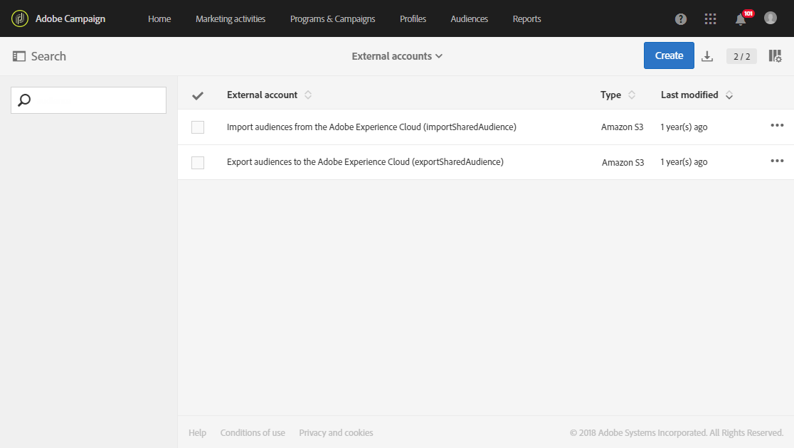

# Provisioning and configuring integration with Audience Manager or People core service{#provisioning-and-configuring-integration-with-audience-manager-or-people-core-service}

The provisioning and configuring of Audience Manager and People core in Adobe Campaign take two steps: [Submitting request to Adobe](../../integrating/using/provisioning-and-configuring-integration-with-audience-manager-or-people-core-service.md#submitting-request-to-adobe) then [Configuring the integration in Adobe Campaign](../../integrating/using/provisioning-and-configuring-integration-with-audience-manager-or-people-core-service.md#configuring-the-integration-in-adobe-campaign).

## Submitting request to Adobe {#submitting-request-to-adobe}

Audience Manager（AAM）またはPeopleコアサービス統合を使用すると、Adobe Campaignでオーディエンスやセグメントをインポートおよびエクスポートできます。

この統合は最初に設定する必要があります。To request provisioning of this integration, write an email to [Digital-Request@adobe.com](mailto:Digital-Request@adobe.com) with the following information:

<table> 
 <tbody> 
  <tr> 
   <td> <strong>リクエストタイプ:</strong>  </td> 
   <td> AAM/Peopleコアサービス-キャンペーン統合の設定 </td> 
  </tr> 
  <tr> 
   <td> <strong>組織名:</strong>  </td> 
   <td> 組織名 </td> 
  </tr> 
  <tr> 
   <td> <strong>IMS Org ID</strong>  </td> 
   <td> IMS組織ID* </td> 
  </tr> 
  <tr> 
   <td> <strong>環境:</strong>  </td> 
   <td> 例:実稼働環境 </td> 
  </tr> 
  <tr> 
   <td> <strong>AAMまたはPeopleサービス</strong>  </td> 
   <td> 例:Adobe Audience Manager </td> 
  </tr> 
  <tr> 
   <td> <strong>宣言済みIDまたは訪問者ID</strong>  </td> 
   <td> 例:宣言済みID </td> 
  </tr> 
  <tr> 
   <td> <strong>追加情報</strong>  </td> 
   <td> 役立つ役立つ情報またはコメント </td> 
  </tr> 
 </tbody> 
</table>

* You can find your IMS Org ID on the Experience Cloud, in the **Administration** menu. また、Adobe Experience Cloudに初めて接続したときにも提供されます。

## Configuring the integration in Adobe Campaign {#configuring-the-integration-in-adobe-campaign}

このリクエストを送信すると、アドビは統合のプロビジョニングに進み、設定を最終的に行う必要がある詳細と情報を提供します。

* [手順1:Adobe Campaignでの外部アカウントの設定または確認](../../integrating/using/provisioning-and-configuring-integration-with-audience-manager-or-people-core-service.md#step-1--configure-or-check-the-external-accounts-in-adobe-campaign)
* [手順2:データソースの設定](../../integrating/using/provisioning-and-configuring-integration-with-audience-manager-or-people-core-service.md#step-2--configure-the-data-sources)
* [手順3:キャンペーントラッキングサーバーの設定](../../integrating/using/provisioning-and-configuring-integration-with-audience-manager-or-people-core-service.md#step-3--configure-campaign-tracking-server)
* [手順4:訪問者IDサービスの設定](../../integrating/using/provisioning-and-configuring-integration-with-audience-manager-or-people-core-service.md#step-4--configure-the-visitor-id-service)

### Step 1: Configure or check the external accounts in Adobe Campaign {#step-1--configure-or-check-the-external-accounts-in-adobe-campaign}

まず、Adobe Campaignで外部アカウントを設定または確認する必要があります。これらのアカウントはアドビによって設定されている必要があり、必要な情報がユーザーに伝えられています。

そのためには、次の手順を実行します。

1. From the advanced menu, select **Administration &gt; Application settings &gt; External accounts**.

   この統合に使用できる外部アカウントの1つを選択します。

   

1. Enter **[!UICONTROL Receiver server]** in following format
1. Enter the **[!UICONTROL AWS Access Key ID]**, **[!UICONTROL Secret Access Key]** and **[!UICONTROL AWS Region]**.

外部アカウントがこの統合用に設定されました。

### Step 2: Configure the Data Sources {#step-2--configure-the-data-sources}

Audience Manager内では、次の2つのデータソースが作成されます。Adobe Campaign（MID）およびAdobe Campaign（DeclarID）。同時に、これら2つのデータソースはAdobe Campaignで使用できます。

* **[!UICONTROL Recipient - Visitor ID (Defaultdatasources)]**:これは、訪問者IDにデフォルトで設定されているデフォルトのデータソースです。キャンペーンから作成されたセグメントは、このデータソースの一部になります。
* **宣言されたID** データソース:このデータソースは、Audience Managerから **[!UICONTROL DeclaredId]** データソース定義を作成し、マッピングする必要があります。

異なるドメインを持つ複数のWebサイトの場合、Adobe Campaignは、ECIDに基づく紐付けをサポートしていません。

**[!UICONTROL Recipient - Visitor ID (Defaultdatasources)]** データソースを設定するには:

1. In **[!UICONTROL Administration]** &gt; **[!UICONTROL Application settings]** &gt; **[!UICONTROL Shared Data Sources]**, select **[!UICONTROL Recipient - Visitor ID (Defaultdatasources)]**.

   

1. Choose **[!UICONTROL Adobe Campaign]** in the **[!UICONTROL Data Source/ Alias]** drop-down.
1. Enter the **[!UICONTROL AAM Destination ID]** provided by Adobe.

   

1. **[!UICONTROL Reconciliation process]** カテゴリでは、紐付け条件を変更しないことをお勧めし、常に使用 **[!UICONTROL Visitor ID]**&#x200B;します。
1. **[!UICONTROL Save]**&#x200B;をクリックします。

**[!UICONTROL Declared ID]** データソースを作成するには:

1. In **[!UICONTROL Administration]** &gt; **[!UICONTROL Application settings]** &gt; **[!UICONTROL Shared Data Sources]**, click the **[!UICONTROL Create]** button.
1. Edit the **[!UICONTROL Label]** of your data source.
1. **[!UICONTROL Data Source/ Alias]** ドロップダウンで、Audience Managerから **[!UICONTROL DeclaredID]** データソースに対応するデータソースを選択します。
1. Configure your data source by entering the **[!UICONTROL Data Source / Alias]** and **[!UICONTROL AAM Destination ID]** provided by Adobe.
1. Set the **[!UICONTROL Reconciliation process]** as needed.
1. **[!UICONTROL Save]**&#x200B;をクリックします。

>[!NOTE]
>
>The **[!UICONTROL AAM Destination ID]** field is not required if you are configuring the shared data source for the [Campaign-Triggers integration](../../integrating/using/configuring-triggers-in-experience-cloud.md). **[!UICONTROL Priority]** は、Triggers- Campaign統合の設定時にのみ必要です。優先順位によって、最初に設定するデータソースが決定されます。優先度には、1や100などの任意の数値を指定できます。優先度が高いほど、紐付け中の優先順位が高くなります。

### Step 3: Configure Campaign Tracking server {#step-3--configure-campaign-tracking-server}

PeopleコアサービスまたはAudience Managerとの統合の設定については、キャンペーントラッキングサーバーを設定する必要もあります。

ここで、キャンペーントラッキングサーバーがドメイン（CNAME）に登録されていることを確認する必要があります。You can find more information about domain name delegation in [this article](https://docs.campaign.adobe.com/doc/AC/en/technicalResources/Technotes/AdobeCampaign_Deliverability_Sub_Domain_Delegation.pdf).

### Step 4: Configure the Visitor ID Service {#step-4--configure-the-visitor-id-service}

In the case that your Visitor ID service has never been configured on your web properties or websites, refer to the following [document](https://marketing.adobe.com/resources/help/en_US/mcvid/mcvid-setup-aam-analytics.html) to learn how to configure your service or the following [video](https://helpx.adobe.com/marketing-cloud/how-to/email-marketing.html#step-two).

設定とプロビジョニングがファイナライズされ、オーディエンスまたはセグメントの読み込みおよびエクスポートに統合を使用できるようになりました。
