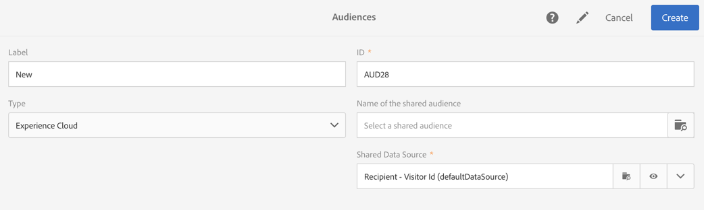
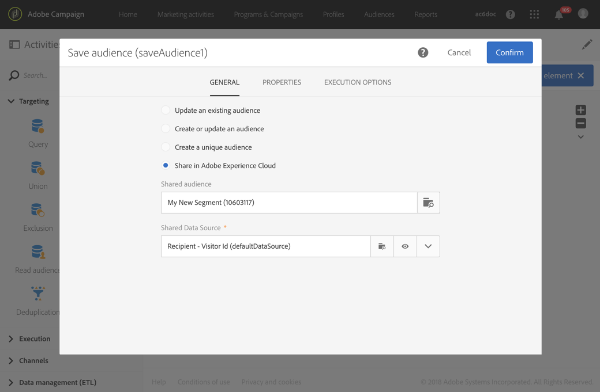
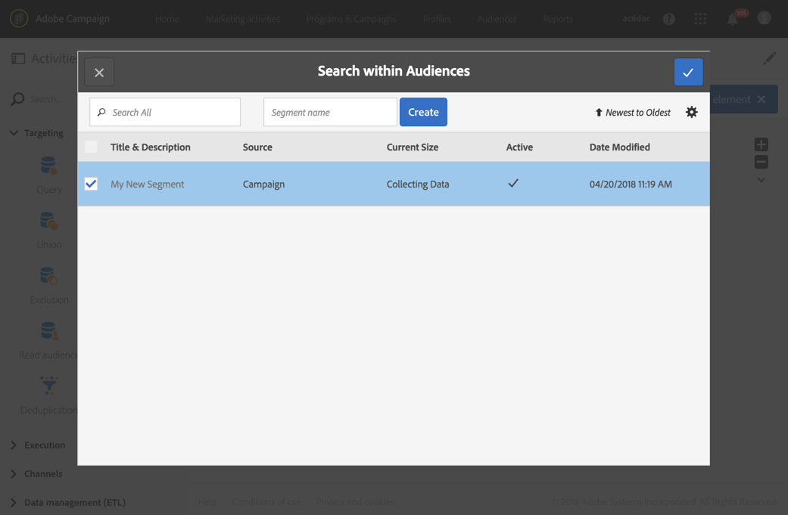

# Audience Manager または People コアサービスとのオーディエンスの共有{#sharing-audiences-with-audience-manager-or-people-core-service}

## オーディエンスのインポート {#importing-an-audience}

ピープルコアサービスの統合により、技術的なワークフローを介してオーディエンスをAdobe Campaignに直接インポートし、データベースを強化できます。 People コアサービスでのオーディエンス共有について詳しくは、この[&#x200B; ドキュメント &#x200B;](https://experienceleague.adobe.com/docs/analytics/components/segmentation/segmentation-workflow/seg-publish.html?lang=ja)を参照してください。

Adobe CampaignのPeople コアサービスからのオーディエンス/セグメントの読み込みは、IMS経由で接続されたユーザーのみが&#x200B;**[!UICONTROL Audiences]** メニューから実行できます（Adobe ID経由の認証）。

1. **[!UICONTROL Audiences]** メニューに移動します。
1. アクションバーで、画面に移動する&#x200B;**[!UICONTROL Create]**&#x200B;を選択してオーディエンスを作成します。
1. 新しいオーディエンスのラベルを指定します。
1. 作成されるオーディエンスがPeople コアサービスからインポートされたオーディエンスであることを示すために、オーディエンス **[!UICONTROL Type]**&#x200B;を&#x200B;**[!UICONTROL Experience Cloud]**&#x200B;に設定します。
1. **[!UICONTROL Name of the shared audience]** フィールドから、読み込むオーディエンスを選択します。 インポートできるのはセグメントのみです。 キーと値のペア、特性、ルールなどの詳細データはサポートされません。

   

1. 対応する&#x200B;**[!UICONTROL Shared Data Source]**&#x200B;を選択します。

   選択したデータソースが暗号化アルゴリズムを使用するように設定されている場合、追加のオプションで&#x200B;**[!UICONTROL Force reconciliation with a profile]**&#x200B;を使用できます。 データソースの&#x200B;**[!UICONTROL Channel]** フィールドが電子メールまたはモバイル （SMS）に設定されている場合と、プロファイルデータを活用する場合は、このオプションをオンにします。

   **[!UICONTROL Force reconciliation with a profile]**&#x200B;を選択せず、**[!UICONTROL Channel]**&#x200B;がAMC データソースで電子メールまたはモバイル （SMS）に設定されている場合、暗号化されたすべての宣言されたIDが復号化されます。 すべての電子メールアドレス/携帯電話番号のリストを含むタイプ **ファイル**&#x200B;のオーディエンスが作成/更新されます。 これにより、Campaignに共有オーディエンスが存在しない場合でも、この統合を通じて共有オーディエンスを読み込む際にメールアドレスや携帯電話番号が失われることはありません。 このタイプのオーディエンスは、ワークフローを使用して手作業で調整する必要があるため、直接使用することはできません。

1. 確認してオーディエンスを作成します。

   その後、テクニカルワークフローを介してオーディエンスを読み込みます。 これは、ID （「訪問者ID」または「宣言されたID」）をプロファイルディメンションと紐付けることができたレコードで構成されます。 Adobe Campaign によって認識されない People コアサービスセグメントからの ID はインポートされません。

これで、オーディエンスがAdobe Campaign データベースに読み込まれました。 インポートプロセスで、People コアサービスまたは Audience Manager からセグメントを直接インポートする場合は、同期に 24～36 時間かかります。 同期が終了すると、Adobe Campaign で新しいオーディエンスを検索したり、使用したりできます。

>[!NOTE]
>
>Adobe AnalyticsからAdobe Campaignにオーディエンスを読み込む場合、これらのオーディエンスを最初にPeople Core ServiceまたはAudience Managerで共有する必要があります。 このプロセスには 12～24 時間を要し、Campaign との同期にはさらに 24～36 時間が必要です。 場合により、オーディエンスの共有プロセスは最大 60 時間に及ぶことがあります。 People コアサービスと Audience Manager での Adobe Analytics オーディエンスの共有について詳しくは、この[ドキュメント](https://experienceleague.adobe.com/docs/analytics/components/segmentation/segmentation-workflow/seg-publish.html?lang=ja)を参照してください。

## オーディエンスのエクスポート {#exporting-an-audience}

ワークフローと&#x200B;**[!UICONTROL Save audience]** アクティビティを使用して、Adobe CampaignからAudience ManagerまたはPeople コアサービスにオーディエンスを書き出すことができます。

これは、新しいワークフローで、IMS （Adobe ID経由の認証）を介して接続されたユーザーのみが実行できます。

1. プログラム、キャンペーン、またはマーケティングアクティビティのリストから新しいワークフローを作成します。
1. さまざまなアクティビティを使用して、プロファイルをターゲットにします。
1. ターゲティングの後、ワークフローに&#x200B;**[!UICONTROL Save audience]** アクティビティをドラッグ&amp;ドロップしてから開きます。
1. 「**[!UICONTROL Share in Adobe Experience Cloud]**」を選択します。

   

1. **[!UICONTROL Shared audience]** フィールドを使用してオーディエンスを指定します。 開いたウィンドウで、既存のオーディエンスを選択するか、新しいオーディエンスを作成するかを選択できます。

   * 既存オーディエンスを選択した場合、新規レコードだけがオーディエンスに追加されます。
   * プロファイルリストを新しいオーディエンスに書き出すには、**[!UICONTROL Segment name]** フィールドに入力し、**[!UICONTROL Create]**&#x200B;をクリックしてから、新しく作成したオーディエンスを選択します。

   

   紐付けおよび交換を行うには、レコードにAdobe Experience Cloud ID （「訪問者ID」または「宣言済みID」）が必要です。 調整されていないレコードは、オーディエンスの読み込みおよび書き出し時に無視されます。

1. 最後に、画面の右上にあるチェックマークをクリックします。
1. 対応する&#x200B;**[!UICONTROL Shared Data Source]**&#x200B;を選択します。
1. 必要に応じて、**[!UICONTROL Generate an outbound transition]** ボックスをオンにして、書き出されたプロファイルを使用します。 紐付け可能なプロファイルのみがエクスポートされます。
1. アクティビティの設定を確認し、ワークフローを保存します。
1. オーディエンスを書き出すワークフローを開始します。 Adobe CampaignとPeople コアサービス間の同期には、数時間かかる場合があります

Adobe Campaign と People コアサービス間の同期には、24～36 時間かかります。 同期が終了すると、People コアサービスで新しいオーディエンスを検索できるようになり、そのオーディエンスを他の Adobe Experience Cloud ソリューションで再利用することができます。 Adobe People コアサービスで Adobe Campaign の共有オーディエンスを使用する方法について詳しくは、この[ドキュメント](https://experienceleague.adobe.com/docs/core-services/interface/audiences/t-audience-create.html?lang=ja)を参照してください。

**関連トピック：**

* [ワークフロー](../../automating/using/get-started-workflows.md)
* [オーディエンス](../../audiences/using/about-audiences.md)
