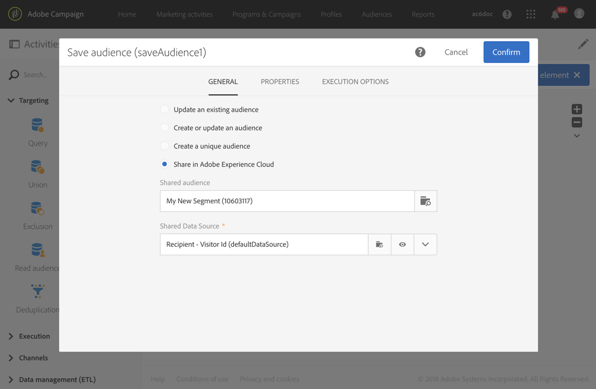

# Audience Manager または People コアサービスとのオーディエンスの共有{#sharing-audiences-with-audience-manager-or-people-core-service}

## オーディエンスのインポート {#importing-an-audience}

People コアサービス統合を使用すると、テクニカルワークフローを通じてオーディエンスをAdobe Campaignに直接読み込み、データベースを強化できます。 People コアサービスでのオーディエンス共有について詳しくは、この [&#x200B; ドキュメント &#x200B;](https://experienceleague.adobe.com/docs/analytics/components/segmentation/segmentation-workflow/seg-publish.html?lang=ja) を参照してください。

Adobe Campaignの People コアサービスからのオーディエンス/セグメントの読み込みは、IMS （Adobe ID経由の認証）で接続したユーザーのみが **[!UICONTROL Audiences]** メニューから実行できます。

1. **[!UICONTROL Audiences]** メニューに移動します。
1. アクションバーで、オーディエンスを作成するために画面に表示する **[!UICONTROL Create]** を選択します。
1. 新しいオーディエンスのラベルを指定します。
1. 作成されているオーディエンスが People コアサービスからインポートされたオーディエンスであることを示すには、オーディエンス **[!UICONTROL Type]** を **[!UICONTROL Experience Cloud]** に設定します。
1. 「**[!UICONTROL Name of the shared audience]**」フィールドから、読み込むオーディエンスを選択します。 インポートできるのはセグメントのみです。キーと値のペア、特性、ルールなどの詳細データはサポートされません。

   

1. 対応する **[!UICONTROL Shared Data Source]** を選択します。

   選択したデータ ソースが暗号化アルゴリズムを使用するように構成されている場合は、追加のオプションを使用して **[!UICONTROL Force reconciliation with a profile]** を実行できます。 データソースの **[!UICONTROL Channel]** フィールドが「メール」または「モバイル（SMS）」に設定され、プロファイルデータを活用する場合は、このオプションを選択します。

   **[!UICONTROL Force reconciliation with a profile]** を選択せず、「AMC データソース」で「メール」 **[!UICONTROL Channel]** 「モバイル（SMS）」に設定されている場合、暗号化されたすべての宣言済み ID が復号化されます。 すべてのメールアドレス/携帯電話番号のリストを含んだ、タイプ **ファイル** のオーディエンスが作成/更新されます。 これにより、この統合を通じて共有オーディエンスのインポート中に、そのプロファイルが Campaign に存在しない場合でも、メールアドレス/携帯電話番号が失われることはありません。 このタイプのオーディエンスは、ワークフローを使用して手動で調整する必要があるので、直接使用できません。

1. オーディエンスの作成を確認します。

   その後、オーディエンスがテクニカルワークフローで読み込まれます。 ID （「訪問者 ID」または「宣言済み ID」）をプロファイルディメンションと紐付けできたレコードで構成されています。 Adobe Campaign によって認識されない People コアサービスセグメントからの ID はインポートされません。

これで、オーディエンスがAdobe Campaign データベースに読み込まれました。 インポートプロセスで、People コアサービスまたは Audience Manager からセグメントを直接インポートする場合は、同期に 24～36 時間かかります。同期が終了すると、Adobe Campaign で新しいオーディエンスを検索したり、使用したりできます。

>[!NOTE]
>
>オーディエンスをAdobe AnalyticsからAdobe Campaignに読み込む場合は、まず People コアサービスまたはAudience Managerでこれらのオーディエンスを共有する必要があります。 このプロセスには 12～24 時間かかり、Campaign との 24～36 時間の同期に追加する必要があります。 場合により、オーディエンスの共有プロセスは最大 60 時間に及ぶことがあります。People コアサービスと Audience Manager での Adobe Analytics オーディエンスの共有について詳しくは、この[ドキュメント](https://experienceleague.adobe.com/docs/analytics/components/segmentation/segmentation-workflow/seg-publish.html?lang=ja)を参照してください。

## オーディエンスのエクスポート {#exporting-an-audience}

オーディエンスは、ワークフローと **[!UICONTROL Save audience]** アクティビティを使用して、Adobe CampaignからAudience Managerまたは People コアサービスに書き出すことができます。

これは、新しいワークフローで、IMS （Adobe IDによる認証）経由で接続したユーザーのみが実行できます。

1. プログラム、キャンペーンまたはマーケティングアクティビティのリストから新しいワークフローを作成します。
1. 使用可能な様々なアクティビティを使用して、一連のプロファイルをターゲットにします。
1. ターゲティングの後、ターゲティング アクティビティをワークフローにドラッグ&amp;ドロップしてから **[!UICONTROL Save audience]** きます。
1. 「**[!UICONTROL Share in Adobe Experience Cloud]**」を選択します。

   

1. 「オーディエンス」フィールドを使用してオーディ **[!UICONTROL Shared audience]** ンスを指定します。 開いたウィンドウで、既存のオーディエンスを選択するか、新しいオーディエンスを作成するかを選択できます。

   * 既存オーディエンスを選択した場合、新規レコードだけがオーディエンスに追加されます。
   * プロファイルリストを新しいオーディエンスに書き出すには、「**[!UICONTROL Segment name]**」フィールドに入力し、「**[!UICONTROL Create]**」をクリックして、新しく作成したオーディエンスを選択します。

   

   紐付けおよび交換するには、レコードにAdobe Experience Cloud ID （「訪問者 ID」または「宣言済み ID」）が必要です。 オーディエンスのインポートおよびエクスポート時に、紐付けされていないレコードは無視されます。

1. 終了するには、画面の右上にあるチェックマークをクリックします。
1. 対応する **[!UICONTROL Shared Data Source]** を選択します。
1. 必要に応じて、書き出されたプロファイルを使用する **[!UICONTROL Generate an outbound transition]** 合は、「」チェックボックスをオンにします。 紐付けできるプロファイルのみが書き出されます。
1. アクティビティの設定を確認し、ワークフローを保存します。
1. ワークフローを開始して、オーディエンスを書き出します。 Adobe Campaignと People コアサービスの同期には数時間かかる場合があります

Adobe Campaign と People コアサービス間の同期には、24～36 時間かかります。同期が終了すると、People コアサービスで新しいオーディエンスを検索できるようになり、そのオーディエンスを他の Adobe Experience Cloud ソリューションで再利用することができます。Adobe People コアサービスで Adobe Campaign の共有オーディエンスを使用する方法について詳しくは、この[ドキュメント](https://experienceleague.adobe.com/docs/core-services/interface/audiences/t-audience-create.html?lang=ja)を参照してください。

**関連トピック：**

* [ワークフロー](../../automating/using/get-started-workflows.md)
* [オーディエンス](../../audiences/using/about-audiences.md)
