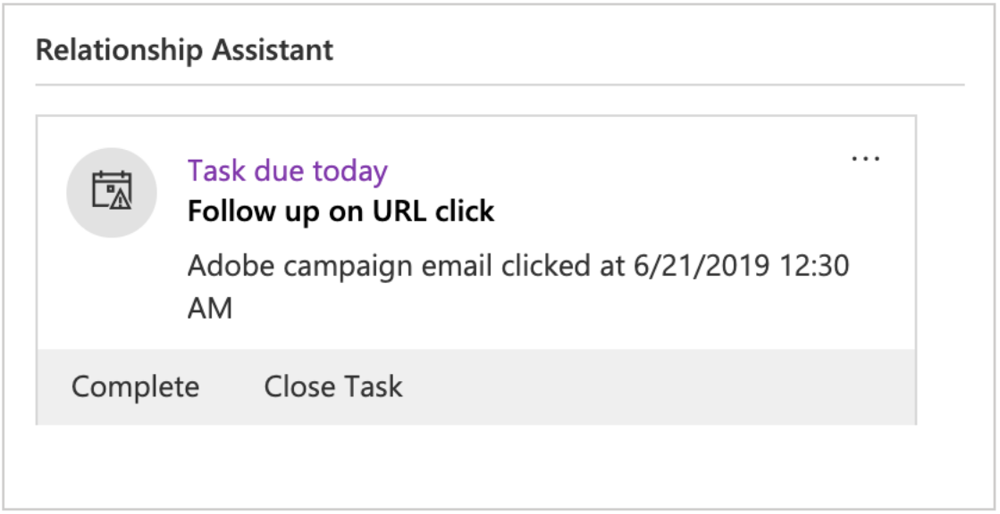

# Microsoft Dynamics 365とCampaign Standard統合の使用

この統合で実行されるジョブはいくつかあります。

* **連絡先の同期**:連絡先はDynamics 365からキャンペーンに送信されます(注意：一方向同期を参照)。
* **カスタムエンティティの同期**:カスタムエンティティレコードは、Dynamics 365からキャンペーンに送信されます（注：片方向同期）。  詳しくは、カスタムエンティティのページを参照してください。
* **イベント**:特定の電子メールマーケティングイベントがキャンペーンからDynamics 365に送信されます。 以下の「注意」を参照してください。
* **連絡先の削除**:キャンペーンプロファイルは、Dynamics 365で対応する連絡先が削除された場合に、プライバシー関連の削除キューに追加されます。
* **オプトアウト同期**:オプトアウトは、オンボーディング中に選択した構成(Dynamics 365からキャンペーンの同期、Dynamics 365へのキャンペーン、双方向の同期など)に応じて、Dynamics 365とキャンペーンの間で同期されます。
* **シングルサインオン(SSO)**:Unifiの統合の詳細は、Adobe IMS認証を使用して、キャンペーンから直接アクセスできます。

>[!NOTE]
>
>イベント **表示の場合**、出力ジョブがUnifiで実行されるたびに、最大10,000個のイベントが取得されます。

## Adobe Campaign Standardのユーザーエクスペリエンス

連絡先がDynamics 365で新規に作成されたり変更されたりすると、連絡先の同期が実行された後、キャンペーンに同期されます。  これらの連絡先は、キャンペーンのプロファイル画面に表示され、マーケティングキャンペーンでターゲット設定できます。  下のプロファイル画面を参照してください。

Dynamics 365で連絡先が削除されると、キャンペーンの対応するプロファイルが、キャンペーンのプライバシー要求画面のプライバシーサービス削除キューに追加されます。  キャンペーンで適用されるデータプライバシー法に準拠するために必要なサブジェクト削除リクエストの実行について詳しくは、Adobe Campaign Standardの法的に義務付けられた削除リクエストの実行方法を参照してください。

プロパティ画面で2ステップのプロセスをアクティブにしている場合は、最後に削除する前に、プライバシー画面で各レコードの削除を手動で確認する必要があることに注意してください。  次の2ステップのプロセス画面を参照してください。

オプトアウト/ブラックリスト属性がキャンペーンで変更されると、キャンペーン対Dynamics 365または双方向オプトアウト設定を選択し、その特定の属性が正しくマッピングされている場合、Dynamics 365に反映されます。

シングルサインオンを使用して統合の詳細にアクセスするには、キャンペーンナビゲーションメニューに移動し、管理/Microsoft Dynamics 365統合をクリックします。

このページには、統合に関するドキュメントへのリンクと、法的義務に従った機能の使用方法に関するガイドラインが含まれています。 グローブアイコンをクリックすると、Unifiインスタンスが自動的にルーティングされ、ログインされ、統合の詳細を管理できます。

この機能に関するビデオは、次のビデオで視聴できます。

>[!VIDEO](https://video.tv.adobe.com/v/29254)

>[!NOTE]
>
>キャンペーンインスタンスでシングルサインオン機能フラグを有効にするには、チケットを（直接またはアドビの担当者を通じて）アドビカスタマーケアに送信する必要があります。

>[!NOTE]
>
>Microsoft Dynamics 365統合アイコンは、管理パネルに表示されません。このアイコンはすぐに使用できます。  お客様（またはアドビの担当者）は、チケットを送信し、お客様のキャンペーンインスタンスでこの機能フラグを有効にする必要があります。
>
>また、Unifiは、ユーザーがSSO経由でユーザーから正常にログオンできるようにする前に、SSOアクセスを有効にする必要があります。キャンペーン

## Microsoft Dynamics 365ユーザーエクスペリエンス

イベント表示の場合、次の電子メールマーケティングイベントがキャンペーンからDynamics 365に送信され、Dynamics 365のタイムライン表示にカスタムアクティビティとして表示されます。

* Adobe Campaign電子メール送信

* Adobe Campaign電子メールオープン

* Adobe Campaign電子メールのURLをクリック

* Adobe Campaignの電子メールバウンス

連絡先の表示を設定するには、[Dynamics 365]ドロップダウンメニューの[Sales Hub]をクリックして、連絡先リストに移動します。  次に、左側のメニューバーの[連絡先]をクリックし、連絡先を選択します。

>[!NOTE]
>
>これらのイベントを表示するには、AppSourceのDynamics 365アプリ用Adobe CampaignがDynamics 365インスタンスにインストールされている必要があります。

下に、「Dynamics User」の連絡先画面のスナップショットが表示されます。  タイムライン表示で、Dynamics Userがキャンペーン名「2019LoyaltyCamp」と配信名「DM190」に関連付けられた電子メールを送信したことがわかります。  Dynamicsユーザーが電子メールを開き、電子メール内のURLもクリックしました。これらの両方のアクションによってイベントが作成され、以下にも表示されます。  右隅を見ると、Relationship Assistant(RA)カードが表示されます。現在、クリックされたURLを追跡するタスクが含まれています。

Dynamics Userのタイムライン表示の終了点については、以下を参照してください。

以下に、Relationship Assistant(RA)カードのクローズアップを示します。  AppSourceアプリには、Adobe電子メールURLのクリックワークフローを監視するイベントが含まれます。  このイベントが発生すると、タスクが作成され、期限が設定されます。  これにより、タスクがRAカードに表示され、表示がさらに向上します。  アドビの電子メールバウンスイベントにも同様のワークフローがあり、無効な電子メールアドレスを調整するタスクを追加します。  これらのワークフローは、ソリューションでオフにできます。

送信イベントの件名をクリックすると、次のようなフォームが表示されます。  開くフォームとバウンスイベントは似ています。

電子メールURLのクリックイベントのフォームに、クリックされたURLの属性が追加されます。

属性と説明のリストを次に示します。

* 件名：イベント電子メールキャンペーンの配信IDと配信

* 所有者：プロビジョニング後の手順で作成されるアプリケーションユーザー

* 関連：連絡先の名前

* キャンペーン名：キャンペーンのCampaign Standard

* 配信名：配信のCampaign Standard

* 送信日/開封日/クリック日/バウンス日：イベントが作成された日時

* 追跡URL:クリックされたURL

* ミラーページURL:送信、開く、クリック、バウンスされた電子メールのミラーページへのURL

使用中のミラーページURLのビデオを下のビデオで確認できます。

>[!VIDEO](https://video.tv.adobe.com/v/29253)

>[!NOTE]
>
>オプトアウトの場合、Dynamics 365でオプトアウト属性を変更すると、Dynamics 365からキャンペーンまたは双方向のオプトアウト設定を選択し、その特定の属性が正しくマッピングされている場合、キャンペーンに反映されます。

**関連トピック**

* キャンペーン/Dynamics 365統合のキャンペーンを構成
* Dynamics forキャンペーン/Dynamics 365統合の構成
* キャンペーン/Dynamics 365統合用のUnifiの設定
* カスタムリソースとカスタムエンティティのマッピング方法を説明します。