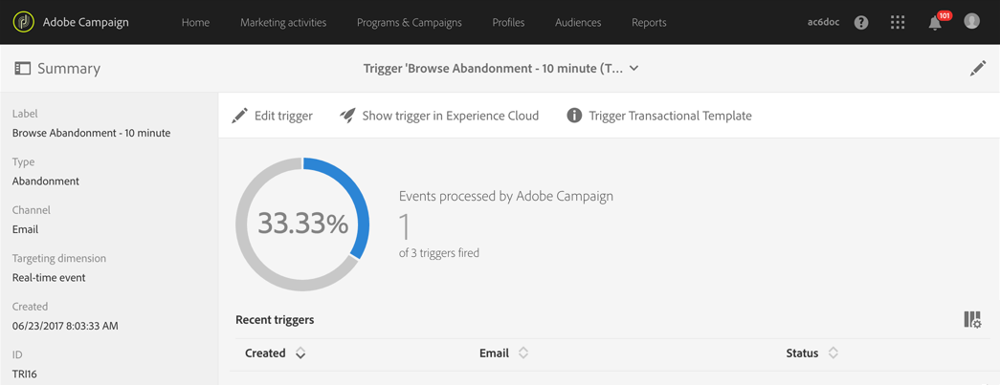

# Campaign での Triggers の使用{#using-triggers-in-campaign}

## Campaign でのマッピングされたトリガーの作成 {#creating-a-mapped-trigger-in-campaign}

>[!NOTE]
>
>トリガーを作成するには、**[!UICONTROL Administration]**&#x200B;の役割か、**[!UICONTROL Administrators]**&#x200B;セキュリティグループに属している必要があります。 これについて詳しくは、この[ページ](../../administration/using/list-of-roles.md)を参照してください。

Adobe Experience Cloud（**[!UICONTROL Triggers]** コアサービス）では、事前に監視するビヘイビアーを定義する必要があります。詳しくは、[Adobe Experience Cloud のドキュメント](https://experienceleague.adobe.com/docs/core-services/interface/activation/triggers.html)を参照してください。トリガーを定義する場合は、エイリアスを有効にする必要があります。各ビヘイビアー（ブラウジング／フォームの放棄、製品の追加／削除、セッションの有効期限切れなど）について、Adobe Experience Cloud に新規トリガーを追加する必要があります。

次に、既存の Adobe Experience Cloud のトリガーを基にして、Adobe Campaign でトリガーイベントを作成する必要があります。

この[ビデオ](https://helpx.adobe.com/jp/marketing-cloud/how-to/email-marketing.html#step-two)を見ると、Adobe Campaign でのトリガーの設定方法を理解できます。

これをおこなうには、次の手順に従います。

1. 左上隅の **[!UICONTROL Adobe Campaign]** ロゴをクリックし、**[!UICONTROL Marketing plans]**／**[!UICONTROL Transactional messages]**／**[!UICONTROL Experience Cloud Triggers]** を選択します。

   

1. 「**[!UICONTROL Create]**」ボタンをクリックします。作成ウィザードが開き、Adobe Experience Cloud で定義されたすべてのトリガーのリストが表示されます。この「**[!UICONTROL Fired by Analytics]**」列には、Adobe Experience Cloud のトリガーによって Campaign に送信されたイベントの数が表示されます。これは、Experience Cloud インターフェイスで作成されたトリガーのマッピングです。

   

1. 使用する Adobe Experience Cloud のトリガーを選択し、「**[!UICONTROL Next]**」をクリックします。
1. トリガーの一般的なプロパティを設定しますウィザードのこの手順で、トリガーに使用するチャネルとターゲティングディメンションも指定します（[ターゲティングディメンションとリソース](../../automating/using/query.md#targeting-dimensions-and-resources)を参照）。次に、トリガーの作成を確認します。
1. 「**[!UICONTROL Event content and enrichment]**」フィールドの右側のボタンをクリックして、ペイロードの内容を表示します。また、この画面では、イベントデータを Adobe Campaign データベースに保存されているプロファイルデータに拡張することもできます。エンリッチメントは、標準トランザクションメッセージと同じ方法で実行されます。

   

1. この「**[!UICONTROL Transactional message validity duration]**」フィールドで、Analytics からイベントが送信された後、メッセージが有効である期間を定義します。期間を 2 日と定義した場合、その期間が過ぎると、メッセージは送信されなくなります。複数のメッセージを保留にすると、一定期間後に再開した場合でも、これらのメッセージは送信されません。

   

1. これで、トリガーを公開できます。 詳しくは、[Campaignでのトリガーのパブリッシュ](../../integrating/using/using-triggers-in-campaign.md#publishing-trigger-in-campaign)を参照してください。

## Campaignでのトリガーのパブリッシュ {#publishing-trigger-in-campaign}

既存のAdobe Experience Cloudトリガーに基づいてAdobe Campaignでトリガーイベントを作成したら、公開する必要があります。

1. 以前に作成したトリガーで、「 **[!UICONTROL Publish]** 」ボタンをクリックしてトリガーイベントの公開を開始します。

   

1. **[!UICONTROL Publication]**&#x200B;の下で、トリガーの公開の進行状況を確認できます。

   

1. 公開が完了すると、**[!UICONTROL Publication]**&#x200B;の下に次のメッセージが表示されます。

   

1. トリガーイベントを公開した後でもトリガースキーマに変更を加える必要がある場合は、「**[!UICONTROL Update schema]**」ボタンをクリックして最新の変更を取得します。

   この操作により、トリガーとトランザクションメッセージが非公開になり、後で再公開する必要があります。

   

1. 「**[!UICONTROL Show Trigger in Experience Cloud]**」ボタンをクリックすると、Adobe Experience Cloudでトリガー定義を表示できます。

イベントが公開されると、新規イベントにリンクされたトランザクションテンプレートが自動的に作成されます。その後、作成したテンプレートを変更して公開する必要があります。詳しくは、[テンプレートの編集](../../start/using/marketing-activity-templates.md)の節を参照してください。

## トランザクションメッセージテンプレートの編集 {#editing-the-transactional-message-template}

トリガーイベントを作成して公開すると、対応するトランザクションテンプレートが自動的に作成されます。詳しくは、[Campaign でのマッピングされたトリガーの作成](#creating-a-mapped-trigger-in-campaign)の節を参照してください。

イベントがトランザクションメッセージの送信をトリガーするには、テンプレートをパーソナライズしてテストし、公開する必要があります。これらの手順は、標準トランザクションメッセージの場合と同じです。詳しくは、[トランザクションメッセージの編集](../../channels/using/editing-transactional-message.md)の節を参照してください。

>[!NOTE]
>
>テンプレートの公開を取り消すと、トリガーイベントの公開が自動的に取り消されます。

コンテンツを編集する際、Analytics トリガーから送信される情報に基づいてパーソナライゼーションフィールドを追加できます。イベントデータを Adobe Campaign プロファイルデータと共に拡張する場合、この情報に基づいてメッセージをパーソナライズできます。メッセージをパーソナライズするには、**[!UICONTROL Transactional event]**／**[!UICONTROL Event context]** と選択し、フィールドを選択します。

## レポートへのアクセス {#accessing-the-reports}

専用のトリガーレポートを Adobe Campaign で表示するには、以前に作成したトリガーイベントを開き、「**[!UICONTROL Show trigger report]**」をクリックします。

このレポートには、処理されたイベントの数と Analytics から送信されたイベントの数が表示されます。また、最近実行したすべてのトリガーのリストも表示されます。

