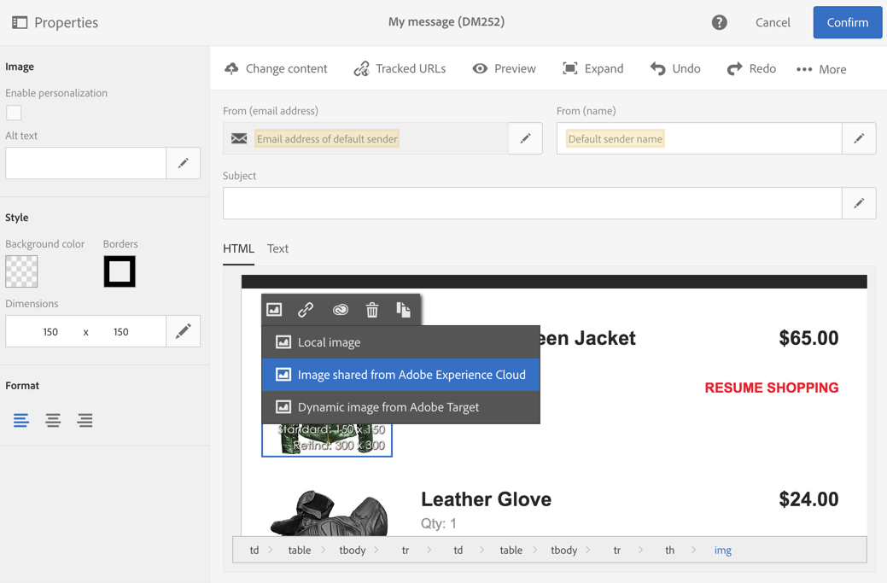

# Campaign と Assets コアサービスの連携{#working-with-campaign-and-assets-core-service}

Assets コアサービスまたはAssets on Demand （Adobe Experience Cloud環境の設定に応じて）をAdobe Campaignと統合することで、Adobe Experience Cloud内で共有されているあらゆるアセットをAdobe Campaignのメールやランディングページで使用できます。

Assets コアサービスとの統合は、[機能管理者](../../administration/using/users-management.md#functional-administrators)に制限されています。

Adobe Experience Cloudから共有されたリソースは、次のように、メールやランディングページで使用できます。

1. メールまたはランディングページのコンテンツを編集する際に、画像ブロックに移動し、コンテキストメニューから「**[!UICONTROL Image shared from Adobe Experience Cloud]**」を選択します。

   

1. 表示される選択ウィンドウで画像を選択し、確定します。

   

次に、画像が挿入されます。 必要に応じてパーソナライズして配信できるようになりました。

**関連トピック：**

* [Assetsと共有](https://experienceleague.adobe.com/docs/core-services/interface/assets/experience-cloud-assets.html?lang=ja)
* [コンテンツエディター](../../designing/using/personalization.md#example-email-personalization)
