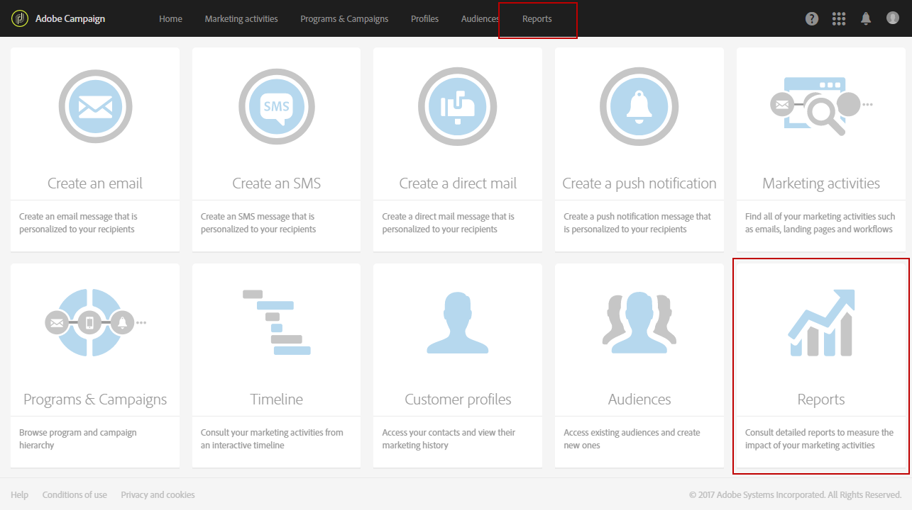

# 動的レポートの基本を学ぶ {#about-dynamic-reports}

動的レポートは、完全にカスタマイズ可能なリアルタイムのレポートを提供します。 プロファイルデータへのアクセスが追加され、開封数やクリック数などの機能的なメールキャンペーンデータに加えて、性別、市区町村、年齢などのプロファイルディメンション別のデモグラフィック分析が可能になります。 ドラッグ＆ドロップインターフェイスを使用してデータを分析し、最も重要な顧客セグメントに対するメールキャンペーンの効果や受信者への影響を測定できます。

>[!NOTE]
>
>管理者権限を持つユーザー、または&#x200B;**すべて**&#x200B;に設定された組織単位を持つユーザーのみが、新しいレポートを作成または保存できます。 詳しくは、[この節](../../administration/using/users-management.md)を参照してください。

## 動的レポートへのアクセス {#accessing-dynamic-reports}

レポートには、次の方法でアクセスできます。

* トップバーの「**[!UICONTROL Reports]**」タブまたは&#x200B;**[!UICONTROL Reports]** カードを選択してホームページから、すべての配信のレポートにアクセスします。

  

* 各プログラム、キャンペーン、メッセージで、**動的レポート**&#x200B;をクリックして&#x200B;**レポート** ボタンから、配信に固有のレポートのみを表示します。

  

情報の収集と処理にかかる時間によっては、配信後すぐに利用できないレポートもあります。

動的レポートは次の 2 つのカテゴリに分かれています。

* **テンプレート**。**別名で保存** オプション（**プロジェクト/別名で保存…**）を使用してコピーすると変更できます。 テンプレート内で利用できます。
* **カスタムレポート**（青色で表示）は、**レポート**&#x200B;ホームページの「**新規プロジェクトの作成**」ボタンをクリックすることで、直接作成できます。

>[!NOTE]
>
>データは、組織単位によってフィルタリングされます。

## 動的レポートの使用契約 {#dynamic-reporting-usage-agreement}

動的レポートの使用契約の目的は、データ処理のポップアップ同意として機能することです。 デフォルトでは、この契約書は表示のみ可能で、管理権限を割り当てられたユーザーのみが承諾または拒否できます。

次の 3 つのオプションを選択できます。

* **[!UICONTROL Ask me later]**:「**後で確認する**」をクリックすると、ウィンドウが24時間表示されなくなります。 お客様が契約書に同意または同意しない限り、プロファイルディメンションはレポートに表示されず、お客様の個人識別情報は収集または送信されません。
* **[!UICONTROL Accept]**：本契約に同意することにより、お客様はAdobe Campaignがお客様の個人情報を収集し、レポートまたはデータセンターに転送することを承認します。
* **[!UICONTROL Decline]**：契約書を辞退すると、プロファイルディメンションはレポートに表示されず、顧客の個人識別情報は収集または送信されません。 この場合でも、externalID は引き続き収集され、エンドユーザーの識別に使用されます。

次の表には、この契約書を承諾した後に行われる内容が地域別に表示されています。

|  | 動的レポート | Microsoft Dynamics 365 コネクタ |
|---|---|---|
| 南北アメリカおよび APAC（アジア太平洋） | **利用可能な機能**。  米国レポートセンターにプッシュされるすべての標準（市区町村、国／地域、都道府県、性別、年齢ベースのセグメント）およびカスタムのプロファイル。 プロファイルディメンションについて詳しくは、この[ ページ ](../../reporting/using/list-of-components.md)を参照してください | **利用可能な機能**。  標準のカスタムプロファイルフィールドとAdobe Campaign Standard イベントフィールドはすべて、米国データセンターで処理されます。 |
| EMEA（ヨーロッパ、中東、アフリカ） | **利用可能な機能**。  EMEA レポートセンターにプッシュされるすべての標準（市区町村、国／地域、都道府県、性別、年齢ベースのセグメント）とカスタムのプロファイル。 プロファイルディメンションについて詳しくは、この[ ページ ](../../reporting/using/list-of-components.md)を参照してください | **機能を利用できます。**  すべての標準およびカスタムプロファイルフィールドと、EMEA データセンターで処理されたAdobe Campaign Standard イベントフィールド。 Adobe I/Oの登録データと、米国のデータセンターに送信および保存されているお客様のエンドユーザーイベントのIDを含む&#x200B; **[!UICONTROL Control data]**。 |

次の表には、この契約を拒否した後に行われる内容が地域別に表示されています。 この契約を拒否した場合でも、配信と Microsoft Dynamics 365 の統合に関するレポートは引き続き使用できます。

| 地域 | 動的レポート | Microsoft Dynamics 365 コネクタ |
|---|---|---|
| 南北アメリカおよび APAC（アジア太平洋） | **使用可能な機能**。  ExternalIDを除き、米国のレポートセンターにプッシュされる、すぐに使用できるカスタムプロファイル情報はありません。 | **利用可能な機能**。  外部 ID と受信者 ID を除き、米国データセンターに送信される標準またはカスタムのプロファイルフィールドはありません。   ミラーページ IDを除き、米国データセンターで処理されたすべてのAdobe Campaign Standard イベントフィールド。  Microsoft Dynamics 365との連携について詳しくは、この[ ページ ](../../integrating/using/d365-acs-get-started.md)を参照してください。 |
| EMEA（ヨーロッパ、中東、アフリカ） | **利用可能な機能**。  ExternalID を除き、EMEA のレポートセンターにプッシュされる標準およびカスタムのプロファイル情報はありません。 | **機能を利用できます。**  外部IDと受信者IDを除き、標準またはカスタムのプロファイルフィールドをEMEA データセンターに送信しません。   ミラーページ IDを除き、EMEA データセンターで処理されたすべてのAdobe Campaign Standard イベントフィールド。 **[!UICONTROL Control data]**には、Adobe I/Oの登録データと、米国データセンターで送信および保存されたお客様のエンドユーザーイベントのIDが含まれています。 Microsoft Dynamics 365との連携について詳しくは、この[ ページ ](../../integrating/using/d365-acs-get-started.md)を参照してください。 |

この選択は最終的なものではありません。**[!UICONTROL Administration]** > **[!UICONTROL Application Settings]** > **[!UICONTROL Options]**&#x200B;で&#x200B;**[!UICONTROL Enable PII data to be transferred to US region to use reporting on Profile data]**&#x200B;を選択すれば、いつでも変更できます。

この値はいつでも変更できます。 値1は&#x200B;**[!UICONTROL Ask me later]**、2 **[!UICONTROL Decline]**、3 **[!UICONTROL Accept]**&#x200B;に対応します。

